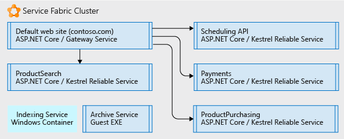
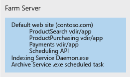
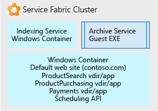

In this example scenario, we walk through an approach using [Azure Service Fabric](/azure/service-fabric/service-fabric-overview) as a platform for decomposing an unwieldy monolithic application. Here we consider an iterative approach to decomposing an IIS/ASP.NET web site into an application composed of multiple manageable microservices.

Moving from a monolithic architecture to a microservice architecture provides the following benefits:

- You can change one small, understandable unit of code and deploy only that unit.
- Each code unit requires just a few minutes or less to deploy.
- If there is an error in that small unit, only that unit stops working, not the whole application.
- Small units of code can be distributed easily and discretely among multiple development teams.
- New developers can quickly and easily grasp the discrete functionality of each unit.

A large IIS application on a server farm is used in this example, but the concepts of iterative decomposition and hosting can be used for any type of large application. While this solution uses Windows, Service Fabric can also run on Linux. It can be run on-premises, in Azure, or on VM nodes in the cloud provider of your choice.

## Potential use cases

This scenario is relevant to organizations with large monolithic Web applications that are experiencing:

- Errors in small code changes that break the entire website.
- Releases taking multiple days due to the need to release update the entire website.
- Long ramp-up times when onboarding new developers or teams due to the complex code base, requiring a single individual to know more than is feasible.

## Architecture

Using Service Fabric as the hosting platform, we can convert a large IIS web site into a collection of microservices as shown below:

In the picture above, we decomposed all the parts of a large IIS application into:

- A routing or gateway service that accepts incoming browser requests, parses them to determine what service should handle them, and forwards the request to that service.
- Four ASP.NET Core applications that were formally virtual directories under the single IIS site running as ASP.NET applications. The applications were separated into their own independent microservices. The effect is that they can be changed, versioned, and upgraded separately. In this example, we rewrote each application using .NET Core and ASP.NET Core. These were written as [Reliable Services](/azure/service-fabric/service-fabric-reliable-services-introduction) so they can natively access the full Service Fabric platform capabilities and benefits (communication services, health reports, notifications, etc.).
- A Windows service called *Indexing Service*, placed in a Windows container so that it no longer makes direct changes to registry of the underlying server, but can run self-contained and be deployed with all its dependencies as a single unit.
- An Archive service, which is just an executable that runs according to a schedule and performs some tasks for the sites. It is hosted directly as a stand-alone executable because we determined it does what it needs to do without modification and it is not worth the investment to change.

### Components

- [Service Fabric](https://azure.microsoft.com/products/service-fabric) is an open source project that you can use to build and operate always-on, scalable, distributed apps.

## Considerations

The first challenge is to begin to identify smaller bits of code that can be factored out from the monolith into microservices that the monolith can call. Iteratively over time, the monolith is broken up into a collection of these microservices that developers can easily understand, change, and quickly deploy at low risk.

Service Fabric was chosen because it is capable of supporting running all the microservices in their various forms. For example you may have a mix of stand-alone executables, new small web sites, new small APIs, and containerized services, etc. Service Fabric can combine all these service types onto a single cluster.

To get to this final, decomposed application, we used an iterative approach. We started with a large IIS/ASP.NET web site on a server farm. A single node of the server farm is pictured below. It contains the original web site with several virtual directories, an additional Windows Service the site calls, and an executable that does some periodic site archive maintenance.

On the first development iteration, the IIS site and its virtual directories placed in a [Windows Container](/azure/service-fabric/service-fabric-containers-overview). Doing this allows the site to remain operational, but not tightly bound to the underlying server node OS. The container is run and orchestrated by the underlying Service Fabric node, but the node does not have to have any state that the site is dependent on (registry entries, files, etc.). All of those items are in the container. We have also placed the Indexing service in a Windows Container for the same reasons. The containers can be deployed, versioned, and scaled independently. Finally, we hosted the Archive Service a simple [stand-alone executable file](/azure/service-fabric/service-fabric-guest-executables-introduction) since it is a self-contained .exe with no special requirements.

The picture below shows how our large web site is now partially decomposed into independent units and ready to be decomposed more as time allows.

Further development focuses on separating the single large Default Web site container pictured above. Each of the virtual directory ASP.NET apps is removed from the container one at a time and ported to ASP.NET Core [Reliable Services](/azure/service-fabric/service-fabric-reliable-services-introduction).

Once each of the virtual directories has been factored out, the Default Web site is written as an ASP.NET Core reliable service, which accepts incoming browser requests and routes them to the correct ASP.NET application.

### Availability, scalability, and security

Service Fabric is [capable of supporting various forms of microservices](/azure/service-fabric/service-fabric-choose-framework) while keeping calls between them on the same cluster fast and simple. Service Fabric is a [fault tolerant](/azure/service-fabric/service-fabric-availability-services), self-healing cluster that can run containers, executables, and even has a native API for writing microservices directly to it (the 'Reliable Services' referred to above). The platform facilitates rolling upgrades and versioning of each microservice. You can tell the platform to run more or fewer of any given microservice distributed across the Service Fabric cluster in order to [scale](/azure/service-fabric/service-fabric-concepts-scalability) in or out only the microservices you need.

Service Fabric is a cluster built on an infrastructure of virtual (or physical) nodes, which have networking, storage, and an operating system. As such, it has a set of administrative, maintenance, and monitoring tasks.

You'll also want to consider governance and control of the cluster. Just as you would not want people arbitrarily deploying databases to your production database server, neither would you want people deploying applications to the Service Fabric cluster without some oversight.

Service Fabric is capable of hosting many different [application scenarios](/azure/service-fabric/service-fabric-application-scenarios), take some time to see which ones apply to your scenario.

## Pricing

For a Service Fabric cluster hosted in Azure, the largest part of the cost is the number and size of the nodes in your cluster. Azure allows quick and simple creation of a cluster composed of the underlying node size you specify, but the compute charges are based on the node size multiplied by the number of nodes.

Other less costly components of cost are the storage charges for each node's virtual disks and network I/O egress charges from Azure (for example network traffic out of Azure to a user's browser).

To get an idea of cost, we have created an example using some default values for cluster size, networking, and storage: Take a look at the [pricing calculator](https://azure.com/e/52dea096e5844d5495a7b22a9b2ccdde). Feel free to update the values in this default calculator to those relevant to your situation.

## Contributors

*This article is maintained by Microsoft. It was originally written by the following contributors.*

Principal author:

* [Tim Omta](https://www.linkedin.com/in/tim-omta-b317056) | Senior Cloud Solution Architect

*To see non-public LinkedIn profiles, sign in to LinkedIn.*

## Next steps

Take some time to familiarize yourself with the platform by going through the [documentation](/azure/service-fabric/service-fabric-overview) and reviewing the many different [application scenarios](/azure/service-fabric/service-fabric-application-scenarios) for Service Fabric. The documentation will tell you what a cluster consists of, what it can run on, software architecture, and maintenance for it.

To see a demonstration of Service Fabric for an existing .NET application, deploy the Service Fabric [quickstart](/azure/service-fabric/service-fabric-quickstart-dotnet).

Here are some additional articles about Service Fabric:

- [Service Fabric overview](/azure/service-fabric/service-fabric-overview)
- [Service Fabric programming model](/azure/service-fabric/service-fabric-choose-framework)
- [Service Fabric availability](/azure/service-fabric/service-fabric-availability-services)
- [Scaling Service Fabric](/azure/service-fabric/service-fabric-concepts-scalability)
- [Hosting containers in Service Fabric](/azure/service-fabric/service-fabric-containers-overview)
- [Hosting standalone executables in Service Fabric](/azure/service-fabric/service-fabric-guest-executables-introduction)
- [Service Fabric Reliable Services](/azure/service-fabric/service-fabric-reliable-services-introduction)
- [Service Fabric application scenarios](/azure/service-fabric/service-fabric-application-scenarios) 

From the standpoint of your current application, start to think about its different functions. Choose one of them and think through how you can separate only that function from the whole. Take it one discrete, understandable, piece at a time.

## Related resources

- [Building microservices on Azure](../../microservices/index.yml)
- [Microservices assessment and readiness](../../guide/technology-choices/microservices-assessment.md)
- [Design a microservices architecture](../../microservices/design/index.yml)
- [Data considerations for microservices](../../microservices/design/data-considerations.yml)
