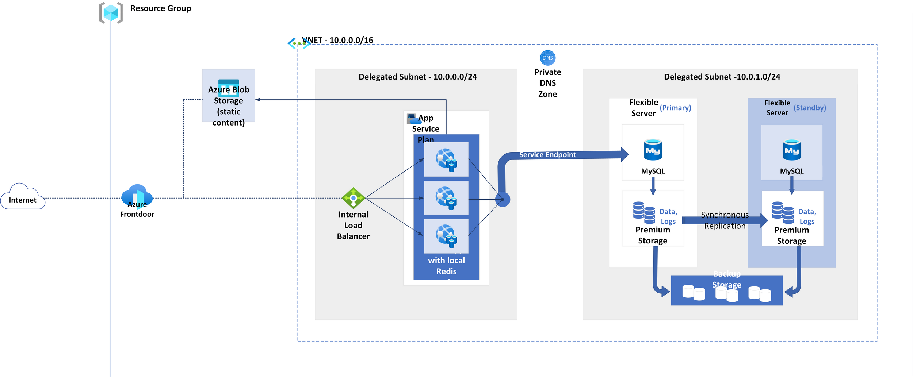

<!-- cSpell:ignore wordpress -->

This solution is ideal for small to medium-sized WordPress installations. It provides the scalability, reliability, and security of the Azure platform without the need for complex configuration or management. For larger or storage-intensive installations, see other [hosting options for WordPress](/azure/wordpress#wordpress-hosting-options-on-azure).

## Architecture

> [!NOTE]
> This architecture can be extended and combined with other tips and recommendations that are not specific to any particular WordPress hosting method. [Learn more about tips for WordPress](/azure/architecture/example-scenario/infrastructure/wordpress)

### Dataflow

This scenario covers a scalable and secure installation of WordPress that uses managed PaaS service [WordPress on AppService](https://learn.microsoft.com/en-us/azure/app-service/quickstart-wordpress). 

1. Users access the front-end website through a CDN ([Azure Front Door](https://azure.microsoft.com/products/frontdoor) *or* [Azure Content Delivery Network (CDN)](https://azure.microsoft.com/products/cdn).
2. The CDN load balances requests across Azure App Service instances that WordPress is running on and pulls any data that isn't cached from the WordPress web app 
3. The WordPress application accesses the [Azure Database for MySQL - Flexible Server](https://learn.microsoft.com/en-us/azure/mysql/flexible-server/overview) privately via Private Endpoint and pulls any dynamic information out.
5. All static content is hosted in [Azure Blob Storage](/azure/storage/blobs/storage-blobs-overview).

### Components

- [WordPress on App Service](https://learn.microsoft.com/en-us/azure/app-service/quickstart-wordpress) is a managed solution template, combined from [Azure App Service](https://azure.microsoft.com/products/appservice) and other Azure services mentioned below
- [Azure Front Door](https://azure.microsoft.com/products/frontdoor) *or* [Azure Content Delivery Network (CDN)](https://azure.microsoft.com/products/cdn) product are a Microsoft’s modern cloud Content Delivery Network (CDN), distributed network of servers that efficiently delivers web content to users. CDNs minimize latency by storing cached content on edge servers in point-of-presence locations near to end users.
- [Virtual networks](https://azure.microsoft.com/products/virtual-network) allow resources to securely communicate with each other, the Internet, and on-premises networks. Virtual networks provide isolation and segmentation, filter and route traffic, and allow connection between locations. The two networks are connected via Vnet peering.
- [Azure DDoS Protection Standard](/azure/ddos-protection/ddos-protection-overview), combined with application-design best practices, provides enhanced DDoS mitigation features to provide more defense against DDoS attacks. You should enable [Azure DDOS Protection Standard](/azure/ddos-protection/ddos-protection-overview) on any perimeter virtual network.
- [Network security groups](/azure/virtual-network/security-overview) contain a list of security rules that allow or deny inbound or outbound network traffic based on source or destination IP address, port, and protocol. The virtual networks in this scenario are secured with network security group rules that restrict the flow of traffic between the application components.
- [Azure Key Vault](https://azure.microsoft.com/products/active-directory) is used to store and tightly control access to passwords, certificates, and keys.
- [Azure Database for MySQL - Flexible server](https://azure.microsoft.com/products/mysql/) is database used to store WordPress data.
- [Azure Blob Storage](https://azure.microsoft.com/products/storage/blobs/) is scalable and secure object storage for cloud-native workloads, archives, data lakes, high-performance computing, and machine learning.

### Potential use cases

- Media events that cause traffic surges.
- Blogs that use WordPress as their content management system.
- Business or e-commerce websites that use WordPress.
- Web sites built using other content management systems.

### Alternatives

- [Azure Cache for Redis](https://azure.microsoft.com/products/cache/) can be used to host key-value cache for WordPress performance optimization plugins, shared between all App Service instances.

## Considerations

These considerations implement the pillars of the Azure Well-Architected Framework, which is a set of guiding tenets that can be used to improve the quality of a workload. For more information, see [Microsoft Azure Well-Architected Framework](/azure/architecture/framework).

### Reliability

App Service provides built-in load balancing and health check features to maintain availability if an App Service instance fails.

Using the CDN to cache all responses can provide a small availability benefit when the origin isn't responding. However, it's important to note that caching shouldn't be considered a complete availability solution.

This scenario supports use of multiple regions, data replication and auto-scalling. These networking components distribute traffic to the pods, and include health probes that ensure traffic is only distributed to healthy instances. All of these networking components are fronted via a CDN. This approach makes the networking resources and application resilient to issues that would otherwise disrupt traffic and affect end-user access.

You can replicate Azure Blob Storage to a paired region for data redundancy across multiple regions. For more information, see [Azure Storage redundancy](/azure/storage/common/storage-disaster-recovery-guidance).

For high availability of Azure Database for MySQL, see [High availability concepts in Azure Database for MySQL - Flexible Server](/azure/mysql/flexible-server/concepts-high-availability).

### Scalability

This scenario hosts the WordPress front-end in App Service. You should enable the autoscale feature to automatically scale the number of App Service instances. You can set a trigger to response to customer demand or based on a defined schedule. For more information, see [Get started with autoscale in Azure](/azure/azure-monitor/autoscale/autoscale-get-started).

For more resiliency and scalability guidance, see the [resiliency checklist](/azure/architecture/checklist/resiliency-per-service) in the Azure Architecture Center.

### Security

Security provides assurances against deliberate attacks and the abuse of your valuable data and systems. For more information, see [Overview of the security pillar](/azure/architecture/framework/security/overview).

All the virtual network traffic point into the front-end application tier and should be protected by [WAF on Azure Front Door](/azure/web-application-firewall/afds/afds-overview). No outbound Internet traffic is allowed from the database tier. No access to private storage is allowed from public. For more information about WordPress security, see [General WordPress security&performance tips](/azure/wordpress#general-wordpress-securityperformance-tips).

For general guidance on designing secure scenarios, see the [Azure Security Documentation][security].

### Cost optimization

Cost optimization is about looking at ways to reduce unnecessary expenses and improve operational efficiencies. For more information, see [Overview of the cost optimization pillar](/azure/architecture/framework/cost/overview).

There are a couple main things to consider:

- How much traffic are you expecting in terms of GB/month? The amount of traffic has the biggest effect on your cost, as it determines the number of App Service instances. Additionally, it directly correlates with the amount of data that is surfaced via the CDN.
- What is the expected amount of hosted data? It's important to consider this since Azure Storage pricing is based on used capacity.
- How much new data are you going to be writing to your website? New data written to your website correlates with how much data is mirrored across the regions.
- How much of your content is dynamic? How much is static? The variance around dynamic and static content influences how much data has to be retrieved from the database tier versus how much is cached in the CDN.

## Contributors

*This article is maintained by Microsoft. It was originally written by the following contributors.*

Principal author:

[Vaclav Jirovsky](https://www.linkedin.com/in/vaclavjirovsky) | Cloud Solution Architect

Other contributors:

- Adrian Calinescu | Sr. Cloud Solution Architect

## Next steps

Product documentation:

- [What is Azure Front Door?](/azure/frontdoor/front-door-overview)
- [What is Azure Web Application Firewall?](/azure/web-application-firewall/overview)
- [What is Azure Blob Storage?](/azure/storage/blobs/storage-blobs-overview)
- [What is Azure Virtual Network?](/azure/virtual-network/virtual-networks-overview)
- [About Azure Key Vault](/azure/key-vault/general/overview)
- [Quickstart: Create a WordPress site](/azure/app-service/quickstart-wordpress)

Microsoft Learn modules:

- [Load balance your web service traffic with Front Door](/training/modules/create-first-azure-front-door/)
- [Implement Azure Key Vault](/training/modules/implement-azure-key-vault)
- [Introduction to Azure Virtual Networks](/training/modules/introduction-to-azure-virtual-networks)

## Related resources

- [Ten design principles for Azure applications](../../guide/design-principles/index.md)
- [Scalable cloud applications and site reliability engineering](../../example-scenario/apps/scalable-apps-performance-modeling-site-reliability.yml)

<!-- links -->

[security]: /azure/security