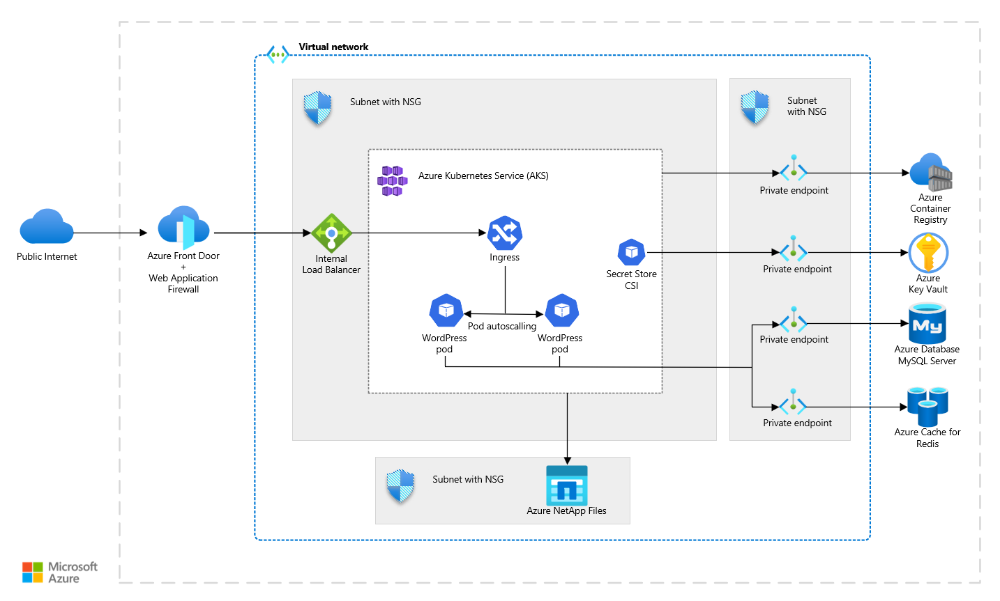

<!-- cSpell:ignore wordpress -->

This example scenario is applicable for any larger installation of WordPress with storage-intensive requirements. It uses [Azure Front Door](/azure/frontdoor/front-door-overview), [Azure Kubernetes Service](/azure/aks/intro-kubernetes), [Azure NetApp Files](/azure/azure-netapp-files/azure-netapp-files-introduction) and other Azure services to deploy a highly scalable and secure installation of WordPress.

## Architecture

[](media/wordpress-aks-netapp.png#lightbox)

> [!NOTE]
> This architecture can be extended and combined with other tips and recommendations that are not specific to any particular WordPress hosting method. [Learn more about tips for WordPress](/azure/architecture/example-scenario/infrastructure/wordpress)

### Dataflow

- Users access the front-end website through Azure Front Door with Azure Web Application Firewall (WAF) enabled.
- Front Door uses an [internal Azure Load Balancer](/azure/load-balancer/load-balancer-overview) as the origin. The internal Azure Load Balancer is a hidden component of AKS. Front Door pulls any data that isn't cached.
- The internal load balancer distributes ingress traffic to pods within AKS.
- The private key (X.509 certificate) and other secrets are stored in [Azure Key Vault](/azure/key-vault/key-vault-overview).
- The WordPress application pulls any dynamic information out of the managed [Azure Database for MySQL - Flexible Server](https://learn.microsoft.com/en-us/azure/mysql/flexible-server/overview) privately via Private Endpoint.
- All static content is hosted in [Azure NetApp Files](/azure/azure-netapp-files/azure-netapp-files-introduction) using the AKS CSI Astra Trident driver with the NFS protocol.

### Components

- [Azure Front Door](https://azure.microsoft.com/products/frontdoor) is a Microsoft’s modern cloud Content Delivery Network (CDN). It's a distributed network of servers that efficiently delivers web content to users. CDNs minimize latency by storing cached content on edge servers in point-of-presence locations near to end users.
- [Virtual networks](https://azure.microsoft.com/products/virtual-network) allow deployed resources to securely communicate with each other, the Internet, and on-premises networks. Virtual networks provide isolation and segmentation, filter and route traffic, and allow connection between locations. The two networks are connected via virtual network peering.
- [Azure DDoS Protection Standard](/azure/ddos-protection/ddos-protection-overview), combined with application-design best practices, provides enhanced DDoS mitigation features to provide more defense against DDoS attacks. You should enable [Azure DDOS Protection Standard](/azure/ddos-protection/ddos-protection-overview) on any perimeter virtual network.
- [Network security groups](/azure/virtual-network/security-overview) contain a list of security rules that allow or deny inbound or outbound network traffic based on source or destination IP address, port, and protocol. The subnets in this scenario are secured with network security group rules that restrict any traffic flow between the application components.
- [Load balancers](https://azure.microsoft.com/solutions/load-balancing-with-azure) distribute inbound traffic according to rules and health probes. A load balancer provides low latency and high throughput and scales up to millions of flows for all TCP and UDP applications. A load balancer is used in this scenario to distribute traffic from the content delivery network to the front-end web servers.
- [Azure Kubernetes Service](https://azure.microsoft.com/products/kubernetes-service) is a fully managed service that makes it easy to deploy, manage, and scale containerized applications using Kubernetes.
- [Azure NetApp Files](https://azure.microsoft.com/products/netapp) provides a fully managed performance-intensive and latency-sensitive storage solution that hosts all of the WordPress content in this scenario so that all of the pods have access to the data.
- [Azure Cache for Redis](https://azure.microsoft.com/products/cache/) can be used to host key-value cache for WordPress performance optimization plugins, shared between all pods.
- [Azure Key Vault](https://azure.microsoft.com/products/active-directory) is used to store and tightly control access to passwords, certificates, and keys.
- [Azure Database for MySQL - Flexible server](https://azure.microsoft.com/products/mysql/) is database used to store WordPress data.

## Scenario details

This example scenario is applicable for any larger installation of WordPress with storage-intensive requirements. This deployment model is able to scale to meet the spike traffic that sessions drove to the site.

### Alternatives

- Redis cache: The cache could be a self-hosted pod within the AKS cluster instead of the Azure Cache for Redis managed product.
- [Rook-Ceph storage](https://rook.io/): Instead of managed storage solution like Azure NetApp Files, it's possible to use self-hosted storage solution. For more information, see [How to use Rook-Ceph on AKS](https://github.com/Azure/kubernetes-volume-drivers/tree/master/rook-ceph).

## Considerations

These considerations implement the pillars of the Azure Well-Architected Framework, which is a set of guiding tenets that can be used to improve the quality of a workload. For more information, see [Microsoft Azure Well-Architected Framework](/azure/architecture/framework).

### Reliability
Reliability ensures your application can meet the commitments you make to your customers. For more information, see [Overview of the reliability pillar](/azure/architecture/framework/resiliency/overview). Consider the following recommendations in your deployment:

- The pods in AKS and load balancing ingress traffic provide high availability even if there's pod failure.
- This architecture supports multiple regions, data replication, and auto-scalling. The components distribute traffic to the pods and include health probes that ensure traffic is only distributed to healthy pods. 
- All of these networking components are fronted by Azure Front Door. This approach makes the networking resources and application resilient to issues that would otherwise disrupt traffic and affect end-user access.
- Front Door is global service and supports Virtual Machine Scale Sets deployed in another regions. 
- Using Front Door to cache all responses can provide a small availability benefit when the origin isn't responding. However, it's important to note that caching isn't a complete availability solution.
- For higher availability, you should replicate NetApp Files storage between paired regions. For more information, see [cross-region replication with Azure NetApp Files](/azure/azure-netapp-files/cross-region-replication-requirements-considerations).
- For higher Azure Database for MySQL availability, you should follow the [high availability options](/azure/mysql/flexible-server/concepts-high-availability) that meet your needs.

### Performance efficiency

Performance efficiency is the ability of your workload to scale to meet the demands placed on it by users in an efficient manner. For more information, see [Performance efficiency pillar overview](/azure/architecture/framework/scalability/overview).

This scenario uses pods in AKS to host the front-end. With the autoscale feature, the number of pods that run the front-end application tier can automatically scale in response to customer demand or based on a defined schedule. For more information, see [Scaling options for applications in Azure Kubernetes Service (AKS)](/azure/aks/concepts-scale).

> [!IMPORTANT]
> For the best performance, it's essential to mount a PersistentVolume using the **NFS protocol version 4.1**. For more information, see *mountOptions* in following YAML example:

```yaml
kind: PersistentVolume
...
    accessModes:
    - ReadWriteMany
    mountOptions:
    - vers=4.1
    nfs:
      server: xx.xx.xx.xx
```

### Security

Security provides assurances against deliberate attacks and the abuse of your valuable data and systems. For more information, see [Overview of the security pillar](/azure/architecture/framework/security/overview). The architecture features the following best practices:

- All the virtual network traffic into the front-end application tier is protected by [WAF on Azure Front Door](/azure/web-application-firewall/afds/afds-overview). 
- No outbound Internet traffic is allowed from the database tier. 
- No access to private storage is allowed from public. You should disable public access to resources and use Private Endpoints for components Database for MySQL, Cache for Redis, Key Vault, Container Registry. For more information, see [Azure Private Link](/azure/private-link/private-link-overview).

For more information about WordPress security, see [General WordPress security&performance tips](./wordpress-overview-content.md#general-wordpress-security-and-performance-tips) and [Azure Security Documentation][security].

### Cost optimization

Cost optimization is about looking at ways to reduce unnecessary expenses and improve operational efficiencies. For more information, see [Overview of the cost optimization pillar](/azure/architecture/framework/cost/overview). Review the following cost considerations:

- **Traffic expectations (GB/month):** How much traffic are you expecting in terms of GB/month? The amount of traffic has the biggest effect on your cost, as it determines the number of AKS nodes and price for outbound data transfer. Additionally, it directly correlates with the amount of data that is surfaced via the CDN, where are outbound data transfer costs cheaper.
- **Amount of hosted data:** It's important to consider how much data you're hosting since Azure NetApp Files pricing is based on reserved capacity. To optimize costs, you need to reserve the minimum capacity needed for your data.
- **Writes percentage:** Consider how much new data are you going to be writing to your website and the cost to store it. For multi-region deployments, new data written to your website correlates with how much data is mirrored across the regions.
- **Static versus dynamic content:** You should monitor your database storage performance and capacity to see if a cheaper SKU can support your site. The database stores dynamic content and the CDN caches static content. 
- **AKS cluster optimalization:** To optimize your AKS cluster costs, follow the general tips for AKS, such as VM sizes, Azure Reservations, and other tips. For more information, see [AKS Cost Optimization](/azure/well-architected/services/compute/azure-kubernetes-service/azure-kubernetes-service#cost-optimization).

## Contributors

*Microsoft maintains this article. The following contributors originally wrote the article.*

Principal author:

[Vaclav Jirovsky](https://www.linkedin.com/in/vaclavjirovsky) | Cloud Solution Architect

Other contributors:

- Adrian Calinescu | Sr. Cloud Solution Architect

## Next steps

Product documentation:

- [What is Azure Front Door?](/azure/frontdoor/front-door-overview)
- [What is Azure Web Application Firewall?](/azure/web-application-firewall/overview)
- [What is Azure NetApp Files?](/azure/azure-netapp-files/azure-netapp-files-introduction)
- [Create an NFS volume for Azure NetApp Files](/azure/azure-netapp-files/azure-netapp-files-create-volumes)
- [Provision Azure NetApp Files volumes on Azure Kubernetes Service](/azure/aks/azure-netapp-files)
- [What is Azure Virtual Network?](/azure/virtual-network/virtual-networks-overview)
- [About Azure Key Vault](/azure/key-vault/general/overview)

Microsoft Learn modules:

- [Develop and deploy applications on Kubernetes](/training/paths/develop-deploy-applications-kubernetes/)
- [Introduction to Azure NetApp Files](/training/modules/introduction-to-azure-netapp-files/)
- [Load balance your web service traffic with Front Door](/training/modules/create-first-azure-front-door/)
- [Implement Azure Key Vault](/training/modules/implement-azure-key-vault)
- [Introduction to Azure Virtual Networks](/training/modules/introduction-to-azure-virtual-networks)

## Related resources

- [Ten design principles for Azure applications](../../guide/design-principles/index.md)
- [Scalable cloud applications and site reliability engineering](../../example-scenario/apps/scalable-apps-performance-modeling-site-reliability.yml)

<!-- links -->

[security]: /azure/security
