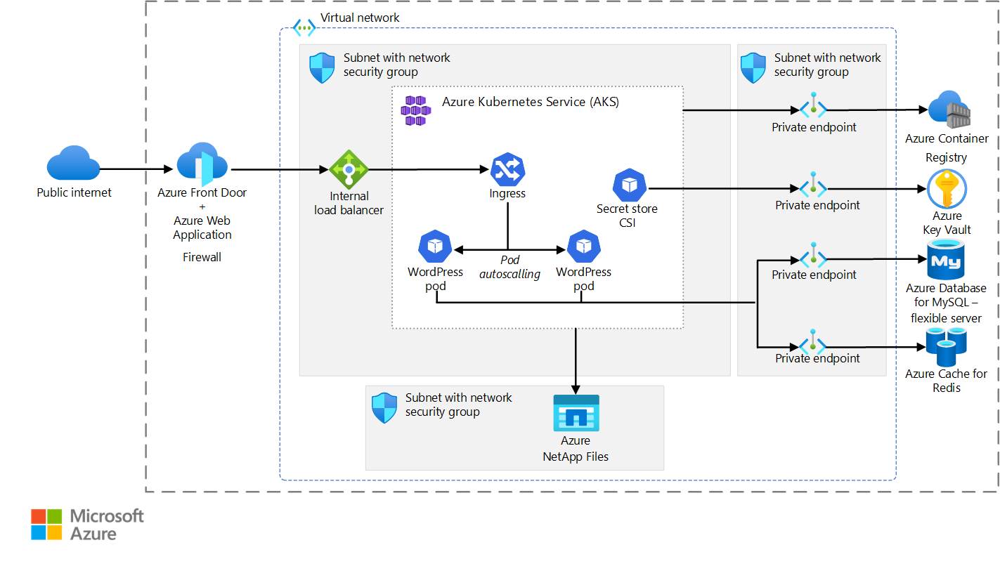

<!-- cSpell:ignore wordpress -->

This article describes a solution for hosting large, storage-intensive installations of WordPress. The solution uses [Azure Front Door](/azure/frontdoor/front-door-overview), [Azure Kubernetes Service (AKS)](/azure/aks/intro-kubernetes), [Azure NetApp Files](/azure/azure-netapp-files/azure-netapp-files-introduction), and other Azure services to deploy a highly scalable and secure installation of WordPress.

## Architecture

[](media/wordpress-aks-netapp.png#lightbox)

> [!NOTE]
> You can extend this solution by implementing tips and recommendations that aren't specific to any particular WordPress hosting method. For general tips for deploying a WordPress installation, see [WordPress on Azure](../../guide/infrastructure/wordpress-overview.yml).

### Dataflow

- Users access the front-end website through Azure Front Door with Azure Web Application Firewall enabled.
- Front Door uses an internal instance of [Azure Load Balancer](/azure/load-balancer/load-balancer-overview) as the origin. The internal load balancer is a hidden component of AKS. Front Door retrieves any data that isn't cached.
- The internal load balancer distributes ingress traffic to pods within AKS.
- The private key (X.509 certificate) and other secrets are stored in [Azure Key Vault](/azure/key-vault/key-vault-overview).
- The WordPress application uses a private endpoint to access a [flexible server instance of Azure Database for MySQL](https://learn.microsoft.com/en-us/azure/mysql/flexible-server/overview). The WordPress application retrieves dynamic information from the managed database service.
- All static content is hosted in [Azure NetApp Files](/azure/azure-netapp-files/azure-netapp-files-introduction). The solution uses the Astra Trident Container Storage Interface (CSI) driver with the NFS protocol.

### Components

- [Azure Front Door](https://azure.microsoft.com/products/frontdoor) is a modern cloud content delivery network. As a distributed network of servers, Azure Front Door efficiently delivers web content to users. Content delivery networks minimize latency by storing cached content on edge servers in point-of-presence locations near to end users.
- [Azure Virtual Network](https://azure.microsoft.com/products/virtual-network) provides a way for deployed resources to securely communicate with each other, the internet, and on-premises networks. Virtual networks provide isolation and segmentation. They also filter and route traffic and make it possible to establish connections between various locations. In this solution, the two networks are connected via a virtual network peering.
- [Azure DDoS Protection Standard](/azure/ddos-protection/ddos-protection-overview) provides enhanced DDoS mitigation features that help defend against DDoS attacks when combined with application-design best practices. You should enable Azure DDOS Protection Standard on any perimeter virtual network.
- [Network security groups](/azure/virtual-network/security-overview) use a list of security rules to allow or deny inbound or outbound network traffic based on source or destination IP address, port, and protocol. The subnets in this scenario are secured with network security group rules that restrict traffic flow between the application components.
- [Load Balancer](https://azure.microsoft.com/solutions/load-balancing-with-azure) distributes inbound traffic according to rules and health probes. A load balancer provides low latency and high throughput. By spreading traffic across multiple servers, a load balancer adds scalability to TCP and UDP applications. In this scenario, a load balancer distributes traffic from the content delivery network to the front-end web servers.
- [Azure Kubernetes Service](https://azure.microsoft.com/products/kubernetes-service) is a fully managed Kubernetes service that makes it easy to deploy, manage, and scale containerized applications.
- [Azure NetApp Files](https://azure.microsoft.com/products/netapp) provides a fully managed performance-intensive and latency-sensitive storage solution. In this solution, Azure NetAppFiles hosts all the WordPress content so that all the pods have access to the data.
- [Azure Cache for Redis](https://azure.microsoft.com/products/cache/) is an in-memory data store that's based on the open-source software Redis. You can use Azure Cache for Redis to host a key-value cache. In this solution, that cache is shared between all pods and is for WordPress performance optimization plugins.
- [Azure Key Vault](https://azure.microsoft.com/products/active-directory) is used to store and tightly control access to passwords, certificates, and keys.
- [Azure Database for MySQL - flexible server](https://azure.microsoft.com/products/mysql/) is a relational database service that's based on the open-source MySQL database engine. The flexible server deployment option is a fully managed service that provides granular control and flexibility over database management functions and configuration settings. In this scenario, Azure Database for MySQL stores WordPress data.

## Scenario details

This example scenario is appropriate for large, storage-intensive installations of WordPress. This deployment model can scale to meet spikes in traffic to the site.

### Potential use cases

- High-traffic blogs that use WordPress as their content management system.
- Business or e-commerce websites that use WordPress.

### Alternatives

- Instead of using the Azure Cache for Redis managed service, you can use a self-hosted pod within the AKS cluster as the cache.
- Instead of using a managed storage solution like Azure NetApp Files, you can use a self-hosted solution like [Rook-Ceph storage](https://rook.io/). For more information, see [How to use Rook-Ceph on AKS](https://github.com/Azure/kubernetes-volume-drivers/tree/master/rook-ceph).

## Considerations

These considerations implement the pillars of the Azure Well-Architected Framework, which is a set of guiding tenets that can be used to improve the quality of a workload. For more information, see [Microsoft Azure Well-Architected Framework](/azure/architecture/framework).

### Reliability

Reliability ensures your application can meet the commitments you make to your customers. For more information, see [Overview of the reliability pillar](/azure/architecture/framework/resiliency/overview).

Consider the following recommendations when you deploy this solution:

- The solution uses pods in AKS and uses a load balancer to distribute ingress traffic. This approach provides high availability even if there's a pod failure.
- The solution supports multiple regions, data replication, and auto-scaling. The components distribute traffic to the pods. Health probes are used so that traffic is only distributed to healthy pods.
- All the networking components are fronted by Azure Front Door. This approach makes the networking resources and application resilient to issues that would otherwise disrupt traffic and affect end-user access.
- Front Door is a global service that supports VM scale sets that are deployed in another region.
- When the origin doesn't respond, you can use gain a small availability benefit by using Azure Front Door to cache all responses. But caching doesn't provide a complete availability solution.
- To increase availability, replicate NetApp Files storage between paired regions. For more information, see [cross-region replication with Azure NetApp Files](/azure/azure-netapp-files/cross-region-replication-requirements-considerations).
- To increase Azure Database for MySQL availability, follow the [high availability options](/azure/mysql/flexible-server/concepts-high-availability) that meet your needs.

### Performance efficiency

Performance efficiency is the ability of your workload to scale to meet the demands placed on it by users in an efficient manner. For more information, see [Performance efficiency pillar overview](/azure/architecture/framework/scalability/overview).

This scenario uses pods in AKS to host the front end. With the autoscale feature, the number of pods that run the front-end application tier can automatically scale in response to customer demand. They can also scale based on a defined schedule. For more information, see [Scaling options for applications in Azure Kubernetes Service (AKS)](/azure/aks/concepts-scale).

> [!IMPORTANT]
> For best performance, it's essential to mount a persistent volume that uses **NFS protocol version 4.1**. The following YAML example shows how to configure a `PersistentVolume` object for this purpose. Note the value of the `mountOptions` field.

```yaml
kind: PersistentVolume
...
    accessModes:
    - ReadWriteMany
    mountOptions:
    - vers=4.1
    nfs:
      server: xx.xx.xx.xx
```

### Security

Security provides assurances against deliberate attacks and the abuse of your valuable data and systems. For more information, see [Overview of the security pillar](/azure/architecture/framework/security/overview).

Consider the following best practices when you deploy this solution:

- Use [Azure Web Application Firewall on Azure Front Door](/azure/web-application-firewall/afds/afds-overview) to protect all the virtual network traffic that flows into the front-end application tier.
- Don't allow outbound internet traffic to flow from the database tier.
- Don't allow public access to private storage. Disable public access to resources, and use private endpoints for the following components: Azure Database for MySQL, Azure Cache for Redis, Key Vault, and Container Registry. For more information, see [Azure Private Link](/azure/private-link/private-link-overview).

For more information about WordPress security, see [General WordPress security and performance tips](../../guide/infrastructure/wordpress-overview.yml#general-wordpress-security-and-performance-tips) and [Azure security documentation][security].

### Cost optimization

Cost optimization is about looking at ways to reduce unnecessary expenses and improve operational efficiencies. For more information, see [Overview of the cost optimization pillar](/azure/architecture/framework/cost/overview).

Review the following cost considerations when you deploy this solution:

- **Traffic expectations (GB/month):** Your traffic volume is the factor with the greatest effect on your cost. The amount of traffic that you receive determines the number of AKS nodes that you need and the price for outbound data transfer. The traffic volume also directly correlates with the amount of data that's provided by your content delivery network, where outbound data transfer costs are cheaper.
- **Amount of hosted data:** It's important to consider how much data that you host, because Azure NetApp Files pricing is based on reserved capacity. To optimize costs, reserve the minimum capacity that you need for your data.
- **Write percentage:** Consider how much new data you write to your website and the cost to store it. For multi-region deployments, the amount of new data that you write to your website correlates with the amount of data that's mirrored across your regions.
- **Static versus dynamic content:** Monitor your database storage performance and capacity to see whether a cheaper SKU can support your site. The database stores dynamic content, and the content delivery network caches static content.
- **AKS cluster optimization:** To optimize your AKS cluster costs, follow general tips for AKS, such as guidance about VM size and Azure reservations. For more information, see [AKS cost optimization](/azure/well-architected/services/compute/azure-kubernetes-service/azure-kubernetes-service#cost-optimization).

## Contributors

*Microsoft maintains this article. The following contributors originally wrote the article.*

Principal author:

- [Vaclav Jirovsky](https://www.linkedin.com/in/vaclavjirovsky) | Cloud Solution Architect

Other contributors:

- Adrian Calinescu | Sr. Cloud Solution Architect

## Next steps

Product documentation:

- [What is Azure Front Door?](/azure/frontdoor/front-door-overview)
- [What is Azure Web Application Firewall?](/azure/web-application-firewall/overview)
- [What is Azure NetApp Files?](/azure/azure-netapp-files/azure-netapp-files-introduction)
- [Create an NFS volume for Azure NetApp Files](/azure/azure-netapp-files/azure-netapp-files-create-volumes)
- [Provision Azure NetApp Files volumes on Azure Kubernetes Service](/azure/aks/azure-netapp-files)
- [What is Azure Virtual Network?](/azure/virtual-network/virtual-networks-overview)
- [About Azure Key Vault](/azure/key-vault/general/overview)

Microsoft training modules:

- [Develop and deploy applications on Kubernetes](/training/paths/develop-deploy-applications-kubernetes/)
- [Introduction to Azure NetApp Files](/training/modules/introduction-to-azure-netapp-files/)
- [Load balance your web service traffic with Front Door](/training/modules/create-first-azure-front-door/)
- [Implement Azure Key Vault](/training/modules/implement-azure-key-vault)
- [Introduction to Azure Virtual Networks](/training/modules/introduction-to-azure-virtual-networks)

## Related resources

- [Ten design principles for Azure applications](../../guide/design-principles/index.md)
- [Scalable cloud applications and site reliability engineering](../../example-scenario/apps/scalable-apps-performance-modeling-site-reliability.yml)

<!-- links -->

[security]: /azure/security
