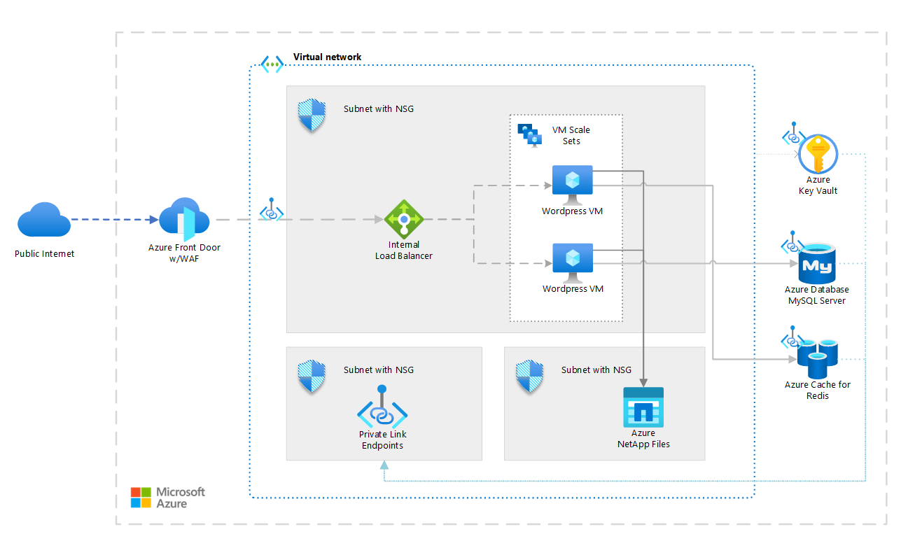

<!-- cSpell:ignore wordpress -->

Use [Azure Front Door](/azure/frontdoor/front-door-overview), [Azure Virtual Machine](/azure/virtual-machines/overview), [Azure NetApp Files](/azure/azure-netapp-files/azure-netapp-files-introduction) and other Azure services to deploy a highly scalable and secure installation of WordPress.


## Architecture

[](media/wordpress-vm.png#lightbox)

### Dataflow

This scenario covers a scalable and secure installation of WordPress that uses Ubuntu web servers. There are two distinct data flows in this scenario the first is users access the website:

1. Users access the front-end website through a CDN (Azure Front Door).
2. The CDN uses an [internal Azure Load Balancer](/azure/load-balancer/load-balancer-overview) as the origin, and pulls any data that isn't cached from there via Private Endpoint.
3. The Azure Load Balancer distributes requests to the [Virtual Machine Scale Sets][docs-vmss] of web servers.
4. SSL keys or other secrets are stored in [Azure Key Vault](/azure/key-vault/key-vault-overview).
5. The WordPress application pulls any dynamic information out of the managed [Azure Database for MySQL - Flexible Server](https://learn.microsoft.com/en-us/azure/mysql/flexible-server/overview), access privately via Private Endpoint.
6. All static content is hosted in [Azure NetApp Files](/azure/azure-netapp-files/azure-netapp-files-introduction), mounted to VMs via NFS protocol.
    > [!IMPORTANT]
    > For the best performance is essential to mount storage via  **NFS protocol version 4.1** - see option *vers* in following bash example for Ubuntu:

```bash
# install nfs driver and create directory
$ apt-get install -y nfs-common && mkdir -p /var/www/html
# add auto-mount on startup (replace with instructions from Azure Portal, but change vers to 4.1)
$ echo '<netapp_private_ip>:/<volume_name> /var/www/html nfs rw,hard,rsize=262144,wsize=262144,sec=sys,vers=4.1,tcp 0 0' >> /etc/fstab
#mount now
$ mount -a
```

### Components

- [Azure Front Door](https://azure.microsoft.com/products/frontdoor) is a Microsoft’s modern cloud Content Delivery Network (CDN), distributed network of servers that efficiently delivers web content to users. CDNs minimize latency by storing cached content on edge servers in point-of-presence locations near to end users.
- [Virtual networks](https://azure.microsoft.com/products/virtual-network) allow deployed resources to securely communicate with each other, the Internet, and on-premises networks. Virtual networks provide isolation and segmentation, filter and route traffic, and allow connection between locations. The two networks are connected via Vnet peering.
- [Azure DDoS Protection Standard](/azure/ddos-protection/ddos-protection-overview), combined with application-design best practices, provides enhanced DDoS mitigation features to provide more defense against DDoS attacks. You should enable [Azure DDOS Protection Standard](/azure/ddos-protection/ddos-protection-overview) on any perimeter virtual network.
- [Network security groups](/azure/virtual-network/security-overview) contain a list of security rules that allow or deny inbound or outbound network traffic based on source or destination IP address, port, and protocol. The virtual networks in this scenario are secured with network security group rules that restrict any traffic flow between the application components.
- [Load balancers](https://azure.microsoft.com/solutions/load-balancing-with-azure) distribute inbound traffic according to rules and health probes. A load balancer provides low latency and high throughput, and scales up to millions of flows for all TCP and UDP applications. A load balancer is used in this scenario to distribute traffic from the content deliver network to the front-end web servers.
- [Virtual Machine Scale Sets](https://azure.microsoft.com/products/virtual-machine-scale-sets) let you create and manage a group of identical load-balanced VMs. The number of VM instances can automatically increase or decrease in response to demand or a defined schedule. Two separate Virtual Machine Scale Sets are used in this scenario - one for the front-end web-servers serving content, and one for the front-end web servers used to author new content.
- [Azure NetApp Files](https://azure.microsoft.com/products/storage/netapp) provides a fully managed performance-intensive and latency-sensitive storage solution that hosts all of the WordPress content in this scenario so that all of the pods have access to the data.
- [Azure Cache for Redis](https://azure.microsoft.com/products/cache/) can be used to host key-value cache for WordPress performance optimization plugins, shared between all pods.
- [Azure Key Vault](https://azure.microsoft.com/products/active-directory) is used to store and tightly control access to passwords, certificates, and keys.
- [Azure Database for MySQL - Flexible server](https://azure.microsoft.com/products/mysql/) is database used to store WordPress data.

## Scenario details

This example scenario is applicable for any larger installation of WordPress with storage-intensive requirements. This deployment model is able to scale to meet the spike traffic that sessions drove to the site.

### Alternatives

- Redis cache - the cache could be self-hosted pod within VM instead of managed product Azure Cache for Redis.

## Considerations

These considerations implement the pillars of the Azure Well-Architected Framework, which is a set of guiding tenets that can be used to improve the quality of a workload. For more information, see [Microsoft Azure Well-Architected Framework](/azure/architecture/framework).

### Reliability

The combination of VMs and load balancing of ingress traffic provides high availability even if there's VM failure.

This scenario supports use of multiple regions, data replication and auto-scalling. These networking components distribute traffic to the VMs, and include health probes that ensure traffic is only distributed to healthy VMs. All of these networking components are fronted via a CDN. This approach makes the networking resources and application resilient to issues that would otherwise disrupt traffic and affect end-user access.

The CDN (Front Door) is global service and supports origins deployed across multiple regions (Virtual Machine Scale Sets in another regions). In addition, caching all responses on the CDN level can provide a small availability benefit when the origin isn't responding. However, it's important to note that caching shouldn't be considered a complete availability solution.

The NetApp Files storage can be replicated between paired regions. For more information, see [cross-region replication with Azure NetApp Files](/azure/azure-netapp-files/cross-region-replication-requirements-considerations).

For high availability of Azure Database for MySQL, see [High availability concepts in Azure Database for MySQL - Flexible Server](/azure/mysql/flexible-server/concepts-high-availability).

### Performance efficiency

This scenario uses Virtual Machine Scale Sets for the two front-end web server clusters in each region. With scale sets, the number of VM instances that run the front-end application tier can automatically scale in response to customer demand, or based on a defined schedule. For more information, see [Overview of autoscale with Virtual Machine Scale Sets][docs-vmss-autoscale].

For more performance efficiency guidance, see the [Performance efficiency principles](/azure/well-architected/scalability/principles) in the Azure Architecture Center.

### Security

Security provides assurances against deliberate attacks and the abuse of your valuable data and systems. For more information, see [Overview of the security pillar](/azure/architecture/framework/security/overview).

All the virtual network traffic into the front-end application tier and protected by [WAF on Azure Front Door](/azure/web-application-firewall/afds/afds-overview). No outbound Internet traffic is allowed from the database tier. No access to private storage is allowed from public. You should disable public access to resources (where applicable) and use Private Endpoints - for components Database for MySQL, Cache for Redis, Key Vault, Container Registry. See the article [Integrate Key Vault with Azure Private Link]( https://aka.ms/akvprivatelink).

For more information about WordPress security, see [General WordPress security&performance tips](/azure/wordpress#general-wordpress-securityperformance-tips).

For general guidance on designing secure scenarios, see the [Azure Security Documentation][security].

### Cost optimization

Cost optimization is about looking at ways to reduce unnecessary expenses and improve operational efficiencies. For more information, see [Overview of the cost optimization pillar](/azure/architecture/framework/cost/overview).

There are a couple main things to consider:

- How much traffic are you expecting in terms of GB/month? The amount of traffic has the biggest effect on your cost, as it determines the number of VMs. Additionally, it directly correlates with the amount of data that is surfaced via the CDN.
- What is the expected amount of hosted data? It's important to consider this since Azure NetApp Files pricing is based on reserved capacity.
- How much new data are you going to be writing to your website? New data written to your website correlates with how much data is mirrored across the regions.
- How much of your content is dynamic? How much is static? The variance around dynamic and static content influences how much data has to be retrieved from the database tier versus how much is cached in the CDN.

## Contributors

*This article is maintained by Microsoft. It was originally written by the following contributors.*

Principal author:

[Vaclav Jirovsky](https://www.linkedin.com/in/vaclavjirovsky) | Cloud Solution Architect

Other contributors:

- Adrian Calinescu | Sr. Cloud Solution Architect

## Next steps

Product documentation:

- [What is Azure Front Door?](/azure/frontdoor/front-door-overview)
- [What is Azure Web Application Firewall?](/azure/web-application-firewall/overview)
- [What is Azure NetApp Files?](/azure/azure-netapp-files/azure-netapp-files-introduction)
- [Create an NFS volume for Azure NetApp Files](/azure/azure-netapp-files/azure-netapp-files-create-volumes)
- [What are Virtual Machine Scale Sets?](/azure/virtual-machine-scale-sets/overview)
- [What is Azure Load Balancer?](/azure/load-balancer/load-balancer-overview)
- [What is Azure Virtual Network?](/azure/virtual-network/virtual-networks-overview)
- [About Azure Key Vault](/azure/key-vault/general/overview)

Microsoft Learn modules:

- [Build a scalable application with Virtual Machine Scale Sets](/training/modules/build-app-with-scale-sets)
- [Introduction to Azure NetApp Files](/training/modules/introduction-to-azure-netapp-files/)
- [Load balance your web service traffic with Front Door](/training/modules/create-first-azure-front-door/)
- [Implement Azure Key Vault](/training/modules/implement-azure-key-vault)
- [Introduction to Azure Virtual Networks](/training/modules/introduction-to-azure-virtual-networks)

## Related resources

- [Ten design principles for Azure applications](../../guide/design-principles/index.md)
- [Scalable cloud applications and site reliability engineering](../../example-scenario/apps/scalable-apps-performance-modeling-site-reliability.yml)

<!-- links -->

[docs-vmss]: /azure/virtual-machine-scale-sets/overview
[docs-vmss-autoscale]: /azure/virtual-machine-scale-sets/virtual-machine-scale-sets-autoscale-overview
[security]: /azure/security
