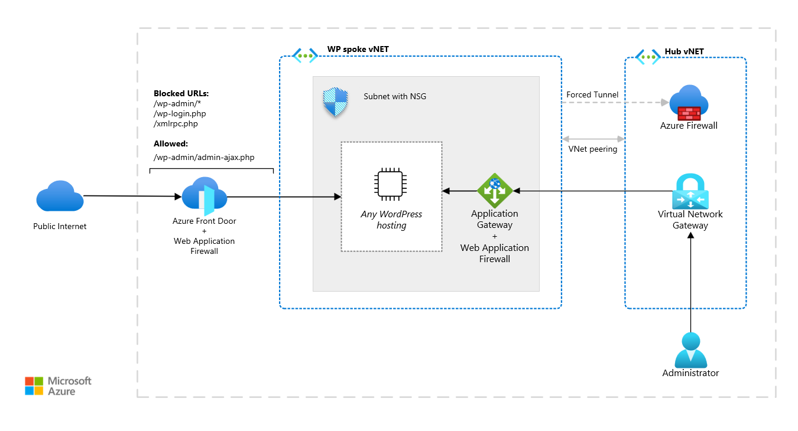

<!-- cSpell:ignore wordpress -->

WordPress is a versatile and popular content management system, used for creating websites of all sizes and purposes. From small personal blogs to large-scale corporate sites and e-commerce stores, WordPress offers a range of functionalities and customizations to suit different needs. However, due to its varying sizes and use cases, WordPress also has different hosting requirements, depending on factors such as traffic volume and storage needs.

This section covers deploying WordPress on Azure and provides guidance on what to consider and implement to ensure a secure, scalable, and cost-effective installation.

## General WordPress security & performance tips

Because of its overwhelming popularity, WordPress is a target for hackers, and websites running on the platform can be vulnerable to security threats such as malware and phishing attacks. To address these risks, the following tips can help to create a more secure and better-performing WordPress installation.

Regardless of the hosting architecture, whether it's VM, App Service, or any other, these tips are universally applicable.

### Use Web Application Firewall

You should use Azure Web Application Firewall (WAF). WAF helps secure the website against common web-based attacks. It acts as a filter between the website and the internet, monitoring incoming traffic and blocking malicious requests that can exploit vulnerabilities in your website's code. WAF can protect your website from a range of attacks, including SQL injections, cross-site scripting (XSS), and cross-site request forgery (CSRF).

You should use WAF on Azure Front Door to get centralized protection for your web applications. Azure Front Door is content delivery network (CDN) that provides fast, reliable, and secure access between your users and your applications’ static and dynamic web content across the globe.  WAF on Front Door defends your web services against common exploits and vulnerabilities.

### Remove unused plugins and themes

You should remove unused plugins and themes from any WordPress installation. It's an important step in keeping your WordPress website secure and optimizing its performance. Even if you're not actively using a plugin or theme, it can still pose a security risk by providing an entry point for hackers to exploit vulnerabilities in outdated or unmaintained code. Additionally, having too many plugins and themes installed on your website can slow down its performance by increasing the load time and server resource usage.

### Offload static content away from PHP processor

You should offload static content, such as images, videos, and CSS files, away from the PHP processor. Offloading static content helps optimize website performance and reducing server load. When a user visits a website, the server processes the PHP code and generates HTML content dynamically. This process is resource intensive. However, static content doesn't change frequently. You should serve static content directly from the server file system or a CDN without needing PHP processing. By offloading these assets, you can reduce the load on the server's CPU and RAM. This configuration results in faster page load times, improved website performance, and a better user experience.

Another benefit of serving static resources from a CDN service such as [Azure Front Door](/azure/frontdoor/front-door-overview) is that users can access servers closer to their geographic location, further reducing latency and increasing website speed. In summary, offloading static content away from the PHP processor is a crucial step in optimizing website performance and reducing server load.

> [!NOTE]
> To secure an origin with Azure Front Door using a Private Endpoint, you need to use the Premium SKU of Front Door. For more information, see [Secure your origin with Private Link](/azure/frontdoor/private-link).

#### CDN cache invalidation

For large WordPress installations using any CDN (like Azure Front Door or Azure CDN), you need to implement cache invalidation logic. Whenever a new event occurs, such as publishing a new article, updating an existing page, or adding a new comment, your need to invalidate the cache in the CDN for the affected page. The invalidation logic needs to discover all the URLs the change affected. The logic needs to discover and invalidate dynamically generated pages, such as categories and archives, in the CDN cache. Depending on the installed theme and plugins, even a minor change may affect every page.

An easy way to implement some discovery logic could be through a plugin that enables manual triggering of cache invalidation for all URLs. However, this cache purge could cause traffic peaks to WordPress when all URLs are invalidated at once. [Example implementation for Azure CDN on GitHub](https://github.com/vjirovsky/pr-crisis-wp-website/blob/master/wordpress/wp-content/plugins/azure-invalidate-cdn/plugin.php)

### Enable Two-Factor Authentication (2FA)

Two-factor authentication increases the security of your installation and help protect all accounts accessing the administration against unauthorized access or attacks. You can use of a plugin such a [MiniOrange authentication plugin](https://wordpress.org/plugins/miniorange-2-factor-authentication/). This plugin allows, among other methods, to use the Microsoft Authenticator as provider for 2FA method before gaining access to administration of your WordPress site.

### Disable XML-RPC access

XML-RPC is a remote protocol that allows third-party applications to interact with your website's server. However, this protocol is also a common target for hackers who use it to launch brute force attacks or exploit vulnerabilities in the CMS. If you're using Front Door, you can set up a deny rule for URL `/xmlrpc.php` to disable XML-RPC.

### Restrict access to administration

By default, the WordPress administration panel is accessible to anyone with the correct URL `/wp-login.php` or `/wp-admin` and login credentials. This means that hackers and other malicious actors can attempt to guess your login details, perform a session hijacking, launch brute force attacks, or exploit some vulnerabilities in the WordPress to gain access.
 Web Application Firewall can help to prevent some attack, but many administrators prefer to restrict access to WordPress administration on network level.

An example, how to achieve this restriction, could be blocking any access to private URLs on Azure Front Door component and introduce a new internal access via Internal Application Gateway/Load Balancer accessible from private network via Hub&spoke network topology. Internal Application Gateway supports Web Application Firewall rules (as well as Azure Front Door) providing protection to WordPress installation also for internal access. In case the risk of attack from internal access is acceptable, there could be used Internal Load Balancer (*OSI layer 4*).

In some cases, certain WordPress plugins require the URL `/wp-admin/admin-ajax.php` be publicly accessible and removed from this deny rule.

### Store secrets in Azure Key Vault

To ensure the security of WordPress deployments on Azure, it's recommended to store secrets, such as database passwords and SSL certificates, in Azure Key Vault. Azure Key Vault is a cloud-based service that provides secure storage and management of cryptographic keys, certificates, and secrets.

Authorized applications and services can securely access secrets without storing them in plain text within the WordPress container image or in application code.

### Tune performance

You should tune various settings and use plugins to optimize WordPress performance. The following plugin can assist in debugging WordPress installation:

- [Query Monitor](https://wordpress.org/plugins/query-monitor/) - breakdown of time spent for each SQL query and more (PHP errors, hooks and actions, block editor blocks, enqueued scripts and stylesheets, HTTP API calls)
- [Laps](https://github.com/Rarst/laps) - provides a breakdown of where time is spent serving a page

## Hosting challenges of WordPress

WordPress application architecture gives rise to several hosting challenges, including:

- **Scalability**: A hosting architecture must be capable of scaling out during peak traffic periods.
- **Read&Write-Many storage (*RWX*)**: By default, WordPress stores all static assets, plugin, and theme source codes in the `/wp-content/` directory, which must be readable and writable from all nodes during scale-out.
- **IOPS storage class**: WordPress consists of 1000+ tiny `.php` files that are referenced, loaded, and executed by PHP processor during incoming requests. Loading numerous small files can result in overhead and is often slower than loading one file with the same size (depending on the selected protocol).
- **Cache invalidation**: When a new activity occurs in the application, such as publishing a new article, the cache must be invalidated across all nodes.
- **Building cache time**: For the first user of a given node, the response time may be slower until the cache is built.

## WordPress hosting options on Azure

WordPress can run on App Service, Azure Kubernetes Service (AKS), and virtual machines (VMs). The size of the installation is an important factor for decision. For small to medium installations, App Service is a cost-effective option. However, for larger installations you should consider AKS or VM hosting.

### WordPress on App Service

[WordPress on App Service (on Linux)](/azure/app-service/quickstart-wordpress) is a fully managed solution provided by Microsoft and designed to help you quickly and easily deploy a WordPress installation. This solution is ideal for small to medium-sized WordPress installations. It provides the scalability, reliability, and security of the Azure platform without the need for complex configuration or management. It performs automatic updates, backups, and monitoring to ensure that your site is always available.

[More details about this deployment architecture](/azure/architecture/example-scenario/infrastructure/wordpress-appservice)

### Storage-intensive workloads

Large WordPress installations can be storage intensive. In these scenarios, you should use a storage solution with a higher input-output per second (IOPS) class and low latency to accommodate the storage requirements. We recommend [Azure NetApp Files](/azure/azure-netapp-files/). Azure NetApp Files can support storage-intensive WordPress deployments and provides extra features such as data protection, backup and restore, cross-region replication and disaster recovery.

For a container deployment of WordPress, you should use **Azure Kubernetes Service (AKS)** and with Azure NetApp Files storage via Kubernetes CSI driver. Azure NetApp Files offers a ReadWriteMany mode so that all the nodes can read and write to the same storage. For more information, see [AKS WordPress architecture](/azure/architecture/example-scenario/infrastructure/wordpress-container).

For a large WordPress installation running on virtual machines (VMs), you should mount Azure NetApp Files using the network file system (NFS) protocol. [More details about VM deployment architecture](/azure/architecture/example-scenario/infrastructure/wordpress-iaas).

### Immutable WordPress container

An alternative approach to traditional hosting methods is to deploy WordPress into an immutable container. This approach has advantages and disadvantages. The source code and all resources within immutable containers are fixed and can't be modified after deployment. You need to make all changes, including new plugin installation or WordPress core updating, in a new version of the container image. While this approach ensures consistency and simplifies rollbacks, you have to build deployment pipeline to make changes. Additionally, immutable containers may have limitations on persistent storage options. It might force to develop a solution for handling media files and other data. Despite these limitations, immutable container deployments offer benefits in terms of security, scalability, and portability.

You can deploy an immutable containerized version of WordPress on various platforms, including Azure Container App, Azure Kubernetes Service, and Azure App Service with a custom container image. You can host the container image in Azure Container Registry.

## Contributors

*This article is maintained by Microsoft. It was originally written by the following contributors.*

Principal author:

[Vaclav Jirovsky](https://www.linkedin.com/in/vaclavjirovsky) | Cloud Solution Architect

Other contributors:

- Adrian Calinescu | Sr. Cloud Solution Architect

## Next steps

Product documentation:

- [What is Azure Front Door?](/azure/frontdoor/front-door-overview)
- [What is Azure Web Application Firewall?](/azure/web-application-firewall/overview)
- [About Azure Key Vault](/azure/key-vault/general/overview)
- [What is Azure Load Balancer?](/azure/load-balancer/load-balancer-overview)
- [What is Azure Application Gateway?](/azure/application-gateway/overview)
- [What is Azure Virtual Network?](/azure/virtual-network/virtual-networks-overview)
- [What is Azure Firewall?](/azure/firewall/overview)
- [What is VPN Gateway?](/azure/vpn-gateway/vpn-gateway-about-vpngateways)

Microsoft Learn modules:

- [Introduction to Azure Front Door](/training/modules/intro-to-azure-front-door)
- [Configure Azure Load Balancer](/training/modules/configure-azure-load-balancer)
- [Implement Azure Key Vault](/training/modules/implement-azure-key-vault)
- [Introduction to Azure Virtual Networks](/training/modules/introduction-to-azure-virtual-networks)

## Related resources

- [Ten design principles for Azure applications](../../guide/design-principles/index.md)
- [Scalable cloud applications and site reliability engineering](../../example-scenario/apps/scalable-apps-performance-modeling-site-reliability.yml)

<!-- links -->

[docs-nsg]: /azure/virtual-network/security-overview
[security]: /azure/security
