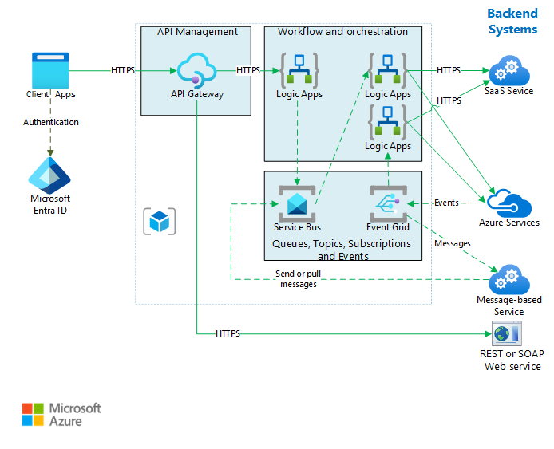

This example architecture is built on the [Basic enterprise integration][basic-enterprise-integration] architecture. It extends that architecture to show how to integrate enterprise backend systems, by using message brokers and events to decouple services for greater scalability and reliability. Ensure that you're familiar with that design and the components used in the basic integration architecture. It provides foundational information on the core components of this architecture, which won't be reproduced here.

## Architecture

The backend systems referenced in this design may include software as a service (SaaS) systems, Azure services, and existing web services in your enterprise.

*Download a [Visio file](https://arch-center.azureedge.net/queues-events-content.vsdx) of this architecture*.

### Workflow

The architecture shown here builds on a simpler architecture that is shown in [Basic enterprise integration][basic-enterprise-integration]. That architecture uses [Logic Apps][logic-apps] to orchestrate workflows directly with backend systems and [API Management][apim] to create catalogs of APIs.

This version of the architecture adds two components that help make the system more reliable and scalable:

- **[Azure Service Bus][service-bus]**. Service Bus is a secure, reliable message broker.

- **[Azure Event Grid][event-grid]**. Event Grid is an event routing service. It uses a [publish/subscribe](../../patterns/publisher-subscriber.yml) (pub/sub) eventing model.

Asynchronous communication using a message broker provides the following advantages over making direct, synchronous calls to backend services:

- Provides load-leveling to handle bursts in workloads, using the [Queue-Based Load Leveling pattern](../../patterns/queue-based-load-leveling.yml).
- Provides for broadcasting of messages to multiple consumers using [Publisher-Subscriber pattern](../../patterns/publisher-subscriber.yml).
- Reliably tracks the progress of long-running workflows that involve multiple steps or multiple applications.
- Helps to decouple applications.
- Integrates with existing message-based systems.
- Allows work to be queued when a backend system isn't available.

Event Grid enables the various components in the system to react to events as they happen, rather than relying on polling or scheduled tasks. As with a message queue and topics, it helps decouple applications and services. An application or service can publish events, and any interested subscribers will be notified. New subscribers can be added without updating the sender.

Many Azure services support sending events to Event Grid. For example, a logic app can listen for an event when new files are added to a blob store. This pattern enables reactive workflows, where uploading a file or putting a message on a queue kicks off a series of processes. The processes might be executed in parallel or in a specific sequence.

## Recommendations

The recommendations described in [Basic enterprise integration][basic-enterprise-integration] apply to this architecture. 

### Service Bus

Service Bus has two delivery modes, *pull* or *proxied push*. In the pull model, the receiver continuously polls for new messages. Polling can be inefficient, especially if you have many queues that each receive a few messages, or if there's much time between messages. In the proxied push model, Service Bus sends an event through Event Grid when there are new messages. The receiver subscribes to the event. When the event is triggered, the receiver pulls the next batch of messages from Service Bus.

When you create a logic app to consume Service Bus messages, we recommend using the proxied push model with Event Grid integration. It's often more cost efficient, because the logic app doesn't need to poll Service Bus. For more information, see [Azure Service Bus to Event Grid integration overview](/azure/service-bus-messaging/service-bus-to-event-grid-integration-concept). Currently, Service Bus [Premium tier](https://azure.microsoft.com/pricing/details/service-bus/) is required for Event Grid notifications.

Use [PeekLock](/azure/service-bus-messaging/service-bus-messaging-overview#queues) for accessing a group of messages. When you use PeekLock, the logic app can perform steps to validate each message before completing or abandoning the message. This approach protects against accidental message loss.

### Event Grid

When an Event Grid trigger fires, it means *at least one* event happened. For example, when a logic app gets an Event Grid triggers for a Service Bus message, it should assume that several messages might be available to process.

## Considerations

These considerations implement the pillars of the Azure Well-Architected Framework, which is a set of guiding tenets that can be used to improve the quality of a workload. For more information, see [Microsoft Azure Well-Architected Framework](/azure/architecture/framework).

### Reliability

Reliability ensures your application can meet the commitments you make to your customers. For more information, see [Overview of the reliability pillar](/azure/architecture/framework/resiliency/overview).

- **Azure AD:** Azure AD is a globally distributed, highly available SaaS platform. Refer to the [SLA](https://azure.microsoft.com/support/legal/sla/active-directory/v1_1/) for guaranteed availability details.
- **API Management:** API Management can be deployed in several highly available configurations, according to business requirements and cost tolerance.  Refer to the [Ensure API Management availability and reliability](/azure/api-management/high-availability) for a full review of options. Also refer to the [SLA][apim-sla] for guaranteed availability details.
- **Logic Apps:** Geo-redundant storage is available for Logic Apps on the Consumption plan tier.  For information on designing a business continuity and disaster recovery solution, refer to the [guidance](/azure/logic-apps/business-continuity-disaster-recovery-guidance). Also refer to the [SLA][logic-apps-sla] for guaranteed availability details.
- **Event Grid:** Event Grid resource definitions for topics, system topics, domains, and event subscriptions and event data are automatically replicated across three availability zones [(when available)](/azure/availability-zones/az-overview#azure-regions-with-availability-zones) in the region. When there's a failure in one of the availability zones, Event Grid resources automatically fail over to another availability zone without any human intervention. Refer to the [Geo-disaster recovery across regions](/azure/event-grid/availability-zones-disaster-recovery#geo-disaster-recovery-across-regions) for guidance on designing a disaster recovery solution for failing over to another region. Also refer to the [SLA][event-grid-sla] for guaranteed availability details.
- **Service Bus:** Service Bus Premium supports [Geo-disaster recovery](/azure/service-bus-messaging/service-bus-outages-disasters#geo-disaster-recovery) and [Availability Zones](/azure/service-bus-messaging/service-bus-outages-disasters#availability-zones). [Replication](/azure/service-bus-messaging/service-bus-outages-disasters#protecting-against-outages-and-disasters---service-bus-standard) is available for Service Bus Standard. Also refer to the [SLA][sb-sla] for guaranteed availability details.

### Security

Security provides assurances against deliberate attacks and the abuse of your valuable data and systems. For more information, see [Overview of the security pillar](/azure/architecture/framework/security/overview).

To secure Service Bus, use [Azure Active Directory (Azure AD) authentication](/azure/service-bus-messaging/service-bus-authentication-and-authorization#azure-active-directory) paired with [managed identities](/azure/service-bus-messaging/service-bus-managed-service-identity). Azure AD integration for Service Bus resources provides Azure role-based access control (RBAC) for fine-grained control over a client’s access to resources. You can use Azure RBAC to grant permissions to a security principal, which may be a user, a group, or an application service principal (a managed identity in this case).

Where Azure AD isn't available, you can use [shared access signature (SAS)](/azure/service-bus-messaging/service-bus-authentication-and-authorization#shared-access-signature). You can grant a user access to Service Bus resources with specific rights by using [SAS authentication](/azure/service-bus-messaging/service-bus-sas).

If you need to expose a Service Bus queue or topic as an HTTP endpoint, for example, to post new messages, use API Management to secure the queue by fronting the endpoint. You can then secure the endpoint with certificates or OAuth authentication as appropriate. The easiest way to secure an endpoint is using a logic app with an HTTP request/response trigger as an intermediary.

The Event Grid service secures event delivery through a validation code. If you use Logic Apps to consume the event, validation is automatically performed. For more information, see [Event Grid security and authentication](/azure/event-grid/security-authentication).

#### Network security

Network security should be considered throughout the design.

- **[Service Bus](/azure/service-bus-messaging/network-security) Premium** can be bound to a virtual network (VNet) subnet service endpoint, securing the namespace to only accept traffic from authorized virtual networks.  Additionally, use [private endpoints](/azure/service-bus-messaging/network-security#private-endpoints) to lock down your VNet traffic to private traffic over [Private Link](/azure/private-link/private-link-overview).
- **[Logic Apps](/azure/logic-apps/secure-single-tenant-workflow-virtual-network-private-endpoint)** Standard and Premium Logic Apps can be configured to accept inbound traffic through [private endpoints](/azure/logic-apps/secure-single-tenant-workflow-virtual-network-private-endpoint#set-up-inbound-traffic-through-private-endpoints) and to send outbound traffic through [VNet integration](/azure/logic-apps/secure-single-tenant-workflow-virtual-network-private-endpoint#set-up-outbound-traffic-using-virtual-network-integration).
- **API Management** provides several options to secure access to your API Management instance and APIs using an Azure virtual network. Refer to the [Use a virtual network with Azure API Management](/azure/api-management/virtual-network-concepts?tabs=stv2) documentation for a thorough review of the options. [Private endpoints](/azure/api-management/virtual-network-concepts?tabs=stv2#private-endpoint) are also supported.

### Cost Optimization

Cost optimization is about looking at ways to reduce unnecessary expenses and improve operational efficiencies. For more information, see [Overview of the cost optimization pillar](/azure/architecture/framework/cost/overview).

In general, use the [Azure pricing calculator][azure-pricing-calculator] to estimate costs. Here are some other considerations.

#### API Management

You're charged for all API Management instances when they're running. If you've scaled up and don't need that level of performance all the time, manually scale down or configure [autoscaling][apim-autoscale].

For light usage workloads, consider the [consumption tier](/azure/api-management/api-management-features), which is a low-cost, serverless option. The consumption tier is billed per API call, whereas the other tiers are billed per hour.

#### Logic Apps

Logic Apps uses a [serverless](/azure/logic-apps/logic-apps-serverless-overview) model. Billing is calculated based on action and connector execution. For more information, see [Logic Apps pricing](https://azure.microsoft.com/pricing/details/logic-apps/).

#### Service Bus queues, topics and subscriptions

Service Bus queues and subscriptions support both proxied push and pull models for delivering messages. In the pull model, every polling request is metered as an action. Even with long polling at 30 secs (default), cost can be high. Unless you need real-time delivery of messages, consider using the proxied push model.

Service Bus queues are included in all tiers (Basic, standard, and premium tiers). While Service Bus topics and subscriptions are available in standard and premium tiers. For more information, see [Azure Service Bus pricing][service-bus-pricing].

#### Event Grid

Event Grid uses a serverless model. Billing is calculated based on the number of operations (event executions). Operations include ingress of events to Domains or Topics, advanced matches, delivery attempts, and management calls. Usage of up to 100,000 operations is free of charge.

For more information, see [Event Grid pricing](https://azure.microsoft.com/pricing/details/event-grid/).

For more information, see the cost section in [Microsoft Azure Well-Architected Framework][aaf-cost].

### Operational Excellence

The [Basic Enterprise Integration reference architecture](../../reference-architectures/enterprise-integration/basic-enterprise-integration.yml#devops) provides guidance on DevOps patterns, which align to the Well-Architected Framework's [Operational Excellence](/azure/architecture/framework/devops/) pillar. 

Automating recovery operations as much as possible is an integral component of Operational Excellence.  With automation in mind, you can combine [Azure Log Monitoring](/azure/service-bus-messaging/service-bus-insights) with [Azure Automation](/azure/automation/overview) to automate the failover of your Service Bus resources. Refer to the diagram in [failover flow](/azure/service-bus-messaging/service-bus-geo-dr#failover-flow) documentation for an example of automation logic to initiate a failover.

### Performance efficiency

Performance efficiency is the ability of your workload to scale to meet the demands placed on it by users in an efficient manner. For more information, see [Performance efficiency pillar overview](/azure/architecture/framework/scalability/overview).

To achieve higher scalability, the Service Bus Premium tier can scale out the number of messaging units. Refer to the [Service Bus Premium and Standard messaging tiers](/azure/service-bus-messaging/service-bus-premium-messaging) documentation for a review of the Premium tier benefits. Also, refer to the [autoscaling feature](/azure/service-bus-messaging/automate-update-messaging-units) documentation to learn about configuring the autoscaling of messaging units.

More recommendations for Service Bus can be found at [Best practices for performance improvements by using Service Bus Messaging](/azure/service-bus-messaging/service-bus-performance-improvements).

## Next steps

For more information, see the Service Bus documentation:

- [Azure Service Bus to Event Grid integration overview](/azure/service-bus-messaging/service-bus-to-event-grid-integration-concept)
- [Service Bus Premium and Standard messaging tiers](/azure/service-bus-messaging/service-bus-premium-messaging)
- [Service Bus autoscaling feature](/azure/service-bus-messaging/automate-update-messaging-units)
- [Best practices for performance improvements by using Service Bus Messaging](/azure/service-bus-messaging/service-bus-performance-improvements)

## Related resources

- [Basic enterprise integration on Azure](../../reference-architectures/enterprise-integration/basic-enterprise-integration.yml)
- [Enterprise business intelligence](/azure/architecture/example-scenario/analytics/enterprise-bi-synapse)
- [Custom Business Processes](../../solution-ideas/articles/custom-business-processes.yml)

[aaf-cost]: /azure/architecture/framework/cost/overview
[apim]: /azure/api-management
[apim-sla]: https://azure.microsoft.com/support/legal/sla/api-management
[apim-autoscale]: /azure/api-management/api-management-howto-autoscale
[azure-pricing-calculator]: https://azure.microsoft.com/pricing/calculator
[event-grid]: /azure/event-grid
[event-grid-sla]: https://azure.microsoft.com/support/legal/sla/event-grid
[logic-apps]: /azure/logic-apps/logic-apps-overview
[logic-apps-sla]: https://azure.microsoft.com/support/legal/sla/logic-apps
[sb-sla]: https://azure.microsoft.com/support/legal/sla/service-bus
[service-bus]: /azure/service-bus-messaging
[service-bus-pricing]: https://azure.microsoft.com/pricing/details/service-bus
[basic-enterprise-integration]: ../../reference-architectures/enterprise-integration/basic-enterprise-integration.yml
