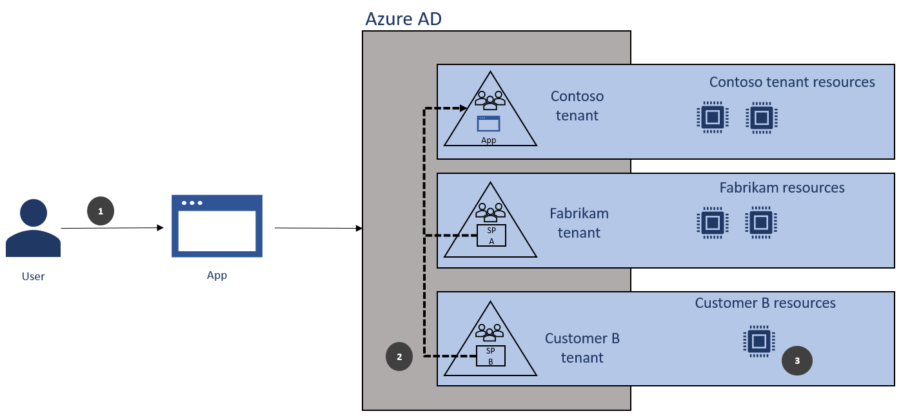
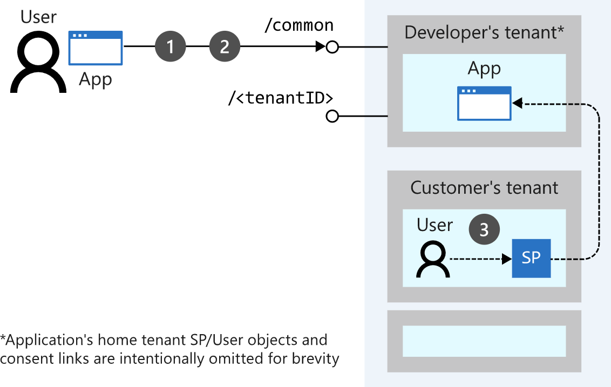
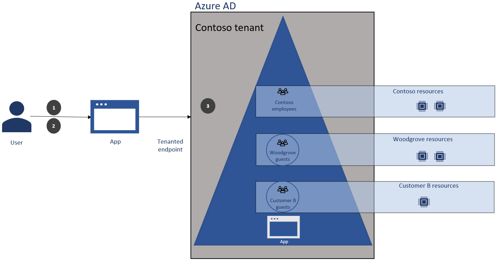

<!--cSpell:ignore knicholasa ISV's Woodgrove ecommerce SAML Gmail -->

IoT device manufacturers are creating custom apps and services to better serve their customers' device management needs. Developers building IoT apps and services want to provide secure, frictionless access to cloud-connected devices and the telemetry data sent by these devices to the cloud.

In this article, we explain how a developer can take advantage of [Azure Active Directory](/azure/active-directory/fundamentals/active-directory-whatis) and the [Microsoft identity platform](/azure/active-directory/develop/v2-overview) to create a secure [SaaS app](https://azure.microsoft.com/overview/what-is-saas/). We'll cover the basic how-tos and benefits of integrating your app with Azure AD , as well as two common customer scenarios IoT developers may encounter.

By integrating with the Microsoft identity platform and configuring the app to be [multi-tenant](/azure/active-directory/develop/single-and-multi-tenant-apps), developers can:

- Ensure isolation of customer resources and data.
- Enable access control by enforcing organizational policies and conditions based on time, location, and more.
- Support auditing and reporting of access.
- Allow users to sign in with existing work and social accounts, which in turn allows a [single sign-on](/azure/active-directory/manage-apps/what-is-single-sign-on) experience so that users sign in once and are able to access other corporate resources and apps without signing in again.

To learn more about the topics covered in this article, check out the [Microsoft identity platform homepage](/azure/active-directory/develop). The quickstart guides there will help you get set up quickly to integrate your app with our platform.

## Example scenario

Contoso is a manufacturer of IoT-ready chillers and pumps which they sell to geographically distributed customers. An in-house developer at Contoso is tasked with creating an app that customers of Contoso will use to manage the chillers and pumps that will be connected to the cloud via Azure IoT. These devices will send telemetry data to Azure which is then used for predictive maintenance of these devices. The IoT app will be sold along with the industrial chillers and pumps to two different types of customers represented by the following examples:

- Fabrikam, a large enterprise customer who has their own Azure AD tenant and would like their employees to sign into the app using their Azure AD work accounts. The Fabrikam IT department will manage access and apply organizational polices for access to the app as well as the IoT devices/resources and data the IoT app manages.

- Woodgrove, a customer who does not have an Azure AD tenant and would like users to log in using existing email accounts such Gmail or  Microsoft accounts.

## Building a multi-tenant app

Contoso's developer is building a SaaS app and they want the employees at the companies that purchase the app to be able to sign in with existing credentials and only access data that belongs to their own company. This can be done by configuring the app to be [multi-tenant](/azure/active-directory/develop/single-and-multi-tenant-apps) in Azure AD.

Multi-tenant apps are configured to accept sign-ins from multiple Azure AD tenants. Users in any Azure AD tenant will be able to sign in to the application after consenting to use their account with the application. For most IoT developers, the end users of the app will belong to a company with an Azure AD account. However, in the case that their company does not have an Azure AD tenant, the B2B capabilities described in the Woodgrove scenario below will allow users to sign in using existing email accounts such Gmail or Microsoft accounts.

For step by step instructions on making an app multi-tenant, check out [How to: Sign in any Azure Active Directory user using the multi-tenant application pattern](/azure/active-directory/develop/howto-convert-app-to-be-multi-tenant#understand-user-and-admin-consent) or this [example multi-tenant SaaS application](https://github.com/Azure-Samples/active-directory-aspnetcore-webapp-openidconnect-v2/blob/master/2-WebApp-graph-user/2-3-Multi-Tenant/README.md) available on GitHub. The basic process and benefits of integrating with Azure AD and making your IoT app multi-tenant are included here.

### Prerequisites

To get started, the developer of the app must belong to an Azure AD tenant. If they don't have an existing tenant, they can create a [new Azure AD tenant](/azure/active-directory/fundamentals/active-directory-access-create-new-tenant). Additionally, the developer needs to have permission to register an app in their Azure AD tenant. You can [check if you have sufficient permissions](/azure/active-directory/develop/howto-create-service-principal-portal#check-azure-ad-permissions) in the Azure portal.

### Register the app

The first step is for the developer to [register the app](/azure/active-directory/develop/quickstart-register-app) inside their own Azure AD tenant. This established an identity for the app, and allows the developer to specify the permissions it will need to perform its tasks in any given tenant. This is also the point when the developer specifies that it is a multi-tenant app.

When the app is registered, two objects are created in the tenant:

- [Application object](/graph/api/resources/application?view=graph-rest-1.0) - lives in the tenant where the app was registered (the "home" tenant) and serves as the template for common and default properties.

- [Service principal object](/graph/api/resources/serviceprincipal?view=graph-rest-beta) - defines the access policy and permissions for the application in the current tenant. A service principal will be created in each tenant that uses this application.

### Direct user sign-ins to the common endpoint

For multi-tenant apps, sign-in requests for Azure AD accounts should be sent to the [common endpoint](/azure/active-directory/develop/howto-convert-app-to-be-multi-tenant#update-your-code-to-send-requests-to-common): `https://login.microsoftonline.com/common`. When the Microsoft identity platform receives a request on the common endpoint, it signs the user in and identifies which tenant the user belongs to. It sends this information back to the app, which can then determine the resources this user should have access to based on tenant membership. In this way, the developer can maintaining separation of proprietary information between companies.

> [!NOTE]
> Guest users' sign-in attempts must be directed to a tenant-specific endpoint (i.e. the developer's tenant) `https://login.microsoftonline.com/{TenantId_or_Name}`. This is required when users are signing in with social accounts, and we provide an example of this in the Woodgrove Bank scenario below.

1. User logs in to app

2. Azure AD determines the user's tenant and issues token with tenant ID

3. App accepts the token and user gets access to tenant-specific resources (note that the app developer must enforce the separation of resources by tenant ID)

### Obtain user (or admin) consent

When a user (or admin) logs in to a multi-tenant application for the first time, the application must ask for consent to be registered in the user's directory and access directory data it needs to run. For example, if an application needs to read calendar information about a user from Microsoft 365, that user is required to consent to this access before the app can do so.

Developers can use the Azure AD consent framework to obtain consent via interactive prompts as part of the first time log in experience. The prompts ensure that users and administrators know exactly what data the app is requesting access to, and they can be confident that it isn't behaving with malicious intent. The consent framework is built on OAuth 2.0 and its various flows, such as authorization code grant and client credentials grant, using public or confidential clients. An example of the consent process is available in the [Azure Active Directory consent framework](/azure/active-directory/develop/consent-framework) document, as well as this [example multi-tenant application](https://github.com/Azure-Samples/active-directory-aspnetcore-webapp-openidconnect-v2/blob/master/2-WebApp-graph-user/2-3-Multi-Tenant/README.md).

Once the user consents, a service principal defining the access policy and permissions for this app is created in the user's tenant, and the sign-in will continue.

1. App sends sign-in request to common for the user

2. User responds to sign-in prompt and provides any required consent to app

3. Azure AD creates service principal (SP) in customer's tenant

In addition, the developer can decide based on the requirements of the app if it needs consent from the user (to access data related to them) or an admin (to allow access to the entire organization's data), although some tenants may require admin approval for any new application. This is covered in more depth in [How to: Sign in any Azure Active Directory user using the multi-tenant application pattern](/azure/active-directory/develop/howto-convert-app-to-be-multi-tenant#understand-user-and-admin-consent).

### Implement authorization with Azure AD App Roles

In addition to authentication, the developer can enforce *authorization* within the app. Authorization is used to ensure once a user has access to an app, they are given proper privileges to access data and resources.

Authorization rules can be enforced with [Azure role-based access control (Azure RBAC)](/azure/role-based-access-control/overview) and [Role Claims](/azure/active-directory/develop/active-directory-enterprise-app-role-management). When using Azure RBAC, a tenant admin grants permissions to use or view resources based on **roles**, and not to individual users or groups.

The developer can [add app roles](/azure/active-directory/develop/howto-add-app-roles-in-azure-ad-apps) to an app and declare them in the [app's manifest](/azure/active-directory/active-directory-application-manifest/). When a user signs into the app, Azure AD emits a claim for each role that the user has been granted, individually and from their group membership. The app can use these role claims with the tenant ID claim to do an access check. This will determine whether a user is allowed to perform an action on a specific resource associated with an Azure AD tenant.

An app does not need any extra Active Directory permissions, other than reading the user's profile, to enable app roles. Role assignment managers within each tenant can then assign these pre-defined app roles to users and manage who has access to which resource following their organization's needs.

### Conditional access to IoT resources

If customers have additional requirements to restrict access to IoT resources based on specific conditions, they can use [Azure AD Conditional Access](/azure/active-directory/conditional-access/overview) in their own tenants. Common signals that Conditional Access can take into account include:

- User or group membership
- IP location information
- Devices marked as compliant
- Specific applications

### Get the app to customers

Finally, the developer may want to provide an e-commerce site for customers to purchase licenses for the app. This e-commerce site is separate from the IoT app itself. A sample workload describing how to build an [e-commerce front-end](../apps/ecommerce-scenario.yml) is available on the Azure Reference Architecture Center.

To increase the discoverability and adoption of your IoT app, the developer should publish the app to the [Azure AD App gallery](/azure/active-directory/develop/howto-app-gallery-listing). The Azure AD application gallery is in the Azure Marketplace app store, where all application connectors are published for single sign-on and user provisioning. IT administrators can add connectors from the app gallery, and then configure and use the connectors for single sign-on and provisioning for additional convenience for the end user of the app.

## Example app usage scenarios

In the first part of this document we explained the basic configurations necessary for a developer to set up a multi-tenant app. Now, let's explore a couple customer scenarios to explain how the authentication process will work for the IoT app. The following two customers, Fabrikam, Inc. and Woodgrove Bank, will sign in to our IoT developer's app in different ways. We'll go through each scenario and discuss how Azure AD helped the developer meet the customers' needs.

### Scenario 1: Customer with an existing Azure AD tenant

Fabrikam, Inc. is a large enterprise customer of the developer and has its own Azure AD tenant. Fabrikam, Inc. would like its employees to sign into the IoT app using their existing Azure AD work accounts. In addition, the company's IT departments will manage access and apply organizational policies for access to the app, the IoT devices, and data the IoT app manages. Fabrikam, Inc.'s global admin will review the permissions required by any app before allowing it in the tenant.

The developer's app supports these requirements as follows:

#### Signing in Fabrikam, Inc.'s users with their existing work accounts

Since the app has been registered as a multi-tenant app, Fabrikam, Inc. users can sign into the app with their Azure AD work credentials. The app must send the sign-in request with these credentials to the common endpoint, `https://login.microsoftonline.com/common`. The Microsoft identity platform will discover which tenant the user is from and send a sign-in response token that contains information on which tenant the user belongs to. The developer can use this information to determine which resources the user can access.

#### Admin consent for the app

Fabrikam, Inc.'s tenant administrators can set the enterprise app settings so that [administrator approval is required](/azure/active-directory/develop/active-directory-how-applications-are-added#who-has-permission-to-add-applications-to-my-azure-ad-instance) before a user in the tenant can register or provide consent to a new app. This allows the administrators to control which apps are being run in their tenant. If a user is blocked from registering or signing in, they'll see a generic error message that says they're unauthorized to access the app and they should ask their admin for help.

In addition, the admins can set up the tenant to require admin consent for certain permissions (e.g. the ability to write data to your Azure AD tenant) regardless of whether regular users can register or consent to new apps.

> [!TIP]
> The [new admin consent workflow](/azure/active-directory/manage-apps/configure-admin-consent-workflow) gives tenant admins a secure way to grant access to applications that require admin approval while allowing them to disable their end-user's ability to consent. When a user tries to access an app but is unable to provide consent, they can use the dialog box with the error message to send a request for admin approval. Benefits of the admin consent workflow include the following:
>
> - Helps admins manage access to organizational data and regulate the enterprise apps within their organization.
> - Gives administrators increased visibility into what app users need access to.
>
> The new workflow gives all end-users the ability to request access to apps that they were previously unable to access because of a lack of permissions. The request is sent via email to admins who have been designated as reviewers. A reviewer acts on the request, and the user is notified of the action.

### Scenario 2: Customer without Azure AD tenant

Most customers for IoT app developers will likely be larger companies that have their own Azure AD tenants. However, in the case that there are customers who want to use the app and do not have Azure AD, they can still use the app by taking advantage of features available with Azure AD B2B as described in this scenario.

Woodgrove Bank is another company using the developer's app. Woodgrove Bank does not have an Azure AD tenant and would like its employees to log in with existing email accounts such Gmail or Microsoft accounts. As with other customers, isolation of Woodgrove Bank's users and resources from other customers must be maintained. In addition, the developer would like to ensure all access to the app can be audited and reported on.

To enable this, the developer and IT Admins can use [Azure AD B2B (business-to-business) collaboration](/azure/active-directory/b2b/what-is-b2b), adding Woodgrove Bank's users as guests in the app's home tenant. Azure AD B2B will fulfill the business requirements as follows.

#### Adding guest users to a tenant

The developer can enable guests to log in with existing email accounts using an [invitation and redemption process](/azure/active-directory/b2b/redemption-experience) that involves sending either a direct link or an email to the guest. The process can be customized using [Azure AD business-to-business APIs](/azure/active-directory/b2b/customize-invitation-api).

The developer will need to decide which tenant they want to keep the guest user accounts in. These guest users will show up in the directory, so if this will be a common scenario for the app the developer and company administrators may decide it is best to create a new tenant separate from the company's corporate tenant in which to register the app so that the guest user accounts are tracked there and not in the company's corporate tenant.

#### Authenticating guest users

To enable guest sign-ins, the developer must ensure that guest users' sign-in attempts are directed to the tenant-specific endpoint (i.e. the developer's tenant) `https://login.microsoftonline.com/{TenantId_or_Name}`. Note that this differs from the endpoint used for users with existing Azure AD accounts, so may require the developer to implement a separate sign-in page specifically for guests.

There are several options for authenticating guests who wish to use non-Azure AD accounts with your app:

- [Direct federation](/azure/active-directory/b2b/direct-federation). Direct federation works with identity systems that support the SAML or WS-Fed standards.

- [Google federation](/azure/active-directory/b2b/google-federation). Gmail users are authenticated using Google federation.

- [One Time Passcode (OTP) authentication](/azure/active-directory/b2b/one-time-passcode). Provides a temporary code to authenticate users who cannot be authenticated through other means.

#### Isolation

The developer can [create a security group](/azure/active-directory/fundamentals/active-directory-manage-groups?context=azure%2factive-directory%2fusers-groups-roles%2fcontext%2fugr-context) in their home tenant that will act as the isolation boundary for Woodgrove Bank's users and their IoT devices. The developer or IT Admin in the developer's tenant can choose to designate a Woodgrove Bank employee as the owner of the security group so that they can control security group membership. The developer's app will factor in guest users' group memberships when making access control decisions.

In addition, the Woodgrove security group owner can set group-level access policies that will control how the group members can access the app in order to enforce company policies.

> [!NOTE]
> Depending on the business logic required by your app, security group ownership and membership can be managed by either an account manager who is an employee of the developer's company or by a Woodgrove guest user who is assigned as owner of the group. To learn more about Azure AD security group functionality, see [Manage app and resource access using Azure Active Directory groups](/azure/active-directory/fundamentals/active-directory-manage-groups).

##### Runtime

1. The user signs into the app using the targeted tenant endpoint.

2. Azure AD issues a token with tenant ID and group membership claims.

3. The app accepts the token and user gets access to security group-specific resources.

## Conclusion

This has been an overview of how to use Azure AD to secure your application, focusing on common IoT app scenarios. The links below provide more information on the topics discussed in this document.

## Next steps

- [Microsoft identity platform best practices and recommendations](/azure/active-directory/develop/identity-platform-integration-checklist)

- [Azure AD developer guidance](/azure/active-directory/develop/howto-add-app-roles-in-azure-ad-apps)

- [Permissions and consent](/azure/active-directory/develop/v2-permissions-and-consent)

- [Signing up and signing in with Azure AD](/azure/active-directory/develop/howto-add-branding-in-azure-ad-apps#signing-up-and-signing-in-with-azure-ad)

- [Self-service group management](/azure/active-directory/fundamentals/active-directory-manage-groups?context=azure%2factive-directory%2fusers-groups-roles%2fcontext%2fugr-context)

- [Restrict your app to a set of users](/azure/active-directory/develop/howto-restrict-your-app-to-a-set-of-users)

- [Microsoft identity platform (v2.0) Authentication flows and app scenarios](/azure/active-directory/develop/authentication-flows-app-scenarios)

- [Secure your Internet of Things (IoT) deployment](/azure/iot-fundamentals/iot-security-deployment)

## Related resources

- [Manage identity in multi-tenant applications](../../multitenant-identity/index.md)
- [Architectural considerations for identity in a multitenant solution](/azure/architecture/guide/multitenant/considerations/identity)
- [Architectural approaches for identity in multitenant solutions](/azure/architecture/guide/multitenant/approaches/identity)
