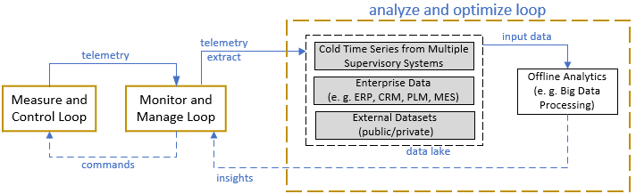

# Analyze and optimize loops

The Internet-of-Things (IoT) *analyze and optimize loop (AOL)* enables generation and application of business optimization insights to one or more [Cyber Physical System (CPS)](https://en.wikipedia.org/wiki/Cyber-physical_system) deployments, based on the entire enterprise business context.

The AOL sources telemetry, typically from MML processes, refines it, and combines it with enterprise data sources to generate insights.

## Use cases

Some example scenarios for AOLs include:

- Smart spaces: Compute campus safety index and take appropriate measures.
- Power transmission: Correlate power outage and wildfire event trends to produce proactive transmission repairs and replacement of monitoring devices.
- Oil and gas production: Compute a basin's oil production trends and compare it with site performance.
- Transportation and logistics: Compute carbon footprint trends, compare them with organizational goals, and take corrective measures.
- Wind farm: Compute the power factor of the entire wind farm operation, and devise means to improve efficiency of each wind turbine.
- Discrete manufacturing: Increase the widget production rate of many factories to meet market demand.

## Architecture

The following diagram shows the schematic of a typical AOL and its relationships with other IoT process loops.

In an AOL, data from various IoT, enterprise, private, and public sources flows into cloud data lakes. Offline analytics consume the data lakes to discover hidden trends and business optimization insights. The optimization insights from the offline analytics processes flow back to IoT installations through [monitor and manage loops (MMLs)](monitor-and-manage-loop.md) and [measure and control loops (MCLs)](measure-and-control-loop.md).

## Characteristics

- The AOL operates asynchronously, so there are no tight timing deadlines for analyzing data or sending optimization signals to devices. AOLs depend on long telemetry history and enterprise operational data history for running batch jobs.
- System dependencies include multiple systems to feed data through the data lake, which include IoT systems and feeds from enterprise systems. The optimization loop primarily uses web service protocols to integrate with supervisory systems and other enterprise systems.

## Components

The important components of business optimization control are:

- A **data lake**, large-scale storage optimized for lower usage costs over longer periods. HDFS storage in the context of map-reduce processing is an example of such a data lake. Data lake defers the structure of the data to the processing time, so is good for storing both structured and unstructured data.
- **Cold time series data**, raw or processed telemetry that is important for offline analytics and often comes from multiple IoT systems. Analytics jobs further refine and combine this data with enterprise and external data sets.
- **Enterprise data** produced by enterprise systems like product lifecycle management, supply chain, finance, sales, manufacturing and distribution, and customer relationship management. Enterprise data combined with external data sets like weather can contextualize IoT telemetry at business scope for generating compatible insights.
- **Offline analytics** to process big data in batch mode. Spark jobs and Hadoop map-reduce processing are a couple of examples. MML and MCL processes then apply the AOL insights to IoT devices.

## See also
- [Monitor and manage loops](monitor-and-manage-loop.md)
- [Measure and control loops](measure-and-control-loop.md)
