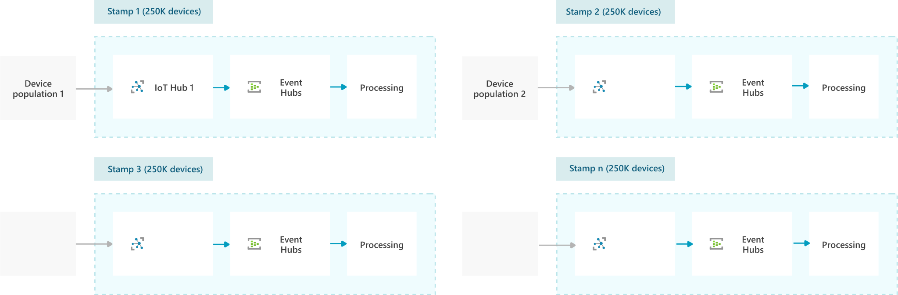

This article discusses a *deployment stamping* strategy for managing and adding connected devices in an internet of things (IoT) solution. The article also describes in detail how to move IoT devices and applications between deployment stamps.

The deployment stamping strategy for IoT solutions is based on the [Deployment Stamp](../../patterns/deployment-stamp.md) design pattern. Deployment stamps are units composed of heterogenous components that support a defined device population. Deployment stamping scales up numbers of connected IoT devices by replicating stamps, rather than independently scaling up different parts of a solution.

Deployment stamping lets you:

- Place and distribute devices by criteria like geo-dependency, lifecycle, or release status.
- Contain outage or service degradation impacts to specific stamps.
- Deploy new features, capabilities, and architectural changes to specific stamps that can support them.
- Support multi-generational device management by aligning capabilities and services to specified device populations.
- Provide a scaling and cost model based on stamps to predictably accommodate future growth.
- Track costs per device.

## IoT deployment stamping architecture

The preceding diagram illustrates a deployment stamping strategy for Azure IoT. This solution builds atomic stamps that each consist of:

- An [Azure IoT Hub](/azure/iot-hub/about-iot-hub)
- Routing endpoints like [Azure Event Hubs](/azure/event-hubs/event-hubs-about)
- Processing components

Stamps should always be designed to support explicit capacities. To determine the correct number of devices to support, consider how much communication traffic to expect from the devices. In this solution, each stamp optimally supports a defined device population from 1,000 to 1,000,000 devices. As the device population grows, added stamp instances accommodate the growth.

## Move devices and applications between stamps

Deployment stamps are intended for atomic deployment, but sometimes you need to move device populations between stamps. For example, you might need to:

- Move device populations from test stamps to production stamps as part of a release cycle.
- Move devices and users to another stamp as part of outage remediation in a high-availability scenario.
- Load balance to distribute device populations more evenly across stamps.

### Move devices between hubs

If the stamp components encompass only device-to-cloud behavior, moving devices between hubs is enough to migrate the devices from one stamp to another. [Azure IoT Device Provisioning Service (DPS)](/azure/iot-dps/) provides a way to move devices between IoT Hub instances. To use DPS in stamping strategy, be sure to understand [IoT Hub Device Provisioning Service (DPS) terminology](/azure/iot-dps/concepts-device) and concepts.

> [!NOTE]
> DPS uses *registration IDs*, while IoT Hub uses *device IDs*. These IDs are often the same value, but can be different. When you query or manage devices with the DPS APIs, be sure to use the registration IDs.

### Move devices and applications between self-contained stamps

If deployment stamps include web front ends or API applications that communicate through IoT Hub, those components also need to migrate to new hubs to continue communicating with the devices that moved. You can move entire applications and devices between stamps. 

When each stamp encompasses an end-to-end application, [Azure Traffic Manager](/azure/traffic-manager/traffic-manager-how-it-works) can move traffic from one stamp to another. This strategy involves creating multiple stamps, each containing the entire application with its own URL. Entire populations of devices and application users move from one stamp to another.

This fully self-contained strategy is:
- Simple to implement.
- Appropriate as part of a high-availability strategy.
- Useful for migrating devices and users from test to production environments.

The preceding diagram above shows the process of moving a set of devices from Stamp 1 to Stamp 2:

1. Devices acquire the IoT Hub endpoint through DPS if it's either unknown or no longer valid.
1. When devices are moved to Stamp 2, Traffic Manager points the application URL to the Application 2 instance.
1. DPS moves a whole set of devices from one stamp to another.
1. Each application stamp contains the application front end and refers to the IoT Hub corresponding to that stamp.

### Move devices between stamps behind a single app gateway

When a single application front-end supports multiple device stamps, the application front-end must dynamically update its device-to-hub mapping to maintain cloud-to-device communication. To manage devices moving to different stamps and IoT Hubs, gateways can use a caching mechanism for device-to-hub mapping. Service clients can use a shared lookup routine to dynamically detect and migrate device calls to new IoT Hubs.

In this model, the gateway uses a cache to map devices to IoT Hubs, and defaults to the cached endpoint. If the gateway receives a [device not found error](/azure/iot-hub/iot-hub-troubleshoot-error-404001-devicenotfound), it uses the [DPS Service SDK](/azure/iot-hub/iot-hub-devguide-sdks#azure-iot-service-sdks) to query individual device enrollment and determine which IoT Hub the device now uses. The gateway then updates the cache with the new mapping.

Here are some considerations for this strategy:

- While caching in a shared lookup avoids renegotiating endpoints on every call, it's possible for the cache endpoint to fail. A secondary cache or fallback plan of renegotiating with DPS can improve solution reliability.

- If device enrollment is in progress, the device isn't reachable. Use a DPS API like [Get Device Registration State](/rest/api/iot-dps/service/device-registration-state/get) to get the device's assigned IoT Hub and its current enrollment status.

- In the device-only case, devices are disconnected from the IoT Hub when they move from one stamp to another. In the application-to-device case, the error occurs when the app tries to reach the device through the IoT Hub.

## Next steps

- [IoT devices, platform, and applications](devices-platform-application.yml)
- [IoT application-to-device commands](cloud-to-device.yml)
- [Deployment Stamps design pattern](../../patterns/deployment-stamp.md)
