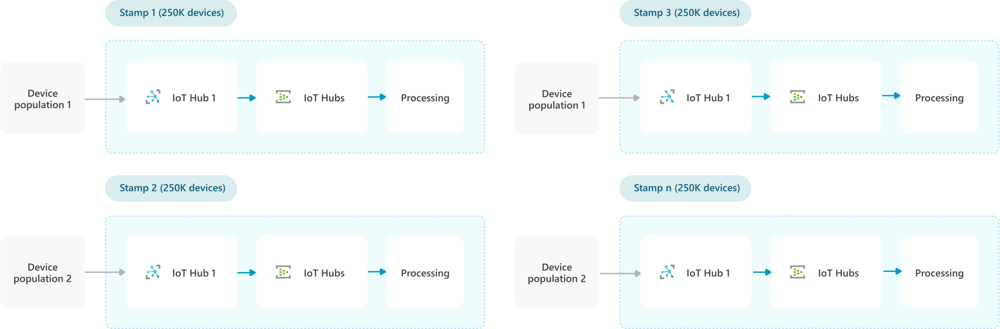
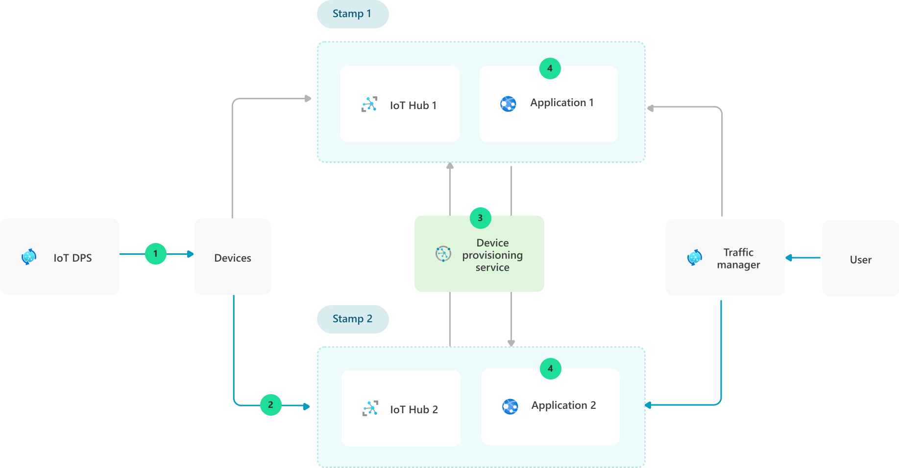
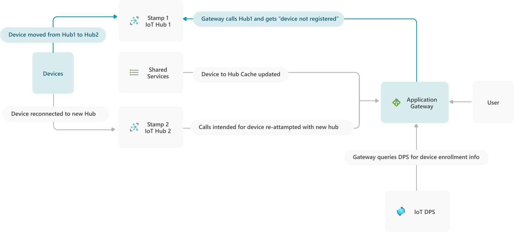

The *deployment stamping* strategy in an Internet-of-Things (IoT) solution supports scaling up the numbers of connected IoT devices by replicating *stamps*. Stamps are discrete units of core solution components that optimally support a defined number of devices.  This pattern is a variation of the [Deployment Stamps](../../patterns/deployment-stamp.md) design pattern specifically for IoT solutions.

This article describes deployment stamping benefits and considerations, and how to move devices and applications between stamps.

The deployment stamping strategy is to build atomic stamps that consist of an [Azure IoT Hub](/azure/iot-hub/about-iot-hub), routing endpoints like [Azure Event Hubs](/azure/event-hubs/event-hubs-about), and processing components. The stamps optimally support a defined device population, from 1 thousand to 1 million devices. As the incoming device population grows, stamp instances are added to accommodate the growth, rather than independently scaling up different parts of the solution.

Stamps should always be designed to support explicit capacities. To determine the right-sized population, consider how much communication traffic to expect from targeted device populations.

## Deployment stamping benefits

Deployment stamping provides several key benefits:

Flexibility:
- Place and distribute devices by geo-dependency, lifecycle, test to production migration, or other criteria.
- Target deployment of new features and capabilities to specific stamps.
- Scope generational changes to align capabilities and services to specified device populations.
- Facilitate a multi-generational device management strategy.

Predictability:
- Contain the blast radius of outages or service degradations to specific stamp device populations rather than a large-scale impact.
- Provide a predictable scaling model for expansion.

Cost management:
- Predictably scale costs by stamp to accommodate future growth.
- Support observability of cost-per-device in the solution.
- Target architectural changes to specific device populations ready to support the changes.

## Move devices between stamps

While deployment stamps are intended for atomic deployment, sometimes it's desirable to move device populations between stamps. Some examples include:
- Moving populations of devices from test stamps to production stamps as part of a release cycle.
- In a high-availability strategy, moving devices and consumers to another stamp as part of outage remediation.
- Load balancing to distribute device population more evenly across stamps.

[Azure IoT Device Provisioning Service (DPS)](/azure/iot-dps/) provides a way to move devices between hub instances gracefully. If the stamps only encompass device-to-cloud behavior, moving devices between hubs is adequate to migrate the devices from one stamp to another. To use DPS in stamping strategy, be sure to understand the [IoT Hub Device Provisioning Service device concepts](/azure/iot-dps/concepts-device).

> [!NOTE]
> DPS uses *registration IDs*, while IoT Hub uses *device IDs*. These IDs are often the same value, but can be different. When querying device status with DPS APIs, be sure to use the device's registration ID.

## Move applications between stamps

If the deployment stamps include web front ends or API applications that communicate with IoT Hub, those components will also need to migrate to new IoT Hubs to continue communicating with the devices that moved.

There are a couple of strategies for moving devices and application end-users from one application stamp to another. These strategies may not cover all cases, but elements of them cover most cases.

### Move between fully self-contained deployment stamps

Where stamps encompass an end-to-end application, [Azure Traffic Manager](/azure/traffic-manager/traffic-manager-how-it-works) can move traffic from one stamp to another. This strategy involves creating multiple stamps, each containing the entire application with its own URL, and moving entire populations of devices and application users from one stamp to another.

The diagram above shows the process of moving a set of devices from Stamp 1 to Stamp 2:
1. Devices acquire IoT Hub endpoint through DPS if it is either unknown or no longer valid.
2. When devices are moved to Stamp 2, Traffic Manager is set to point the application URL to the Application 2 instance.
3. Device Provisioning Service is used to move a whole set of devices from one stamp to another.
4. Each application stamp contains the application front end and refers to the corresponding Hub for that stamp.

This fully self-contained strategy is:
- Simple to implement
- Appropriate when using stamps as part of a high-availability strategy
- Useful for migrating devices and users through test and production environments

### Move between deployment stamps behind a single gateway

Where solutions consist of a single application front-end and multiple stamps, the application front-end will need to be aware of multiple IoT Hubs, and be able to dynamically update its device-to-hub mapping to maintain cloud-to-device communication.

To gracefully manage devices moving to different stamps and IoT Hubs, gateways can use a caching mechanism of device-to-hub mapping. If a lookup routine exists as part of a set of shared components, service clients can dynamically detect and migrate device calls to new IoT Hubs.

In this model, the gateway uses a cache to map devices to IoT Hubs, defaulting to the cached endpoint unless it receives an [error](/azure/iot-hub/iot-hub-troubleshoot-error-404001-devicenotfound) indicating the device is not registered to the known IoT Hub. When this error occurs, the gateway uses the [DPS Service SDK](/azure/iot-hub/iot-hub-devguide-sdks#azure-iot-service-sdks) to query individual device enrollment and determine which IoT Hub the device is now registered to. The gateway then updates the cache with the new mapping to avoid re-negotiating the device-to-hub mapping on future calls.

## Additional considerations

- If device enrollment is in progress, the device won't be reachable. Use DPS APIs like [Get Device Registration State](/rest/api/iot-dps/service/device-registration-state/get) to get the device's assigned IoT Hub and its current enrollment status.
- While caching in a shared lookup avoids re-negotiating endpoints on every call, it's possible for the cache endpoint to fail. A secondary cache or fallback plan of renegotiating with DPS can improve solution reliability.
- In the device-only case, devices are disconnected when moved from one IoT Hub to another, either through a disconnect or an error on the next attempted call. In the application-to-device case, the error occurs as the result of attempting to reach the device through the IoT Hub.

## Next steps

- [IoT devices, platform, and applications](devices-platform-application.yml)
- [IoT application-to-device commands](cloud-to-device.yml)
- [Deployment Stamps design pattern](../../patterns/deployment-stamp.md)
