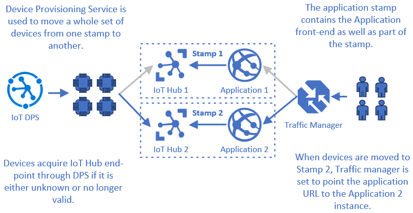
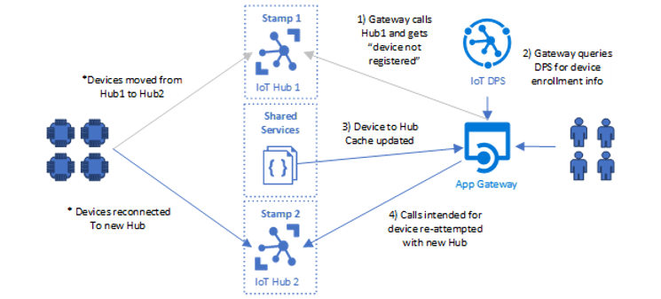

# Application Stamping

Application Stamping is a strategy of implementing a discrete unit
of scale approach towards supporting a steadily increasing population of
connected devices through replica implementations of core IoT solution
components. 

 

The basic idea behind this strategy is that an IoT Hub, routing
end-points (e.g. Event Hub) and processing components are built to
optimally support a certain population of devices. As solutions grow in
scale and incoming device population grows, new atomic stamps are added
to the solution to accommodate the growth vs. independently scaling up
different parts of the solution. 
 

> **Note:** Stamps can be built to accommodate device populations of 1
thousand to 1 million devices. The right-sized population is best
informed by considering how much communication traffic is expected from
targeted populations of device. It's advisable to design stamps to
support explicit capacity. 

## Benefits of Application Stamping

Application Stamps can provide several key benefits toward flexibility,
predictability, and cost management for a solution: 

| Key Benefits | Description |
--- | ---
Flexibility | Placement and distribution of devices by geo-dependency, lifecycle, test to production migration, or other criteria.Deployment of new features and capabilities can be targeted to specific stamps.
  | Scoping of generational changes to align capabilities and services to specified device population.                       |
  | Facilitates strategy for management of multi-generational devices.
Predictability | Blast radius of outages or service degradations are contained to device population of a specific stamp vs. large scale impact
  | Provides predictable scaling model for expansion.
Cost Management | Predictable scale cost by stamp as new atomic scale units can be added to accommodate future growth as solution scales up.
  | Supports observability of cost-per-device in solution.
  | Architectural changes that reduce components and associated costs can be targeted to specific device populations ready to support changes. 

## Moving Devices Between Stamps

While application stamps are intended to represent atomic units of
deployment, there are cases where it is desirable to move populations of
devices between stamps. Some examples include: 

 

-   Populations of devices are moved from test stamps to production
    stamps as part of release cycle. 

-   Stamps are employed as part of a high availability strategy. In
    these cases, devices and consumers are moved to another stamp as
    part of outage remediation. 

-   Load balancing of device population is done as a way to distribute
    population more evenly across stamps. 
 

In the cases of devices, [Azure IoT Device Provisioning
Service](https://docs.microsoft.com/azure/iot-dps/) provides a way
for devices to be moved between hub instances gracefully. Should
the application stamps only encompass Device-to-Cloud behavior,
this ~~may ~~provide[s]{.underline} adequate end-to-end migration of
devices from one stamp to another. 

> **Note:** DPS uses **registration IDs** while IoT Hub uses **Device
IDs**. While are often the same value, they can be different. It's
important when dealing with DPS APIs to remember to use
the **registration ID** for the device you are querying status on. If
using DPS in stamping strategy, it is important to understand the [IoT
Hub Device Provisioning Service device
concepts](https://docs.microsoft.com/azure/iot-dps/concepts-device) outlined
in the DPS documentation. 

## Moving Applications Between Stamps

Components such as web front-ends or API applications that speak to IoT
Hub, will also need to have a strategy for migrating to new IoT Hubs.
This ensures communication with the devices that have moved.  

Here, we'll explore a couple of strategies for moving
devices, and application end-users, from one application stamp to
another. While these may not cover all cases, elements of them can
be readily employed to cover additional cases. 

## Moving Device and User Populations Between Full Application Stamps

Where stamps encompass an end-to-end application, [Azure Traffic
Manager](https://docs.microsoft.com/azure/traffic-manager/traffic-manager-how-it-works) can
be used to move traffic from one stamp to another. This strategy
involves creating multiple stamps of an entire application, each with
its own URL, and moving entire populations of devices
and application users from one stamp to another. 

 

This strategy is simple to implement and useful in cases where stamps
are used as part of a high-availability strategy or for migrating
devices and users from one stamp to another for moving them through
different test and production environments. 

## Moving Devices Between Stamps Behind a Single Application Gateway

Where solutions consist of a single application front-end and multiple
stamps the application front-ends will need to be aware of multiple IoT
Hubs, and able to dynamically update their
Device-to-Hub mapping to communication with devices via Cloud-to-Device
functionality. 

To gracefully manage devices moving to different stamps, and by
extension different IoT Hubs, a caching mechanism of "device to hub"
mapping can be used in gateways. Assuming lookup exists as part of a set
of shared components, service clients can dynamically detect and migrate
calls to devices to new IoT Hubs. 

In this model, the gateway uses a cache to map devices to IoT Hubs,
defaulting to that endpoint unless it receives an [error indicating the
device is
not registered](https://docs.microsoft.com/azure/iot-hub/iot-hub-troubleshoot-error-404001-devicenotfound) to
the known Hub. When this happens the individual device enrollment in DPS
can be queried ([using the DPS Service
SDK](https://docs.microsoft.com/azure/iot-hub/iot-hub-devguide-sdks#azure-iot-service-sdks)) to
determine the Hub the device is now registered to. Should the Hub
successfully be found for the device, the cache can be updated to avoid
re-negotiating the device-to-hub mapping on future calls.  

 
## Additional considerations:

-   It's possible for a device enrollment to be
    in-progress, meaning it will not be reachable. The device's assigned
    IoT Hub and its current enrollment status can be obtained using DPS
    APIs such [Get Device Registration
    State](https://docs.microsoft.com/rest/api/iot-dps/getdeviceregistrationstate/getdeviceregistrationstate). 

-   While caching in a shared lookup saves re-negotiating endpoints on
    every call, there is always the possibility of the caching endpoint
    failing. Having a fallback plan of re-negotiating with DPS, or a
    secondary cache, can further improve solution resiliency. 

-   In the device case, devices will be disconnected when moved from one
    Hub to another, either through a disconnect or via an error
    occurring the next time a call is attempted. In the Cloud-to-Device
    case, an error will occur as the result of attempting to reach the
    device through the Hub. 
