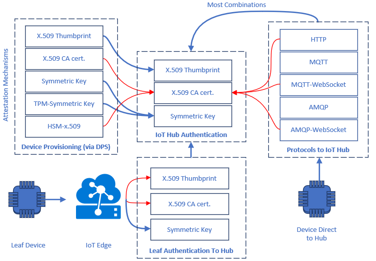

Connecting IoT devices to the IoT platform involves the three processes of *attestation*, *authentication*, and *provisioning*.

- The [attestation mechanism](/azure/iot-dps/concepts-security#attestation-mechanism) represents the method chosen for a device to confirm its identity when it connects to an IoT platform service like Azure IoT Hub. IoT Hub supports [symmetric key, X.509 thumbprint, and X.509 CA](https://azure.microsoft.com/blog/iot-device-authentication-options/) attestation methods.

- [Authentication](/azure/iot-hub/iot-hub-devguide-security#authentication) is how the device identifies itself. IoT Hub grants access to a device based on the device's ability to prove itself using its unique device identity in combination with its attestation mechanism.

- [Provisioning](/azure/iot-dps/about-iot-dps#provisioning-process) is the act of enrolling a device into Azure IoT Hub. Provisioning makes IoT Hub aware of the device and the attestation mechanism the device uses.

### Azure IoT Hub Device Provisioning Service (DPS)

Device provisioning can happen through the [Azure IoT Hub Device Provisioning Service (DPS)](/azure/iot-dps/) or directly via [IoT Hub Registry Manager APIs](/dotnet/api/microsoft.azure.devices.registrymanager). Using DPS confers the benefit of *late binding*, which allows removing and reprovisioning field devices to IoT Hub without changing the device software.

The following example shows how to implement a test-to-production environment transition workflow by using DPS.

1. The solution developer links the Test and Production IoT clouds to the provisioning service.
2. The device implements the DPS protocol to find the IoT Hub if it's no longer provisioned. The device is initially provisioned to the Test environment.
3. Since the device is registered with the Test environment, it connects there and testing occurs.
4. The developer re-provisions the device to the Production environment and removes it from the Test hub. The Test hub rejects the device the next time it reconnects.
5. The device connects and re-negotiates the provisioning flow. DPS now directs the device to the Production environment, and the device connects and authenticates there.

### IoT Hub supported protocols

Consider the combinations of [Azure IoT Hub supported authentication protocols](/azure/iot-hub/iot-hub-devguide-protocols) when working through end-to-end IoT solutions. Combinations shown with red lines in the following diagram may be incompatible or have added considerations.

- SAS tokens are always registered as symmetric keys with IoT Hub.
- Revoking certificates through DPS doesn't prevent currently provisioned devices from continuing to authenticate with IoT Hub. After revoking a certificate in DPS, also remove the device from the IoT Hub, either manually through the portal dashboard or programmatically using [Registry Manager APIs](/dotnet/api/microsoft.azure.devices.registrymanager?view=azure-dotnet).
- Although IoT Hub supports X.509 CA authentication, provisioning devices with X.509 CA through DPS provisions them to the IoT Hub as X.509 thumbprint.
- Web socket variants of AMQP and MQTT aren't supported with X.509 CA certificates in IoT Hub.

### Next steps

- [Set up the IoT Hub Device Provisioning Service with the Azure portal](/azure/iot-dps/quick-setup-auto-provision)
- [Provision a symmetric key device using C#](/azure/iot-dps/quick-create-device-symmetric-key-csharp)
- [Create and provision an X.509 device using C# device SDK for IoT Hub Device Provisioning Service](/azure/iot-dps/quick-create-simulated-device-x509-csharp)

### See also

- [Device Authentication using X.509 CA Certificates](/azure/iot-hub/iot-hub-x509ca-overview)
