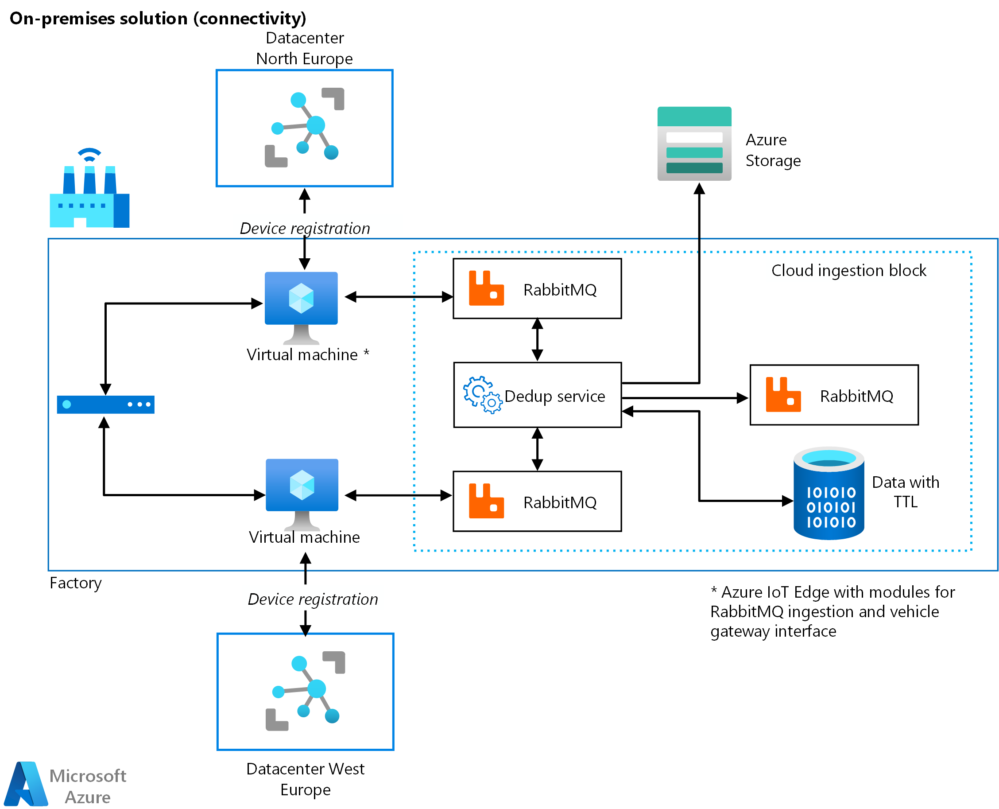
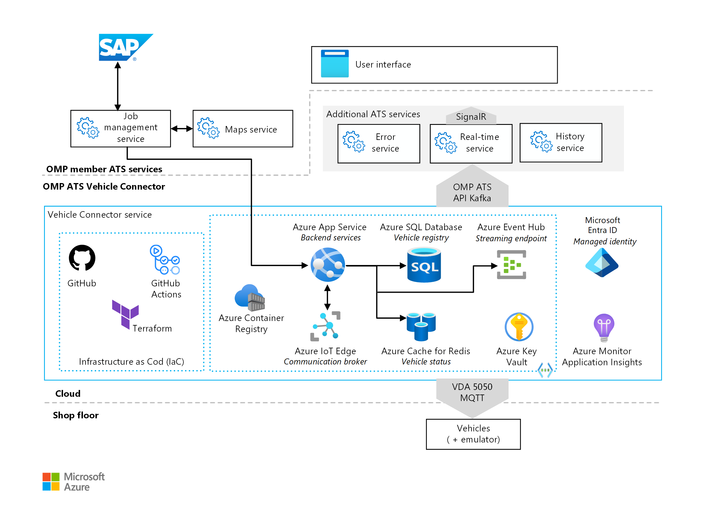

This example architecture shows an end-to-end approach for an automotive
original equipment manufacturer (OEM) and includes a reference architecture and several published supporting open-source libraries that can be reused. Microsoft rearchitected the fleet control software to be highly available, geo-redundant, and vendor-neutral, and to run in a hybrid cloud context.

## Architecture

### Geo-redundancy with zero-downtime failover for 99.9% availability and disaster recovery

:::image type="content" source="./media/automated-guided-vehicles-fleet-control-01.png" alt-text="Screenshot of an instance of the back end, consisting of the following components, is deployed to two Azure regions: Azure IoT Hub, Ingestion, RabbitMQ, Mission State, Vehicle State, Job Manager, and Geo DB." border="false":::

*Download a [Visio file](https://arch-center.azureedge.net/automated-guided-vehicles-fleet-control-01-georedundancy.vsdx) of this architecture.*

#### Workflow

- An instance of the back end, consisting of the following components, is deployed to two Azure regions: [Azure IoT Hub](https://azure.microsoft.com/services/iot-hub/#overview), Ingestion, [RabbitMQ](https://www.rabbitmq.com/), Mission State, Vehicle State, Job Manager, and Geo DB. IoT Hub connects to the set of applications built using a microservice architecture that can be deployed on [Azure App Service](https://azure.microsoft.com/en-in/services/app-service/#overview)
    using the [Web Apps feature of Azure App Service](https://azure.microsoft.com/services/app-service/web/), [Web App for Containers](https://azure.microsoft.com/services/app-service/containers/#overview), or [Kubernetes](https://kubernetes.io/).
- A leader election system determines which back end controls AGVs on the shop floor at any given point in time. If the back end in charge fails, the leader election immediately transfers the control to the back end in the other region.
- Thanks to this geo-redundant and zero-downtime failover architecture, the AGV control software that runs in Azure achieves 99.9% availability, provided that the internet connection and external subsystems, such as SAP, are not limiting factors.

### Kubernetes and RabbitMQ for datacenter-agnostic deployments

*Download a [Visio file](https://arch-center.azureedge.net/automated-guided-vehicles-fleet-control-02-onpremises.vsdx) of this architecture.*

In scenarios where the internet connection between a production plant and Azure is a limiting factor, our AGV control software can also be deployed to on-premises compute nodes. By using Kubernetes and RabbitMQ as platform-agnostic technologies, the application layer described in the previous section is deployed on an Azure IoT Edge device.

### Implementation of the VDA 5050 specification for AGV-vendor-agnostic communication

*Download a [Visio file](https://arch-center.azureedge.net/automated-guided-vehicles-fleet-control-03-vda5050spec.vsdx) of this architecture.*

Thanks to compliance with the [VDA 5050 vehicle connector specification](https://en.vda.de/en/services/Publications/vda-5050-v-1.1.-agv-communication-interface.html), our AGV control software can communicate with all types of AGVs from different vendors that also comply with VDA 5050.

#### Workflow

In this architecture, you can see an overview of the different services and components used to run the back-end AGV fleet control solution in Azure:

- When developers commit new code, [GitHub Actions](https://github.com/features/actions) automatically scans the code to quickly find vulnerabilities and coding errors. It can also be used to deploy applications and infrastructure components automatically.
- A [container registry](/azure/container-registry/container-registry-intro)
    stores the container images used for the different services of the AGV fleet control back end.
- Back-end services are deployed to [Web App for Containers](/azure/app-service/quickstart-custom-container?tabs=dotnet&pivots=container-linux).
- These back-end services can connect to external systems using the VDA 5050
    protocol. They can also connect to a managed streaming platform, such as [Kafka](https://kafka.apache.org/), and can store vehicle information in an [Azure SQL database](/azure/azure-sql/database/sql-database-paas-overview).
- Azure Key Vault stores passwords, keys, and certificates.
- Application Insights implements logging and monitoring for the applications that run as back-end services.
- [Managed identities](/azure/active-directory/managed-identities-azure-resources/overview)
    connect to the different services and resources in Azure, eliminating the need for developers to manage credentials. They provide an identity for applications to use when connecting to resources that support Azure Active Directory (Azure AD) authentication.

### Components

[Azure App Service](https://azure.microsoft.com/services/app-service/#overview) is a platform as a service (PaaS) for building and hosting apps in managed virtual machines (VMs). It manages the underlying compute infrastructure on which your apps run. App Service provides monitoring of resource usage quotas and app metrics, logging of diagnostic information, and alerts based on metrics.

[Azure Virtual Network](https://azure.microsoft.com/services/virtual-network/#overview)
is the fundamental building block for your private network in Azure. This service enables many types of Azure resources, such as Azure Virtual Machines, to securely communicate with each other, the internet, and on-premises networks.

[IoT Hub](https://azure.microsoft.com/services/iot-hub/#overview) is a PaaS managed service, hosted in the cloud, that acts as a central message hub for bidirectional communication between an IoT application and the devices it manages.

[Azure Container Apps](https://azure.microsoft.com/en-gb/products/container-apps/#overview)
build and deploy modern apps and microservices using serverless containers.

[Azure Container Registry](https://azure.microsoft.com/services/container-registry/#overview)
is a managed, private Docker registry service based on the open-source Docker Registry 2.0. You can use Azure container registries with your existing container development and deployment pipelines, or you can use Azure Container Registry Tasks to build container images in Azure. Build on demand, or fully automate builds with triggers, such as source code commits and base image updates.

[Azure Active Directory](https://azure.microsoft.com/services/active-directory/#overview)
is the cloud-based identity and access management service that authenticates users, services, and applications.

[Azure Storage](https://azure.microsoft.com/services/storage/) offers a durable, highly available, and massively scalable cloud storage solution. It includes object, file, disk, queue, and table storage capabilities.

[RabbitMQ](https://www.rabbitmq.com/) is an open-source message-broker software that originally implemented the Advanced Message Queuing Protocol and has since been extended with a plug-in architecture to support Streaming Text Oriented Messaging Protocol, MQ Telemetry Transport, and other protocols.

[Azure Virtual Machines](https://azure.microsoft.com/services/virtual-machines/)
provides on-demand, scalable computing resources that give you the flexibility of virtualization, without having to purchase and maintain the physical hardware.

[Azure SQL Database](https://azure.microsoft.com/products/azure-sql/database/#overview)
is a fully managed PaaS database engine that handles most of the database management functions, such as upgrading, patching, backups, and monitoring, without user involvement.

[Azure Key Vault](https://azure.microsoft.com/services/key-vault/#product-overview)
is a cloud service for securely storing and accessing secrets. A *secret* is anything that you want to tightly control access to, such as API keys, passwords, certificates, or cryptographic keys.

[Application Insights](https://azure.microsoft.com/services/monitor/?&ef_id=CjwKCAjwzaSLBhBJEiwAJSRokueDwZ0Yc0TNkHDx3-6XBEi0_WniC6PdjfnIEA91Owdvcswgw6K5PBoCvlAQAvD_BwE:G:s&OCID=AID2200221_SEM_CjwKCAjwzaSLBhBJEiwAJSRokueDwZ0Yc0TNkHDx3-6XBEi0_WniC6PdjfnIEA91Owdvcswgw6K5PBoCvlAQAvD_BwE:G:s&gclid=CjwKCAjwzaSLBhBJEiwAJSRokueDwZ0Yc0TNkHDx3-6XBEi0_WniC6PdjfnIEA91Owdvcswgw6K5PBoCvlAQAvD_BwE#overview), a feature of Azure Monitor, is an extensible application performance management (APM) service for developers and DevOps professionals. You can use it to monitor live applications. It automatically detects performance anomalies, and it includes powerful analytics tools to help you diagnose issues and to understand what users actually do with your app.

### Alternatives

This architecture uses Kubernetes and the Web Apps feature of Azure App Service for running the applications for this solution. As an alternative, you can run these microservices in Azure Container Instances, which offers the fastest and simplest way to run a container in Azure, without having to adopt a higher-level service, such as Azure Kubernetes Service (AKS).

The on-premises example uses Azure virtual machines, which can also be replaced by container technologies.

Another option to run these services is in [Azure Kubernetes Service (AKS)](/azure/aks/intro-kubernetes). This offers serverless Kubernetes for running microservices, an integrated continuous integration and continuous deployment (CI/CD) experience, and enterprise-grade security and governance.

Also consider using [Azure Monitor](https://azure.microsoft.com/services/monitor/) in combination with Application Insights to analyze and optimize the performance of your applications, containers, databases, and other resources and to monitor and diagnose networking issues.

This architecture uses RabbitMQ as the message broker. Microsoft Azure also has native support for messaging solutions, such as [Azure Queue Storage](/azure/storage/queues/storage-dotnet-how-to-use-queues?tabs=dotnet)
or [Azure Service Bus](/azure/service-bus-messaging/service-bus-messaging-overview).
For a comparison, see [Azure Storage queues and Service Bus queues - compared and contrasted](/azure/service-bus-messaging/service-bus-azure-and-service-bus-queues-compared-contrasted).

The applications and services in Azure are deployed using
[Terraform](https://www.terraform.io/) scripts. Consider using Azure-native
[Azure Resource Manager templates (ARM templates)](/azure/azure-resource-manager/templates/overview) or [Bicep](/azure/azure-resource-manager/bicep/overview)
for creating scripts.

## Scenario details

Automotive manufacturing relies on automated guided vehicles (AGVs) to deliver parts to assembly lines. AGVs are a mission-critical part of just-in-time manufacturing and automated shop-floor logistics. Shop floors using AGVs commonly face three challenges:

- Availability. Any service interruption disrupts production.
- Connectivity. Shop floors frequently lack a reliable connection to the public cloud.
- Vendor lock-in. Traditional AGV solutions rely on proprietary communication protocols.

This example architecture is divided into three operational areas:

- An Azure-based fleet control reference architecture with geo-redundancy, zero-downtime failover, 99.9% availability, and efficient disaster recovery.
- A datacenter-agnostic and on-premises deployment built on Kubernetes and RabbitMQ.
- Vendor-neutral AGV communication built on top of the common VDA 5050
    specification.

### Potential use cases

This solution is ideal for the manufacturing, automotive, and transportation industries. It applies to the following scenarios:

- The customer is currently using AGVs in its manufacturing process.
- The customer experiences low availability with the AGVs, which impacts their return on investment (ROI).
- The shop floor has an inconsistent connection with the public cloud.
- The customer is a member of the Open Manufacturing Platform (OMP).
- The customer is a member of the OMP Autonomous Transport System (OMP ATS)
    working group.

### Key problems

Low-cost production of goods relies on automation of the manufacturing process and just-in-time delivery of parts to assembly lines. By automatically transporting parts to assembly lines, automated guided vehicles contribute both to just-in-time manufacturing and to the automation of shop-floor logistics. In a typical mass production plant of passenger cars, for example, one passenger car is rolled out every minute. Therefore, every minute of interruption of an assembly line in a production plant causes a financial loss—in the order of tens of thousands of US dollars. Automotive OEMs require a high level of reliability and availability for their automated systems, and they face a number of challenges:

- Availability problem. Existing AGV fleet control software does not fulfill the 99.9% availability requirement.
- Connectivity problem. Some production plants do not have a sufficiently stable internet connection with the required bandwidth to enable the communication between the AGV fleet control software hosted in Azure public cloud and the AGVs on the shop floor. Therefore, hosting the AGV fleet control software in a datacenter that is outside the intranet of such a production plant was not an option.
- AGV vendor lock-in problem. It was not possible to swap the existing AGVs with new ones from a different vendor, because the AGV fleet control software depended on the proprietary communication protocol of the existing AGVs.

An architecture supporting geo-redundancy with zero-downtime failover for 99.9%
availability and disaster recovery can solve these issues.

## Considerations

These considerations implement the pillars of the Azure Well-Architected Framework, which is a set of guiding tenets that can be used to improve the quality of a workload. For more information, see [Microsoft Azure Well-Architected Framework](/azure/architecture/framework).

### Availability and scalability

The applications and services that make up the AGV fleet control solution are deployed to two Azure regions using [availability zones](/azure/availability-zones/az-overview), which are unique physical locations within Azure regions that help protect VMs, applications, and data from datacenter failures. Azure App Service and
[AKS](/azure/aks/availability-zones) can be deployed in availability zones, as well. IoT Hub provides intraregion high availability by implementing redundancies in almost all layers of the service.

### Security

Security provides assurances against deliberate attacks and the abuse of your valuable data and systems. For more information, see [Overview of the security pillar](/azure/architecture/framework/security/overview).

Use Azure Active Directory for identity and access control and use Azure Key Vault to manage keys and secrets.

### DevOps

For deploying the microservices to Kubernetes or Azure App Service automatically, it's best to use [CI/CD processes](/azure/architecture/example-scenario/apps/devops-with-aks).
Consider using a solution such as Azure DevOps or GitHub Actions.

### Cost optimization

Cost optimization is about looking at ways to reduce unnecessary expenses and improve operational efficiencies. For more information, see [Overview of the cost optimization pillar](/azure/architecture/framework/cost/overview).

In general, use the [Azure pricing calculator](https://azure.microsoft.com/pricing/calculator) to estimate costs, and use the [AKS calculator](https://azure.microsoft.com/pricing/calculator/?service=kubernetes-service)
to estimate the costs for running AKS in Azure. To learn about other considerations, see the "Cost optimization" section in [Microsoft Azure Well-Architected Framework](/azure/architecture/framework/).

## Contributors

*This article is maintained by Microsoft. It was originally written by the following contributors.*

Principal author:

- [Gürcan Güleşir](https://de.linkedin.com/in/g%C3%BCrcan-g%C3%BCle%C5%9Fir-08792a7) | Senior Program Manager

## Next steps

Product documentation:

- [Application Insights](/azure/azure-monitor/app/app-insights-overview)
- [Azure Active Directory](/azure/active-directory/fundamentals/active-directory-whatis)
- [Azure App Service](/azure/app-service/overview)
- [Azure Container Instances](/azure/container-instances/container-instances-overview)
- [Azure Container Registry](/azure/container-registry/container-registry-intro)
- [Azure IoT Hub](/azure/iot-hub/iot-concepts-and-iot-hub)
- [Azure Kubernetes Service](/azure/aks/intro-kubernetes)
- [Azure Key Vault](/azure/key-vault/general/basic-concepts)
- [Azure Monitor](/azure/azure-monitor/overview)
- [Azure SQL Database](/azure/azure-sql/database/sql-database-paas-overview)
- [Azure Virtual Machines](/azure/virtual-machines/linux/overview)
- [Azure Virtual Network](/azure/virtual-network/virtual-networks-overview)
- [GitHub](https://docs.github.com/en/get-started)

Microsoft learning paths:

- [Introduction to Azure IoT](/training/paths/introduction-to-azure-iot/)
- [Introduction to Kubernetes on Azure](/training/paths/intro-to-kubernetes-on-azure/)
- [Administer containers in Azure](/training/paths/administer-containers-in-azure/)
- [Create microservices with .NET and ASP.NET Core](/training/paths/create-microservices-with-dotnet/)
- [Manage identities and governance for Azure administrators](/training/paths/azure-administrator-manage-identities-governance/)

## Related resources

Azure Architecture Center overview articles:

- [Microservices architecture style](/azure/architecture/guide/architecture-styles/microservices)
- [Choosing an Azure compute option for microservices](/azure/architecture/microservices/design/compute-options)
- [Highly available multi-region web application](/azure/architecture/reference-architectures/app-service-web-app/multi-region)
- [Advanced Azure Kubernetes Service (AKS) microservices architecture](/azure/architecture/reference-architectures/containers/aks-microservices/aks-microservices-advanced)
- [Microservices with Azure Kubernetes Service (AKS)](/azure/architecture/solution-ideas/articles/microservices-with-aks)

Related architectures:

- [Building blocks for autonomous-driving simulation environments](/azure/architecture/industries/automotive/building-blocks-autonomous-driving-simulation-environments)
- [Running CFD simulations](/azure/architecture/example-scenario/infrastructure/hpc-cfd)
- [Industrial services on Azure Kubernetes](https://github.com/Azure/Industrial-IoT/tree/master/docs/services)
