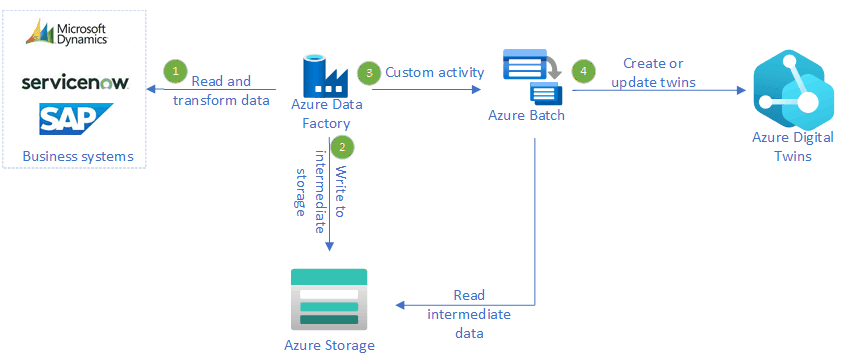

This scenario is relevant to organizations that need to integrate data from systems that require traditional ETL techniques with Azure Digital Twins. It allows you to integrate Azure Digital Twins into line of business systems by synchronizing or updating your Azure Digital Twins graph with data so that you can have a 360 view of your entire environment/system. Synchronization frequency should be determined per source system basis depending on solution requirements.

## Relevant use cases

These other uses cases have similar design patterns:

- You have an ADT graph of moving assets in a warehouse (forklifts etc.), you may want to receive "current processing order" data for each asset by integrating with the WMS or Sales LOB application every 10 minutes. The same ADT graph can be synced with asset management solution every day to receive inventory of assets available that day for use in the warehouse.
- You have a fleet of vehicles that belong to a hierarchy that contains data that doesn't change often.  You could use this solution to keep that data updated as needed.

## Architecture

_Download a [Visio file](https://arch-center.azureedge.net/azure-digital-twins-batch-update-diagram.vsdx) of this architecture._

### Dataflow

1. Azure Data Factory uses either a Copy Data Activity or a Mapping Data Flow source to connect to the business system and copy the data to a temporary location.
2. A Mapping Dataflow handles any transformations and outputs a file for each twin that needs to be processed.
3. A Metadata Activity retrieves the list of files, loops through them, and calls a Custom Activity.
4. Azure Batch creates a task for each file that executes the custom code to interface with Azure Digital Twins.

### Components

- [Azure Digital Twins](https://azure.microsoft.com/services/digital-twins) is the foundation for the metaverse that represents the digital representation of the physical assets.
- [Azure Data Factory](https://azure.microsoft.com/services/data-factory) handles the connectivity and orchestration between the source system and Azure Digital Twins.
- [Azure Storage](https://azure.microsoft.com/services/storage) stores the code for the custom activity and the data files that we generate that need to be processed.
- [Azure Batch](https://azure.microsoft.com/services/batch) executes the custom activity code.
- [Azure Managed Identity](https://azure.microsoft.com/services/active-directory) securely connect from the custom activity to Azure digital twins.

### Alternatives

An alternative to this approach could be to swap Azure Functions for Azure Batch.  We chose not to use Functions for this architecture since there's a timeout window for execution.  If the update to Digital Twins requires complex logic, or if the API gets throttled, the Function could time out before completing.  Azure Batch doesn't have this restriction, and we can also configure the number of virtual machines that are active to process the files to find a balance of scale and speed of updates.

## Considerations

- Custom Activities are essentially console applications.  We took some of the best practices outlined in this [blog](https://mrpaulandrew.com/2018/11/12/creating-an-azure-data-factory-v2-custom-activity/) to use as a foundation to be able to run and debug locally.
- Consider archiving the files after they've been processed for historical purposes.
- Consider implementing a change-data-capture pattern so that you only update the twins that are necessary.

### Availability

- Monitor Azure Data Factory pipelines
  - [Using Azure Monitor](https://docs.microsoft.com/en-us/azure/data-factory/monitor-using-azure-monitor)
  - [Azure Monitor Alerts](https://docs.microsoft.com/en-us/azure/data-factory/monitor-metrics-alerts)
  - [Data Flow Monitoring](https://docs.microsoft.com/en-us/azure/data-factory/concepts-data-flow-monitoring)
  - [Using Azure Monitor Effectively](https://azurelib.com/how-to-monitor-azure-data-factory-effectively)

- Monitor Azure Batch
  - [Azure Batch Monitoring](https://docs.microsoft.com/en-us/azure/batch/monitoring-overview)
  - [Azure Batch Application Insights](https://docs.microsoft.com/en-us/azure/batch/monitor-application-insights)

### Operations

- Operational considerations 
  - [Providing SLA](https://docs.microsoft.com/en-us/azure/data-factory/tutorial-operationalize-pipelines)
  - [Failure Handling](https://docs.microsoft.com/en-us/azure/data-factory/tutorial-pipeline-failure-error-handling)
  - [Monitoring pipelines using email alerts](https://docs.microsoft.com/en-us/azure/data-factory/how-to-send-email)
  - [Monitoring pipelines using teams alerts](https://docs.microsoft.com/en-us/azure/data-factory/how-to-send-notifications-to-teams?tabs=data-factory)

### Performance

- Performance could be a problem if you need to integrate ADT with large datasets  Consider how to scale Azure Batch appropriately to find the balance you need.
  - [Azure Batch Autoscaling](https://docs.microsoft.com/en-us/azure/data-factory/transform-data-using-custom-activity#auto-scaling-of-azure-batch)
  - [Azure Batch Performance](https://docs.microsoft.com/en-us/azure/architecture/framework/services/compute/azure-batch/performance-efficiency)

- Depending on the complexity and size of data in the source system, consider the scale of your Mapping Data Flow.
  - [Data Flow Performance](https://docs.microsoft.com/en-us/azure/data-factory/concepts-data-flow-performance)

### Scalability

- Need to scale for large datasets
  - [Implement SCD pattern(s)](https://techcommunity.microsoft.com/t5/azure-data-factory-blog/create-generic-scd-pattern-in-adf-mapping-data-flows/ba-p/918519)
  - [Optimize Pipeline](https://docs.microsoft.com/en-us/learn/paths/data-integration-scale-azure-data-factory)

### Security

This pattern relies on Managed Identities for security, so it's safe.  Azure Data Factory requires the storage account key to generate SAS keys.  To protect that key, we store it in Azure Key Vault and grant the ADF managed identity access to it.

### Resiliency

Resiliency is considered as part of availability, monitoring and operations sections above. 

### DevOps

- The custom activity code is a zip file that gets placed in Azure Storage.  A devops pipeline can manage the deployment of that.
- Azure Data Factory supports devops, giving you an end to end devops lifecycle.

## Deploy this scenario

A reference implementation can be found in [GitHub](https://github.com/Azure-Samples/azuredigitaltwins-batchupdate).

## Pricing

Leverage the [Azure Pricing Calculator](https://azure.microsoft.com/pricing/calculator/) to get accurate pricing on Azure Digital Twins, Azure Data Factory, and Azure Batch.
 
## Related resources

- [Pipeline Orchestration](https://docs.microsoft.com/en-us/azure/architecture/data-guide/technology-choices/pipeline-orchestration-data-movement)
- [ETL](https://docs.microsoft.com/en-us/azure/architecture/data-guide/relational-data/etl)
- [Azure Digital Twins Builder](https://docs.microsoft.com/en-us/azure/architecture/solution-ideas/articles/azure-digital-twins-builder)
