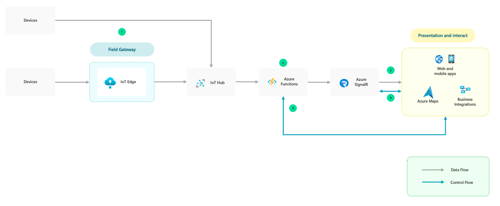

# Cloud Application Signaling Pattern for IoT

Some Internet of Things (IoT) applications work with real-time data from IoT devices. For instance, these apps often display device telemetry or alerts. With traditional polling methods, these client apps ask the devices for state changes.

This guide outlines a way for clients like web pages or mobile apps to receive updates from devices in real time. Clients no longer submit HTTP requests for up-to-date information. Instead, the solution uses SignalR to push content to connected clients as soon as it's available.

As an example, a retailer might display the total number of customers in a store on a digital sign in real time. With this solution, the sign doesn't have to request the latest customer count from data storage. Instead, the system feeds that information to the sign as soon as the total changes.

## Architecture

1. Clients like web pages and mobile apps get a SignalR endpoint and token from Azure Functions. This serverless compute platform integrates data from various sources. But it also manages SignalR endpoints and information on client groups.

1. Clients use the endpoint and token to connect to Azure SignalR Service. This managed service simplifies the process of adding real-time communication to web apps.
1. IoT devices send telemetry to IoT Hub.
1. The telemetry triggers a function in Azure Functions. The function:

   - Runs any calculations on the telemetry that you program.
   - Transforms the data any way that you program.
   - Uses the managed service SignalR to broadcast the data.

1. SignalR provides an abstraction over several techniques used for building real-time applications. WebSocket is the optimal transport. But SignalR uses techniques like Server-Sent Events (SSE) and Long Polling when other options aren't available. SignalR automatically detects and initializes the appropriate transport based on the features that the server and client support.

1. The SignalR message goes out to a specific client or group of clients. The clients use the data to update apps.

## Characteristics

Here are some considerations when using this pattern.
-   Low latency requirements: Understand the maximum latency requirement from the data ingestion to the application. The cloud application signal pattern may apply to near real-time scenarios of up to 10 seconds. Any extra data transformation and/or layers may impact latency.
-   Performance: Understand the inbound and outbound messages in the scenario and select the right tiers to scale the solution based on requirements. For more information, see [Performance considerations](/azure/azure-signalr/signalr-concept-performance). 

When to use this pattern:
-   Any scenario that requires pushing data from server to client in real-time. Sending data for real-time functionality like visualization and/or applications. 
-   Rich and highly-interactive client applications. As compared to only visualization using Power BI Streaming Datasets, this pattern enables a multitude of clients and enables other scenarios like updating maps and customized UI. 

When not to use this pattern:
-   When required to visualize on Power BI, the [streaming data](/power-bi/connect-data/service-real-time-streaming) could be an option.
-   Any use case that requires guaranteed message delivery. 

## Use cases
-   Fleet monitoring: Real-time location tracking of vehicles on maps.
-   Real-time remote monitoring of process: Monitoring telemetry data like operational status, temperature, and pressure in process manufacturing. 
-   Real-time monitoring of drilling conditions: Viewing telemetry data like revolutions, power, and angle to optimize process. 
-   Real-time notifications: Pushing real-time alerts based on the events received. 

## See also

-   [Azure SignalR](https://azure.microsoft.com/services/signalr-service/)
-   [Real time IoT data with SignalR](https://anthonychu.ca/post/end-to-end-realtime-python-iot-azure-functions-signalr-iothub/)
-   [Broadcast Real-time Updates from Cosmos DB with SignalR Service and Azure Functions](https://anthonychu.ca/post/cosmosdb-real-time-azure-functions-signalr-service/)
-   [Visualizing real time IoT data using Power BI](/azure/iot-hub/iot-hub-live-data-visualization-in-power-bi)
-   [Azure Stream Analytics patterns](/azure/stream-analytics/stream-analytics-solution-patterns)
