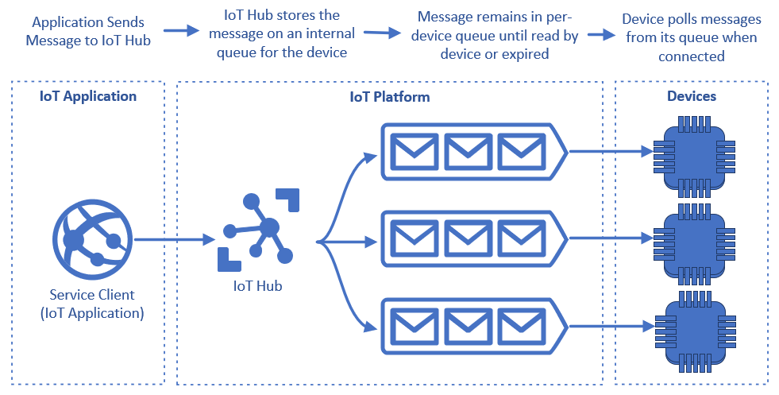
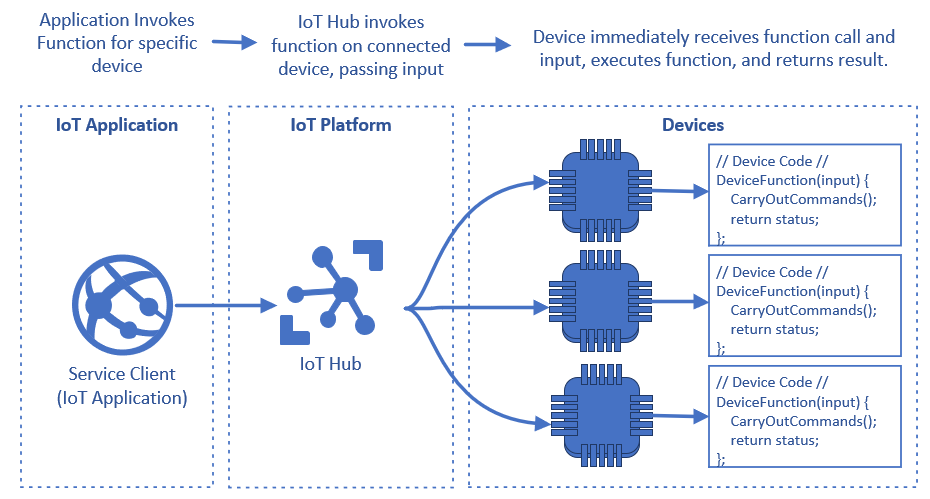
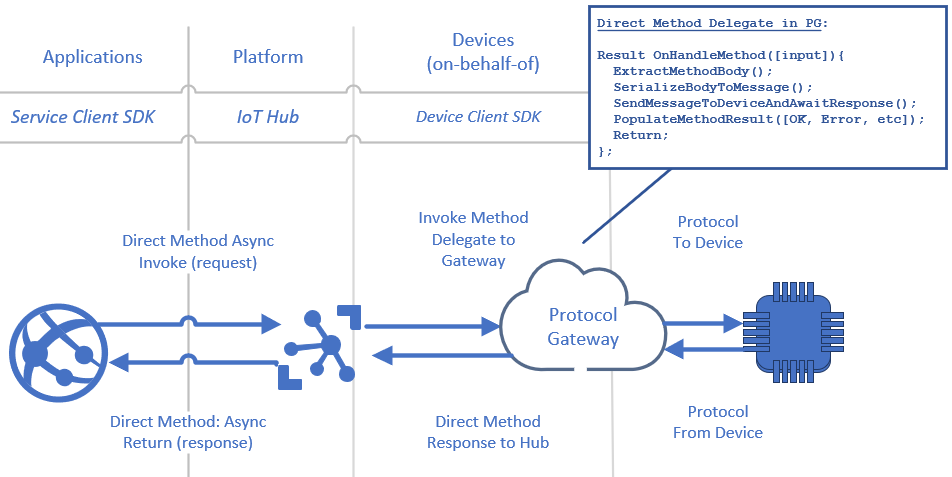
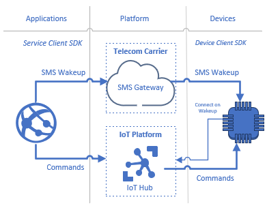

Applications use two primary mechanisms to send commands to IoT devices, *cloud-to-device messaging* and *direct methods*.

- Applications send [cloud-to-device messages](/azure/iot-hub/iot-hub-csharp-csharp-c2d) to device-specific message queues on the IoT platform for devices to read when they're connected. The devices decide when to read the messages.

- Applications invoke [direct methods](/azure/iot-hub/iot-hub-devguide-direct-methods) directly on connected devices, using a request-response pattern over dedicated IoT device endpoints.

This article discusses characteristics of cloud-to-device messaging and direct methods. The article also describes how to use direct methods with protocol gateways and connected standby devices.

## Cloud-to-device messaging

Applications send cloud-to-device command messages for specific devices to [Azure IoT Hub](/azure/iot-hub), which stores the messages in device-specific queues. IoT Hub delivers the messages to the device-specific queues regardless of whether the devices are connected.



The following considerations apply when using cloud-to-device messaging:

- Message queues effectively act as mailboxes for devices, and devices are responsible for polling their message queues for new messages when they're connected.
- Devices receive messages in a first-in, first-out fashion, making cloud-to-device messaging ideal for sequentially reading and acting on messages.
- Messages have a configurable expiration, so unread messages can eventually be removed from the device's message queue.
- For stateful communication, applications can use a [feedback receiver](/azure/iot-hub/iot-hub-csharp-csharp-c2d#receive-delivery-feedback) to monitor message delivery and acknowledgment. The application can use a single feedback receiver to monitor all message queues for all devices.

## Direct methods

Applications invoke direct methods directly on connected IoT devices, and expect the devices to execute the methods and register them with the IoT Hub. IoT Hub calls the direct methods on connected devices over direct channels, and devices are responsible for executing functions and returning immediate results.



The following considerations apply when using direct methods:

- Direct methods fail if the connection is broken between the IoT Hub and the device before the method completes. Applications can catch and handle failures to re-attempt commands.
- Since there's no queue, applications that require sequencing of direct methods need to manage the sequencing of method calls, such that completing the previous method calls the next method.
- Invoking direct methods allows an application to set two timeouts. One timeout specifies how long the IoT Hub should wait for a device to connect before giving up, and the other timeout specifies how long the caller should wait for the method to complete and respond before giving up.

### Direct methods with protocol gateways

IoT applications that use [protocol gateways](/azure/iot-hub/iot-hub-protocol-gateway) can benefit from the connectivity enforcement and request-response model of direct methods. Cloud or protocol gateways allow connecting pre-existing and diverse devices to IoT Hub by acting on behalf of devices to broker custom protocol communications. Protocol gateways can likewise abstract the direct methods model by serializing methods into device-compatible protocol messages.



1. The application invokes the direct method on behalf of the device in the protocol gateway.
2. For the method implementation, the gateway translates the method into a device-specific protocol and sends the message to the device. The device is unaware of any changes to cloud implementation.
3. When the device completes the message and responds, the gateway translates the device-specific status to the method response.
4. The IoT Hub completes the direct method by populating a method result for the caller.

The [Azure Protocol Gateway](/azure/iot-hub/iot-hub-protocol-gateway) open-source project translates direct methods to MQTT protocol messages natively, is easily extensible, and demonstrates this programming model for other protocol adapters.

### Connected standby devices

IoT command scenarios may involve *connected standby devices* that are in a low-power, idle condition when not active. Mechanisms like mobile Short Message Service (SMS) can send wakeup signals to transition these devices to a fully operational state.



1. The application sends commands to devices using the [ServiceClient API](/dotnet/api/microsoft.azure.devices.serviceclient). One instance of **ServiceClient** can send messages and invoke methods for multiple devices.
1. The application also sends SMS wakeup calls to standby devices via the mobile provider's SMS gateway.
1. On wakeup, standby devices use the [DeviceClient API](/dotnet/api/microsoft.azure.devices.client.deviceclient) to connect to IoT Hub and receive commands. One instance of **DeviceClient** represents a single device connected to IoT Hub.

#### Use direct methods to determine device connection status

Sending unnecessary wakeup messages through SMS gateways is costly. Before sending actual commands to a device, use the connection and method timeouts to determine whether the device is connected, and send a wakeup if necessary.

```csharp
    TimeSpan connTimeOut = FromSeconds(0); // Period to wait for device to connect.
    TimeSpan funcTimeOut = FromSeconds(30); // Period to wait for method to execute.

    while (true) {
        // Send the command via direct method. Initially use a timeout of zero
        // for the connection, which determines whether the device is connected to
        // IoT Hub or needs an SMS wakeup sent to it.

        var method = new CloudToDeviceMethod("RemoteCommand", funcTimeOut, connTimeOut);
        methodInvocation1.SetPayloadJson(CommandPayload);

        var response = await serviceClient.InvokeDeviceMethodAsync(deviceId, method);

        // [DeviceNotConnected] represents a return value from the CloudToDeviceMethod
        // method. That method is not implemented in this sample.
        if (response == [DeviceNotConnected] && connTimeOut == 0) {
            // The device is not currently connected and needs an SMS wakeup. This
            // device should wake up within a period of < 30 seconds. Send the wakeup
            // and retry the method request with a 30 second timeout on waiting for
            // the device to connect.

            connTimeOut = FromSeconds(30); // Set a 30 second connection timeout.
            SendAsyncSMSWakeUpToDevice(); // Send SMS wakeup through mobile gateway.
            continue; // Retry with new connection timeout.
        } else {
            // The method either succeeded or failed.
            ActOnMethodResult(var);
            break;
        }
    }
```

To simply check connectivity, use an empty method with a connection timeout of zero to implement a simple ping. For example:
```csharp
var method = new CloudToDeviceMethod("Ping", 0, 0);
```

## Contributors

*This article is maintained by Microsoft. It was originally written by the following contributors.*

Principal author:

- [Jason Wadsworth](https://www.linkedin.com/in/jason-wadsworth-23549b158) | Principal Software Engineer

## Next steps

- [Cloud-to-device communications guidance](/azure/iot-hub/iot-hub-devguide-c2d-guidance) provides scenario-based guidance about when to use cloud-to-device messages or direct methods.

## Related resources

- [IoT devices, platform, and applications](devices-platform-application.yml)
- [Scale IoT solutions with application stamps](application-stamps.yml)
