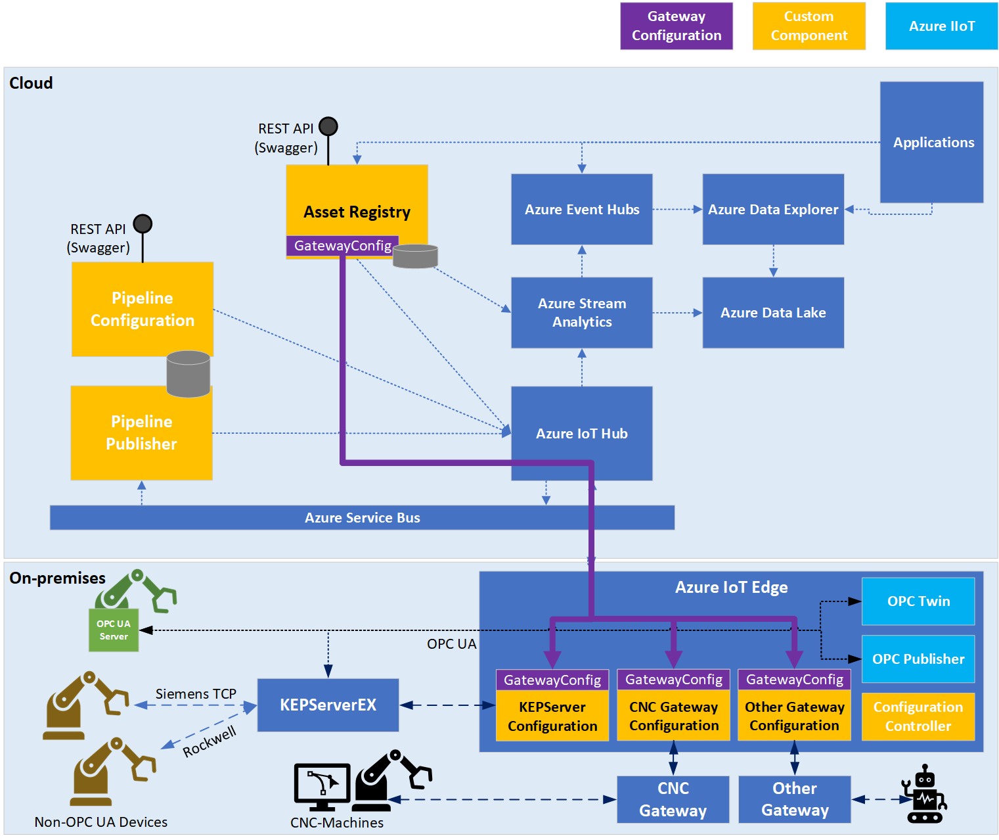

Manufacturing organizations across the world face the need to digitalize their
manufacturing facilities. Processes once managed—and data once gathered—manually
are now being migrated to on-premises and cloud solutions. This allows
organizations to streamline processes, to improve efficiency, and to quickly
identify issues on manufacturing floors and swiftly react to them.

A manufacturing floor may have hundreds to thousands of Internet of Things (IoT)
and Industrial Internet of Things (IIoT) devices that capture data at different
intervals, and both legacy (brownfield) and more modern (greenfield) devices
often coexist. It can be problematic to reliably interconnect this
sometimes-vast landscape of heterogeneous devices to capture and format data
consistently so that it can be analyzed and acted on.

The connected factory signal pipeline architecture solves this problem by
introducing a common configuration interface to connect brownfield devices
through an [OPC Unified Architecture (UA)](https://opcfoundation.org/about/opc-technologies/opc-ua/) gateway.
Greenfield devices that are OPC UA–capable can connect to the pipeline directly.
This approach simplifies the process of interconnecting devices, which reduces
organizational reliance on experts every time a change is needed.

The data captured from each of the devices follows a standard format and is
enriched with specific contextual information about the device or machine it
originates from. Finally, changes made to a signal pipeline configuration (that
is, which signals are captured from which devices) are traceable and can be
rolled back.

The connected factory signal pipeline example workload consists of a group of
custom components that use Azure technologies to enable the easy identification
and capture of signals (data points) from IIoT devices. Where IIoT devices
cannot communicate over OPC UA, the architecture defined here relies on the
[KEPServerEX](https://www.kepware.com/products/kepserverex/) IoT Gateway
and application programming interface (API). It uses two components of the Azure
Industrial IoT solution: the extensively field-tested [Microsoft OPC Publisher](/azure/industrial-iot/overview-what-is-opc-publisher)
and the [OPC Twin edge module](https://azure.github.io/Industrial-IoT/modules/twin.html).

## Potential use cases

Typical uses for this architecture workload:

-   Empowering workers by tracking the status of all connected machines and
    devices on the shop floor
-   Predictive maintenance
-   Enabling connectivity in a plant or factory
-   Managing the collection of device signals reliably and at scale
-   Increasing the pace of continuous improvement and digital transformation of
    factories
-   Sustaining productivity in a plant or factory

## Architecture

This architecture leverages a pipeline configuration that contains the details
of machines, leaf devices, and signals of interest:

-   The Pipeline Configuration API (an ASP.NET Core Web API on Azure Kubernetes
    Service) is responsible for the create, read, update, and delete (CRUD)
    operations in the pipeline’s configuration. It defines the devices and
    signals to be included in the pipeline and hence the data to be surfaced to
    applications. The signal configurations include attributes such as heartbeat
    interval, sampling interval, and publishing rate. The pipeline configuration
    has a state, which can be draft, final, activating, or active, and the
    pipeline has built-in traceability, versioning, and rollback functionality.
    Each deployment of a pipeline configuration is recorded for traceability.
    It’s easy to integrate streaming technologies to provide enriched machine
    data for consumption using services such as Azure Event Hubs, Azure Stream
    Analytics, Azure Event Hubs, Azure Data Lake, Azure Storage, and Azure Data
    Explorer.
-   The Asset Registry (an ASP.NET Core Web API on Azure Kubernetes Service) is
    responsible for CRUD operations on machine metadata, including the servers
    they are connected to and their available signals.
-   The Pipeline Publisher (an ASP.NET Core Web API on Azure Kubernetes Service)
    component is responsible for chunking the configuration file and sending it
    to the configuration controller module when a new pipeline version is
    requested to be applied.
-   The Configuration Controller (an Azure IoT Edge module) is then responsible
    for communicating with the OPC Publisher to apply the requested
    configuration version.

### How KEPServerEX works

When leveraging KEPServerEX as the (OPC-UA) gateway, which allows brownfield devices to connect
with the signal pipeline, supported device types can be automatically configured
to connect to the gateway. This removes the need to manage any configuration
directly in the gateway’s user interface and simplifies and standardizes the
device setup process.

The KEPServerEX automation is the first implementation of the generic gateway
configuration solution built into the Asset Registry (an ASP.NET Core Web API on
Azure Kubernetes Service). This extensible gateway configuration solution
consists of the following parts:

-   A polymorphic, gateway-agnostic model for gateways, devices, and signals
    managed by the Asset Registry service.
-   A client library used by the Asset Registry REST API to communicate with the
    gateway configuration IoT Edge modules.
-   A library for an Azure IoT Edge module exposing a common interface based on
    direct methods to configure devices and signals in a gateway.
-   The Azure IoT Edge module for a specific gateway configuration, which
    translates the generic requests from the direct methods to the proprietary
    gateway configuration interface and back. In the case of KEPServer
    Configuration, the Azure IoT Edge module connects to KEPServer’s REST–based
    Configuration API using a library generated from the built-in KEPServerEX
    API documentation.

## Components

[Azure Data Explorer](https://azure.microsoft.com/services/data-explorer/#overview) is
a fast, fully managed data analytics service for real-time analysis on large
volumes of data streaming from applications, websites, IoT devices, and more.

[Azure Data Lake](https://azure.microsoft.com/solutions/data-lake/)
includes all the capabilities required to make it easy for developers, data
scientists, and analysts to store data of any size, shape, and speed, and do all
types of processing and analytics across platforms and languages. It removes the
complexities of ingesting and storing all of your data while making it faster to
get up and running with batch, streaming, and interactive analytics.

[Azure Event Hubs](https://azure.microsoft.com/services/event-hubs/#overview) is a
fully managed, real-time data ingestion service that’s simple, trusted, and
scalable. Stream millions of events per second from any source to build dynamic
data pipelines and immediately respond to business challenges.

[Azure IoT Edge](https://azure.microsoft.com/services/iot-edge/#iotedge-overview)
intelligent devices recognize and respond to sensor input by using onboard
processing. These devices can respond rapidly, or even offline. Intelligent edge
devices limit costs by preprocessing and sending only necessary data to the
cloud.

[Azure IoT Hub](https://azure.microsoft.com/services/iot-hub/#overview)
provides a cloud-hosted solution back end to connect virtually any device.
Extend your solution from the cloud to the edge with per-device authentication,
built-in device management, and scaled provisioning.

[Azure Kubernetes Service (AKS)](https://azure.microsoft.com/services/kubernetes-service/#overview)
is a managed, serverless Kubernetes platform for microservices apps. Kubernetes
is open-source orchestration software for deploying, managing, and scaling
containerized apps.

[Azure Service Bus](https://azure.microsoft.com/services/service-bus/#overview) is a
fully managed enterprise message broker with message queues and
publish-subscribe topics. Service Bus is used to decouple applications and
services from each other.

[Azure Storage](https://azure.microsoft.com/services/storage/) offers a durable,
highly available, and massively scalable cloud storage solution. It includes
object, file, disk, queue, and table storage capabilities.

[Azure Stream Analytics](https://azure.microsoft.com/services/stream-analytics/#features)
is a real-time analytics and complex event-processing engine that is designed to
analyze and process high volumes of fast-streaming data from multiple sources
simultaneously.

[PTC/Kepware's KEPServerEX](https://www.kepware.com/products/kepserverex/)
is an industry leader in industrial and manufacturing device connectivity. It
has connectivity libraries for a vast array of equipment and is a popular choice
for unlocking data from both new and legacy industrial devices. Kepware provides
an IoT Gateway module that can be used to connect to and send data to Azure IoT
Hub over the MQTT protocol.

[OPC Publisher](/azure/industrial-iot/overview-what-is-opc-publisher)
is an Azure IoT Edge module that connects to existing OPC UA servers and
publishes telemetry data from OPC UA servers.

[OPC Twin edge module](https://azure.github.io/Industrial-IoT/modules/twin.html)
remotely browses nodes from known OPC UA servers.

## Alternatives

This architecture uses AKS for running the pipeline configuration API, the
Pipeline Publisher module, and the Asset Registry. As an alternative, you can
run these microservices in [Azure Container Instances](https://azure.microsoft.com/services/container-instances/#overview).
Container Instances offers the fastest and simplest way to run a container in
Azure, without having to adopt a higher-level service, such as AKS.

As an alternative to Azure Stream Analytics, you could use [HDInsight Storm](/azure/hdinsight/storm/apache-storm-overview)
or [HDInsight Spark](/azure/hdinsight/spark/apache-spark-overview)
to perform streaming analytics.

Also consider using [Azure Monitor](https://azure.microsoft.com/services/monitor/#overview) to
analyze and optimize the performance of your Azure Kubernetes Service cluster,
Azure Service Bus, Azure IoT Hub, Azure Data Lake, Azure Stream Analytics, and
other resources, and to monitor and diagnose networking issues.

## Considerations

### Availability

The APIs and Azure services that make up this architecture can be deployed in
multiple Azure regions using [availability zones](/azure/availability-zones/az-overview),
which are unique physical locations within Azure regions that help protect
virtual machines (VMs), applications, and data from datacenter failures. [Azure Kubernetes Services](/azure/aks/availability-zones)
can be deployed in availability zones as well. IoT Hub provides intraregion high
availability by implementing redundancies in almost all layers of the service.

### Scalability

Azure Event Hubs, Azure Service Bus, and Azure IoT Hub come with autoscaling
features. [Autoscale](https://azure.microsoft.com/features/autoscale/) is
a built-in feature of cloud services, mobile services, virtual machines, and
websites.

### Security

Consider using [Azure Active Directory (Azure AD)](/azure/active-directory/fundamentals/active-directory-whatis)
for identity and access control, and use [Azure Key Vault](/azure/key-vault/general/overview) to
manage keys and secrets.

Take advantage of [Azure Policy](/azure/governance/policy/overview),
which helps to enforce organizational standards and can assess compliance at
scale. Besides denying deployments and logging compliance issues, these policies
can also modify resources, making them compliant even if they aren't deployed
that way.

To improve the security of your Azure Kubernetes Service cluster, you can apply
and enforce built-in security policies using Azure Policy as well. After
installing the [Azure Policy Add-on for AKS](/azure/governance/policy/concepts/policy-for-kubernetes),
you can apply individual policy definitions or groups of policy definitions
called *initiatives* (sometimes called *policysets*) to your cluster.

### DevOps

For deploying the used services in this example workload automatically, it's
best to use [continuous integration/continuous deployment (CI/CD) processes](/azure/architecture/example-scenario/apps/devops-with-aks).
Consider using a solution such as Azure DevOps or GitHub Actions, as described
in the [Azure DevOps Starter](/azure/devops-project/overview)
documentation.

## Pricing

In general, use the [Azure pricing calculator](https://azure.microsoft.com/pricing/calculator) to estimate costs,
and use the [AKS calculator](https://azure.microsoft.com/pricing/calculator/?service=kubernetes-service)
to estimate the costs for running AKS in Azure. To learn about other considerations, see the “[Cost optimization](/azure/architecture/framework/cost/)”
section in [Microsoft Azure Well-Architected Framework](/azure/architecture/framework/).

## Next steps

Azure Architecture Center overview articles:

-   [Predictive maintenance](/azure/architecture/solution-ideas/articles/predictive-maintenance)
-   [Advanced Azure Kubernetes Service (AKS) microservices architecture](/azure/architecture/reference-architectures/containers/aks-microservices/aks-microservices-advanced)
-   [Microservices with AKS](/azure/architecture/solution-ideas/articles/microservices-with-aks)
-   [Stream processing with Azure Stream Analytics](/azure/architecture/reference-architectures/data/stream-processing-stream-analytics)

Product documentation:

-   [Azure Data Explorer](/azure/data-explorer/data-explorer-overview)
-   [Azure Data Lake](/azure/storage/blobs/data-lake-storage-introduction)
-   [Azure Digital Twins](/azure/digital-twins/overview)
-   [Azure Event Hubs](/azure/event-hubs/event-hubs-about)
-   [Azure IoT Edge](https://azure.microsoft.com/services/iot-edge/#iotedge-overview)
-   [Azure IoT Hub](/azure/iot-hub/iot-concepts-and-iot-hub)
-   [Azure Kubernetes Service (AKS)](/azure/aks/intro-kubernetes)
-   [Azure Service Bus](/azure/service-bus-messaging/service-bus-messaging-overview)
-   [Azure Storage](/azure/storage/)
-   [Azure Stream Analytics](/azure/stream-analytics/stream-analytics-introduction)

Microsoft Learn learning paths:

-   [Implement a Data Streaming Solution with Azure Streaming Analytics](/learn/paths/implement-data-streaming-with-asa/)
-   [Large-Scale Data Processing with Azure Data Lake Storage Gen2](/learn/paths/data-processing-with-azure-adls/)
-   [Introduction to Kubernetes on Azure](/learn/paths/intro-to-kubernetes-on-azure/)
-   [Architect message brokering and serverless applications in Azure](/learn/paths/architect-messaging-serverless/)
-   [Connect your services together](/learn/paths/connect-your-services-together/)
-   [Build the intelligent edge with Azure IoT Edge](/learn/paths/build-intelligent-edge-with-azure-iot-edge/)

## Related resources

-   [Industrial Services on Azure Kubernetes](https://github.com/Azure/Industrial-IoT/tree/master/docs/services)
-   [Connected Factory – Hierarchy Service](/azure/architecture/solution-ideas/articles/connected-factory-hierarchy-service)
-   [Predictive maintenance for industrial IoT](/azure/architecture/solution-ideas/articles/iot-predictive-maintenance)
-   [Condition monitoring for Industrial IoT](/azure/architecture/solution-ideas/articles/condition-monitoring)
-   [IoT and data analytics](/azure/architecture/example-scenario/data/big-data-with-iot)
