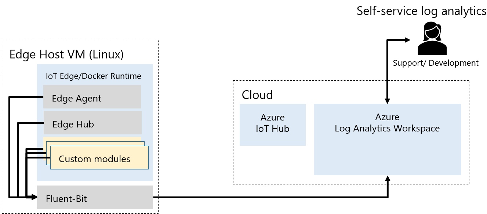

This connected factory signal processing pipeline simplifies device interconnection.

## Architecture

*Download a [Visio file](https://arch-center.azureedge.net/connected-factory-signal-pipeline.vsdx) of this architecture.*

### Workflow

This architecture uses a pipeline configuration that tracks the details of machines, leaf devices, and signals.

1. The Pipeline Configuration API, an ASP.NET Core web API on Azure Kubernetes Service (AKS), does the pipeline configuration create, read, update, and delete (CRUD) operations. The API defines the devices and signals to include in the pipeline, and the data they surface to applications.

   - The pipeline configuration state can be draft, final, activating, or active.
   - The signal configurations include attributes like heartbeat interval, sampling interval, and publishing rate.

1. Streaming, storage, and analytics technologies integrate into the pipeline to provide enriched machine data. The pipeline can use services like Azure Event Hubs, Azure Stream Analytics, Azure Data Lake, Azure Storage, and Azure Data Explorer.

1. The Asset Registry, an ASP.NET Core web API on AKS, does CRUD operations on machine metadata, including the servers that machines are connected to and their available signals.

1. The Pipeline Publisher, an ASP.NET Core web API on AKS, chunks the configuration file and sends it to the Configuration Controller module to apply a new pipeline version.

1. The Configuration Controller, an Azure IoT Edge module, communicates with OPC Publisher to apply the requested configuration version.

1. The solution uses two [Azure Industrial IoT](/azure/industrial-iot) components, OPC Publisher and the OPC Twin edge module.

1. For KEPServer configuration, the Azure IoT Edge module connects to KEPServer’s REST–based Configuration API, using a library generated from the built-in KEPServerEX API documentation.

### Components

- [Azure Kubernetes Service (AKS)](https://azure.microsoft.com/services/kubernetes-service) is a managed, serverless Kubernetes platform for microservices apps. Kubernetes is open-source orchestration software for deploying, managing, and scaling containerized apps.

- [Azure Service Bus](https://azure.microsoft.com/services/service-bus) is a fully managed enterprise message broker with message queues and publish-subscribe topics. Service Bus decouples applications and services from each other.

- [Azure Event Hubs](https://azure.microsoft.com/services/event-hubs) is a fully managed, scalable, real-time data ingestion service. Event Hubs can stream millions of events per second from any source to build dynamic data pipelines and immediately respond to business challenges.

- [Azure Stream Analytics](https://azure.microsoft.com/services/stream-analytics) is a real-time analytics and complex event-processing engine. Stream Analytics can analyze and process high volumes of fast-streaming data from multiple sources simultaneously.

- [Azure Data Lake](https://azure.microsoft.com/solutions/data-lake) stores data of any size, shape, and speed, and does all types of processing and analytics across platforms and languages. Azure Data Lake removes the complexities of ingesting and storing data, making it faster to get up and running with batch, streaming, and interactive analytics.

- [Azure Storage](https://azure.microsoft.com/services/storage) is a durable, highly available, and massively scalable cloud storage solution. Azure Storage includes object, file, disk, queue, and table storage capabilities.

- [Azure Data Explorer](https://azure.microsoft.com/services/data-explorer) is a fast, fully managed data analytics service for real-time analysis of large volumes of data streaming from applications, websites, and IoT devices.

- [Azure IoT Edge](https://azure.microsoft.com/services/iot-edge) devices recognize and respond to sensor input by using onboard processing. Preprocessing and sending only necessary data to the cloud controls costs. Intelligent edge devices can respond rapidly or even work offline.

- [Azure IoT Hub](https://azure.microsoft.com/services/iot-hub) provides a cloud-hosted solution back end to connect virtually any device. You can extend your solution from the cloud to the edge with per-device authentication, built-in device management, and scaled provisioning.

- [OPC Publisher](/azure/industrial-iot/overview-what-is-opc-publisher) is an Azure IoT Edge module that connects to existing OPC UA servers and publishes telemetry data from OPC UA servers.

- [OPC Twin](https://azure.github.io/Industrial-IoT/modules/twin.html) is an Azure IoT Edge module that remotely browses nodes from known OPC UA servers.

- [PTC/Kepware's KEPServerEX](https://www.kepware.com/products/kepserverex) provides an IoT Gateway module that connects to and sends data to IoT Hub over the MQTT protocol. Kepware has connectivity libraries for an array of equipment, and can unlock data from both new and legacy industrial devices.

#### KEPServerEX Gateway configuration

Using KEPServerEX as the OPC-UA gateway lets brownfield devices connect with the signal pipeline. Supported device types can be configured to automatically connect to the gateway. Removing the need to manage any configuration directly in the gateway's user interface simplifies and standardizes the device setup process.

*Download a [Visio file](https://arch-center.azureedge.net/connected-factory-signal-pipeline-server.vsdx) of this architecture.*

The KEPServerEX automation is the first implementation of the generic gateway configuration solution built into the solution's Asset Registry API. This extensible gateway configuration solution has the following parts:

- A polymorphic, gateway-agnostic model for gateways, devices, and signals managed by the Asset Registry service.
- A client library used by the Asset Registry REST API to communicate with the gateway configuration IoT Edge modules.
- A library for an Azure IoT Edge module that uses a common interface based on direct methods, to configure devices and signals in a gateway.
- The Azure IoT Edge module for a specific gateway configuration, which translates the generic direct methods requests to and from the proprietary gateway.

### Alternatives

This architecture uses AKS for running the Pipeline Configuration API, the Pipeline Publisher module, and the Asset Registry. As an alternative, you can run these microservices in [Azure Container Instances](https://azure.microsoft.com/services/container-instances). Container Instances offers the fastest and simplest way to run a container in Azure, without having to adopt a higher-level service like AKS.

As an alternative to Azure Stream Analytics, you could use [HDInsight Storm](/azure/hdinsight/storm/apache-storm-overview) or [HDInsight Spark](/azure/hdinsight/spark/apache-spark-overview) to do streaming analytics.

## Scenario details

A manufacturing floor might have hundreds or thousands of internet of things (IoT) and industrial IoT (IIoT) devices that capture data at different intervals. Legacy *brownfield* and modern *greenfield* devices often coexist. These devices must capture and format data consistently to analyze and act on. Reliably interconnecting this landscape of heterogeneous devices can be difficult.

 A common configuration interface connects brownfield devices through an [OPC Unified Architecture (OPC UA)](https://opcfoundation.org/about/opc-technologies/opc-ua) gateway. OPC UA-capable greenfield devices connect to the pipeline directly.

The signal processing pipeline components use Azure technologies to identify and capture *signals*, or data points, from IIoT devices. For IIoT devices that can't communicate over OPC UA, the architecture uses the [KEPServerEX](https://www.kepware.com/products/kepserverex) IoT gateway and application programming interface (API).

Data from all devices follows a standard format, and includes specific contextual information about the originating device or machine. The pipeline has built-in traceability, versioning, and rollback functionality.

The connected factory signal processing pipeline can help manufacturing organizations to:

- Digitize previously manual management processes and data gathering.
- Easily migrate to on-premises and cloud IoT solutions.
- Quickly identify and react to issues on factory floors.
- Streamline processes and improve efficiency.

### Potential use cases

- Track status of all connected machines and devices on the shop floor.
- Enable connectivity of on-premises assets to enhance productivity across a plant or factory.
- Predictive maintenance.

## Considerations

These considerations implement the pillars of the Azure Well-Architected Framework, a set of guiding tenets to improve the quality of a workload. For more information, see the [Microsoft Azure Well-Architected Framework](/azure/architecture/framework).

### Reliability

Reliability ensures your application can meet the commitments you make to your customers. For more information, see [Overview of the reliability pillar](/azure/architecture/framework/resiliency/overview).

- [Availability zones](/azure/availability-zones/az-overview) are unique physical locations within Azure regions that help protect virtual machines (VMs), applications, and data from datacenter failures. The APIs and Azure services that make up this architecture can be deployed in multiple Azure regions using availability zones. You can also [deploy AKS in availability zones](/azure/aks/availability-zones).

- IoT Hub provides intra-region high availability by implementing redundancies in almost all layers of the service.

### Security

Security provides assurances against deliberate attacks and the abuse of your valuable data and systems. For more information, see [Overview of the security pillar](/azure/architecture/framework/security/overview).

- Consider using [Azure Active Directory (Azure AD)](/azure/active-directory/fundamentals/active-directory-whatis) for identity and access control, and [Azure Key Vault](/azure/key-vault/general/overview) to manage keys and secrets.

- Take advantage of [Azure Policy](/azure/governance/policy/overview) to enforce organizational standards and assess compliance at scale. Policies can deny deployments, log compliance issues, and modify resources to make them compliant.

  Azure Policy can also enforce built-in security policies to improve your AKS cluster security. Install the [Azure Policy Add-on for AKS](/azure/governance/policy/concepts/policy-for-kubernetes) to apply individual policy definitions or groups of policy definitions, called *initiatives* or *policy sets*, to your cluster.

### Cost optimization

Cost optimization is about looking at ways to reduce unnecessary expenses and improve operational efficiencies. For more information, see [Overview of the cost optimization pillar](/azure/architecture/framework/cost/overview).

Use the [Azure pricing calculator](https://azure.microsoft.com/pricing/calculator) to estimate costs, and the [AKS calculator](https://azure.microsoft.com/pricing/calculator/?service=kubernetes-service) to estimate costs for running AKS in Azure. For more considerations, see [Cost optimization](/azure/architecture/framework/cost) in the [Microsoft Azure Well-Architected Framework](/azure/architecture/framework).

### Operational excellence

- Use [continuous integration/continuous deployment (CI/CD) processes](/azure/architecture/example-scenario/apps/devops-with-aks) to deploy the services in this example workload automatically. Use a solution like [Azure Pipelines](https://azure.microsoft.com/services/devops/pipelines) or [GitHub Actions](https://github.com/features/actions).

- Also consider using [Azure Monitor](https://azure.microsoft.com/services/monitor) to analyze and optimize the performance of your Azure services and to monitor and diagnose networking issues.

### Performance efficiency

[Autoscale](https://azure.microsoft.com/features/autoscale) is a built-in feature of many cloud services. For example, Azure Virtual Machines, Azure App Service, and Azure Event Hubs come with autoscaling features.

### Observability

For the metrics, use the Metrics Collector Module that belongs to the [Industrial Internet of Things Platform](https://github.com/Azure/Industrial-IoT). It leverages the [Prometheus data model](https://prometheus.io/docs/concepts/data_model/) endpoints exposed by the runtime modules EdgeAgent and EdgeHub. Logs are then pushed to an [Azure Log Analytics Workspace](/azure/azure-monitor/logs/log-analytics-workspace-overview). From there they are displayed in [Azure Workbooks](/azure/azure-monitor/visualize/workbooks-overview) in Azure IoT Hub, in a custom dashboard that monitors the entire solution. Custom alerts are then triggered if the Edge devices are deemed unhealthy based on available disk space or system memory, device-to-cloud message queue length, and the last time the Metrics Collector module has successfully transmitted metrics data.

For the logs, as all Edge modules run as Docker containers, use the [Fluentd log driver](https://docs.docker.com/config/containers/logging/fluentd/) to redirect these logs to a Fluentd server deployed at the Edge, namely [Fluent-Bit](https://docs.fluentbit.io/manual) which is an open-source log processor and forwarder that allows collecting logs from different sources, enriching them with filters, and sending them to multiple destinations. This Fluent-Bit server is then configured to push the logs to an [Azure Log Analytics Workspace](/azure/azure-monitor/logs/log-analytics-workspace-overview). The high level architecture of this approach is illustrated in the following diagram.

## Contributors

*This article is maintained by Microsoft. It was originally written by the following contributors.*

Principal authors:

- [Francisco Beltrao](https://ch.linkedin.com/in/francisco-beltrao-58521a) | Principal Software Engineer Lead
- [Jean-Baptiste Ranson](https://www.linkedin.com/in/jb-ranson) | Senior Software Engineer
- [Martin Weber](https://ch.linkedin.com/in/martin-weber-ch) | Senior Software Engineer

*To see non-public LinkedIn profiles, sign in to LinkedIn.*

## Next steps

- [Industrial Services on Azure Kubernetes](https://github.com/Azure/Industrial-IoT/tree/master/docs/services)
- [Azure IoT Hub](/azure/iot-hub/iot-concepts-and-iot-hub)
- [Azure Kubernetes Service (AKS)](/azure/aks/intro-kubernetes)
- [Industrial IoT (IIoT) architecture patterns with Azure IoT Central](/azure/iot-central/core/concepts-iiot-architecture)

Microsoft learning paths:

- [Implement a Data Streaming Solution with Azure Streaming Analytics](/training/paths/implement-data-streaming-with-asa)
- [Introduction to Kubernetes on Azure](/training/paths/intro-to-kubernetes-on-azure)
- [Connect your services together](/training/paths/connect-your-services-together)
- [Build the intelligent edge with Azure IoT Edge](/training/paths/build-intelligent-edge-with-azure-iot-edge)

## Related resources

- [Connected factory hierarchy service](/azure/architecture/solution-ideas/articles/connected-factory-hierarchy-service)
- [Predictive maintenance for industrial IoT](/azure/architecture/solution-ideas/articles/iot-predictive-maintenance)
- [Condition monitoring for industrial IoT](/azure/architecture/solution-ideas/articles/condition-monitoring)
- [IoT and data analytics](/azure/architecture/example-scenario/data/big-data-with-iot)
- [Predictive maintenance](/azure/architecture/solution-ideas/articles/predictive-maintenance)
- [Advanced Azure Kubernetes Service (AKS) microservices architecture](/azure/architecture/reference-architectures/containers/aks-microservices/aks-microservices-advanced)
- [Microservices with AKS](/azure/architecture/solution-ideas/articles/microservices-with-aks)
- [Stream processing with Azure Stream Analytics](/azure/architecture/reference-architectures/data/stream-processing-stream-analytics)
