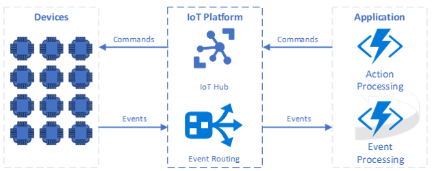

# IoT solution architecture

Topologically, Azure Internet-of-Things (IoT) solutions are a collection of assets and components divided across *IoT devices*, the *IoT platform*, and *IoT applications*. [Events, insights, and actions](introduction-to-solutions.md) are data flow and processing pipelines that occur across these structural parts.

This article describes IoT device, platform, and application characteristics. The article also discusses IoT Edge gateways, and IoT platform attestation, authentication, protocols, and provisioning.

## IoT devices, platform, and applications

*IoT devices* are the physical or virtual things that send events to and receive commands from IoT applications. The terms *thing* and *device* both mean a connected device in an IoT solution.

An IoT device has one or more of the following characteristics:
- Possesses a unique *identity* that distinguishes it within the solution.
- Has *properties*, or a *state*, that applications can access.
- Sends *events* to the IoT platform for applications to act on.
- Receives *commands* from applications to execute.

The *IoT platform* is the collection of services that allow devices and applications to connect and communicate with each other. The Azure IoT platform usually consists of [Azure IoT Hub](https://docs.microsoft.com/azure/iot-hub/about-iot-hub) and event routing services like [Azure Event Hub](https://docs.microsoft.com/azure/iot-hub/iot-hub-compare-event-hubs).

The IoT platform at least:
- Brokers secure *connectivity*, *authentication*, and *communication* between devices and trusted applications.
- Generates *contextual insights* on incoming events to determine the routing of events to endpoints.

*Applications* are the collection of scenario-specific services and components that are unique to an IoT solution. IoT applications typically have:
- A mix of Azure or other services for compute, storage, and event endpoints, combined with unique application business logic.
- *Event* workflows to receive and process incoming device events.
- *Action* workflows to send commands to devices or other processes.

## Field and cloud edge gateways

IoT devices can connect to the IoT platform directly, or through *IoT Edge gateways* that implement intelligent capabilities. Edge gateways enable functionality like:
- Aggregating or filtering device events before they're sent to the IoT platform
- Localized decision-making
- [Protocol and identity translation](https://docs.microsoft.com/azure/iot-edge/iot-edge-as-gateway) on behalf of devices

There are two types of edge gateways, *field* or [IoT Edge](https://docs.microsoft.com/azure/iot-edge/iot-edge-as-gateway), and *cloud* or [protocol](https://docs.microsoft.com/azure/iot-hub/iot-hub-protocol-gateway) gateways.

 

- IoT Edge *field gateways* are located close to devices on-premises, and connect to the IoT platform to extend cloud capabilities into devices. IoT Edge devices can act as communication enablers, local device control systems, and data processors for the IoT platform. IoT Edge devices can run cloud workflows on-premises by using [Edge modules](https://docs.microsoft.com/azure/iot-edge/iot-edge-modules), and can communicate with devices even in offline scenarios.

- *Protocol* or *cloud gateways* enable connecting existing and diverse device populations to IoT solutions by hosting device instances and enabling communication between devices and the IoT platform. Cloud gateways can do protocol and identity translation to and from the IoT platform, and can execute additional logic on behalf of devices.

## Attestation, authentication, and provisioning

Connecting IoT devices to the IoT platform involves the three processes of *attestation*, *authentication*, and *provisioning*.

- The [attestation mechanism](https://docs.microsoft.com/azure/iot-dps/concepts-security#attestation-mechanism) represents the method chosen for a device to confirm its identity when it connects to an IoT platform service like Azure IoT Hub. IoT Hub supports [symmetric key, X.509 thumbprint, and X.509 CA](https://azure.microsoft.com/blog/iot-device-authentication-options/) attestation methods.

- [Authentication](https://docs.microsoft.com/azure/iot-hub/iot-hub-devguide-security#authentication) is how the device identifies itself. IoT Hub grants access to a device based on the device's ability to prove itself using its unique device identity in combination with its attestation mechanism.

- [Provisioning](https://docs.microsoft.com/azure/iot-dps/about-iot-dps#provisioning-process) is the act of enrolling a device into Azure IoT Hub. Provisioning makes IoT Hub aware of the device and the attestation mechanism the device uses.

### Azure IoT Hub Device Provisioning Service (DPS)

Device provisioning can happen through the [Azure IoT Hub Device Provisioning Service (DPS)](https://docs.microsoft.com/azure/iot-dps/) or directly via [IoT Hub Registry Manager APIs](https://docs.microsoft.com/dotnet/api/microsoft.azure.devices.registrymanager). Using DPS confers the benefit of *late binding*, which allows removing and reprovisioning field devices to IoT Hub without changing the device software.

The following example shows how to implement a test-to-production environment transition workflow by using DPS.

 

1. The solution developer links the Test and Production IoT clouds to the provisioning service.
2. The device implements the DPS protocol to find the IoT Hub if it's no longer provisioned. The device is initially provisioned to the Test environment.
3. Since the device is registered with the Test environment, it connects there and testing occurs.
4. The developer re-provisions the device to the Production environment and removes it from the Test hub. The Test hub rejects the device the next time it reconnects.
5. The device connects and re-negotiates the provisioning flow. DPS now directs the device to the Production environment, and the device connects and authenticates there.

### IoT Hub supported protocols

Consider the combinations of [Azure IoT Hub supported authentication protocols](https://docs.microsoft.com/azure/iot-hub/iot-hub-devguide-protocols) when working through end-to-end IoT solutions. Combinations shown with red lines in the following diagram may be incompatible or have added considerations.

 

- SAS tokens are always registered as symmetric keys with IoT Hub.
- Revoking certificates through DPS doesn't prevent currently provisioned devices from continuing to authenticate with IoT Hub. After revoking a certificate in DPS, also remove the device from the IoT Hub, either manually through the portal dashboard or programmatically using [Registry Manager APIs](https://docs.microsoft.com/rest/api/iothub/service/registrymanager).
- Although IoT Hub supports X.509 CA authentication, provisioning devices with X.509 CA through DPS provisions them to the IoT Hub as X.509 thumbprint.
- Web socket variants of AMQP and MQTT aren't supported with X.509 CA certificates in IoT Hub.

## See also
- [IoT application-to-device commands](cloud-to-device.md)
- [Scale IoT solutions with application stamps](application-stamps.md)
