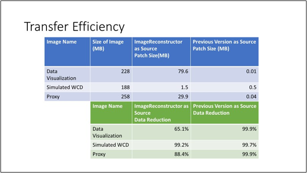

As the Internet of Things (IoT) becomes more ubiquitous, moving processing to
the edge serves as a key model to address needs such as low-latency connectivity and conservation of bandwidth. This is especially true in scenarios involving mobility, which are commonly characterized by intermittent and low-bandwidth connectivity. Since you'll typically provision edge devices by deploying software container images, interruptions to deployment processes can result in failures in mobile scenarios. As a result, you may need a reliable and resilient deployment capability for situations when you have limited, intermittent, or low bandwidth.

This solution enabled the deployment of Docker containers to heterogenous remote IoT devices across intermittent low-bandwidth internet connections, such as over satellite, from the customer's IoT edge platform. The CSE team accomplished this by minimizing the size of the deployment to each device and by enabling reliable monitoring of these deployments.

## Potential use cases

This solution is suitable for any scenario where software containers are used as part of the solution and connectivity is intermittent with low bandwidth. Examples include the following:

-   Mobile scenarios

-   Over-the-air automotive updates

-   Oil and gas and mining

-   Retail

-   Anywhere a strong connection is not guaranteed

## Architecture

In high-bandwidth scenarios, Azure IoT Edge pulls images directly from an internet-accessible Docker registry, either a Docker hub or a private one like the [Azure Container Registry (ACR)](https://azure.microsoft.com/services/container-registry/#overview). This is the same functionality as running the command "docker pull
\<image\_name\>" from a local machine.

However, when you are forced to work with potentially intermittent network access, such as a satellite internet connection, the Docker pull method becomes unreliable. Specifically, the progress will not be cached if the internet connection drops while Docker is pulling the image. So, when the internet connection resumes, Docker must start pulling the image from the beginning.

The following sections describe an alternative deployment mechanism that compensates for the limits imposed by intermittent connectivity.

The diagram below shows the high-level architecture of this solution.


### Design requirements

The customer needed a solution that would support intermittent low-bandwidth cloud connectivity, allowing deployed applications to continue to run locally and enabling local staff to use functionality without a cloud round-trip delay and while offline. When connected to the cloud, the solution needed to use the cloud connection efficiently to prioritize the sending of data according to business rules that are consistently defined across products.

The CSE team identified the following detailed requirements for binary patching of image files:

-   Image files must be transferred across a low bandwidth (1Mbit/s), intermittent-connectivity satellite connection.

-   The data being transferred should be minimized as much as possible.

-   The customer prefers to continue using a third-party application for transferring files to devices.

-   The workloads on a device will run in IoT Edge using Docker images.

-   Image size will range from tens of MB to several GB (Windows base images are \~5.5 GB).

-   IoT Edge modules will be written in .NET Core 2.2.

### Components

#### Azure

-   [Azure DevOps](https://azure.microsoft.com/services/devops/)

-   [Azure Functions](https://azure.microsoft.com/services/functions/)

-   [Azure Container Registry](https://azure.microsoft.com/services/container-registry/#overview)

-   [Azure Storage](https://azure.microsoft.com/services/storage/)

-   [Azure Key Vault](https://azure.microsoft.com/services/key-vault/)

-   [Azure SQL Database](https://azure.microsoft.com/services/sql-database/)

-   [Azure Monitor](https://azure.microsoft.com/services/monitor/#overview)

-   [Azure Application Insights](/azure/azure-monitor/app/app-insights-overview)

#### Third-party

-   [Docker](https://www.docker.com/)

#### Open source

-   [Ubuntu Linux](https://ubuntu.com/)

## Example use case

A major logistics company wanted to improve tracking of its worldwide product shipments, even through geographical areas with intermittent low-bandwidth cloud connectivity. Product shipments had a variety of IoT devices installed on them for insurance, safety, or tracking purposes, depending upon the type of goods being shipped. The capabilities of these devices, such as GPS trackers, temperature sensors, and tools to capture other pertinent data points, varied from one device to another; and the goods could be shipped using a variety of transportation methods (for example, ground, air, and sea) and to a wide variety of remote locales.

The solution has dramatically increased reliability and resiliency of the provisioning process in limited-connectivity environments. The discussion below describes the options evaluation process, the details of the solution the CSE team developed for this customer, and other scenarios in which this solution might be useful.

### Customer scenario

The customer was having problems updating their devices over their recently developed IoT edge platform. CSE teamed up with the customer to address the following major pain points:

-   High bandwidth consumption when deploying updated software to devices.

-   No standardized automated deployment across devices, and no way to know which devices had which updates.

-   Limited flexibility on technology selection.

### Solution evaluation

Of the four possible solutions CSE evaluated, more than one was viable and available. CSE determined a full Docker image data transfer to be the ideal solution.

#### Evaluation criteria

CSE considered the following:

-   Ability of the solution to meet requirements

    -   Yes, No

-   IoT device complexity (how much logic needs to be implemented on the devices)

    -   Low, Medium, High

-   Azure complexity (how much logic needs to be implemented in Azure)

    -   Low, Medium, High

-   Bandwidth efficiency (ratio of transferred data to total size of image) for transferring an image when:

    -   No images exist on the device.

    -   An image with the same base image exists on the device.

    -   An image representing a previous version of an application is on the device.

    -   An image for the application built on a previous version of the base image is on the device.

For the evaluations of bandwidth efficiency, CSE used images to represent the following sets.

| **Scenario**                                          | **Description**                                                                                                                                                                                                                      |
|-------------------------------------------------------|--------------------------------------------------------------------------------------------------------------------------------------------------------------------------------------------------------------------------------------|
| **Transfer New Image – Base Layer Already on Device** | Transferring a new image while there is another image already on the device that shares a base image. This represents deploying a new application for the first time, while another application in the same OS and framework exists. |
| **Update to Application Layer**                       | Changing only the code for an existing application's image. This represents a typical change when a user commits a new feature.                                                                                                      |
| **Update to Base Image**                              | Changing the version of the base image the application is built on.                                                                                                                                                                  |

A short description of the four options and their tradeoffs follows.

### Evaluation options considered for the solution

#### Transfer Docker layers

An image is a Union File System mount of various file system differences, which are read-only, with an additional writable layer for any changes made while the container is running. These various file systems are known as *layers*, which are essentially just folders and files. Layers are stacked to form the base of a container's root file system. Since layers are read-only, various images can share the same layer if they have it in common.

In this solution, layers between images are reused, thus only needing to transfer the new layers to the device. This would be most common in images that share the same base layer (usually the OS, such as Ubuntu or Alpine) or in images that are updated versions of existing images.

Tradeoffs of this method include:

-   Information about which layers exist on which devices needs to be maintained in the orchestrator.

-   Base layer changes cause all subsequent layers' hashes to change.

-   Consistent layer hashes are needed to compare.

-   It could introduce dependency on Docker save and Docker load.

#### Modified Docker client

This solution focuses on modifying or wrapping the Docker client so that it resumes layer download when the internet connection is interrupted. By default, a Docker pull will resume a download if the internet connection is restored within \~30 minutes of the interruption. Otherwise, the client exits and all download progress is lost.

While this was a viable solution, it had complications, including:

-   All images on the device needed to be registered with the Docker daemon pulling the images to maximize bandwidth efficiencies.

-   The open-source Docker project would need to be modified to support this modified functionality, presenting a risk to the project if the proposal was rejected by open-source maintainers.

-   Data would be transferred over HTTP instead of the customer's favored fast file transfer solution, which would require the development of custom retry logic.

-   All layers needed to be retransmitted when a base image changed.

#### On edge

This approach moves the image build environment to each device. In this scenario, the following data is sent to the device:

-   The source code for the application being built

-   A copy of all the NuGet packages the code has a dependency on

-   The Docker base images for the .NET Core build environment and runtime

-   Metadata about what the end image should look like

A Build Agent on the device then builds the image and registers it with the Device Docker Manager.

This solution was rejected because:

-   There would still be a need for a way to move large Docker images to the device. Images to build the .NET application are larger than the ones to run them.

-   This method will only work for .NET Core applications where the team is in possession of the source code, and no benefits would be realized if using third-party images.

-   It creates the need to package and track moving NuGet packages to the device.

If an image fails to build on the device, then the team would have to remotely debug the build environment and the created image, which is a lot of telemetry to pass over a potentially limited internet connection.

#### Full image delta transfer

This approach treats a Docker image as a single binary file. This is achieved by using the Docker save command to export the image as a .tar file. By exporting two Docker images, we can calculate the binary delta that, when applied, transforms one image into the other.

In this solution, we track the existing Docker images on our devices and build binary deltas to transform an existing image into the new image being deployed. This way, we transfer only the delta across the low-bandwidth internet connection.

#### Evaluation conclusion

The following table shows each of the above solutions measured against the evaluation criteria from the first section.

| **Solution**              | **Met Requirements?** | **Device Complexity** | **Azure Complexity** | **Transport** | **First Image** | **Base Exists on Device** | **Update to Application Layer** | **Update to Base Layer** |
|---------------------------|-----------------------|-----------------------|----------------------|---------------|-----------------|---------------------------|---------------------------------|--------------------------|
| Transfer Docker Layers    | Yes                   | Low                   | Medium               | FileCatalyst  | 100%            | 10.5%                     | 22.4%                           | 100%                     |
| Modified Docker Client    | Yes                   | Medium                | Low                  | HTTP          | 100%            | 10.5%                     | 22.4%                           | 100%                     |
| On Edge                   | No                    | High                  | Medium               | FileCatalyst  | N/A             | N/A                       | N/A                             | N/A                      |
| Full Image Delta Transfer | Yes                   | Low                   | High                 | FileCatalyst  | 100%            | 3.2%                      | 0.01%                           | 16.1%                    |

Based on the details above, CSE selected the full image delta transfer method. This solution required some custom logic to build the binary patches, but it was the most efficient option in terms of how much data gets sent to devices.

## Considerations

### Solution details

Developers will interact with the source code for their modules in a source code repository. The basic structure of the repository consists of folders that contain the code for each module, as follows:

```

\- repository root

    - modulea

    - modulea.csproj

    - module.json

    - Program.cs

    - Dockerfile

\- moduleb

    - moduleb.csproj

    - module.json

    - Program.cs

    - Dockerfile
```

The number of source code repositories is a matter of preference; however, the two recommended patterns, and what CSE used with this customer, were:

-   One repository for all modules developed across all workstreams.

-   One source code repository for each workstream.

### Source repository build pipelines

There is an Azure DevOps build pipeline for each module. These pipelines are responsible for:

-   Security scanning of the source code.

-   Security scanning of the base image for building the Docker image.

-   Running unit tests for the module.

-   Building the source into a Docker image. The image tag contains the BUILD\_BUILDID so that the image can always be linked back to the source code that made it.

-   Pushing the image to an Azure Container Registry instance.

-   Creating the delta file.

-   Creating a signature file for the image and saving it to an Azure storage account.

All pipeline instances can be based off a single [YAML pipeline definition](/azure/devops/pipelines/yaml-schema?view=azure-devops&tabs=schema%2Cparameter-schema). The module can be acted upon using environment variables, with filters added to each pipeline, so that they are only triggered when changes are committed in a certain folder. This avoids building all modules when only one of them gets updated.

As shown below, a generic Docker build utilizing the Azure DevOps Build Pipeline is used to create and register modules.

### Azure Container Registry

Azure Container Registry (ACR) is used to store each module's Docker images. There are two possible configurations for ACR:

-   A single ACR instance that stores all images

-   A two-ACR-instance system: one stores the dev, testing, and debugging images; the other contains only images verified by additional testing and marked as production-ready.

### Manifest repository

The manifest repository contains the deployment manifests for all workstreams. The templates are put in folders based on the workstream they represent, shown below. In this engagement, the two workstreams are shared infrastructure and the (software) container application.

```

\- repository root

     - Workstream1

         - deployment.template.json

     - Workstream2

         - deployment.template.json
```

### Manifest repository image-to-device pipeline

This pipeline is responsible for deploying the images to various targeted devices, as defined by a manifest file. You must trigger the pipeline manually to start a deployment.

The definition for these pipelines specifies that this deployment work is run in a container. Azure DevOps supports running build pipelines inside of containers and supports variable input for which image to base the container on. This way, a single variable can control the image that all the pipelines are based on.

This image contains the code needed to determine which patches to build, to build those patches, and to distribute them to the Azure side of the file transfer tool.

To operate, the image distribution tool needs the following pieces of information:

-   Image(s) to be deployed (provided by the manifest in the repository)

-   Devices to deploy to (provided by the user triggering the pipeline)

-   Image(s) already on the targeted devices (provided by a SQL database in Azure)

The outputs of the pipeline are:

-   Patch bundles being sent to the Azure side of the file transfer tool to be distributed to the devices.

-   An entry in SQL database marking which images have started transferring to each of the devices.

-   An entry in SQL database representing a new deployment set. This includes information on who ordered the deployment and an email address to contact if     something goes wrong with the deployment.

This process involves the following steps:

1.  Determine which images are needed based on the deployment manifest.

2.  Query SQL to see which images are already on the targeted devices. If they are all present, then the pipeline terminates successfully.

3.  Determine which patch bundles need to be created.

    1.  The algorithm that determines the starting image will generate the smallest patch bundle.

    2.  Inputs: .tar file containing the new image being deployed and signature files for the existing images on the devices.

    3.  Output: a rank of the existing images to determine the smallest patch to create.

    4.  From this ranked list, a determination can be made on which patches to build for each device. Similar patches are built once and then copied to all the devices that need them.

4.  Create the needed patch bundles as determined in the previous step.

5.  Distribute the patches to the file transfer tool storage account for deployment.

6.  Update SQL to mark the new images as "in transit" to each of the targeted devices.

7.  Add the deployment set information to SQL along with the contact email for the person deploying the image.


### Manifest repository manifest-to-device pipeline

>   This pipeline sends the new deployment manifest to the proper IoT hub for the device being updated. This is a manually triggered pipeline.
>   The pipeline:
-   Determines which images are needed for the deployment.

-   Queries SQL to make sure that the needed images are all on the targeted devices already.

    -   If they are not, the pipeline terminates here with a "failed" status.

-   Pushes the new deployment manifest to the proper IoT hub.

>   The IoT Hub instance where the deployment gets pushed is an environment variable configured when the pipeline is created.

### Fast file transfer solution

>   This customer was already using a fast file transfer solution, called
>   FileCatalyst, that they preferred to continue using. This solution, also
>   known as an "eventually consistent" file transfer tool, provides the
>   connection between Azure and their IoT devices. The concept of eventually
>   consistent means it could take weeks for a transfer to go from A to B but
>   will eventually complete without a loss of file information. CSE used an
>   Azure Storage Account on the Azure side of the connection and the customer's
>   existing file transfer virtual machine (VM) on each of the devices to
>   receive images.
>   Once the patch bundles arrive on the device, they are transferred by
>   existing processes to a Linux VM. From here the file is moved to the Linux
>   VM that is running IoT Hub.

### Image reconstruction module

>   The Image Reconstruction IoT Edge module is responsible for applying
>   received patches on the devices. It operates by:
1.  Receiving the patch bundle in a folder mounted to the container.

2.  Unzipping the contents to read the config file.

3.  Pulling the base image from the local container registry (by hash).

4.  Saving the base image as a .tar file.

5.  Applying the patch to the base image.

6.  Loading the new .tar file containing the new image to Docker.

7.  Pushing the new image to the local Container Registry. A friendly name and tag are included in the config file.

8.  Sending a success message to IoT Hub.

>   If the process fails at any point, this module is responsible for sending a
>   failure message to IoT Hub so that the user who ordered the deployment can
>   be notified.
>   The Azure function watching the IoT Hub stream processes these images and
>   takes action in the cloud once they're ready.
>   

### Local container registry

Every device hosts its own local container registry. In this solution, CSE used the open-source registry distributed by Docker. This process runs on the host VM, which is also used as the existing file transfer VM.

#### Azure IoT Hub

IoT Hub is used by several other deployment processes. The IoT hub receives status messages from the image reconstruction modules. It also sets the deployment manifests for the various different devices, and these manifests are then used by the rest of the DevOps flow.

#### Azure Functions

An Azure function is used to monitor the message stream coming from the IoT hub. This is responsible for acting on messages sent by the Image Reconstruction modules on each device.

In the case of a successful message:

-   The function updates the status of the SQL entry for the image on the device from "in transit" to "succeeded."

-   If this is the last image to arrive in a deployment set:

    -   The function notifies the user (using email notifications configured in the SQL server) of the success of the deployment.

    -   The function also triggers the manifest-to-device pipeline to start using the new images.

In the case of a failure message:

-   The SQL entry for the image on device status is updated from "in transit" to
    "failed."

-   The user is notified (using email notifications configured in the SQL server) of the image's failure to transfer.


### SQL databases

A SQL database is responsible for tracking the state of what's occurring on the target devices and the Azure-based deployment services during and after the deployment processes.

A private NuGet package was created for interacting with the database that is used by both Azure Functions and Azure Pipelines.

The data currently being stored is:

-   Which images are on which device.

-   Which images are on the way to which device.

-   Which images being deployed belong to a set, and who ordered that deployment.

This can be used as a data source for a dashboard that shows:

-   The state of a deployment.

-   The images on a given device.

-   The devices that have an image.

-   Time series data on successful and failed transfers.

-   Queries of deployments based on user.

The primary goal during this customer engagement was to ensure that the system was generating the data that would be needed in the future. The solution allows future dashboards to query IoT Hub to get stats on running IoT Edge devices, which will provide visibility into the success of the manifest-to-device pipeline.

## Implementation summary

The implementation of this solution dramatically reduced the bandwidth consumed by updates to IoT devices. A breakdown of the differences in transfer efficiency is shown below.



## Next steps

For more details about the processes and technologies used to create this solution, see:

-   [Azure IoT reference architecture](/azure/architecture/reference-architectures/iot)

-   [Monitor Azure resources in Microsoft Defender for Cloud](/azure/architecture/framework/security/monitor-resources)

-   [Azure IoT Edge for Azure Industrial IoT](/azure/architecture/guide/iiot-guidance/iiot-architecture#azure-iot-edge)

-   [Design a CI/CD pipeline using Azure DevOps](/azure/architecture/example-scenario/apps/devops-dotnet-webapp)

## Related resources

-   [Architectural considerations in an IoT analytics solution](/azure/architecture/guide/iiot-guidance/iiot-considerations)

-   [Low-latency network connections for industry](/azure/architecture/solution-ideas/articles/low-latency-network)

-   [Deploy your first IoT Edge module to a virtual Linux device](/azure/iot-edge/quickstart-linux)

-   [Develop IoT Edge modules with Linux containers](/azure/iot-edge/tutorial-develop-for-linux)
