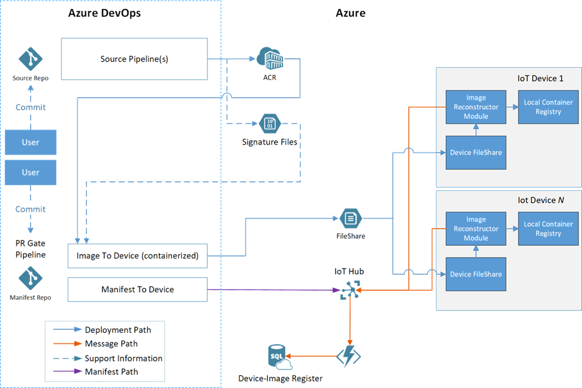
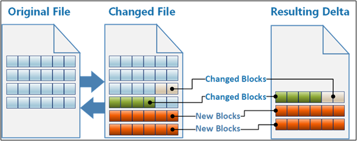
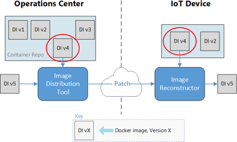
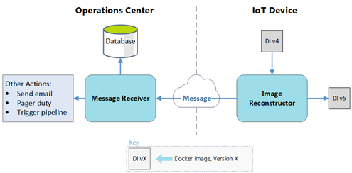

This article describes a solution for deploying containerized internet-of-things (IoT) edge modules across intermittent or low-bandwidth internet connections.

Edge processing is a key internet-of-things (IoT) pattern for providing low-latency connectivity and conserving bandwidth, such as in mobile scenarios. IoT systems typically provision edge devices by deploying software container images. Interrupted container deployments over intermittent low-bandwidth internet connections can cause failures in mobile scenarios. IoT scenarios that have limited, intermittent, or low bandwidth need reliable and resilient deployment capabilities.

In this example, a large logistics company wanted to improve its worldwide product shipment tracking. The company shipped goods with various ground, air, and sea transportation methods to many locales, including areas with intermittent, low-bandwidth internet connectivity. Depending upon the type of goods, product shipments had various IoT insurance, safety, or tracking devices installed on them, with different capabilities. Devices included GPS trackers, temperature sensors, and data capture tools.

The company was having problems updating devices over their recently developed Azure IoT Edge platform. The major pain points were:

- High bandwidth consumption when deploying updated software to devices.
- No standardized automated deployment across devices.
- Limited flexibility of technology selection.

To address these issues, the development team created a solution that:

- Minimizes the size of the deployment to each device, reducing bandwidth.
- Implements a standardized Docker container deployment from the IoT Edge platform to heterogenous remote IoT devices.
- Enables reliable deployment monitoring.
- Takes advantage of various Azure DevOps and cloud services, and uses the customer's preferred legacy tools.

The solution dramatically increased reliability and resiliency of the device provisioning process in limited-connectivity environments. This article describes the solution details and the solution options evaluation process.

### Customer requirements

The customer had the following requirements:

- The solution must support intermittent low-bandwidth cloud connectivity.
- Deployed applications must continue to run locally.
- Local staff need to use functionality offline or without a cloud round-trip delay.
- When connected, the solution must use the cloud connection efficiently.
- The solution must prioritize sending data according to consistently defined business rules across products.

There were also the following detailed requirements:

- Image files are transferred across a low bandwidth, intermittent-connectivity satellite connection.
- The amount of data being transferred should be minimized.
- Transferring files to devices uses the customer's preferred third-party application.
- Device workloads use Docker images in IoT Edge.
- Image sizes range from tens of MB to several GB.
- IoT Edge modules are written in .NET Core 2.2.

## Potential use cases

This solution is suitable for IoT scenarios where software containers deliver solutions over low bandwidth, intermittent connections. Examples include:

- Remote oil, gas, and mining monitoring
- Over-the-air automotive updates
- Anywhere a strong connection isn't guaranteed

## Architecture

In high-bandwidth scenarios, Azure IoT Edge pulls images directly from an internet-accessible Docker registry, either a Docker hub or a private hub like Azure Container Registry. This functionality is the same as running the `docker pull <image_name>` command.

With potentially intermittent network access, such as a satellite internet connection, the Docker pull method is unreliable. Progress isn't cached if the internet connection drops while Docker is pulling the image. When the internet connection resumes, Docker must start pulling the image again from the beginning.

The solution uses an alternative deployment mechanism, binary patching of Docker image files, to reduce bandwidth and compensate for intermittent connectivity.



### Dataflow

1. Developers interact with edge module source code in a source code repository.
1. Container Registry stores each module's Docker images.
1. The manifest repository contains the deployment manifests for all workstreams.
1. Each module has an Azure Pipelines build pipeline that uses a generic Docker build to create and register modules automatically.
1. The image-to-device pipeline deploys the Docker images to the targeted devices, as defined by the manifest file.
1. The manifest-to-device pipeline pushes the deployment manifest to the proper Azure IoT Hub for the device being updated.
1. A third-party fast file transfer solution transfers the files from an Azure Storage account to the device.
1. The Image Reconstruction IoT Edge module applies the received patches on the devices.
1. IoT Hub receives status messages from the Image Reconstruction module, and sets the deployment manifest for the device. The rest of the pipeline flow uses this deployment manifest.
1. Azure Functions monitors the IoT Hub message stream, updates the SQL database, and notifies the user of success or failure.
1. Azure SQL Database tracks occurrences on the target devices and the Azure-based services, during and after deployment.

### Components

- [Azure IoT Edge](https://azure.microsoft.com/services/iot-edge) runs containerized workloads on devices, providing low-latency connectivity and conserving bandwidth.
- [Azure IoT Hub](https://azure.microsoft.com/services/iot-hub) is a managed, cloud-hosted service that acts as a central message hub between IoT applications and the devices they control.
- [Azure Container Registry](https://azure.microsoft.com/services/container-registry) is a cloud-based, private registry service to store and manage private Docker container images and related artifacts.
- [Azure Pipelines](https://azure.microsoft.com/services/devops/pipelines) combines continuous integration (CI) and continuous delivery (CD) to automatically test and build code and ship it to any target.
- [Azure Functions](https://azure.microsoft.com/services/functions) is a serverless compute platform that enables running event-triggered code without having to provision or manage infrastructure.
- [Azure Storage](https://azure.microsoft.com/services/storage) provides highly scalable, secure, performant, and cost-effective storage for all types of business data, objects, and files.
- [Azure SQL Database](https://azure.microsoft.com/services/sql-database) is a fully managed, multimodel relational database service built for the cloud.
- [Docker](https://www.docker.com) is an open platform for developing, shipping, and running containerized applications.

### Alternatives

The development team evaluated several options before deciding on the full Docker image delta transfer solution. The following sections describe the evaluation alternatives and results.

The team considered the following evaluation criteria for each option:

- Whether or not the solution met requirements.
- Whether a low, medium or high amount of logic needed to be implemented on the devices.
- Whether a low, medium or high amount of logic needed to be implemented in Azure.
- Bandwidth efficiency, or ratio of transferred data to total size of an image, for transferring a container image.

Bandwidth efficiency included scenarios where:

- No images existed on the device.
- An image with the same base existed on the device.
- An image of a previous application version existed on the device.
- An image for the application built on a previous base image existed on the device.

The team used the following scenarios to evaluate bandwidth efficiency:

| Scenario | Description |
|------------------|------------------------------|
| Transfer image with base layer already on the device | Transfer a new image when another image already on the device shares the base image. This scenario represents deploying a new application for the first time, when another application already exists in the same OS and framework. |
| Update the application layer | Change only the code for an existing application's image. This scenario represents a typical change when a user commits a new feature. |
| Update the base image | Change the version of the base image the application is built on. |

#### Transfer Docker layers option

A Docker container image is a [UnionFS](https://wikipedia.org/wiki/UnionFS) mount of read-only file system differences, with another writable layer for changes made while the container is running. The file systems are called *layers*, which are basically folders and files. Layers stack to form the base of the container's root file system. Since layers are read-only, various images can share the same layer if they have the layer in common.

The transfer Docker layers option reuses the layers between images, and transfers only new layers to the device. This option would be most useful for images that share the same base layer, usually the OS, or for updating versions of existing images.

Drawbacks of this method include:

- The orchestrator must maintain information about which layers exist on which devices.
- Base layer changes cause all subsequent layers' hashes to change.
- Comparison requires consistent layer hashes.
- There could be dependencies on Docker save and Docker load.

#### Modify Docker client option

This option focuses on modifying or wrapping the Docker client so it resumes layer download after an interruption. By default, a Docker pull resumes a download if the internet connection is restored within about 30 minutes of the interruption. Otherwise, the client exits and loses all download progress.

This method is viable, but had complications, including:

- All images on the device have to be registered with the Docker daemon that pulls the images, to maximize bandwidth efficiency.
- The open-source Docker project would have to be modified to support this functionality, presenting a risk of rejection by open-source maintainers.
- Transferring data over HTTP instead of the customer's favored fast file transfer solution would require developing custom retry logic.
- All layers must be retransmitted when a base image changes.

#### Build on edge device option

This approach moves the image build environment to the devices. The following data is sent to the device:

- The source code for the application being built
- A copy of all the NuGet packages the code depends on
- The Docker base images for the .NET Core build environment and runtime
- Metadata about the end image

A build agent on the device then builds the image and registers it with the device Docker Manager.

This solution was rejected because:

- There would still need to be a way to move large Docker images to the devices. Images to build .NET applications are larger than the app images themselves.
- This method works only for applications where the team has the source code, so it can't use third-party images.
- The option requires packaging NuGet packages and tracking their movement to the devices.
- If an image failed to build on the device, the team would have to remotely debug the build environment and the created image. Remote debugging would require high usage of the potentially limited internet connection.

#### Full image delta transfer option

The chosen approach treats a Docker image as a single binary file. The Docker `save` command exports the image as a *.tar* file. The solution exports the existing and new Docker images, and calculates the binary delta that, when applied, transforms the existing image into the new one.

The solution tracks the existing Docker images on the devices, and builds binary delta patches to transform the existing images into the new images. The system transfers only the delta patches across the low-bandwidth internet connection. This solution required some custom logic to build the binary patches, but it sent the least amount of data to devices.

#### Evaluation results

The following table shows how each of the above solutions measured against the evaluation criteria.

|                 | Meets reqs    | Device logic     | Azure logic     | Transport     | First image     | Base on device | Update app layer | Update base layer |
|---------------------------|-----------------------|-----------------------|----------------------|---------------|-----------------|----------------|--------------------------|--------------------|
| **Transfer Docker layers**    | Yes                   | Low                   | Medium               | FileCatalyst  | 100%            | 10.5%          | 22.4%                    | 100%               |
| **Modify Docker client**    | Yes                   | Medium                | Low                  | HTTP          | 100%            | 10.5%          | 22.4%                    | 100%               |
| **Build on edge device**                      | No                    | High                  | Medium               | FileCatalyst  | N/A             | N/A            | N/A                      | N/A                |
| **Full image delta transfer** | Yes                   | Low                   | High                 | FileCatalyst  | 100%            | 3.2%           | 0.01%                    | 16.1%              |

## Considerations

These considerations implement pillars of the Azure Well-Architected Framework, a set of guiding tenets that improve workload quality. For more information, see [Microsoft Azure Well-Architected Framework](/azure/architecture/framework).

### Performance efficiency

This solution dramatically reduced the bandwidth consumed by updates to IoT devices. The following tables show a breakdown of the differences in transfer efficiency.

Image Reconstructor as source:

|Image name | Image size | Patch size | Data reduction |
|-----------|------------|--------------------------------------|----------------|
|Data visualization|228 MB|79.6 MB|65.1%|
|Simulated WCD|188 MB|1.5 MB|99.2%|
|Proxy|258 MB|29.9 MB|88.4%|

Previous version as source:

|Image name | Image size | Patch size | Data reduction |
|-----------|------------|--------------------------------------|----------------|
|Data visualization|228 MB|0.01 MB|99.9%|
|Simulated WCD|188 MB|0.5 MB|99.7%|
|Proxy|258 MB|0.04 MB|99.9%|

### Operational excellence

The following sections provide a detailed walkthrough of the solution.

#### Source code repository

Developers interact with edge module source code in a source code repository. The repository consists of folders that contain the code for each module, as follows:

```

\- repository root
    - modulea
    - modulea.csproj
    - module.json
    - Program.cs
    - Dockerfile

\- moduleb
    - moduleb.csproj
    - module.json
    - Program.cs
    - Dockerfile
```

The recommended number of source code repositories is:

- One repository for all modules across all workstreams.
- One source code repository for each workstream.

#### Container Registry instances

Container Registry stores each module's Docker images. There are two possible configurations for Container Registry:

- A single Container Registry instance that stores all images.
- Two Container Registry instances, one to store the development, testing, and debugging images, and another that contains only images marked as production-ready.

#### Manifest repository

The manifest repository contains the deployment manifests for all workstreams. The templates are in folders based on their workstream. In this example, the two workstreams are shared infrastructure and the containerized application.

```

\- repository root
     - Workstream1
         - deployment.template.json
     - Workstream2
         - deployment.template.json
```

#### Docker image build pipeline

Each module has an Azure Pipelines build pipeline. The pipeline uses a generic Docker build to create and register modules. The pipeline is responsible for:

- Security scanning of the source code.
- Security scanning of the base image for building the Docker image.
- Running unit tests for the module.
- Building the source into a Docker image. The image tag contains the `BUILD_BUILDID`, so the image can always be linked back to the source code that made it.
- Pushing the image to a Container Registry instance.
- Creating the delta file.
- Creating a signature file for the image and saving the file to an Azure storage account.

All pipeline instances are based on a single [YAML pipeline definition](/azure/devops/pipelines/yaml-schema). The pipeline can act on the modules by using environment variables. Filters trigger each pipeline only when changes are committed in a certain folder. This filter avoids building all modules when only one module is updated.

#### Image-to-device pipeline

The image-to-device pipeline deploys the Docker images to the targeted devices, as defined by a manifest file. Triggering the pipeline manually starts the deployment.

The pipeline definition specifies running these deployments in a container. The pipelines support variable input for the images to base containers on. A single variable can control deployments for all pipelines.

The image contains the code that determines which patches to build, builds the patches, and distributes them to the Azure side of the file transfer tool.

The image distribution tool needs the following information:

- Which image(s) to deploy, provided by the manifest in the repository.
- Which devices to deploy to, provided by the user who triggers the pipeline.
- Which image(s) are already on the targeted devices, provided by an Azure SQL database.

The pipeline outputs are:

- Patch bundles sent to the Azure side of the file transfer tool, to be distributed to the devices.
- SQL database entries that mark which images have started transferring to each device.
- SQL database entries for the new deployment sets. These entries include the name and email address of the user who ordered the deployment.

This pipeline does the following steps:

1. Determines needed images, based on the deployment manifest.
1. Queries SQL to see which images are already on the devices. If all images are already present, the pipeline terminates successfully.
1. Determines which patch bundles to create. The algorithm determines which starting image generates the smallest patch bundle.
   - Inputs: A *.tar* file containing the new image to deploy, and signature files for the existing images on the devices.
   - Output: A rank of the existing images to determine the smallest patch to create.
1.  Creates the needed patch bundles for each device. Builds similar patches once, and copies them to all devices that need them.
1.  Distributes the patches to the file transfer tool storage account for deployment.
1.  Updates SQL to mark the new images as `in transit` to each of the targeted devices.
1.  Adds the deployment set information to SQL, with the name and contact email for the person deploying the image.



#### Manifest-to-device pipeline

The manifest-to-device pipeline pushes the deployment manifest to the proper IoT Hub connection for the device being updated. A user triggers the pipeline manually, and specifies an environment variable for the IoT Hub instance to target.

The pipeline:
- Determines which images the deployment needs.
- Queries SQL to make sure that the needed images are all on the targeted devices. If not, the pipeline terminates with a `failed` status.
- Pushes the new deployment manifest to the proper IoT Hub.

#### Fast file transfer solution

The customer wanted to continue using their third-party fast file transfer solution, called FileCatalyst, to provide the connection between Azure and their IoT devices. This solution is an *eventually consistent* file transfer tool, meaning a transfer can take a long time, but will eventually complete without losing any file information.

The solution used an Azure Storage account on the Azure side of the connection, and the customer's existing file transfer host VM for each device receiving images. The patch bundles transfer to a Linux VM that runs IoT Hub.

#### Image Reconstruction module

The Image Reconstruction IoT Edge module applies the received patches on the devices. Every device hosts its own local container registry, using the Docker open-source registry. The Image Reconstruction process runs on the host VM, which is the same as the file transfer VM.

The module:

1. Receives the patch bundle in a folder mounted to the container.
1. Unzips the patch contents to read the configuration file.
1. Pulls the base image from the local container registry by hash.
1. Saves the base image as a *.tar* file.
1. Applies the patch to the base image.
1. Loads the *.tar* file containing the new image to Docker.
1. Pushes the new image to the local container registry, with a configuration file including a friendly name and tag.
1. Sends a success message to IoT Hub.

If the process fails at any point, the module sends a failure message to IoT Hub, so the user who triggered the deployment can be notified.

#### IoT Hub

Several of the deployment processes use IoT Hub. Besides receiving status messages from the Image Reconstruction module, IoT Hub sets the deployment manifest for the device. The rest of the pipeline flow uses this manifest.



### Azure Functions

Azure Functions monitors the message stream coming from IoT Hub, and takes action in the cloud.

For a success message:

- The function updates the status of the SQL entry for the image on the device from `in transit` to `succeeded`.
- If this image is the last to arrive in a deployment set:
  - The function notifies the user of the deployment success.
  - The function updates the manifest-to-device pipeline to start using the new images.

For a failure message:

- The function updates the status of the SQL entry for the image on the device from `in transit` to `failed`.
- The function notifies the user of the image transfer failure.



### SQL Database

An SQL database tracks occurrences on the target devices and the Azure-based deployment services during and after deployment. Azure Functions and Azure Pipelines both use a private NuGet package created for interacting with the database.

SQL Database stores the following data:

- Which images are on each device.
- Which images are on the way to each device.
- Which images being deployed belong to a set.
- The user that ordered the deployments.

The goal for this example was to make sure the system generated the needed data for future data dashboards. Querying IoT Hub can provide the following data about the manifest-to-device pipeline:

- The state of a deployment.
- The images on a given device.
- The devices that have an image.
- Time series data on successful and failed transfers.
- Queries of deployments based on user.

## Contributors

*This article is maintained by Microsoft. It was originally written by the following contributors.*

Principal author:

- [Kanio Dimitrov](https://www.linkedin.com/in/kanio-dimitrov-19b71a8) | Principal Software Engineering Lead

## Next steps

- [Deploy your first IoT Edge module to a virtual Linux device](/azure/iot-edge/quickstart-linux)
- [Develop IoT Edge modules with Linux containers](/azure/iot-edge/tutorial-develop-for-linux)

## Related resources

- [Azure IoT reference architecture](/azure/architecture/reference-architectures/iot)
- [Azure IoT Edge for Azure Industrial IoT](/azure/architecture/guide/iiot-guidance/iiot-architecture#azure-iot-edge)
- [Design a CI/CD pipeline using Azure DevOps](/azure/architecture/example-scenario/apps/devops-dotnet-baseline)
- [Architectural considerations in an IoT analytics solution](/azure/architecture/guide/iiot-guidance/iiot-considerations)
- [Low-latency network connections for industry](/azure/architecture/solution-ideas/articles/low-latency-network)
