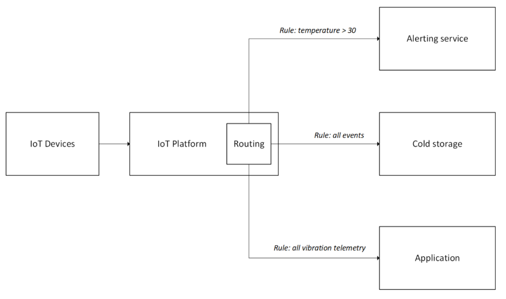

# Event Routing

## Motivations
In an Internet of Things (IoT) solution, IoT devices send [events](https://docs.microsoft.com/azure/architecture/example-scenario/iot/introduction-to-solutions#events) (notifications, acknowledgements, telemetry) to application to gain insights. Applications may require specific subsets of events for processing and/or storage at different end points. These events may also need to be routed to multiple different services for further processing. As the IoT solution is scaled, the number of devices, volume of events, variety of events and different services also varies. A flexible, scalable, consistent, and reliable method to route events is necessary to serve this pattern.

## Use cases
A retail outlet is monitoring the fridges for their frozen food section. 
-   An alert is sent when the temperature of the fridges goes past a pre-determined threshold. A routing rule can be created with the threshold rule to send these specific events to an alert system. 
-   The data science team is building an anomaly detection model to identify issues with the fridges before any of them breaks down. A message routing rule can send all the raw telemetry data to a storage specifically for the data science team to use for training and modelling. 

## Architecture

In an IoT platform, rules can be created for fine-grained routing of events. One or more rules can be configured in the IoT platform. The rules will be applied to the ingress events and are routed to the specific endpoint(s). 

## Characteristics
Here are some considerations when using this pattern. 
-   Throughput of endpoints: Endpoints that receives the events must be able to handle the ingress of events sent via the routing. It is also necessary to ensure that the endpoint services have the capacity to ingest and store the data till it is consumed.

-   Format of events: For the routing to be scalable and flexible, the events should have a common format to ensure interoperability across protocols. 

-   Event handling: If an event matches multiple routes that point to the same endpoint, it should deliver to that endpoint only once. It is also important to guarantee message ordering in such situations.

-   Events duplication: For handling message duplication, we recommend stamping a unique identifier in the application properties of the message at the point of origin, which is usually a device or a module. The service consuming the messages can then handle duplicate messages using this identifier.

-   Fallback route: Events that do not match any rules should land in a fallback route so that they can be addressed appropriately, and no event would be lost. 

-   Non-telemetry events: IoT solutions have different types of events like device state changes, and device lifecycle events. The events route should be able to capture and apply rules to such non-telemetry events to enable automation and monitoring. 

When to use this pattern:
-   Sending device telemetry messages as well as events like device lifecycle events, and device twin change events to specific endpoints determined by rules. 

-   Filtering events by applying specific rules. 

This pattern is not recommended for:
-   Routing based on complex real-time data analysis of times series data. For example, when comparing the 15-minute average telemetry data. This should be implemented with a real-time analytics service for the hot path data. 

## See also
[Azure IoT Hub message routing](https://docs.microsoft.com/azure/iot-hub/iot-hub-devguide-messages-d2c)

