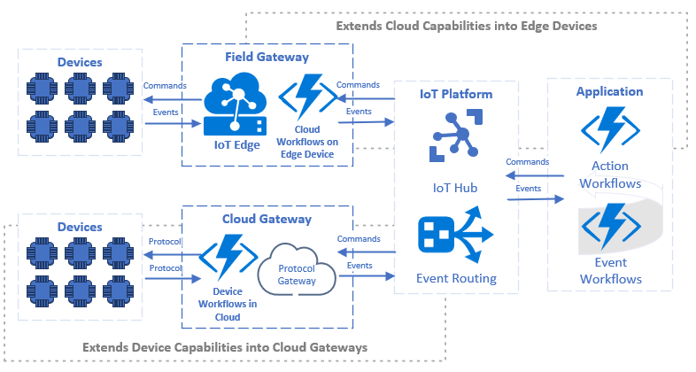

# Field and cloud edge gateways

IoT devices can connect to the IoT platform directly, or through *IoT Edge gateways* that implement intelligent capabilities. Edge gateways enable functionality like:
- Aggregating or filtering device events before they're sent to the IoT platform
- Localized decision-making
- [Protocol and identity translation](/azure/iot-edge/iot-edge-as-gateway) on behalf of devices

There are two types of edge gateways, *field* or [IoT Edge](/azure/iot-edge/iot-edge-as-gateway), and *cloud* or [protocol](/azure/iot-hub/iot-hub-protocol-gateway) gateways.

 

- IoT Edge *field gateways* are located close to devices on-premises, and connect to the IoT platform to extend cloud capabilities into devices. IoT Edge devices can act as communication enablers, local device control systems, and data processors for the IoT platform. IoT Edge devices can run cloud workflows on-premises by using [Edge modules](/azure/iot-edge/iot-edge-modules), and can communicate with devices even in offline scenarios.

- *Protocol* or *cloud gateways* enable connecting existing and diverse device populations to IoT solutions by hosting device instances and enabling communication between devices and the IoT platform. Cloud gateways can do protocol and identity translation to and from the IoT platform, and can execute additional logic on behalf of devices.