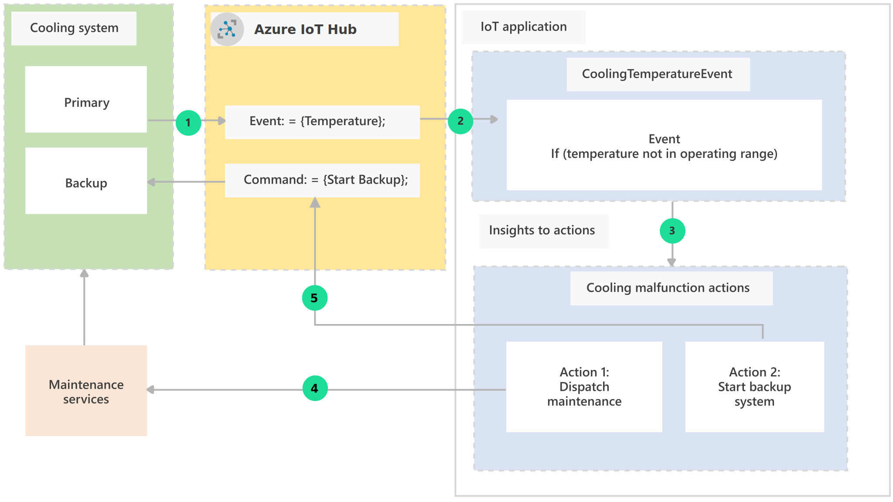

This article describes basic concepts and patterns that are common to internet-of-things (IoT) solutions. In IoT solutions, *events* generate *insights*, which trigger *actions* that improve a business process. Cloud-hosted services and applications determine actions to take, based on events that devices send.

The following diagram illustrates how *events* generate *insights* to inform *actions* in IoT solutions.

1. Devices generate events and send them to cloud applications.
1. Applications derive insights by evaluating data from incoming device events.
1. Based on insights, applications take action by running processes and workflows. Applications can also send commands to the devices.

## Architecture

The following example shows the interaction of events, insights, and actions in a food storage temperature monitoring IoT solution.

In this system:

- Device sensors send operating temperatures as telemetry to a connected application through [Azure IoT Hub](https://azure.microsoft.com/services/iot-hub).
- The cloud application monitors temperatures, and takes actions if the temperature gets too low or high.
- Devices can receive commands to adjust temperatures or start and stop operation.
- There are backup systems in case a primary system malfunctions or goes offline.

### Dataflow

The example shows the following process:

1. The primary cooling system sends temperature data to IoT Hub, via device-to-cloud events, every 30 seconds.
1. Routing rules in IoT Hub evaluate events for immediate contextual insights, such as temperatures at malfunctioning levels.
1. If the temperature is at a malfunctioning level, event routing sends the event to specific handlers to take action.
1. A handler invokes an action to dispatch maintenance to the site via Maintenance Services.
1. A handler sends a command to start the backup cooling system while maintenance is on the way.

## Considerations

Considering events, insights, and actions can help expand IoT scenarios. In this example, the cooling monitoring system can add more complex insights and actions by using the events from cooling system devices.

While the event data doesn't change, gathering events and applying different types of insights to the data enables different actions. This strategy is powerful for operating large numbers of devices at multiple locations.

|Event|Insight|Action
|---|---|---|
|Report single event with temperature out of operating range.|Contextual: Single event. Cooling system malfunction.|Service: Invoke maintenance service dispatch.|
|Monitor and analyze real-time events for operating temperature anomalies.|Real-time: Several events. Temperature needs adjustment to stay in range.|Device: Notify devices to adjust temperatures.|
|Gather events over many days to analyze ongoing maintenance patterns.|Aggregated: Many events. Malfunctions happen more often during certain periods.|Analog: Modify regular system maintenance schedule.|

### Events

Events represent *device-to-cloud* communication in an IoT solution, and can be *notifications*, *acknowledgments*, or *telemetry*.

#### Notification events

Notifications are:

- Unsolicited events the device sends to convey its state.
- Requests from a device to its cloud application.

Notifications can be alerts, state changes, or requests for an application to take an action. Examples include:

- Alerts from devices that are malfunctioning.
- Device state or property change updates.
- Requests to provide information.

#### Acknowledgment events

Devices send acknowledgments to indicate receipt, progress, or completion of requested asynchronous operations.

Application logic that relies on stateful communication from devices requires acknowledgments. Examples include:

- Progress updates on long-running requests.
- Success or failure signals for completing an asynchronous request.
- Tightly coupled multi-step device and application transactions.

#### Telemetry events

Device telemetry sends recurring measurement or state transmissions to the cloud at regular intervals. Remote sensor monitoring uses telemetry events, such as:

- Continual sensor data from devices to applications.
- Monitored health and diagnostics data from devices.
- Regular location data from tracked assets.

### Insights

Insights are interpretations of events. Insights that derive directly from events are called *contextual* insights. Insights that come from application processing of transformed or stored event data are *real-time* or *aggregated* insights.

#### Contextual insights

Context-sensitive interpretations of events determine where to route the events or what immediate actions to take. Examples include:

- Where to route a message, based on contextual data like message header content or device type.
- Runtime decisions by event handling code that decides whether to take immediate action based on an event.
- Reconciling acknowledgments to complete stateful transactions.

#### Real-time insights

Real-time insights are gathered and observed in real-time for monitoring and decision-making purposes. Examples include:

- Gathering and observing near real-time solution metrics.
- Monitoring solution health for visualization, alerting, and remediation.
- Combining events with other data sources for real-time transformation and output to display and analyze.

#### Aggregated insights

Aggregated insights come from gathering and storing large numbers of events over time, and executing batch processing on the aggregated data. Examples include:

- Building training data for machine learning (ML) and artificial intelligence (AI) to improve device and service algorithms.
- Gathering and observing trends and characteristics over long durations to use for improving processes.
- Building on-demand query capabilities for multiple data sources to use in business planning.

### Actions

Actions are deliberate activity undertaken either programmatically or manually as *device*, *service*, or *analog* actions.

#### Device actions

Device actions are instructions or information an IoT application sends to a device to act on locally. Examples include:

- Commands a user application sends to control a device.
- Configuration data sent to a device to modify its behavior.
- On-demand requests to a device to provide data or state.

#### Service actions

Service actions are service or intro-process communications that one part of a solution sends to another. Service actions also include requests that an application's logic sends to an external service. Examples include:

- Requests for data from external services to use in solutions.
- Transactions with other services as part of application logic.
- Summoning emergency, police, or other external services.

#### Analog actions

An IoT solution tracks analog actions as part of a workflow, but the actions usually happen outside of solution automation. Analog actions often have a mechanism for a human operator to signal when the action is complete. Examples include:

- Field maintenance operators notifying a solution when they complete a requested repair.
- Operators notifying a solution when they finish stocking or staging items in a retail workflow.
- Human-conducted scoring and tuning of training data for AI.

## Contributors

*This article is maintained by Microsoft. It was originally written by the following contributors.* 

Principal author:

 - [Jason Wadsworth](https://www.linkedin.com/in/jason-wadsworth-23549b158/) | Principal Software Engineer
 
*To see non-public LinkedIn profiles, sign in to LinkedIn.*

## Next steps

- [Azure IoT documentation](/azure/iot-fundamentals)
- [IoT concepts and Azure IoT Hub](/azure/iot-hub/about-iot-hub)

## Related resources

- [IoT devices, platform, and applications](devices-platform-application.yml)
- [IoT application-to-device commands](cloud-to-device.yml)
- [IoT event routing](event-routing.yml)
- [Choose an Internet of Things (IoT) solution in Azure](iot-central-iot-hub-cheat-sheet.yml)
