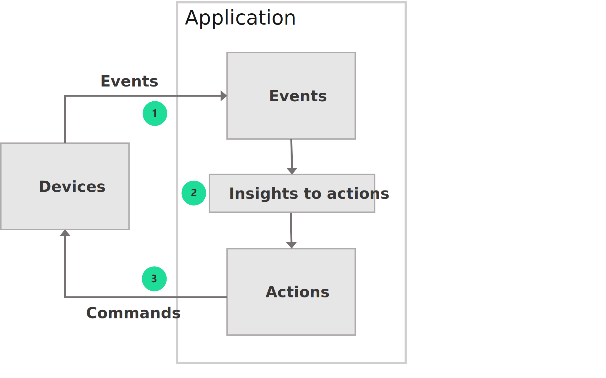

Connected sensors, devices, and intelligent operations can transform businesses and enable new growth opportunities with [Azure Internet of Things (IoT)](https://azure.microsoft.com/overview/iot/) solutions. This content complements existing [Azure IoT documentation](/azure/iot-fundamentals) with concepts and patterns to consider when designing and developing IoT solutions.

Azure *IoT solutions* involve *events* that generate *insights* to inform *actions* that improve a business or process. IoT solutions use events, insights, and actions to connect devices, or things, to cloud applications and achieve end-to-end scenarios. The terms *thing* and *device* both mean a connected physical device in an IoT solution.

Events, insights, and actions are functional concepts that exist across the [devices, platform, and applications](devices-platform-application.yml) of an IoT solution. To illustrate, consider an application that monitors cooling system temperatures for food storage, and calls emergency maintenance services if a temperature becomes dangerously low or high:

The cooling system sends operating temperatures as telemetry to a connected application through [Azure IoT Hub](/azure/iot-hub/about-iot-hub). Backup systems exist in case a primary cooling system malfunctions or goes offline. Devices can receive commands to adjust temperature or start and stop operation.

The following process occurs in this example:

1. **Devices send events.** Devices send temperature samples from the primary cooling system to the application's IoT Hub, via device-to-cloud events, every 30 seconds.
2. **Events generate insights.** Routing rules in the IoT Hub evaluate events for any immediate contextual insights, such as temperatures at malfunctioning levels.
3. **Insights inform actions.** If the temperature is at a malfunctioning level, event routing sends the event to a specific handler to take action. The handler invokes an action to another process to dispatch maintenance to the site, and sends a command to the backup system to start while maintenance is enroute to the location.

Considering events, insights, and actions allows expansion of the cooling system monitoring scenario. The system can add more complex insights and actions by using the events from the cooling system devices:

While the series of events doesn't change, gathering events and applying different types of insights to the events enables taking additional actions with the data. This strategy becomes more powerful when applied to large numbers of devices operating at multiple locations.

## Events

Events represent *device-to-cloud* communication in an IoT solution, and may be *notifications*, *acknowledgments*, or *telemetry*.

**Notifications** are unsolicited events the device sends to convey state, or requests from a device to its cloud application. These types of events are often used for alerts, state changes, and requests from a device for an application to take an action. Examples include:
- An alert from a device that it's experiencing a malfunction.
- A request from a device for information to be sent to it.
- An update on local device state or property change.

**Acknowledgments** are events a device sends to indicate receipt, progress, or completion of a requested asynchronous operation. Acknowledgments are often used in transactions between a device and cloud where the application logic relies on stateful communication from the device. Examples include:
- Progress updates on a long-running request from an application.
- Success or failure signals for completing an asynchronous request.
- Tightly coupled multi-step device and application transactions.

**Telemetry** is recurring transmission of measurements or state sent at regular intervals from a device to the cloud. These types of events are typically used for remote sensor monitoring. Examples include:
- Continual sensor data from devices to applications for interpretation.
- Monitored health and diagnostics data sent from devices.
- Tracked assets regularly sending their location data.

## Insights

Insights are interpretations of events. Insights may derive from events directly as *contextual* insights, or from transformed or stored event data by application event processing for *real-time* or *aggregated* insights.

**Contextual insights** are context-sensitive interpretations of events to determine where they should be routed or what immediate actions application logic should execute. Examples are:
- Determining where to route a message based on contextual data, such as message header content or the type of device.
- Runtime decisions by event handling code that decides whether to take immediate action based on an event.
- Reconciling acknowledgments to complete a stateful transaction.

**Real-time insights** are interpretations gathered and observed in real-time for monitoring and decision-making purposes. Examples are:
- Gathering and observing metrics for a solution in near real-time.
- Monitoring solution health for visualization, alerting, and remediation workflows.
- Combining events with other data sources for real-time transformation and output to display and analyze.

**Aggregated insights** are interpretations made by gathering larger quantities of events over time, storing them, and executing batch processing on the aggregated data. Examples are:
- Building training data from real events for machine learning and artificial intelligence (AI) to use in improving device and service algorithms.
- Gathering and observing trends and characteristics over a long period of time for use in improving processes.
- Building on-demand query capabilities around multiple data sources to use in business planning.

## Actions

Actions are deliberate activity undertaken either programmatically or manually as *device*, *service*, or *analog* actions.

**Device actions** are instructions or information an IoT application sends to a device to act on locally. Examples are:
- Commands sent from a user application to control a device.
- Configuration data sent to a device to modify its behavior.
- Requests to a device to provide data or state on-demand.

**Service actions** are service or intra-process communications sent from one part of a solution to another. These actions may also be requests sent to an external service as part of an application's logic. Examples are:
- Requesting data from an external service for use by a solution.
- Transactions with another service as part of application logic.
- Summoning emergency, police, or other external services.

**Analog actions** are tracked by a solution as part of a workflow, but usually take place outside of the solution automation. These types of actions often have a mechanism for a human operator to signal when the action is complete. Examples are:
- Field maintenance on devices where someone is sent to repair or replace a device. The operator notifies the solution when they complete the repair.
- Stocking, packaging, or staging physical items in a retail workflow. The operator notifies the solution when they've stocked or staged the items.
- Human-conducted scoring and tuning of training data for AI.

## See also
- [IoT devices, platform, and applications](devices-platform-application.yml)
- [IoT builder, developer, and operator roles](builders-developers-operators.yml)
