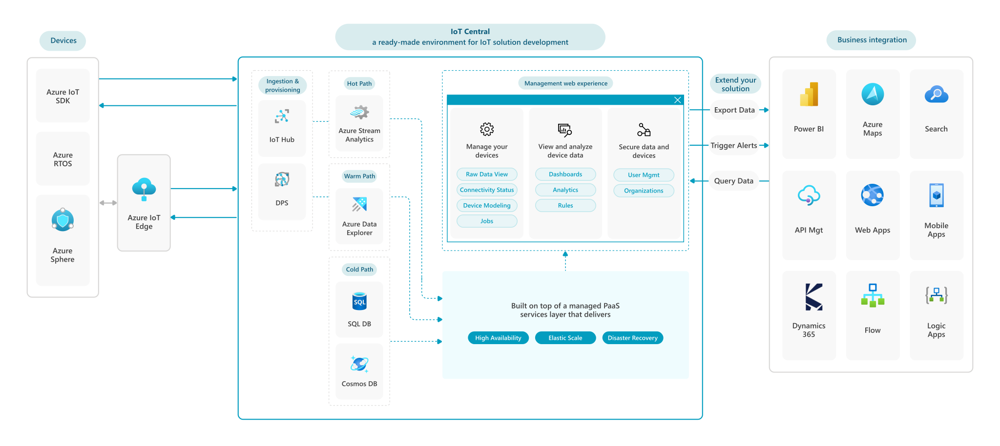
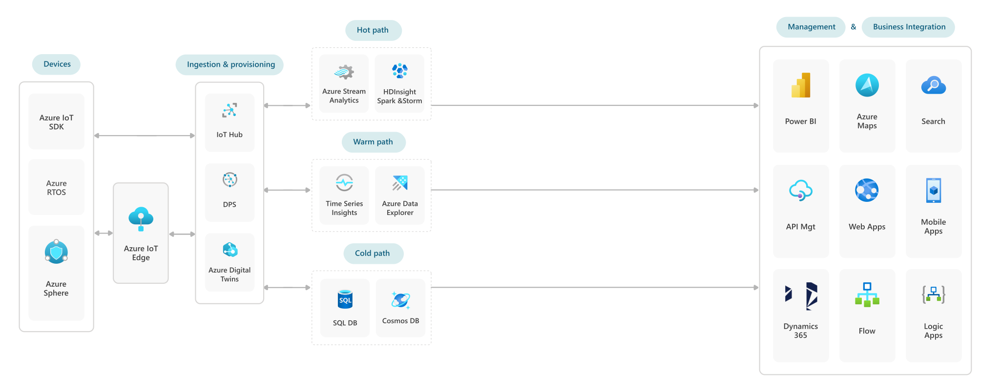

IoT solutions require a combination of technologies to effectively connect devices, events, and actions to cloud applications. In Azure, we have a single set of guidance for building and connecting devices to the cloud. However, there are many options for building and deploying your IoT cloud solutions. Which technologies and services you'll use depends on your scenario's development, deployment, and management needs.

## Starting with Azure IoT Central (aPaaS)
Using an application platform as a service (aPaaS) streamlines many of the complex decisions you'll face when building an IoT solution. Azure IoT Central is Microsoft's aPaaS offering designed to simplify and accelerate IoT solution assembly and operation by assembling platform as a service (PaaS) components into an extensible and fully managed app development platform hosted by Microsoft. This takes a lot of the guesswork and complexity out of building reliable, scalable, and secure IoT applications.

An out-of-the box web UX and API surface area make it simple to monitor device conditions, create rules, and manage millions of devices and their data remotely throughout their life cycles. Furthermore, it enables you to act on device insights by extending IoT intelligence into line-of-business applications. Azure IoT Central also offers built-in disaster recovery, multitenancy, global availability, and a predictable cost structure.

## Building with Azure PaaS services
In certain scenarios you may need a higher degree of control and customization than Azure IoT Central provides. In these cases, Azure also offers individual platform as a service (PaaS) cloud services that you can use to build a custom IoT solution. For example, you might build a solution using a combination of these PaaS services:

-   Azure IoT Device Provisioning Service and Azure IoT Hub for device provisioning, device connectivity, and management

-   Azure Time Series Insights for storing and analyzing warm and cold path time series data from IoT devices

-   Azure Stream Analytics for analyzing hot path data from IoT devices

-   Azure IoT Edge for running AI, third-party services, or your own business logic on IoT Edge devices

## Comparing approaches

Choosing to build with Azure IoT Central gives you the opportunity to focus time and money on transforming your business and designing innovative offerings, rather than maintaining and updating a complex and continually evolving IoT infrastructure. However, if your solution requires features or services that Azure IoT Central does not currently support, you may need to develop a PaaS solution using Azure IoT Hub as a core element.

You can use the table and links below to help decide if you can use a managed solution based on Azure IoT Central, or if you should consider building a PaaS solution using Azure IoT Hub.

|                                         | **Azure IoT Central**                                                                                                                                                                                                                                                                                                                                                                                                                                                                                                                                                        | **Azure IoT Hub**                                                                                                                                                                                                                                                                                                                                                                                                                                                                                             |
|-----------------------------------------|------------------------------------------------------------------------------------------------------------------------------------------------------------------------------------------------------------------------------------------------------------------------------------------------------------------------------------------------------------------------------------------------------------------------------------------------------------------------------------------------------------------------------------------------------------------------------|---------------------------------------------------------------------------------------------------------------------------------------------------------------------------------------------------------------------------------------------------------------------------------------------------------------------------------------------------------------------------------------------------------------------------------------------------------------------------------------------------------------|
| Type of Service                         | Fully managed aPaaS solution. It simplifies device connectivity and management at scale so that you can focus time and resources on using IoT for business transformation. This simplicity comes with a tradeoff: an aPaaS-based solution is less customizable than a PaaS-based solution.                                                                                                                                                                                                                                                                                                                                               | Managed PaaS back-end solution that acts as a central message hub between your IoT application and the devices it manages. You can build more functionality using additional Azure PaaS services. This approach provides great flexibility but requires more development and management effort to build and operate your solution.                                                                                                                                         |
| Application Template                    | [Application templates](/azure/iot-central/core/concepts-app-templates) in Azure IoT Central help solution builders kick-start IoT solution development. You can get started with a generic application template, or use a prebuilt industry-focused application template for [retail](/azure/iot-central/retail/overview-iot-central-retail), [energy](/azure/iot-central/energy/overview-iot-central-energy), [government](/azure/iot-central/government/overview-iot-central-government), or [healthcare](/azure/iot-central/healthcare/overview-iot-central-healthcare). | Not supported. You'll design and build your own solution using Azure IoT Hub and other PaaS services.                                                                                                                                                                                                                                                                                                                                                                                                         |
| Device Management                       | Provides seamless [device integration and device management capability](/azure/iot-central/core/overview-iot-central#manage-your-devices). Device Provisioning Service capabilities (DPS) are built in.                                                                                                                                                                                                                                                                                                                                                                      | No built-in experience. You'll design and build your own solutions using Azure IoT Hub primitives, such as device twin and direct methods. DPS must be enabled separately.                                                                                                                                                                                                                                                                                                                                                                                                                                                                         |
| Scalability                             | Supports auto-scaling.                                                                                                                                                                                                                                                                                                                                                                                                                                                                                                                                                       | There is no built-in mechanism for automatically scaling an IoT Hub. You'll need to deploy other solutions to enable auto-scaling.     See: [Auto-scale your Azure IoT Hub](/samples/azure-samples/iot-hub-dotnet-autoscale/iot-hub-dotnet-autoscale/)                                                                                                                                                                                                                                              |
| Message Retention                       | Retains data on a rolling, 30-day basis. You can continuously export data using the [export feature](/azure/iot-central/howto-export-data).                                                                                                                                                                                                                                                                                                                                                                                                                                  | Allows data retention in the built-in Event Hubs for a maximum of 7 days.                                                                                                                                                                                                                                                                                                                                                                                                                                     |
| Visualizations                      | Yes, IoT Central has a UX that makes it simple to visualize device data, perform analytics queries, and create custom dashboards.                                                                                                                                                                       | No.                                                                                                                                                                                                                                                                                                                                                                                                                                                                                                           |
| OPC UA Protocol                         | Not yet.                                                                                                                                                                                                                                                                                                                                                                                                                                                                                                                                                                     | OPC Publisher is a Microsoft-supported open-source product that bridges the gap between industrial assets and Azure hosted resources. It connects to OPC UA–enabled assets or industrial connectivity software and publishes telemetry data to [Azure IoT Hub](https://azure.microsoft.com/services/iot-hub/) in various formats, including IEC62541 OPC UA PubSub standard format.   See: [Azure/iot-edge-opc-publisher: Microsoft OPC Publisher](https://github.com/Azure/iot-edge-opc-publisher) |
| Pricing                                 | The first two active devices within an IoT Central application are free, if their message volume does not exceed 800 (Standard Tier 0 plan), 10,000 (Standard Tier 1 plan), or 60,000 (Standard Tier 2 plan) per month. Volumes exceeding those thresholds will incur overage charges. Beyond that, device pricing is prorated monthly. For each hour during the billing period, the highest number of active devices is counted and billed.  See: [Azure IoT Central pricing](https://azure.microsoft.com/pricing/details/iot-central/)       | [See: Azure IoT Hub pricing](https://azure.microsoft.com/pricing/details/iot-hub/#:~:text=%2B%20IoT%20Hub%20%20%20%20Edition%20Type,%20%20300%2C000%2C000%20%20%204%20KB%20)                                                                                                                                                                                                                                                                                                                                  |
| Analytics, Insights, and Actions        | Integrated analytics experience targeted at exploration of device data in the context of device management.                                                                                                                                                                                                                                                                                                                                                                                                                                                                                                                                   | You'll use separate Azure PaaS services to incorporate analytics, insights, and actions, like Azure Steam Analytics, Time Series Insight, Azure Data Explorer, and Azure Synapse.                                                                                                                                                                                                                                                                                                                                                                               |
| Big Data Management                     | Data Management can be managed from Azure IoT Central itself.                                                                                                                                                                                                                                                                                                                                                                                                                                                                                                                | You'll need to add and manage big data Azure PaaS services as part of your solution.                                                                                                                                                                                                                                                                                                                                                                                                                          |
| High Availability and Disaster Recovery | High availability and disaster recovery capabilities are built in to Azure IoT Central and managed for you automatically.   See: [Best practices for device development in Azure IoT Central](/azure/iot-central/core/concepts-best-practices)                                                                                                                                                                                                                                                                                                                     | Can be configured to support multiple high availability and disaster recovery scenarios.   See: [Azure IoT Hub high availability and disaster recovery](/azure/iot-hub/iot-hub-ha-dr)                                                                                                                                                                                                                                                                                                               |
| SLA                                     | Azure IoT Central guarantees you 99.9% connectivity.   See:  [SLA for Azure IoT Central](https://azure.microsoft.com/support/legal/sla/iot-central/)                                                                                                                                                                                                                                                                                                                                                                                                               | The Azure IoT Hub standard and basic tiers guarantee 99.9% uptime. No SLA is provided for the Free Tier of Azure IoT Hub.   See: [SLA for Azure IoT Hub](https://azure.microsoft.com/support/legal/sla/iot-hub/v1_2/)                                                                                                                                                                                                                                                                               |
| Device Template                         | Supports centrally defining and managing device templates that help structure the characteristics and behaviors of device types for use in supported device management tasks and visualizations.                                                                                                                                                                                                                                                                                                                                                                                                                                                        | Requires users to create their own repository to define and manage device message templates.                                                                                                                                                                                                                                                                                                                                                                                                                  |
| Data Export                             | Provides data export to Azure blob storage, event hubs, service bus, webhook, and Azure Data Explorer. Additional capabilities include filtering, enriching, and transforming messages on egress.                                                                                                                                                                                                                                                                                                                                                                                                                                                                                   | Provides a built-in event hub endpoint and can also make use of message routing to export data to other storage locations.                                                                                                                                                                                                                                                                                                                                                                                    |
| Multi-tenancy                           | IoT Central [Organizations](/azure/iot-central/core/howto-create-organizations) enabled in-app multi-tenancy where you to define a hierarchy to manage which users can see which devices in your IoT Central application.                                                                                                                                                                                                                                                                                                                                                                                                                                                                      | Not supported. Tenancy can be achieved by using separate hubs per customer and/or access control can be built into the data layer of solutions.                                                                                                                                                                                                                                                                                                                                                                                    |
| Rules and Actions                       | Provides a built-in rules and actions processing capability with email notification, Azure Monitor group, Power Automate, and Webhook actions.   See: [What is Azure IoT Central?](/azure/iot-central/core/overview-iot-central#rules-and-actions)                                                                                                                                                                                                                                                                                                                                                                                                   | Data coming from IoT Hub can be sent to Azure Stream Analytics, Azure Time Series Insights, or Azure Event Grid. From those services you can connect to Azure Logic apps or other custom applications to handle rules and actions processing.   See: [IoT remote monitoring and notifications with Azure Logic Apps](/azure/iot-hub/iot-hub-monitoring-notifications-with-azure-logic-apps)                                                                                                         |
| SigFox/LoRaWAN Protocol                 | Uses IoT Central Device Bridge.   See: [Azure IoT Central Device Bridge](https://github.com/Azure/iotc-device-bridge#azure-iot-central-device-bridge)                                                                                                                                                                                                                                                                                                                                                                                                              | Requires you to write a custom Module on Azure IoT Edge and integrate it with Azure IoT Hub.                                                                                                                                                                                                                                                                                                                                                                                                                  |

## Next steps

Continue learning about IoT Hub and IoT Central:

-   [What is Azure IoT Central?](/azure/iot-central/core/overview-iot-central#rules-and-actions)

-   [What is Azure IoT Hub?](/azure/iot-hub/about-iot-hub)

## Related resources

Additional IoT topics:

-   [Overview of device management with Azure IoT Hub](/azure/iot-hub/iot-hub-device-management-overview)

-   [Azure IoT Hub high availability and disaster recovery](/azure/iot-hub/iot-hub-ha-dr)

-   [Understand and use Azure IoT Hub SDKs](/azure/iot-hub/iot-hub-devguide-sdks)

-   [IoT remote monitoring and notifications with Azure Logic Apps](/azure/iot-hub/iot-hub-monitoring-notifications-with-azure-logic-apps)

IoT architecture guides:

-   [IoT solutions conceptual overview](./introduction-to-solutions.yml)

-   [Vision with Azure IoT Edge](../../guide/iot-edge-vision/index.md)

-   [Azure Industrial IoT Analytics Guidance](../../guide/iiot-guidance/iiot-architecture.md)

-   [Azure IoT reference architecture](../../reference-architectures/iot.yml)

-   [IoT and data analytics](../data/big-data-with-iot.yml)

Example architectures using Azure IoT Central:

-   [Retail - Buy online, pickup in store (BOPIS)](./vertical-buy-online-pickup-in-store.yml)
-   [Environment monitoring and supply chain optimization with IoT](../../solution-ideas/articles/environment-monitoring-and-supply-chain-optimization.yml)
-   [Blockchain workflow application](../../solution-ideas/articles/blockchain-workflow-application.yml)

Example architectures using Azure IoT Hub:

-   [Azure IoT reference architecture](../../reference-architectures/iot.yml)

-   [IoT and data analytics](../data/big-data-with-iot.yml)

-   [IoT using Cosmos DB](../../solution-ideas/articles/iot-using-cosmos-db.yml)

-   [Predictive maintenance with the intelligent IoT Edge](../predictive-maintenance/iot-predictive-maintenance.yml)
-   [Predictive Maintenance for Industrial IoT](../../solution-ideas/articles/iot-predictive-maintenance.yml)

-   [Project 15 Open Platform](../../solution-ideas/articles/project-15-iot-sustainability.yml)
-   [IoT connected light, power, and internet for emerging markets](../../solution-ideas/articles/iot-power-management.yml)
-   [Condition Monitoring for Industrial IoT](../../solution-ideas/articles/condition-monitoring.yml)
