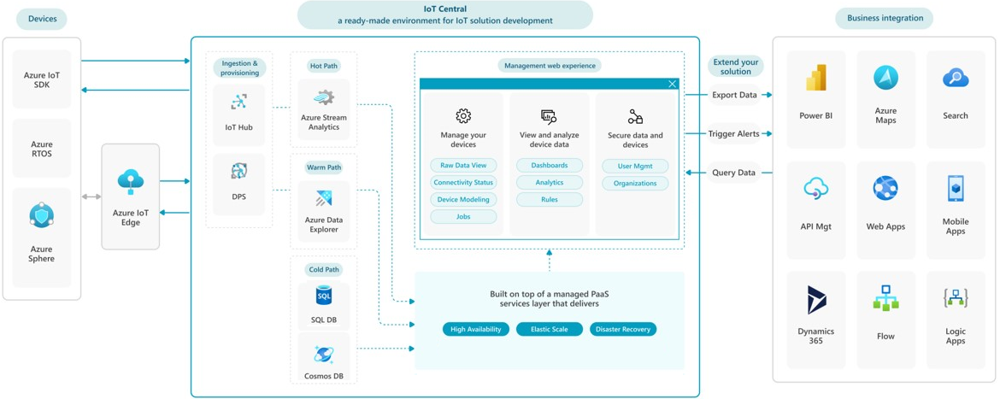
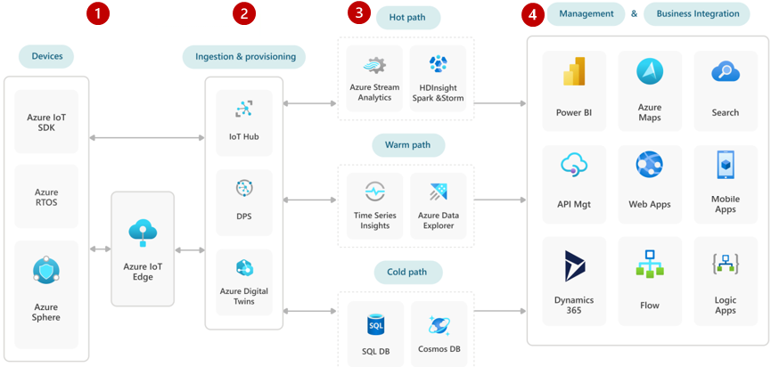

This article compares using [Azure IoT Central](https://azure.microsoft.com/services/iot-central) versus individual Azure platform-as-a-service (PaaS) components for building, deploying, and managing internet-of-things (IoT) solutions.

IoT solutions use a combination of technologies to connect devices, events, and actions through cloud applications. The technologies and services you choose depend on your scenario's development, deployment, and management requirements.

The IoT Central application platform-as-a-service (aPaaS) already provides the integrated Azure components and capabilities that an IoT solution needs. Another option is to combine [Azure IoT Hub](https://azure.microsoft.com/services/iot-hub) with other Azure PaaS components to develop your own IoT solutions.

## Start with Azure IoT Central

IoT Central is a Microsoft aPaaS that assembles Azure PaaS components into an extensible, fully managed IoT app development and operations platform. IoT Central accelerates solution development, streamlines operations, and simplifies building reliable, scalable, and secure IoT solutions.

IoT Central offers:

- An out-of-the-box web user experience (UX) and API surface area that simplifies device management and rule creation.
- Extension of IoT intelligence into line-of-business applications to help act on insights.
- Built-in disaster recovery, multitenancy, global availability, and a predictable cost structure.

The following diagram shows an IoT Central-based architecture:

1. IoT Central ingests device events and telemetry through the [Azure IoT device SDKs](/azure/iot-develop/about-iot-sdks), [Azure RTOS](https://azure.microsoft.com/services/rtos), [Azure Sphere](https://azure.microsoft.com/services/azure-sphere), or [Azure IoT Edge](https://azure.microsoft.com/services/iot-edge).

1. IoT Central is built with multiple Azure PaaS services, so it provides the following capabilities out of the box:
   - Data ingestion and provisioning services.
   - Hot, warm, and cold path data storage and analytics.
   - A managed PaaS layer that delivers High Availability/Disaster Recovery (HADR) and elastic scaling.
   - A management web user experience that lets you:
     - Manage devices with raw data view, connectivity status, device modeling, and jobs.
     - View and analyze device data with dashboards, analytics, and rules.
     - Secure data and devices with user management and organizations.

1. IoT Central extends solutions by triggering alerts, exporting data, and supporting data queries.

1. IoT Central integrates with line-of-business apps like Power BI, Azure Maps, Search, API Management, Web Apps, Mobile Apps, Dynamics 365, Flow, or Logic Apps.

## Build with Azure PaaS services

If you need more control and customization, you can use individual Azure PaaS components to build an IoT solution. The following diagram shows Azure services in a PaaS-based IoT architecture:

1. IoT systems can ingest device data through the Azure IoT device SDKs, Azure RTOS, Azure Sphere, or Azure IoT Edge.

1. IoT Hub, [Azure IoT Hub Device Provisioning Service (DPS)](/azure/iot-dps), or [Azure Digital Twins](https://azure.microsoft.com/services/digital-twins) can provide device provisioning, connectivity, and management.

1. For data storage and analytics:

   - The hot path can be through [Azure Stream Analytics](https://azure.microsoft.com/services/stream-analytics) or [Azure HDInsight](https://azure.microsoft.com/services/hdinsight).
   - The warm path can be through [Azure Data Explorer](https://azure.microsoft.com/services/data-explorer).
   - The cold path can be through [Azure SQL Database](https://azure.microsoft.com/products/azure-sql/database) or [Azure Cosmos DB](https://azure.microsoft.com/services/cosmos-db).

1. Management and business integration services can include Power BI, Azure Maps, Search, API Management, Web Apps, Mobile Apps, Dynamics 365, Flow, and Logic Apps.

For a detailed PaaS IoT reference architecture and discussion, see [Azure IoT reference architecture](../../reference-architectures/iot.yml).

## Compare aPaas and PaaS approaches

IoT Central lets you avoid maintaining and updating a complex and evolving IoT infrastructure. You can focus time and money on transforming your business and designing innovative offerings.

If your solution requires customized features or services that IoT Central doesn't support, you can develop a PaaS solution with IoT Hub as a core element.

The following comparison tables and links can help you decide whether to use an IoT Central managed solution or build a PaaS solution with IoT Hub.

### IoT Central vs. IoT Hub-based PaaS solution

The following table describes how IoT Central or an IoT Hub-based PaaS solution achieve various IoT features and capabilities.

| Feature | IoT Central | IoT Hub-based PaaS |
|---|---|---|
| Description | Fully managed aPaaS solution that simplifies device connectivity and management at scale.  An aPaaS-based solution is scalable, repeatable, and reliable, with a tradeoff of being less customizable than a PaaS-based solution. | Uses IoT Hub as a central message hub between the IoT application and the devices it manages. Adds more functionality with other Azure PaaS services.  This approach is more flexible, but requires greater development and management effort.|
| Application development | IoT Central is an application platform with support for repeatability of solutions. For more information, see the [IoT Central application administration guide](/azure/iot-central/core/overview-iot-central-admin)  [Application templates](/azure/iot-central/core/concepts-app-templates) help kick-start IoT solution development. Use a generic application template, or a prebuilt industry-focused template for [retail](/azure/iot-central/retail/overview-iot-central-retail), [energy](/azure/iot-central/energy/overview-iot-central-energy), [government](/azure/iot-central/government/overview-iot-central-government), or [healthcare](/azure/iot-central/healthcare/overview-iot-central-healthcare). | Design and build your own application solution by using IoT Hub and other PaaS services. |
| Device template | Device templates help structure device type characteristics and behaviors. Use the templates for supported device management tasks and visualizations. | Define and manage device message templates in a private repository. |
| Device management | Built-in Azure IoT Device Provisioning Service (DPS) capabilities provide [device integration and device management](/azure/iot-central/core/overview-iot-central#manage-your-devices). | Design and build solutions by using IoT Hub primitives, such as device twin and direct methods. Enable DPS separately. |
| OPC UA protocol | Not supported. | Use OPC Publisher to bridge the gap between OPC UA–enabled industrial assets and Azure hosted resources by publishing telemetry data to IoT Hub. OPC Publisher supports IEC62541 OPC UA PubSub standard format and other formats. For more information, see [Microsoft OPC Publisher](https://github.com/Azure/iot-edge-opc-publisher). |
| SigFox and LoRaWAN protocols | Use [Azure IoT Central Device Bridge](https://github.com/Azure/iotc-device-bridge#azure-iot-central-device-bridge) or [Azure IoT Edge LoRaWAN Starter Kit](https://github.com/Azure/iotedge-lorawan-starterkit). | Create a custom module for Azure IoT Edge, and integrate it through Azure IoT Hub. |
| Multi-tenancy | [Organizations](/azure/iot-central/core/howto-create-organizations) enable in-app multi-tenancy. You can define a hierarchy to manage which users can see which devices in the IoT Central application. | Achieve multi-tenancy by using separate hubs per customer. You can also build access control into the solution's data layer. |
| Message retention | IoT Central retains data on a rolling, 30-day basis. | IoT Hub allows data retention in built-in event hubs for a maximum of seven days. |
| Big data | Manage data from within IoT Central. | Add and manage big data Azure PaaS services. |
| Data export | Continuously export data by using the [export feature](/azure/iot-central/core/howto-export-to-blob-storage). Export data to Azure blob storage, event hubs, service bus, webhook, and Azure Data Explorer. Filter, enrich, and transform messages on egress. | Use the IoT Hub built-in event hub endpoint, and use message routing to export data to other storage locations. |
| Analytics | An integrated analytics experience explores device data in the context of device management. | Use separate Azure PaaS services to incorporate analytics, insights, and actions, like Stream Analytics, Azure Data Explorer, and Azure Synapse. |
| Visualizations | A UX makes it simple to visualize device data, perform analytics queries, and create custom dashboards. | No built-in user interface. |
| Rules and actions | Use built-in rule and action processing capability with email notification, Azure Monitor group, Power Automate, and webhook actions. For more information, see [Azure IoT Central rules and actions](/azure/iot-central/core/overview-iot-central#rules-and-actions). | Send data from IoT Hub to Azure Stream Analytics or Azure Event Grid. Connect to Azure Logic apps or other custom applications to process rules and actions. For more information, see [IoT remote monitoring and notifications with Azure Logic Apps](/azure/iot-hub/iot-hub-monitoring-notifications-with-azure-logic-apps). |
| Scalability | Supports autoscaling. For more information about IoT Central scale limits and autoscaling, see [Quotas and limits](/azure/iot-central/core/concepts-quotas-limits).| Deploy solutions to enable IoT Hub autoscaling. For more information, see [Auto-scale your Azure IoT Hub](/samples/azure-samples/iot-hub-dotnet-autoscale/iot-hub-dotnet-autoscale/). |
| High Availability and Disaster Recovery (HADR)| Manages built-in HADR capabilities automatically. For more information, see [Azure IoT Central scalability and high availability](/azure/iot-central/core/concepts-faq-scalability-availability). | Design your solution to support multiple HADR scenarios. For more information, see [Azure IoT Hub high availability and disaster recovery](/azure/iot-hub/iot-hub-ha-dr). |
| Service Level Agreement (SLA) | Guarantees 99.9% connectivity. For more information, see [SLA for Azure IoT Central](https://azure.microsoft.com/support/legal/sla/iot-central). | IoT Hub standard and basic tiers guarantee 99.9% uptime. The IoT Hub free tier has no SLA. For more information, see [SLA for Azure IoT Hub](https://azure.microsoft.com/support/legal/sla/iot-hub/v1_2). |
| Pricing | The first two active devices are free, if their message volume doesn't exceed 800 (Standard Tier 0 plan), 10,000 (Standard Tier 1 plan), or 60,000 (Standard Tier 2 plan) per month. Added device pricing is prorated monthly. IoT Central counts and bills the highest number of active devices each hour. For more information, see [Azure IoT Central pricing](https://azure.microsoft.com/pricing/details/iot-central). | For details about IoT Hub pricing, see [Azure IoT Hub pricing](https://azure.microsoft.com/pricing/details/iot-hub). |

### IoT Central and other Azure PaaS capabilities

The following table shows the level of support for various capabilities in IoT Central and other Azure PaaS services. A filled circle 🔵 means full support, a line ➖ indicates partial support, and an empty circle ⚪ means no support.

|  |IoT Central|IoT Hub + DPS|Stream Analytics + Azure Functions|Azure Cosmos DB + Azure Data Explorer|Active Directory|
|--|--|--|--|--|--|
|**Description**|Ready-made IoT solution development environment|IoT data ingestion services|Stream processing services|Data storage services|Universal identity management and security platform|
|**HADR and elastic scale**|🔵|⚪|⚪|⚪|⚪|
|**Device connectivity management experience**|🔵|➖|⚪|⚪|⚪|
|**Data routing, filtering, and rules**|➖|➖|➖|⚪|⚪|
|**Analytics and visualizations**|➖|⚪|➖|🔵|⚪|
|**Data storage and security**|🔵|⚪|⚪|🔵|🔵|
|**Export and integration with other services**|🔵|🔵|🔵|🔵|🔵|

## Next steps

- [Azure IoT Central overview](/azure/iot-central/core/overview-iot-central)
- [Azure IoT Hub overview](/azure/iot-hub/about-iot-hub)
- [Device management with Azure IoT Hub](/azure/iot-hub/iot-hub-device-management-overview)
- [Azure IoT Hub high availability and disaster recovery](/azure/iot-hub/iot-hub-ha-dr)
- [Azure IoT Hub SDKs](/azure/iot-hub/iot-hub-devguide-sdks)
- [IoT technologies and protocols](https://azure.microsoft.com/overview/internet-of-things-iot/iot-technology-protocols)
- [IoT remote monitoring and notifications with Azure Logic Apps](/azure/iot-hub/iot-hub-monitoring-notifications-with-azure-logic-apps)

## Related resources

- [IoT conceptual overview](introduction-to-solutions.yml)
- [Azure IoT reference architecture](../../reference-architectures/iot.yml)
- [IoT and data analytics](../data/big-data-with-iot.yml)
- [Azure Industrial IoT guidance](../../guide/iiot-guidance/iiot-architecture.yml)
- [Vision AI with Azure IoT Edge](../../guide/iot-edge-vision/index.md)
- [Retail buy online, pick up in store (BOPIS)](./vertical-buy-online-pickup-in-store.yml)
- [Environment monitoring and supply chain optimization with IoT](../../solution-ideas/articles/environment-monitoring-and-supply-chain-optimization.yml)
- [Blockchain workflow application](https://azure.microsoft.com/updates/action-required-migrate-your-azure-blockchain-service-data-by-10-september-2021)
- [IoT using Azure Cosmos DB](../../solution-ideas/articles/iot-using-cosmos-db.yml)
- [IoT Edge railroad maintenance and safety solution](../predictive-maintenance/iot-predictive-maintenance.yml)
- [Predictive maintenance for industrial IoT](../../solution-ideas/articles/iot-predictive-maintenance.yml)
- [Project 15 sustainability open platform](../../solution-ideas/articles/project-15-iot-sustainability.yml)
- [IoT connected light, power, and internet](../../solution-ideas/articles/iot-power-management.yml)
- [Condition monitoring for industrial IoT](../../solution-ideas/articles/condition-monitoring.yml)
