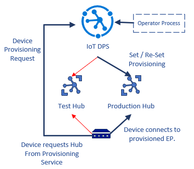

This article includes a list of items you should consider when moving an IoT solution to a production environment.

## Use deployment stamps

Stamps are discrete units of core solution components that support a defined number of devices. Each copy is called a *stamp*. or *scale unit*. For example, a stamp might consist of a set device population, an IoT Hub, an Event Hub or other routing endpoint, and a processing component. Each stamp supports a defined device population. You choose the maximum number of devices the stamp can hold. As the device population grows, you add stamp instances rather than independently scaling up different parts of the solution.

If instead of adding stamps, you move a single instance of your IoT solution to production, you might encounter the following limitations:

- **Scale limits:** Your single instance can encounter scaling limits. For example, your solution might be using services that have limits on the number of inbound connections, host names, TCP sockets, or other resources.

- **Non-linear scaling or cost:** Your solution components may not scale linearly with the number of requests made or the amount of data ingested. Instead, for some components, there might be a decrease in performance or increase in cost once a threshold has been met. Scaling up with more capacity might not be as good a strategy as scaling out by adding stamps.

- **Separation of Customers:** You may need to keep certain customers' data isolated from other customers' data. Similarly, you may have some customers that require more system resources to service than others, and consider grouping them on different stamps.

- **Single and multi-tenant instances:** You might have some large customers who need their own independent instances of your solution. You might also have a pool of smaller customers who can share a multi-tenant deployment.

- **Complex deployment requirements:** You might need to deploy updates to your service in a controlled manner and deploy to different stamps at different times.

- **Update frequency:** You might have some customers who are tolerant of having frequent updates to your system, while others might be risk-averse and want infrequent updates to your service.

- **Geographical or geopolitical restrictions:** To reduce latency or comply with data sovereignty requirements, you can deploy some of your customers into specific regions.

To avoid the preceding issues, consider grouping your service into multiple stamps. Stamps operate independently of each other and can be deployed and updated independently. A single geographical region may contain a single stamp, or may contain multiple stamps to allow for horizontal scale-out within the region. Each stamp contains a subset of your customers.

> [!div class="nextstepaction"]
> [Scale IoT solutions with stamps](/azure/architecture/example-scenario/iot/application-stamps)

## Use back-off when a transient fault occurs

All applications that communicate with remote services and resources must be sensitive to transient faults. This is especially the case for applications that run in the cloud, where the nature of the environment and connectivity over the internet means these types of faults are likely to be encountered more often. Transient faults include:

- Momentary loss of network connectivity to components and services
- Temporary unavailability of a service
- Timeouts that arise when a service is busy
- Collisions caused when devices transmit simultaneously

These faults are often self-correcting, and if the action is repeated after a suitable delay it is likely to succeed. Determining the appropriate intervals between retries is, however, difficult. Typical strategies use the following types of retry intervals:

- **Exponential back-off**. The application waits a short time before the first retry, and then exponentially increasing times between each subsequent retry. For example, it may retry the operation after 3 seconds, 12 seconds, 30 seconds, and so on.
- **Regular intervals**. The application waits for the same period of time between each attempt. For example, it may retry the operation every 3 seconds.
- **Immediate retry**. Sometimes a transient fault is brief, perhaps due to an event such as a network packet collision or a spike in a hardware component. In this case, retrying the operation immediately is appropriate because it may succeed if the fault has cleared in the time it takes the application to assemble and send the next request. However, there should never be more than one immediate retry attempt, and you should switch to alternative strategies, such as exponential back-off or fallback actions, if the immediate retry fails.
- **Randomization**. Any of the preceding retry strategies may include a randomization element to prevent multiple instances of the client sending subsequent retry attempts at the same time.

Avoid also the following anti-patterns:

- Implementations should not include duplicated layers of retry code.
- Never implement an endless retry mechanism.
- Never perform an immediate retry more than once.
- Avoid using a regular retry interval.
- Prevent multiple instances of the same client, or multiple instances of different clients, from sending retries at the same times.

> [!div class="nextstepaction"]
> [Transient fault handling](/azure/architecture/best-practices/transient-faults)

## Use zero-touch provisioning

Provisioning is the act of enrolling a device into Azure IoT Hub. Provisioning makes IoT Hub aware of the device and the attestation mechanism the device uses. You can use the [Azure IoT Hub Device Provisioning Service (DPS)](/azure/iot-dps/) or provision directly via IoT Hub Registry Manager APIs. Using DPS confers the benefit of late binding, which allows removing and reprovisioning field devices to IoT Hub without changing the device software.

The following example shows how to implement a test-to-production environment transition workflow by using DPS.

1. The solution developer links the Test and Production IoT clouds to the provisioning service.
1. The device implements the DPS protocol to find the IoT Hub, if it's no longer provisioned. The device is initially provisioned to the Test environment.
1. Since the device is registered with the Test environment, it connects there and testing occurs.
1. The developer re-provisions the device to the Production environment and removes it from the Test hub. The Test hub rejects the device the next time it reconnects.
1. The device connects and re-negotiates the provisioning flow. DPS now directs the device to the Production environment, and the device connects and authenticates there.

> [!div class="nextstepaction"]
> [Overview of Azure IoT Hub Device Provisioning Service](/azure/iot-dps/about-iot-dps#provisioning-process)

## Contributors

*This article is maintained by Microsoft. It was originally written by the following contributors.* 

Principal authors:

 - [Matthew Cosner](https://www.linkedin.com/in/matthew-cosner-447843225/) | Principal Software Engineering Manager
 - [Ansley Yeo](https://www.linkedin.com/in/ansleyyeo/) | Principal Program Manager
 
*To see non-public LinkedIn profiles, sign in to LinkedIn.*

## Next steps

- [Getting started with Azure IoT solutions](/azure/architecture/reference-architectures/iot/iot-architecture-overview)
- [IoT solutions conceptual overview](/azure/architecture/example-scenario/iot/introduction-to-solutions)
- [Azure Industrial IoT analytics guidance](/azure/architecture/guide/iiot-guidance/iiot-architecture)
- [Choose an Internet of Things (IoT) solution in Azure](/azure/architecture/example-scenario/iot/iot-central-iot-hub-cheat-sheet)
- [Azure IoT reference architecture](/azure/architecture/reference-architectures/iot)
