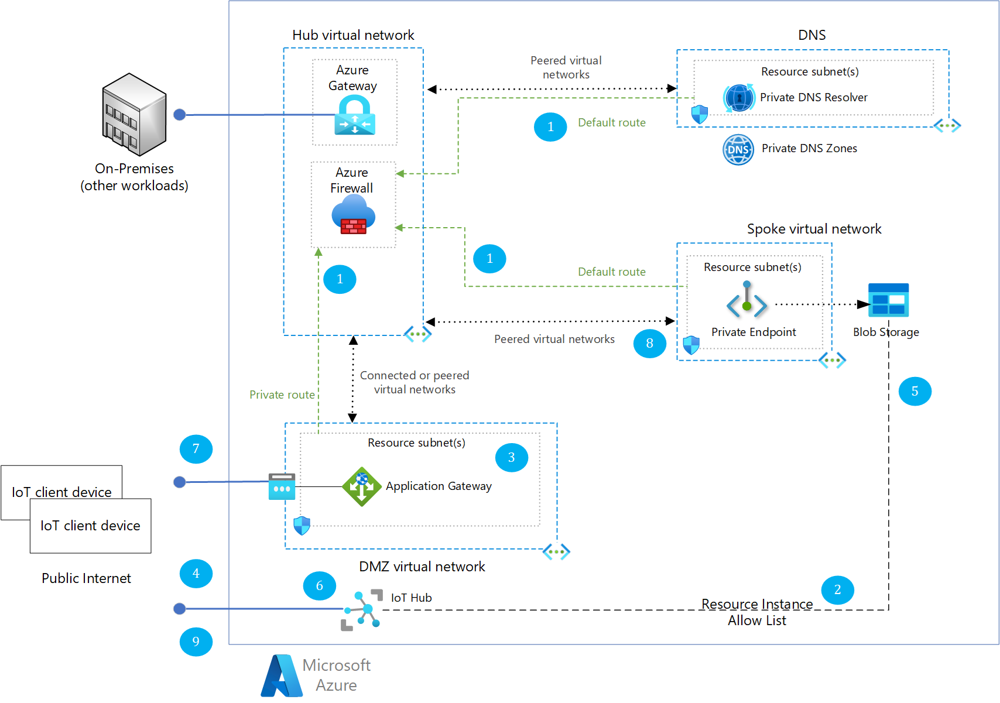

<!-- Use the aac-browse-header.yml -->

[!INCLUDE [header_file](../../../includes/sol-idea-header.md)]

In typical Azure IoT deployments, the client devices need to communicate directly with the Azure Storage account to upload files. So, the Storage account must allow incoming Internet traffic. However, for customers with stricter landing zone and networking requirements, a common practice involves restricting access to the Storage account from within a private network.
This solution proposes a strategy that blocks direct Internet traffic to the Storage account. Instead, only traffic routed through the inbound Application Gateway is permitted. Additionally, this setup allows for traffic inspection via Azure Firewall, providing an extra layer of security.

## Architecture

*Download a [Visio file](https://arch-center.azureedge.net/azure-iot-file-upload-private-network.vsdx) of this architecture.*

### Workflow

1. Storage account is configured to deny any public Internet access, so only private virtual network connections are allowed. An exception configured to allow a chosen Azure IoT Hub service to connect using resource [instance allow rule](https://learn.microsoft.com/azure/storage/common/storage-network-security?tabs=azure-portal#grant-access-from-azure-resource-instances) and Managed Identity authentication.
2. Application Gateway is configured with custom Domain Name Services (DNS) and Transport Layer Security (TLS) termination, and deployed into a Virtual Network. This Virtual Network is granted access or peered with the Virtual Network used by the Storage account's private link.
3. IoT client device using Azure IoT Hub SDK requests a SAS URI for File Upload to the IoT Hub.
4. Azure IoT Hub connects directly to the Azure Storage account with Managed Identity authentication. A short lived SAS URI is generated, containing the public domain name of the blob storage endpoint.
5. Azure IoT Hub sends the SAS URI with the public Storage account name to the IoT device.
6. IoT client device has logic to replace the public Storage URI with a custom domain it's supplied with, for example using a [Device Twin](/azure/iot-hub/iot-hub-devguide-device-twins). IoT Devices uses standard Azure Storage SDK to upload the file through the custom Storage domain.
7. Azure Application Gateway receives the HTTP POST from the client device and tunnels it through via Private Link to the Storage account. Optionally, going through Azure Firewall if configured.
8. When file upload is finished, IoT client device uses Azure IoT SDK to inform Azure IoT Hub of file upload completion.

### Components

- [Azure Application Gateway](/azure/well-architected/service-guides/azure-application-gateway)
- [Azure Firewall](/azure/well-architected/service-guides/azure-firewall)
- [Azure IoT Hub](https://azure.microsoft.com/products/iot-hub/)
- [Azure Private Link](https://learn.microsoft.com/azure/private-link/)
- [Azure Storage](/azure/well-architected/service-guides/storage-accounts/security)
- [Private DNS Zone](https://learn.microsoft.com/azure/dns/private-dns-overview)

## Scenario details

In regular deployments, because the Azure IoT client device needs to talk directly to the Storage account to upload the file. Disabling Internet traffic on the Storage account would automatically block any client IoT devices from uploading files.

Customers with more stringent networking requirements, enforced by their enterprise security teams, can benefit from a common practice of making the Azure Storage account accessible only from within a private network and inspect any inbound traffic through a firewall or gateway. Often the implementation is in the form of a [Hub-Spoke network topology](/azure/architecture/networking/architecture/hub-spoke).

Communication between the Azure IoT Hub and the Azure Storage account still goes through the public endpoint. This exception is possible through Azure Storage Networking configuration for Resource instances, which allows disabling public Internet access while allowing Azure Services and specific instances of resources to connect through the Azure backbone. It works in combination with Managed Identity.

The Azure IoT Hub needs to be assigned a managed identity, and this managed identity needs to be assigned the role of Storage Blob Data Contributor to the specified Storage account.

Azure Application Gateway acts as the entry point and load balancer for requests forwarded to the private endpoint of the Azure Storage account. The Application Gateway uses a Public IP address that can be mapped to an A record or CNAME at your custom DNS provider. Optionally, when implementing a Hub-Spoke networking topology, routing tables ensure traffic from Application Gateway passe through Azure Firewall for traffic inspection.

By implementing this scenario, customers with internal security requirements to use Private Endpoints for many Azure PaaS services have shorter validation cycles to deploy their IoT solutions in production.

For a sample that deploys a similar architecture, see [Setting up Azure IoT Hub File Upload to Azure Storage through Private Endpoint](https://github.com/Azure-Samples/azure-edge-extensions-iothub-fileupload-privatelink). This sample deploys a simulated IoT client device and shows usage of device twins for exchanging the custom domain name for the Storage account. It also contains more extensive documentation on setting up the architecture with Azure Firewall and a Hub-Spoke network topology.

### Potential use cases

An industrial automation vendor offers managed connected edge controllers and sensors. These sensors need to communicate with the Azure cloud through the public internet, but vendor's security team requires the Azure Storage account to be denied public internet access. This architecture approach solves this requirement.

The same use case can apply to any industry where devices need to communicate with an Azure Storage account that isn't exposed publicly.

## Contributors

*This article is maintained by Microsoft. It was originally written by the following contributors.*

Principal authors:

- [Katrien De Graeve](https://linkedin.com/in/katriendg) | "Software Engineer"
- [Vincent Misson](https://www.linkedin.com/in/vmisson/) | "Cloud Solution Architect"

Other contributors:

- [Nacim Allouache](https://www.linkedin.com/in/nacim-allouache) | "Cloud Solution Architect"

*To see non-public LinkedIn profiles, sign in to LinkedIn.*

## Next steps

- [Upload files with IoT Hub](/azure/iot-hub/iot-hub-devguide-file-upload)

## Related resources

Related architecture guides:

- [Hub-spoke network topology in Azure](/azure/architecture/networking/architecture/hub-spoke)
- [Industry specific Azure IoT reference architectures](/azure/architecture/reference-architectures/iot/industry-iot-hub-page)
