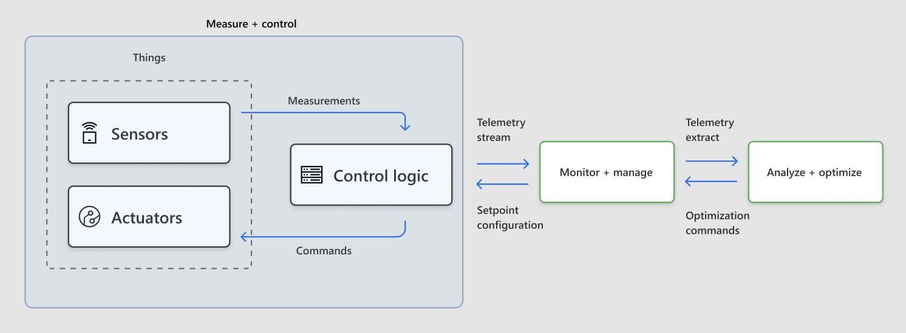

# Measure and Control Loop

## Intent 

To keep an IoT Thing within the tolerable range of the setpoint
configuration through a real time closed loop control process. The Thing
may be part of a larger [Cyber Physical
System](https://en.wikipedia.org/wiki/Cyber-physical_system) (CPS) which
may contain one or more networked Things.

## Motivation

An IoT Thing that is prone to disturbances from external events requires
a closed loop control process to keep it around its desired setpoint
configuration. The control logic inherent to the loop observes the Thing
through sensor metrics and takes corrective measures through actuator
actions. The following are instances of Measure and Control loops in
action:

-   Smart Mousetrap: trigger trap shut event when the sensors detect a
    mouse

-   Smoke Sensors: trigger sprinklers upon sensing smoke from multiple
    sensors

-   Power Transformer: shutdown a transformer under predicted severe
    thunderstorm

-   Gas Pipeline Monitor: open the valve to compensate for the pressure
    drop

-   Home Thermostat: increase the heater gas flow upon sensing the room
    temperature falling below the setpoint

-   Wind Turbine: apply brakes to slow down a rotor when it is about to
    reach the warning RPM threshold

-   Solar Panels: adjust solar panel angle as sun moves over the horizon
    to maximize the power generated

## Characteristics

-   **Deployment**: A Measure and Control Loop (MCL) runs close to the
    Thing or even embedded inside the Thing

-   **Cycle Time**: depending on the IoT scenario, this may be a few
    milliseconds in a time sensitive networking environment

-   **Autonomy**: the logic will not depend on any external systems to
    ensure low cycle time and operational autonomy. This loop may emit
    telemetry to be used by supervisory systems if they exist.

-   **Inputs**: this loop depends on setpoint configuration, last known
    sensor measurements and a small time series history of each
    measurement. Accepts commands from Monitor and Manage loop to adjust
    setpoint configuration as well as imperative commands to control
    actuators.

-   **Outputs**: if actuators are present, the control logic outputs
    actuator commands to maintain the Thing state around the setpoint
    configuration. The loop also emits telemetry for

-   **Networking**: for sensor metrics and actuator commands, this loop
    uses field bus protocols like Modbus, RS485, EtherCAT, SERCOS, etc.
    Optionally this loop may integrate with supervisory system through
    IoT protocols like HTTP, MQTT and AMQP.

## Structure

Measure and Control Loop (MCL) is scoped at a single Thing abstraction
that is composed of sensors, actuators and a controller. MCL may be
integrated with external Manage and Monitor and Analyze and Optimize
loops that operate a much larger context. The components are discussed
in detail below:

**Thing** in its simplest form, is composed of sensors, actuators and a
controller; all these components work in concert to make sure that the
Thing is operating as expected by the environment in which it is a part
of. Example things include wind turbines, washing machines, carwashes,
gas storage tanks, etc. The example setpoints include safe RPM of a wind
turbine, safe temperature and pressure of a gas tank, safe distance for
auto unlock of smart door lock, etc.

**Sensors** continually measure the current Thing conditions and report
them to the controller; the measurements may include temperature and
pressure of an natural gas storage tank, temperature and humidity in a
smart home, or rotor RPM and power generation rate of a wind turbine.
The sensor sampling rate depends on the function of the Thing;
slow-changing Things (e. g. large gas tank) need low frequency sampling
while the fast-changing Things (e. g. RPM of wind turbine) need high
frequency sampling.

**Actuators** are the physical components that will affect the current
state of the Thing; examples include inlet valve of a natural gas tank,
brake that slows down the rotor of a wind turbine, smart front door lock
that locks when the owner is away. The controller is responsible to
drive the actuators based on the sensor measurements and external
stimuli. Some sensing-only devices will not have any actuators and hence
that part of the loop is not needed.

**Control Logic** is responsible to keep the current state of a Thing
within the tolerable range of the desired state. The current state will
be computed from the sensor measurements; in the event of the current
state deviating from desired state, the controller will take corrective
actions by sending commands to the actuators. Such corrective actions
include the closing the valve of a natural gas tank, turning on the
heater in a home or applying brakes to a wind turbine rotor upon sensing
unsafe RPM. The Controller can emit telemetry and receive external
commands (from Manage and Monitor loop) as needed.

## Implementation

This pattern can be realized on Azure IoT using the following
implementations:

-   Measure and Control Loop with Azure IoT SDKs (link to be provided)

-   Measure and Control Loop with IoT Edge (link to be provided
