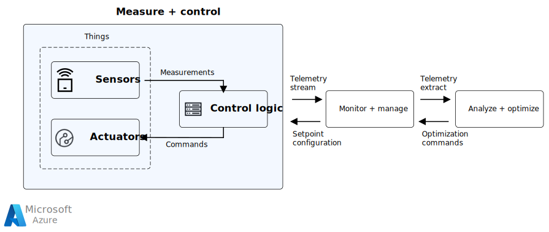

This article provides an overview of the measure and control process loop architecture, characteristics, and components.

## Architecture

*Download a [Visio file](https://arch-center.azureedge.net/measure-and-control.vsdx) of this architecture.*

A measure and control loop is scoped as a single device abstraction composed of sensors, actuators, and a controller. These loops may integrate with [analyze and optimize loops](analyze-optimize-loop.yml) and [monitor and manage loops](monitor-manage-loop.yml) that operate in a much larger context.

### Characteristics

A measure and control loop has the following characteristics:
- Runs close to the device or embedded inside the device.
- Has a cycle time depending on IoT scenario, which may be a few milliseconds in a time-sensitive networking environment.
- Takes input measurements depending on setpoint configuration, last known sensor measurements, and a small time series history of each measurement.
- Accepts commands from monitor and manage loops to adjust setpoint configuration, and imperative commands to control actuators.
- Implements actuator commands to maintain the device state around the setpoint configuration.
- Doesn't depend on any external systems to ensure low cycle time and operational autonomy.
- May emit telemetry to be used by supervisory systems.
- For sensor metrics and actuator commands, uses field bus protocols like Modbus, RS485, EtherCAT, and SERCOS.
- May integrate with supervisory systems like monitor and manage loops through IoT Hub protocols like HTTP, MQTT, and AMQP.

### Components

An IoT *thing* (device) is composed of sensors, actuators, and a controller. All three components work in concert to make sure that the device is operating in its environment as expected. Example devices include wind turbines, washing machines, car washes, and gas storage tanks. Example setpoints include safe RPM of a wind turbine, safe temperature and pressure of a gas tank, and safe distance for auto unlock of a smart door lock.

- **Sensors** continually measure current device conditions and report them to the controller. Example measurements include natural gas storage tank temperature and pressure, smart home temperature and humidity, or wind turbine rotor RPM and power generation rate. The sensor sampling rate depends on the function of the device. Slow-changing devices like large gas tanks need low frequency sampling, while fast-changing devices like wind turbines need high-frequency sampling.

- **Actuators** are the physical components that affect device state. Examples include the inlet valve of a natural gas tank, a brake that slows down the rotor of a wind turbine, or a smart front door lock that locks when the owner is away. The controller drives the actuators based on sensor measurements and external stimuli. Some sensing-only devices don't have any actuators, so that part of the loop isn't needed.

- **Control logic** keeps device state within the tolerable desired range. The current state is computed from sensor measurements. If the current state deviates from the desired state, the controller  takes corrective action by sending commands to the actuators. Examples of corrective actions include closing the valve of a natural gas tank, turning on a home heater, or applying brakes to a wind turbine rotor. The controller can also emit telemetry and receive external commands from monitor and manage loops as needed.

## Scenario details

An Internet-of-Things *measure and control loop* keeps an IoT device within the tolerable range of setpoint configuration, through a real-time, closed-loop control process. The device may be part of a larger physical system controlled by software that contains one or more networked devices.

An IoT device that is prone to disturbances from external events requires a closed-loop control process to keep it near its desired setpoint configuration. The measure and control loop *control logic* observes the device through *sensor* metrics and takes corrective measures through *actuator* actions.

## Potential use cases

This solution is ideal for the energy and environment industries. Examples of measure and control loops in action include:

- Smart mousetrap: Triggers a trap shut event when the sensors detect a mouse.
- Smoke sensors: Trigger sprinklers upon sensing smoke from multiple sensors.
- Power transformer: Shut down a transformer under a predicted severe thunderstorm.
- Gas pipeline monitor: Open a valve to compensate for a pressure drop.
- Home thermostat: Increase the heater gas flow upon sensing the room temperature falling below the setpoint.
- Wind turbine: Apply brakes to slow down a rotor when it is about to reach the warning RPM threshold.
- Solar panels: Adjust solar panel angle as the sun moves over the horizon to maximize the power generated.

## Contributors

*This article is maintained by Microsoft. It was originally written by the following contributors.* 

Principal author:

 - [Hanu Kommalapati](https://www.linkedin.com/in/hanuk/) | Principal Software Engineer
 
*To see non-public LinkedIn profiles, sign in to LinkedIn.*

## Related resources

- [Analyze and optimize loops](analyze-optimize-loop.yml)
- [Monitor and manage loops](monitor-manage-loop.yml)
