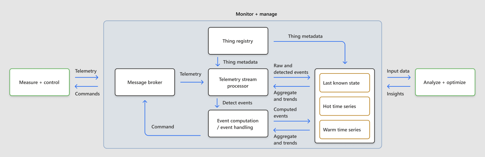

# Monitor and manage loops

An Internet-of-Things (IoT) *monitor and manage loop (MML)* is a supervisory system that continually monitors a [Cyber Physical System (CPS)](https://en.wikipedia.org/wiki/Cyber-physical_system) of networked IoT devices to make sure it's within the tolerable range of the desired state setpoint, and issues commands to control the system.

Multiple devices in a CPS system must act in concert to achieve and stay within the tolerable range of the desired state. The MML observes and correlates telemetry emitted by multiple devices, combines it with external inputs, and computes new insights. The MML then pushes the insights through a rules engine to deliver imperative actions and setpoint change actions against the relevant devices.

## Use cases

Some example scenarios for MMLs include:

- Smart garbage collection: Direct the truck to the route that has the most need for garbage collection.
- Smart campus: Issue campus evacuation alert upon fire detection in multiple buildings.
- Power distribution: Proactively shut down the power to multiple city blocks based on a high wind and rain forecast.
- Gas pipeline monitoring: Shut down a gas pumping station upon sensing pressure drops at multiple segments in a remote pipeline.
- Smart meters: Monitor power consumption and combine it with weather forecasts to automatically raise the setpoint of home thermostats, as part of a program to give discounts to frugal power consumers.
- Wind farm: Upon noticing a power factor drop in a wind farm, schedule the inspection of the suspect wind turbines.
- Process industries: Monitor and control crude oil cracking process in an oil refinery. Monitor and control paint and bulk chemical manufacturing.
- Discrete manufacturing: Monitor and control a widget inspection and packaging cell.

## Architecture

The IoT MML is a supervisory system that ensures that the CPS operates within operational thresholds. MML logic considers the perspectives of multiple devices to deduce current state. The process involves correlating hot telemetry signal trends from multiple devices, combining trends with previously-known warm time series history and enterprise system operational signals, and generating actuator commands or creating alarms.

## Characteristics

MMLs have the following characteristics:

- May be remote or close to the physical IoT devices. Premises that are remote by nature, like oil and gas pipelines, power transformers, smart doorbells, hazardous environments, and asset trackers can't accommodate MML loop infrastructure, so MML operates from remote facilities like public or private clouds. In process industries, like oil refining and chemical manufacturing, MMLs may be deployed closer to the devices. Discrete manufacturing may also deploy MML locally, as network downtimes can be costly.
- Depend on device-based [measure and control loops (MCLs)](measure-and-control-loop.md) for core monitoring and management processes.
- May integrate with other enterprise systems like ERP, CRM, PLM, and support systems to contextualize operations, but don't depend on those systems to work.
- Consume sensor telemetry streams and contribute to last known device state, hot time series cache, warm time series history, and aggregate rollups.
- Produce supervisory commands back to devices for conditions that need to be corrected.
- Compute dependent device states and provide event feeds for external systems.
- Primarily integrate with devices and enterprise systems over HTTP, MQTT, and AMQP network protocols.
- May have cycle times of a few seconds, depending on the IoT scenario. Network jitter can occur when using time-insensitive network protocols like MQTT, HTTP, and AMQP.

## Components

MMLs include the following components:

- **Message brokers** to process telemetry and send commands to devices.
- A **device registry**, or system of record and single truth for all IoT devices, to store metadata about devices and relationships among devices. The Telemetry Stream Processor uses registry information to understand telemetry message structure and parse and execute stream processing logic. The message broker uses the registry to validate device connection requests and make message routing decisions. Event handling logic uses entity metadata to ensure that inputs, outputs, and processing logic conform to structural and semantic entity relationships and interactions.
- A **Telemetry Stream Processor (TSP)** to receive device telemetry, deduce individual device and device set status, and detect errors and deviations from the desired state. The TSP sends error conditions and aggregated or raw data points to appropriate event handlers and to hot and warm storage for further processing and recordkeeping.
- **Hot time series history**, high-speed in-memory or remote cache storage for the last known state of device metrics and a set of data points for detecting near real-time trends.
- **Warm time series history** for storing a few weeks of data points, to help correlate near real-time trends with longterm trends and sense potential deviations from the desired state. MMLs can also use indexed storage to pre-compute trends and make them available.
- **Event computation** to compute actionable business events by combining events from stream processors, last known device states, and near real-time trends from hot time series and warm time series if needed.
- A **rules engine** to consume and handle business events by adjusting desired device states through appropriate commands. The rules engine may also publish events and alarms to the monitoring console.
- A **monitoring console** to provide visual display and human intervention if necessary.

## See also
- [Measure and control loops](measure-and-control-loop.md)
- [Analyze and optimize loops](analyze-and-optimize-loop.md)
