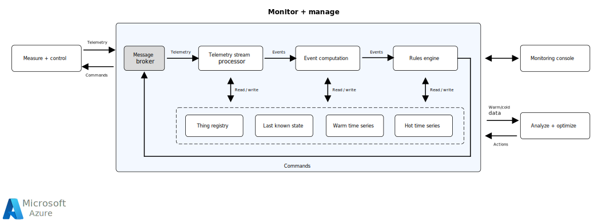

This article provides an overview of monitor and manage process loop architecture, characteristics, and components.

## Architecture

*Download a [Visio file](https://arch-center.azureedge.net/monitor-and-manage.vsdx) of this architecture.*

The IoT manage and monitor loop is a supervisory system that ensures that the system operates within operational thresholds. Multiple devices in a system must act in concert to achieve and stay within the tolerable range of the desired state. The manage and monitor loop observes and correlates hot telemetry signal trends from multiple devices to deduce current state. Logic combines these trends with warm time series history and enterprise system signals to compute new insights. The monitor and manage loop then pushes the insights through a rules engine to generate actuator commands or create alarms as necessary.

### Characteristics

Monitor and manage loops have the following characteristics:

- May be remote or close to the physical IoT devices. Premises that are remote by nature, like oil and gas pipelines, power transformers, smart doorbells, hazardous environments, and asset trackers can't accommodate this infrastructure. For these environments, monitor and manage loops operate from remote facilities like public or private clouds. In process industries, like oil refining and chemical manufacturing, monitor and manage loops might be deployed closer to the devices. Discrete manufacturing might also deploy these loops locally, as network downtimes can be costly.
- Depend on device-based [measure and control loops](measure-control-loop.yml) for core monitoring and management processes.
- Might integrate with other enterprise systems like enterprise resource planning (ERP), customer relationship management (CRM), product lifecycle management (PLM) and support systems to contextualize operations. Monitor and manage loops don't depend on those systems to work.
- Consume sensor telemetry streams and contribute to last known device state, hot time series cache, warm time series history, and aggregate rollups.
- Produce supervisory commands back to devices for conditions that need to be corrected.
- Compute dependent device states and provide event feeds for external systems.
- Primarily integrate with devices and enterprise systems over HTTP, MQTT, and AMQP network protocols.
- May have cycle times of a few seconds, depending on the IoT scenario. Network packet delay variance or *jitter* can occur when using time-insensitive network protocols like MQTT, HTTP, and AMQP.

### Components

Monitor and manage loops include the following components:

- **Message brokers** process telemetry and send commands to devices.
- A **device registry**, or system of record and single truth for all IoT devices, stores metadata about devices and relationships among devices. The Telemetry Stream Processor uses registry information to understand telemetry message structure and parse and execute stream processing logic. The message broker uses the registry to validate device connection requests and make message routing decisions. Event handling logic uses entity metadata to ensure that inputs, outputs, and processing logic conform to structural and semantic entity relationships and interactions.
- A **Telemetry Stream Processor (TSP)** receives device telemetry, deduces individual device and device set status, and detects errors and deviations from the desired state. The TSP sends error conditions and aggregated or raw data points to appropriate event handlers and to hot and warm storage for further processing and recordkeeping.
- **Hot time series history** is high-speed in-memory or remote cache storage that provides last known device metrics and a set of data points for detecting near real-time trends.
- **Warm time series history** stores a few weeks of data points, to help correlate near real-time trends with long-term trends and sense potential deviations from the desired state. Monitor and manage loops can also use indexed storage to pre-compute trends.
- **Event computation** computes actionable events by combining stream processor events, last known device states, near real-time trends from hot time series history, and warm time series history if necessary.
- A **rules engine** consumes and handles business events by adjusting desired device states through appropriate commands. The rules engine may also publish events and alarms to the monitoring console.
- A **monitoring console** provides visual display and human intervention if necessary.

## Scenario details

An Internet-of-Things (IoT) *monitor and manage loop* is a supervisory system that continually monitors a physical system controlled by a set of networked IoT devices. The monitor and manage loop makes sure the system is within the tolerable range of the desired state setpoint, and issues commands to control the system.

### Potential use cases

This solution is ideal for the energy, environment, manufacturing, education, facilities, and real-estate industries. Some example scenarios for monitor and manage loops include:

- Smart garbage collection: Direct the truck to the route that has the most need for garbage collection.
- Smart campus: Issue campus evacuation alert upon fire detection in multiple buildings.
- Power distribution: Proactively shut down the power to multiple city blocks based on a high wind and rain forecast.
- Gas pipeline monitoring: Shut down a gas pumping station upon sensing pressure drops at multiple segments in a remote pipeline.
- Smart meters: Monitor power consumption and combine it with weather forecasts to automatically raise the setpoint of home thermostats, as part of a program to give discounts to frugal power consumers.
- Wind farm: Upon noticing a power factor drop in a wind farm, schedule the inspection of the suspect wind turbines.
- Process industries: Monitor and control crude oil cracking process in an oil refinery. Monitor and control paint and bulk chemical manufacturing.
- Discrete manufacturing: Monitor and control a widget inspection and packaging cell.

## Contributors

*This article is maintained by Microsoft. It was originally written by the following contributors.* 

Principal author:

 - [Hanu Kommalapati](https://www.linkedin.com/in/hanuk/) | Principal Software Engineer

*To see non-public LinkedIn profiles, sign in to LinkedIn.*

## Related resources

- [Measure and control loops](measure-control-loop.yml)
- [Analyze and optimize loops](analyze-optimize-loop.yml)
