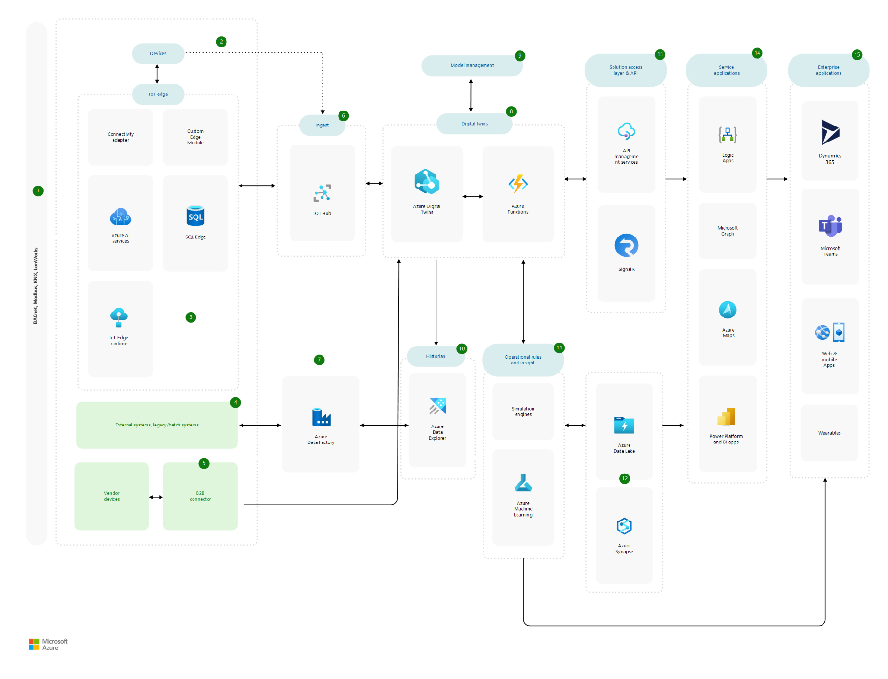

*Smart places* are physical environments that bring together connected devices and data sources. By using these environments, you can see and control:

- Products and systems
- Interior and exterior spaces
- Personal experiences with surroundings

Smart places can include buildings, college or corporate campuses, stadiums, and cities. They provide value by:

- Helping property owners, facility managers, and occupants operate and maintain spaces
- Making spaces more efficient, cost effective, comfortable, and productive

These environments work by digitally modeling the spaces and compiling relevant data. From that data, you can derive insights on how people, places, and devices are connected.

Add info as specified in template:

- A paragraph that describes what the solution does
- A paragraph that contains a brief description of the main Azure services that make up the solution.

## Business outcomes

In this example solution, a large commercial real estate owner is
digitally transforming its office property. This improvement combines
legacy facilities-management data with new features and technologies including:

- Occupancy sensing
- Café queue optimization
- Parking
- Shuttle services

This effort requires integrating *brownfield*, or legacy, devices and modern IoT devices that monitor the physical space. The brownfield devices communicate through common building transports such as BACnet and Modbus.

The company's goals include:

- Optimizing energy usage by diagnosing faults and streamlining field service management. This optimization integrates the existing building management system with devices.

- Deriving new spatial insights and offering innovative occupant experiences by connecting modern devices.

- Developing a cohesive digital model of the environment by bringing together multiple sources of data. The model should expand data analysis opportunities.

- Creating a scalable solution that can collect and archive millions of data points.

- Building a solution that can easily add partner solutions. The solution should also incorporate partner data into the environment's digital twin.

## Potential use cases

This solution applies to many areas:

- Smart campuses
- Facilities management
- Smart offices
- Energy optimization

## Architecture

Add sentence introducing diagram:

- The boxes that contain multiple icons represent categories of
services. Those services work independently or together to provide functionality.
- Arrows between boxes represent communication between the corresponding areas.

1. The environment uses any of these communication protocols:

   - Building Automation Controls network (BACnet)
   - Modbus
   - KNX
   - LonWorks

1. On-premises devices and systems send data and telemetry to the cloud. Data sources include:

   - Brownfield devices
   - Direct-connect sensors
   - Sensors that independent software vendors (ISVs) provide
   - Existing business systems

1. Devices, sensors, and actuators generate telemetry. Some devices interact directly with Azure IoT Hub. Other devices send data to IoT Hub through IoT Edge.

1. External, batch, or legacy systems send data to [Azure Data Factory](https://docs.microsoft.com/azure/data-factory/introduction). This static data typically originates in files and databases.

1. Business-to-business connectors translate and stream data bidirectionally between vendor components and Azure Digital Twins.

1. Azure IoT Hub ingests device telemetry. IoT Hub also provides these services:

   - Device-level security
   - Device provisioning services
   - Device twins
   - Command and control services
   - Scale out capabilities

1. Azure Data Factory transforms semi-static data and transfers it to Azure Data Explorer.

1. Data travels from IoT Hub to Digital Twins. Azure Digital Twins holds the spatial graph of the buildings and environment. Azure Functions processes the data, performing fault detection and graph updates.

1. Various components maintain the DTDL model:

   - For model creation, these options are available:

     - Azure Digital Twins Explorer
     - ISV solutions
     - Custom-built tools
     - Text or code editors

   - Repositories store *ontologies*, or pre-existing model sets:

     - GitHub stores [RealEstateCore](https://github.com/Azure/opendigitaltwins-building), the Smart Cities ontology, and the [Energy Grid ontology](https://github.com/Azure/opendigitaltwins-energygrid/).
     - For custom ontologies, customized repositories and solution-specific repos in GitHub are available.

   - For loading models into Azure Digital Twins, these options are available:

     - Model Uploader
     - Samples in the [Digital Twins tools repository](https://github.com/Azure/opendigitaltwins-tools)

1. Digital Twins sends the data through Azure Event Grid to Azure Data Explorer. This analytics service functions as a historian by storing the solution's time series data.

1. Simulation engines and AI tools process the data. Examples include Azure Cognitive Services, AI models, and partner simulation services.

1. Azure Data Lake provides long-term storage for the data. Azure Synapse Analytics offers reporting and high-level analysis functionality.

1. For visualization tools and enterprise apps, the solution access layer components provide secure access to core system services:

   - Azure API Management offers functionality for normalizing, securing, and customizing APIs. [maybe put nexgt sentence in Components] This platform also enforces usage quotas and rate limits.
   - SignalR sends notifications to UIs when telemetry and data changes.
   - For applications that exchange data asynchronously or at volume, various components provide publishing and subscribing mechanisms:

     - IoT Hub
     - Service Bus queues
     - Event Hubs
     - Web hooks

1. Service applications collect data from the access control API layer. These applications then analyze and prepare the data for end-user applications. Microsoft tools like Power Apps, Power BI, and Azure Maps create reports and insights on data in the Azure data stores.

1. Enterprise applications use the prepared data. Examples include:

   - Dynamics 365 modules
   - ISV solutions
   - Teams apps
   - Field-optimized solutions such as mobile apps and wearables:

     - [HoloLens](https://docs.microsoft.com/dynamics365/mixed-reality/remote-assist/overview-hololens)
     - [RealWear HMT](https://docs.microsoft.com/MicrosoftTeams/flw-realwear)

### Components

- [Azure IoT Hub][Azure IoT Hub] connects devices to Azure cloud resources. This managed service provides:

  - Device-level security
  - Device provisioning services
  - Device twins
  - Command and control services
  - Scale out capabilities

- [Azure IoT SDKs][Azure IoT SDKs] provide a way for devices to connect to IoT Hub. Devices that can use these kits include:

  - [Azure Sphere][Azure Sphere] devices
  - [Devices that run Azure RTOS][Overview of Azure IoT Device SDKs - Device capabilities]

- [Azure IoT Edge][Azure IoT Edge] runs cloud workloads on IoT Edge devices. Specifically, this central message hub can run [real-time analytics][What is Azure IoT Edge] through Machine Learning and Azure Stream Analytics. IoT Edge also functions as a [gateway][How an IoT Edge device can be used as a gateway] to IoT Hub for:

  - Devices with low-power requirements
  - Legacy devices
  - Constrained devices

- [Data Factory][Azure Data Factory] is an integration service that works with potentially large blocks of data from disparate data stores. You can use this platform to orchestrate and automate data transformation workflows. For instance, Data Factory can bridge the gap between semi-static stores and historian components like Azure Data Explorer.

- B2B connector translate & stream data bidirectionally between vendor devices/solutions and Azure Digital Twins. With a growing ecosystem of vendors using industry standard ontologies with Digital Twins Definition Language [(DTDL)](https://docs.microsoft.com/azure/digital-twins/concepts-models) such as [RealEstateCore](https://techcommunity.microsoft.com/t5/internet-of-things/realestatecore-a-smart-building-ontology-for-digital-twins-is/ba-p/1914794), these integrations will become simpler over time.

- [Azure Digital Twins](https://docs.microsoft.com/azure/digital-twins/overview) holds the spatial graph of the buildings and environment (rephrase). The environment is modeled with [Digital Twins Definition Language](https://github.com/Azure/opendigitaltwins-dtdl/blob/master/DTDL/v2/dtdlv2.md) (DTDL). Azure Digital Twins has a [REST API](https://docs.microsoft.com/rest/api/iothub/service/digitaltwin), currently the only way to ingest data. This documentation also includes SDK references for supported languages for control and data plane operations.  When using IoT Hub or Event Hub, there must be a service that pulls the data from the source and calls the [API to submit to Azure Digital Twins](https://docs.microsoft.com/azure/digital-twins/how-to-ingest-iot-hub-data). The [ontology](https://docs.microsoft.com/azure/digital-twins/concepts-ontologies) can be built from the ground up with DTDL, or start with industry supported models such as [RealEstateCore](https://github.com/azure/opendigitaltwins-building), [Smart Cities Ontology](https://github.com/Azure/opendigitaltwins-smartcities), or the [Energy Grid Ontology](https://github.com/Azure/opendigitaltwins-energygrid/).

- [Azure Functions](https://docs.microsoft.com/azure/digital-twins/how-to-create-azure-function?tabs=cli) processes the data, such as comparing it to other sensor data for fault detection, roll up information to related instances in the graph, etc. (eliminate redundancy with diagram step).

- [Azure Data Explorer](https://docs.microsoft.com/azure/data-explorer/data-explorer-overview).

- Azure Cognitive Services. functionality that happens either in near real-time, at certain data thresholds, by user demand, or that requires more sophisticated or longer running processing.

- AI models (check diagram for exact name) functionality that happens either in near real-time, at certain data thresholds, by user demand, or that requires more sophisticated or longer running processing.

- [Azure API Management](https://azure.microsoft.com/services/api-management/) offers services to normalize, secure, rate limit, and customize APIs (maybe remove some of that info from diagram steps).

- Service Bus queues provide a publish/subscribe mechanism for service applications that need to exchange data asynchronously and/or at volume.

- Event Hubs provide a publish/subscribe mechanism for service applications that need to exchange data asynchronously and/or at volume.

- [SignalR](https://docs.microsoft.com/azure/digital-twins/how-to-integrate-azure-signalr) updates UIs as telemetry and data changes (rephrase).

- Azure Digital Twins Explorer creates the DTDL model. Currently in public preview.

- Model Uploader is responsible for loading the model into Azure Digital Twins.

- Power Apps

- Power BI

- Azure Maps

- Azure Graph and check diagram for others

- Dynamics 365

- Teams apps

- [Azure Monitor](https://azure.microsoft.com/services/monitor/) can collect, analyze, visualize, and send notifications from the operational telemetry across the services.

- [Azure Defender for IoT](https://docs.microsoft.com/azure/defender-for-iot/overview) is a unified security service that works across Azure services to protect the solution.

- [Azure DevOps](https://azure.microsoft.com/services/devops/) is a set of services to manage the code, project, deployments that you need for a well-run development team. 

- [Azure Active Directory](https://azure.microsoft.com/services/active-directory/) is the core of Microsoft identity and security services, and is critical to integration with other cloud services, ISV solutions and on premises solutions.

- [Azure Key Vault](https://azure.microsoft.com/services/key-vault/) provides a safe store for keys and secrets across the full solution.

### Alternatives

-   [Azure
    CosmosDB](https://azure.microsoft.com/services/cosmos-db/) is
    another option that offers a fully managed NoSQL database service.
    It scales easily, and offers different interaction styles, including
    document database, graph database, SQL style query, Cassandra API
    and more. It also includes [a link for access from Azure
    Synapse](https://docs.microsoft.com/azure/cosmos-db/synapse-link),
    so all of these data services can be used in conjunction if
    requirements demand it.

-   [Azure Event
    Hubs](https://docs.microsoft.com/azure/iot-hub/iot-hub-compare-event-hubs)
    are also a viable ingestion service. Event Hubs differ from IoT Hub
    in that they facilitate one-way traffic, so they are great for
    ingestion but don't provide command and control communication.
    Event Hubs scale well and have strong security. Event Hubs differ
    from IoT Hub in that they do not offer device-level security, so
    are more appropriate when the solution has a high volume of
    messages from a low number of input devices.

## Considerations

The following considerations apply to this solution:

### Scalability considerations
Smart Places solutions range from relatively simple, low volume to sophisticated solutions with very high data volume (such as a solution that aggregates HVAC telemetry across a large campus.)   The core Azure services in this architecture are built to scale, but when they are integrated with one another to form a solution, the development team needs to ensure that they do not create unintentional choke points.  Avoiding these choke points is best addressed by having performance tests run at scheduled intervals to identify potential problems early in the development cycle.

### Flexibility considerations
Integration is mentioned in the article, but Smart Places solutions need to pay additional attention to building a solution that remains flexible.   Smart Places use cases are rapidly evolving, so new sensors, new data types, new Artificial Intelligence opportunities, and new visualization techniques will inevitably be required after initial deployment. The proposed architecture is loosely coupled which is a requirement for flexibility, the use of [industry standards for data ontology](https://docs.microsoft.com/azure/digital-twins/concepts-ontologies-adopt), will reduce the time to add new functionality and integrate new software, and the use of [Azure API Management](https://azure.microsoft.com/services/api-management/#overview) increases flexibility by providing a way to create multiple API styles and signatures to a single underlying API.

### Security considerations
Legacy building solutions often relied on a lack of external connectivity as the primary source of security.  In today’s world, even data that doesn’t identify people can still be used to draw conclusions about the business or the people in the building.   It is also common to use cameras to achieve use cases such as people counting, asset tracking, and security.  In these cases, be clear with specifics about where the images are processed, what gets saved and where, and ensure that the customer requirements for both privacy and use case are addressed. The bottom line on security for Smart Places solutions is that for all data, security must be top of mind throughout the data lifecycle.  Think about what is being collected, where it is being processed, where it will be stored, and what conclusions can be drawn from the collective set of data.

## Pricing
The [Azure pricing calculator](https://azure.microsoft.com/pricing/calculator/) can be used to estimate costs for an IoT solution. Other considerations are described in the Cost section in [Microsoft Azure Well-Architected Framework](https://docs.microsoft.com/azure/architecture/framework/cost/overview).

The [Azure IoT Reference Architecture](https://docs.microsoft.com/azure/architecture/reference-architectures/iot/) also has a discussion about how to optimize cost for several services commonly used in IoT solutions.

## Next steps
-	Learn [how Microsoft is powering their buildings with Azure Digital Twins](https://www.microsoft.com/itshowcase/blog/powering-microsoft-smart-buildings-with-microsoft-azure-digital-twins/)
-	[Learn more about Azure Digital Twins](https://docs.microsoft.com/learn/paths/develop-azure-digital-twins/)
-	[Learn how EDGE Next leverages Azure Digital Twins in their Smart Buildings platform](https://www.youtube.com/watch?v=sll7tJG1CcI)
-	[Brookfield Properties: real estate innovation with WillowTwin built on Azure Digital Twins](https://customers.microsoft.com/story/1373881459232543118-vasakronan-smartspaces-azure-iot)
-	[Vasakronan: sustainability and carbon neutrality with Idun ProptechOS built on Azure Digital Twins](https://customers.microsoft.com/story/1373881459232543118-vasakronan-smartspaces-azure-iot)

## Related resources

- [Get started with Azure IoT solutions][Getting started with Azure IoT solutions]
- [IoT solutions conceptual overview][IoT solutions conceptual overview]
- [Vision with Azure IoT Edge][Vision with Azure IoT Edge]
- [Azure Industrial IoT analytics guidance][Azure Industrial IoT Analytics Guidance]
- [Choose an Internet of Things (IoT) solution in Azure][Choose an Internet of Things (IoT) solution in Azure]
- [End-to-end manufacturing using computer vision on the edge][End-to-end manufacturing using computer vision on the edge]
- [COVID-19 safe environments with IoT Edge monitoring and alerting][COVID-19 safe environments with IoT Edge monitoring and alerting]
- [IoT analytics with Azure Data Explorer][IoT analytics with Azure Data Explorer]
- [Cognizant Safe Buildings with IoT and Azure][Cognizant Safe Buildings with IoT and Azure]

[Azure Data Factory]: https://docs.microsoft.com/azure/data-factory/introduction
[Azure Industrial IoT Analytics Guidance]: https://docs.microsoft.com/en-us/azure/architecture/guide/iiot-guidance/iiot-architecture
[Azure IoT Edge]: https://azure.microsoft.com/services/iot-edge
[Azure IoT Hub]: https://azure.microsoft.com/services/iot-hub
[Azure IoT SDKs]: https://docs.microsoft.com/azure/iot-hub/iot-hub-devguide-sdks
[Azure Sphere]: https://azure.microsoft.com/en-us/services/azure-sphere/
[Choose an Internet of Things (IoT) solution in Azure]: https://docs.microsoft.com/en-us/azure/architecture/example-scenario/iot/iot-central-iot-hub-cheat-sheet
[Cognizant Safe Buildings with IoT and Azure]: https://docs.microsoft.com/en-us/azure/architecture/solution-ideas/articles/safe-buildings
[COVID-19 safe environments with IoT Edge monitoring and alerting]: https://docs.microsoft.com/en-us/azure/architecture/solution-ideas/articles/cctv-iot-edge-for-covid-19-safe-environment-and-mask-detection
[End-to-end manufacturing using computer vision on the edge]: https://docs.microsoft.com/en-us/azure/architecture/reference-architectures/ai/end-to-end-smart-factory
[Getting started with Azure IoT solutions]: https://docs.microsoft.com/en-us/azure/architecture/reference-architectures/iot/iot-architecture-overview
[How an IoT Edge device can be used as a gateway]: https://docs.microsoft.com/azure/iot-edge/iot-edge-as-gateway?view=iotedge-2018-06
[IoT analytics with Azure Data Explorer]: https://docs.microsoft.com/en-us/azure/architecture/solution-ideas/articles/iot-azure-data-explorer
[IoT solutions conceptual overview]: https://docs.microsoft.com/en-us/azure/architecture/example-scenario/iot/introduction-to-solutions
[Overview of Azure IoT Device SDKs - Device capabilities]: https://docs.microsoft.com/en-us/azure/iot-develop/about-iot-sdks#device-capabilities
[Vision with Azure IoT Edge]: https://docs.microsoft.com/en-us/azure/architecture/guide/iot-edge-vision
[What is Azure IoT Edge]: https://docs.microsoft.com/azure/iot-edge/about-iot-edge?view=iotedge-2018-06)
