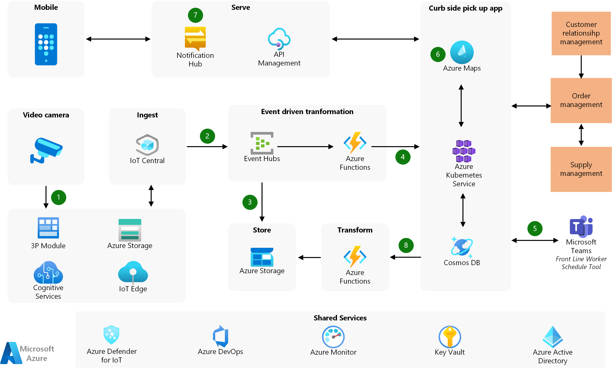

[!INCLUDE [header_file](../../../includes/sol-idea-header.md)]

Contoso is a European retailer operating mid-sized supermarkets. They have grown through the years and are now one of the largest retailers, with more than 1000 stores located in both cities and suburbs.

## Challenges faced

-   *What are the business challenges?*

With the recent COVID-19 pandemic, customers have been making fewer physical trips to the supermarkets as many are concerned with health risks and are practicing safe distancing. As a result, Contoso has also seen an increase in the usage of buy online, pickup in store (BOPIS) which is also known as curbside pickup.

In order to ensure that their customers get the freshest quality produce, Contoso starts packing temperature-controlled items when their customers arrive. Due to the rise in usage and time taken to pack fresh produce, there is a longer than usual waiting time for curbside pickup. These increased waiting times have caused an increased amount of customer dissatisfaction, and surveys have shown that customers are choosing to use other retailers.

Some questions to ask to help understand the challenges are:
-   *What is the estimated impact caused by these issues?*
-   *What are current operations like?*

## Potential use cases

-   *What are the desired business outcomes?*

With [**59% of consumers**](https://retailwire.com/discussion/is-curbside-pickup-just-getting-started/) polled saying they\'re likely to continue choosing curbside pickup even after the pandemic, Contoso wants to improve the efficiency of their curbside operations. For curbside pickups, Contoso needs information on how far away each customer is and when the customer arrives at the parking lot.

-   *What should the solution do for the business?*

The solution should provide alerts to the store associates and trigger a work order to start packing the fresh produce for customers that are near the outlet. This decreases customer-waiting time, improving a key aspect of the curbside pickup experience.

### Requirements

-   *What are key technical and non-technical requirements?*

When accessing data of customers' movements, Contoso must ensure personal privacy protection for their customers. This is an essential prerequisite as part of regulatory requirements.

There are cases where the vehicles license details do not match the database or that information is non-existent. To mitigate such data gaps, Contoso would like to use GPS to help them identify the location of their customers.

### Patterns to address challenges

-   *How can technology like Internet of Things (IoT) help solve your business challenges?*

The following table provides a summary of common use cases and corresponding IoT solutions. Each use case is an example of how an IoT process pattern can be applied to real-world scenarios.

| Use case | Solutions | Pattern
|---|---|---|
| Obtain license plate details and cross-reference that with the respective customer order when the vehicle turns into the parking lot. To alert store associate immediately to start packing and preparing the order. | Use video analytics to detect license plates when the vehicle turns into the parking lot.  This information is reconciled with order management system and a task is sent to Teams which alerts and schedules a store associate to start packing. | [Monitor and manage loop](./monitor-manage-loop.yml) - The video analytics is part of the monitoring layer and the insights are actioned by the store associates as part of the manage pattern. |
| Notify customer that store has started packing and will deliver the order soon. | When store associate starts task, system will cross-check with geofence rule of the customer location. A notification will be sent to the customer to let them know that their delivery is on the way when the system detects that the customer is in the boundaries of the geofence. | [Monitor and manage loop](./monitor-manage-loop.yml) - The geofence rule is monitoring the location of the customer and sending an alert when the customer is in the vicinity (manage)

## Architecture

1.  Video feed is obtained as cars come into the parking area. The IP camera hosting a Real-Time Streaming Protocol (RTSP) server sends the feed to Live View Analytics (LVA) module. The LVA module processes the frame rate and sends the image to Azure Cognitive Services running on the gateway. Azure Cognitive Services extracts only the license plate details and sends it to the cloud application.

2.  Azure IoT Central is used because it is a fully managed application platform. It allows Contoso to extend it easily and focus on features that directly impact the business.

3.  License plate details are queued via Event Hubs, which routes it to Azure Storage for long-term storage, which allows other services to use it.

4.  The license plate details are sent to the curbside pickup application via Azure Functions. The serverless design allows Contoso to lower their infrastructure management and cost.

5.  The license plate details are cross-referenced with the order management system. The order management system is usually integrated with the Customer Relationship Management system to provide details of the license plate. When a match is confirmed, the order packing task is sent to Microsoft Teams. A store associate will be notified to start preparing the order immediately and deliver it to the customer upon arrival.

6.  The curbside pickup application also uses Azure Maps geofence triggers based on rules to start the order packing. The triggers can be used to reconcile the license plate notification (described in the previous point) or it can be a standalone function in the absence of license plate information.

7. Once the store associate begins on the task, the application will send a notification to the customer to inform them of the order progress. Customers have mentioned that this is appreciated as it completes the communication loop with the customer and presents accountability in the process.

8. Order pickup details are written back into storage so that Contoso can understand the time taken to work on the order.

### Components

-   [Azure IoT Edge](https://azure.microsoft.com/services/iot-edge) runs analytics, applications on-premise to ensure low latency, lower bandwidth usage, and privacy (that is, to extract only the license plate details).

-   [Live Video Analytics](https://azure.microsoft.com/services/media-services/live-video-analytics) on IoT Edge offers the capability to capture, record, and analyze live video. This allows Contoso to focus on building features for the business, rather than managing the video processing pipeline.

-   [Azure Cognitive Services](https://azure.microsoft.com/services/cognitive-services) allows the AI model to run on the edge to adhere to privacy regulations and to lower the bandwidth required. Contoso can utilize the service without spending engineering efforts to create and train the model.

-   [Azure IoT Central](https://azure.microsoft.com/services/iot-central) is a fully managed application platform that reduces the burden and cost of developing, managing, and maintaining enterprise-grade IoT solutions.

-   [Event Hubs](https://azure.microsoft.com/services/event-hubs) is used to queue the events sent to the curbside pickup application. Event Hubs creates decoupling for consumption in a distributed application.

-   [Azure Storage](https://azure.microsoft.com/services/storage) is used to store raw data for analysis. Contoso has decided to use this service as they are storing the objects in a flat namespace.

-   [Azure Functions](https://azure.microsoft.com/services/functions/) is a serverless service used to process the events received. Without having to maintain the infrastructure, Contoso can write single function programs to send data from Event Hubs to the curbside pickup application API. It is also used to read the change feed in Cosmos DB to write data into Azure Storage.

-   [Azure Cosmos DB](https://azure.microsoft.com/services/cosmos-db/) provides a low-latency database with guaranteed availability and automatic scalability. Contoso requires low latency reads and write for seamless user experience. The curbside pickup application uses NoSQL document to store the data because of the variety in order SKU. As the application is available throughout Europe, Contoso wants a turn key database that provides multi-master read and write.

-   [Azure Kubernetes Service](https://azure.microsoft.com/services/kubernetes-service/).  The curbside pickup application is based on a microservice design.  It is built using a cluster of containers and managed a hosted Kubernetes service. The Kubernetes masters are managed by Azure. It handles critical tasks, like health monitoring and maintenance.

-   [Azure Maps](https://azure.microsoft.com/services/azure-maps/) provides geofencing as a service that gauges customer proximity. Contoso also uses Azure Maps for indoor mapping too.

-   [Azure Notification Hubs](https://azure.microsoft.com/en-us/services/notification-hubs/) is a massively scalable mobile push notification engine for quickly sending millions of notifications to iOS, Android, and Windows. Using this service, Contoso can easily broadcast notifications to their customers.

For more detailed discussions, see the [IoT reference architecture](../../reference-architectures/iot.yml) to understand and explore the various implementation choices available.

## Considerations

**Privacy**

Azure IoT Edge is selected as it's a runtime that allows the use and orchestration of container-based modules. The solution uses Azure Cognitive Services running on the edge device and only the license plate details are sent to the application. This process ensures that no facial images or privacy data are sent to  storage.

**Geofence**

The application uses Azure Maps, which allows Contoso to create geofence rules.  These rules provide another data point to confirm a customer's location. The geofence triggers provide additional accuracy on the estimated time of arrival.

## Next steps

For more details on implementations, take a look at some of these retail partner solutions:

* [Oneview Commerce](https://www.oneviewcommerce.com)
* [Ombori](https://ombori.com/)

## Related resources

* [IoT reference architecture](../../reference-architectures/iot.yml)
* [Getting started with Azure IoT solutions](/azure/architecture/reference-architectures/iot/iot-architecture-overview)
* [Scalable order processing](/azure/architecture/example-scenario/data/ecommerce-order-processing)
* [Magento e-commerce platform in Azure Kubernetes Service](/azure/architecture/example-scenario/magento/magento-azure)
* [E-commerce front end](/azure/architecture/example-scenario/apps/ecommerce-scenario)
