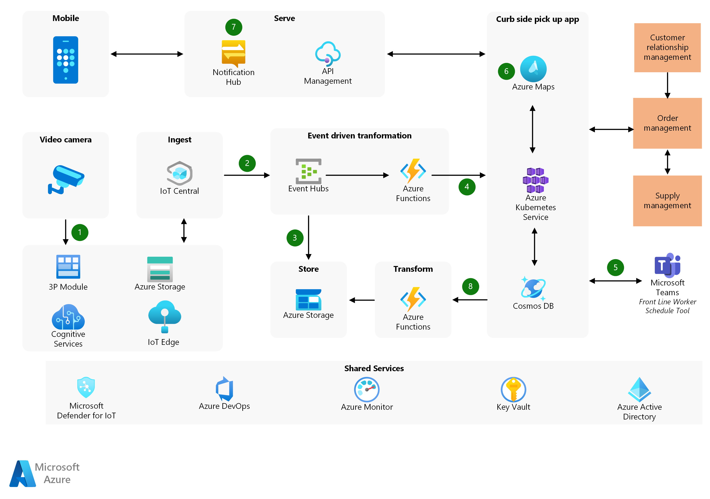

[!INCLUDE [header_file](../../../includes/sol-idea-header.md)]

This solution uses internet of things (IoT) technology to help reduce curbside pickup wait times in retail buy online, pick up in store (BOPIS) scenarios.

## Architecture

*Download a [Visio file](https://arch-center.azureedge.net/iot-vertical-buy-online-pickup-in-store.vsdx) of this architecture.*

### Workflow

1. The video feed shows cars coming into the parking area. The IP camera hosting a Real-Time Streaming Protocol (RTSP) server sends the feed to an Azure IoT Edge custom module that ingests the video and processes the frames. The module sends the images to Azure Cognitive Services running on the gateway.

   Azure Cognitive Services extracts only the license plate details and sends them to the cloud application. This process ensures that no facial images or privacy data are sent to storage.

1. Azure IoT Central ingests the data and sends it to Azure Event Hubs.

1. Event Hubs queues license plate details and routes them to Azure Storage for long-term storage, allowing other services to use the data.

1. Azure Functions sends the license plate details to the curbside pickup application. The serverless design reduces infrastructure management and costs.

1. The application cross-references the license plate details with the order management system, which integrates with the Customer Relationship Management (CRM) system. When it confirms a match, the application sends the order packing task to Microsoft Teams. Teams notifies a store associate to start preparing the order immediately and deliver it to the customer on arrival.

1. The curbside pickup application also uses Azure Maps geofence triggers based on rules to start the order packing. These rules provide another data point to confirm a customer's location and estimated time of arrival. The triggers reconcile the license plate notifications in the previous step, or can be standalone functions if there's no license plate information.

1. Once the store associate begins the packing task, the application sends a notification to the customer informing them of order progress. Customers appreciate these notifications because they complete the communication loop and provide accountability.

1. The application writes order pickup details back into storage so the company can understand the time taken to work on the order.

### Components

- [Azure IoT Edge](https://azure.microsoft.com/services/iot-edge) runs analytics applications on-premises to ensure low latency and lower bandwidth usage. The IoT Edge runtime allows the use and orchestration of container-based modules.

- [Azure Cognitive Services](https://azure.microsoft.com/services/cognitive-services) allows the AI model to run at the edge to lower required bandwidth and adhere to privacy regulations, such as extracting only license plate details. Contoso can use machine learning services without spending engineering efforts to create and train the model.

- [IoT Central](https://azure.microsoft.com/services/iot-central) is a fully managed application platform as a service (aPaaS) that extends easily to let companies focus on business priorities. IoT Central reduces the burden and cost of developing, managing, and maintaining enterprise-grade IoT solutions.

- [Event Hubs](https://azure.microsoft.com/services/event-hubs) queues the events sent to the curbside pickup application. Event Hubs creates decoupling for consumption in a distributed application.

- [Azure Storage](https://azure.microsoft.com/services/storage) stores raw data for analysis. The company uses this service to store the objects in a flat namespace.

- [Azure Functions](https://azure.microsoft.com/services/functions) is a serverless compute service for running single-function programs without having to maintain infrastructure. In this solution, Azure Functions processes the events from Event Hubs and sends the data to the curbside pickup application API. Azure Functions also reads the change feed in Azure Cosmos DB to write data into Azure Storage.

- [Azure Cosmos DB](https://azure.microsoft.com/services/cosmos-db) provides a low-latency database with guaranteed availability and automatic scalability. The curbside pickup application uses NoSQL documents to store the data, because of the variability in order SKUs.

- [Azure Kubernetes Service (AKS)](https://azure.microsoft.com/services/kubernetes-service) hosts the curbside pickup application. The application is a microservices design, built in a cluster of containers, and managed in a hosted Azure Kubernetes service. AKS handles critical tasks like health monitoring and maintenance.

- [Azure Maps](https://azure.microsoft.com/services/azure-maps/) provides geofencing as a service to gauge customer proximity. The company also uses Azure Maps for indoor mapping.

- [Azure Notification Hubs](https://azure.microsoft.com/services/notification-hubs) is a massively scalable mobile push notification engine for quickly sending millions of notifications to iOS, Android, and Windows devices. The company uses this service to easily broadcast notifications to their customers.

To understand and explore the various implementation choices available, see the [IoT reference architecture](../../reference-architectures/iot.yml).

## Scenario details

Contoso, a European retailer with over 1,000 mid-sized supermarkets in cities and suburbs, saw increased BOPIS usage by their customers. Increased BOPIS usage meant longer pickup wait times, which decreased customer satisfaction and caused some customers to choose other retailers. The company wanted to improve their BOPIS efficiency to decrease wait times and increase customer satisfaction.

To ensure that customers got the freshest produce, Contoso had previously started packing temperature-controlled items only after customers arrived for pickup. This practice contributed to long pickup wait times. Contoso developed a solution that alerts store associates and triggers work orders to start packing fresh produce when customers get near the store. By decreasing customer wait time, the solution improves a key aspect of the curbside pickup experience.

This solution had the following requirements:

- The system must gather information about how far away customers are, and when they arrive at the parking lot.
- Per regulatory requirements, the system must protect customers' personal privacy when storing and accessing data about their movements.
- If a vehicle's license plate details aren't present or don't match the database, the system should use GPS to help identify customer locations.
- Since the application is available throughout Europe, its database must provide multi-master read and write capabilities to ensure data consistency.
- Database reads and writes must be low latency, for a seamless user experience.

### Potential use cases

This solution is ideal for the retail and automotive industries. It's related to the following scenarios:

- Use video analytics and geofencing to get license plate details when vehicles are nearby.
- Cross-reference license plate details with customer order data, and trigger alerts and work orders.
- Notify customers about order progress.

## Next steps

- [Is curbside pickup just getting started?](https://retailwire.com/discussion/is-curbside-pickup-just-getting-started)
- [Ombori](https://ombori.com)
- [Avanade intelligent store](https://www.avanade.com/en/industry/retail/intelligent-store-whitepaper)

## Related resources

- [IoT reference architecture](../../reference-architectures/iot.yml)
- [Getting started with Azure IoT solutions](../../reference-architectures/iot/iot-architecture-overview.md)
- [Scalable order processing](../data/ecommerce-order-processing.yml)
- [Magento e-commerce platform in Azure Kubernetes Service](../magento/magento-azure.yml)
- [E-commerce front end](../apps/ecommerce-scenario.yml)
