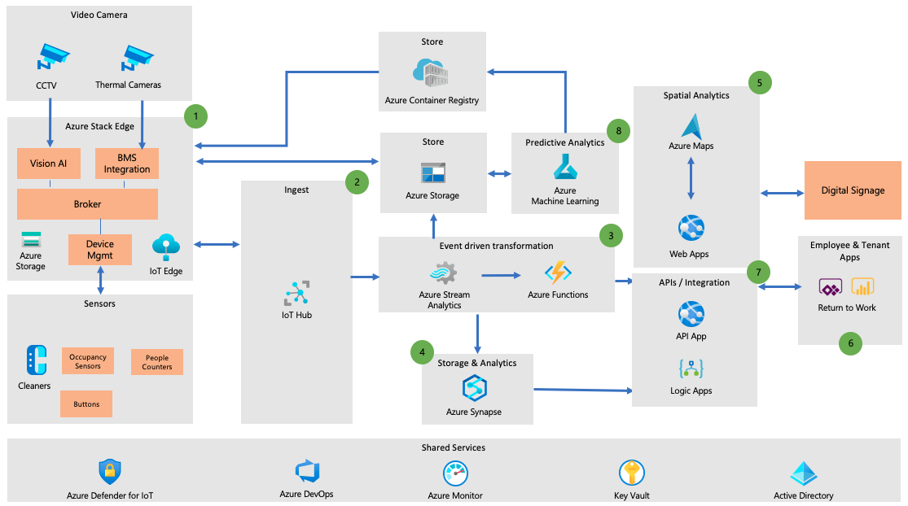

Many real-estate developers, owners, and operators are on a digital transformation journey. They are developing Smart Building / Smart Workplace digital solutions they can offer to their real estate customers. Feedback from customers and industry analysis shows there’s a demand to optimize workplace usage (space optimization) and increase employee satisfaction / experience within the workplace. The COVID-19 pandemic has also required many smart building solutions to quickly pivot and extend their digital solution to help tenants be safe once their buildings reopened for business.

## Challenges faced

Most buildings currently provide minimal employee engagement and space monitoring through basic Building Management System (BMS). There is a fundamental shift in how real-estate is used. This has started before COVID-19 and the crisis has accelerated this. End users of the space have different expectations which owners / operators of the space must respond. This encompasses increasing productivity and employee satisfaction by providing different experiences and lowering costs by optimizing space usage.

Some impact from the challenges are:

* Tenants and employees don’t have a sense of the safety of space as related to COVID-19
* Spaces are underutilized, driving up the Total Cost of Ownership (TCO) for customers. 
* Employee productivity and moral are impacted by a lack of spaces that meet the demands of a modern workforce.

## Business outcomes

* COVID-19 mitigation - Increase the number of people returning to the workplace while decreasing the risk of infection.
* Space Optimization - Identify underutilized spaces and how utilization differs. 
* Employee productivity, collaboration, and satisfaction - Identify spaces that correlate with poor employee productivity, mood, collaboration and satisfaction.
* Operating Efficiency - Drive lower energy usage, carbon footprint and TCO.

## Requirements

- Leveraging Platform-as-a-Service (PaaS) components whenever possible.  PaaS provides scaling, security, and performance optimizations as part of the managed offering. This allows solution developers to focus on solving business problems.
- Cloud services that can meet the unique requirements of Internet of Things scenarios such as: millions of devices, TB’ of data, and real-time insights.
- Hybrid capabilities will be needed to support on-premise hosting and processing requirements.
- Advanced analytical capabilities to derive insights from the massive amount of data collected and generated.

## Patterns to address challenges

-   *How can technology like Internet of Things (IoT) help solve your
    business challenges?*

The table below provides a summary of common use cases and corresponding IoT solutions. Each use case is an example of how an IoT process pattern can be applied real-world scenarios. 

| Use case | Solutions | Pattern
|---|---|---|
| Covid-19: Social Distancing, face mask detection, people counting | Use IoT Edge to run video inferencing locally against multiple video streams from a building. | [Monitor and manage loop](./monitor-manage-loop.yml) |
| Lobby & elevator queuing | Use IoT Edge to run video inferencing locally against multiple video streams from a building. | [Monitor and manage loop](./monitor-manage-loop.yml) |
| Thermal screening | Use IoT Edge to run third party software or integration code that collects data from thermal imaging cameras. | [Monitor and manage loop](./monitor-manage-loop.yml) |
| Bathroom density | Use IoT devices and IoT Hub routing to report on the number of people entering and leaving bathrooms. Use IoT hub to communicate the occupancy status to digital displays. | [Monitor and manage loop](./monitor-manage-loop.yml) |
| Cleaning request & tracking | Use IoT devices to report on the cleaning status of rooms and to allow occupants to request cleaning. | [Event routing](./event-routing.yml) |
| Spatial Analytics | Use Azure Indoor Maps, Video Analytics, and occupancy monitoring sensors analyze space usage especially conference rooms and common areas where groups congregate. | [Analyze and optimize](./analyze-optimize-loop.yml)

## Reference architecture

1. Local video feeds and devices send payload to IoT Edge modules (containers) running on Azure Stack Edge. Inference is done locally on the video and non-PII data is sent to the cloud for data analytics. Device data is also aggregated and optimized as needed at the edge.

2. IoT Hub receives all the data from the edge and can be scaled seamlessly to handle additional traffic.

3. Stream Analytics performs real-time analysis such as data aggregation.  Azure Functions are used to perform data manipulation and integration with complimentary solutions.

4. Data is stored in Azure Synapse which provides access via SQL and advanced analytics.

5. Spatial Analytics is done using Azure Maps and querying the data store.

6. API App and Logic Apps provide integration points and APIs to interface with the Smart Building solution.

7. PowerBI is used by tenants to monitor the building health. PowerApps are used to employees to risk of building and areas they plan to travel to.

8. Azure Machine Learning is used to train the models for predictive analytics.

## Architecture considerations

**Privacy**

Azure IoT Edge is used to run docker-compatible containers that perform inferencing on local video feeds. This process ensures that no facial images or privacy data are saved to storage or sent to the cloud.

**Performance**

Device-to-Cloud and Cloud-to-Device communication should be optimized to support the real-time insights and actions required for building safety.

## Components

-   [Azure Stack Edge](https://azure.microsoft.com/products/azure-stack/edge/)
    * A managed hardware that brings compute, AI and IoT to the Edge to assist with running AI modules the edge and identify mask compliance, social distancing, and people counting.
    * Provide the integration point for Thermal Imaging.
    * Decommission servers needed by on-premises 3rd party systems (like temperature scanning system, BMS, CCTV, etc.) and consolidate to Azure Stack Edge.

-   [Azure IoT Hub](https://azure.microsoft.com/services/iot-hub/)
    * Provides the scale needed to handle the devices and data streams that smart buildings will require.
    * Integration with Azure PaaS services to accelerate development time.

-   [Azure Functions](https://azure.microsoft.com/services/functions/)
    * Serverless platform that allows for dynamic scaling.
    * Supports a wide range of platforms which provides the ability to quickly and cost effectively integrate with a variety of 3rd party systems that enhance the solution e.g. Ility, VergeSense, Rigado ESL, etc.
    * The on-demand usage / cost model will help keep the cost of the solution low.

-   [Azure Stream Analytics](https://azure.microsoft.com/services/stream-analytics/)
    * Extract relevant data in real-time for storage.  This helps the solution deliver real-time insights.
    * Identify deviations and key activity from the data received in real-time so that building and safety staff can respond quickly.

-   [Azure Synapse](https://azure.microsoft.com/services/synapse-analytics/)
    * Provides SQL capabilities needed to store and query IoT data by the IoT infrastructure and the line-of-business applications. 
    * Meet the scaling demands of a Smart Building solution that must serve large real estate portfolios and support a variety of development platforms and use cases. 
    * Pprovides built-in analytics capabilities needed to power the operations and historical reporting dashboard of smart buildings.

-   [Azure Maps](https://azure.microsoft.com/services/azure-maps/)
    * The indoor mapping capabilities allow solution developers to provide wayfinding, room occupancy, and safety (clean) status of common areas to users and staff.

-   [Azure Web Apps](https://azure.microsoft.com/services/app-service/web/)
    * Azure App Service provides the ability to host Web applications and APIs as a managed service. This allows solution developers to quickly develop applications and focus on the business requirements, which is critical to support the rapidly changing Covid-19 pandemic.

-   [Azure Logic Apps](https://azure.microsoft.com/services/logic-apps/)
    * Logic Apps decrease the time it takes to develop business logic and integration with the large number of external systems that exist in a portfolio of buildings.

-   [Azure Machine Learning](https://azure.microsoft.com/services/machine-learning/)
    * Predictive models will be created using the data collected from the buildings.  These models will help with facility management and sales.

For more detailed discussions, see the IoT reference architecture
[document](../../reference-architectures/iot.yml) to understand and explore the various implementation choices
available.

## Next steps

For more details on implementations, take a look at some of these partner solutions. 

-   [RxWell by RXR](https://rxwell.rxrrealty.com/) is a comprehensive, public- health-based, data-driven program that considers every aspect of the COVID workplace experience. RxWell merges RXR’s physical and digital technology to ensure employees have the peace of mind to safely return to the workplace during the “new abnormal” and beyond.
-   [Rigado](https://www.rigado.com/) gateways and BLE beacons to provide people counting, track cleaning, and power digital signage.
-   [myDevices](https://mydevices.com/) provides LoRA connectivity and devices that enable solutions to be stood up quickly in locations where connectivity is a challenge and broad network coverage is needed.
-   [VergeSense](https://vergesense.com/) provides a sensor platform “as a service” that can easily integrate with 3rd party systems through their APIs.
-   [WillowTwin](https://www.willowinc.com/willowtwin/) provides a digital twin and a signle source of truth of all asset infomration. 
