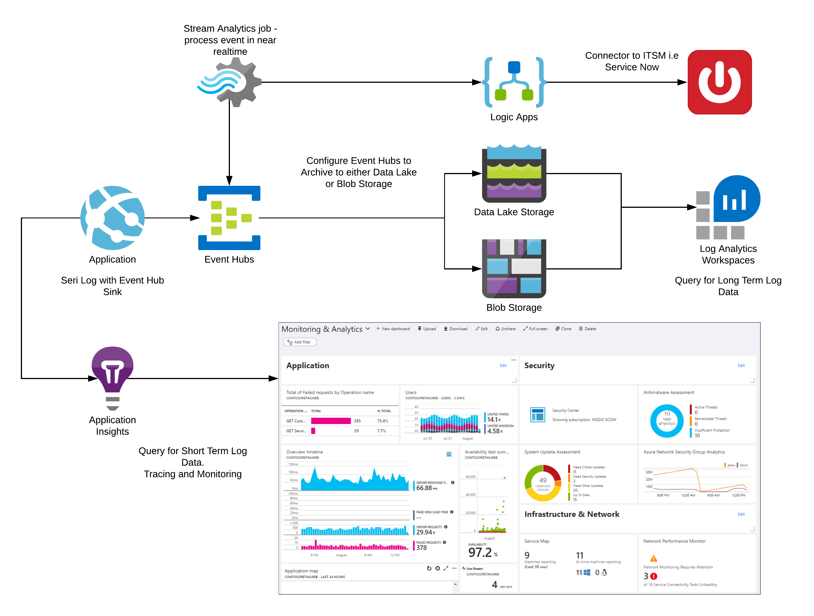
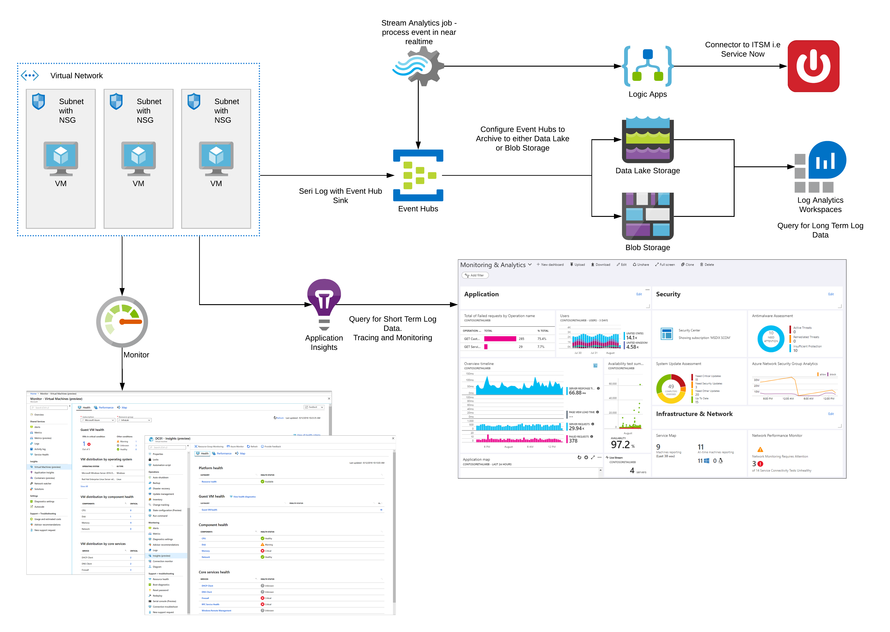

In a traditional on-premise application, most applications were written in a non distributed manner. The application was generally made up of a single executable and relevant dependencies. This executable would run under a single process space and would be installed onto a single virtual machine. If there were a need for additional performance, the application would be horizontally scaled across multiple machines. In each instance, logging and tracing and monitoring would be bound to the single process domain.

With the advent of the cloud and adoption, cloud-native development differs somewhat from the on-premise methodology.

Cloud-native applications, tend to be composed of one or more PaaS services built around the microservices architectural paradigm. This paradigm entails the creation of discrete, loosely-coupled microservices that work within their process boundary. This loosely distributed architecture brings many benefits:

* The application is composed of discrete services that are easier to build and simpler to maintain
* The Microservices focuses on business capabilities
* Microservices naturally work well with automated CI and CD Systems
* Microservices being naturally independent are more fault-tolerant to failures, i.e. a single service failure will not bring down the application
* Microservices can scale independently of each other and allow for better utilization and cost optimization

Wherever an application will run, there is always a possibility that during the application lifetime that failures, transient or otherwise will occur. When these events happen, teams need to know the following:

* Why did the application fail?
* When did the application exception occur?
* Which method caused the exception?
* What were the events recorded up to the point of application failure?
* Did this exception lead to potential data corruption?

To allow us to answer the above, we must rely on the process of logging, tracing and monitoring.

Logging is the ability to track and report related data in a centralized way. These log events can be used to track errors in code, application failures, or purely informational messages. Logging focuses on providing an overview of the state of an application execution through the use of discrete messages, or, events. Through these logs, we can put automation in place in which events can be read, and relevant parties can be notified if a criterion or threshold has been met.

Tracing, on the other hand, focuses on the continuous flow of the application. Tracing allows us to trace the program execution from beginning to end through the various methods and services while understanding the state and transitions of data.

Monitoring can, at times, be used to mean tracing or logging. However, monitoring is the process in which application instrumentation is used to provide metrics in which a user can reason about and thus make informed decisions. These metrics can be aggregated data from logs or trace events into a dashboard view that allows operations teams a holistic view of the application health from utilization to error count.

For single-process applications that traditionally run on-premises, logging and tracing is a relatively straightforward process. The application and its dependencies are deployed together, logging and tracing within a single execution context. All relevant calls within the application happen within the same process boundary, and there is no need to cross-application or process boundaries.

When developing cloud-native distributed applications, this can be a somewhat complicated endeavour at times. A cloud-native application, being distributed by design, a single request can interact with many microservices. Each microservice will generate its own set of logs from their specific task, and it becomes problematic to determine the process flow of execution.

Teams tend to process the log independently for each microservice, as services can handle hundreds of requests concurrently, this can become a laborious task of wading through logs and manually determining a correlation of events.

The following practices can be adopted in a distributed architecture to help overcome the problems of logging in a cloud native environment.

* All requests generated by the user application should have a unique identifier, typically called a correlation ID, for the request. This unique identifier should be passed through each microservice. Each microservice should be designed to accept this correlation ID as part of the request and all logs emitted by the service should contain the correlation ID.
* When the request is processed, and the response sent, the correlation ID should be returned as part of the response. The user application should then use the correlation ID when emitting its own logs.
* All logs should be emitted to a single hub and stored in a central repository.
  * If Audit logging is required, then it is best practice to store these security related events in a separate data store.
    * Audit log are generally required for compliance purposes in accordance with security and compliance guidelines.
* Log data should be structured using JSON.
* Logging operations should always be performed in an asynchronous manner. By performing logging asynchronously, it helps to reduce the overhead of the operation by delegating the call to a background task. The application does not need to await the results of the operation and thus is able to continue logical program flow. Logging frameworks should always be used first and foremost, engineering effort shouldn't always be expended in creating a logging system unless there is a clear business need. [Serilog](https://github.com/serilog) is one of the most popular open source logging frameworks, and provides considerable support for the Azure ecosystem through the use of community supported extensions.

Consideration should also be taken to ensure the common [logging levels](https://docs.microsoft.com/en-us/dotnet/api/microsoft.extensions.logging.loglevel?view=dotnet-plat-ext-3.1) are being used appropriately once the application has been deployed, as well as during development.

* Trace
  * This is the most finest of detail and as such should never be used in a Pre Production or Production Environment 
  * Log data can contain sensitive application state.
  * The most verbose of log levels and can affect application performance.
  * The Trace level outputs very detailed data of the application state during program execution. As such, this should only be enabled sparingly and locally during development time.
* Debug
  * The Debug Logging level is most used during software development and used when debugging code and should be used when developing locally and tends to have no long term value.
* Info
  * This logging level is generally used in production which describes the general application flow when users are interacting with the system.
* Warn
  * A logging level that is used in production that should be used when an event could be potentially problematic. This allows automated alerting tools to pick up Warn events and notify the relevant teams to begin investigation.
* Error
  * This level should be used to log errors within the application, this could be logic errors, and, should be used in production.
* Critical/Fatal
  * This level should be used when an application event occurs when it is unable to fulfil the request and has resulted in an unrecoverable error.

Most applications are created to meet the demand, or, potential demand of the user. As such, application traffic is somewhat variable and to that end, so are the logs that are generated. 

Application Development is a continuous process and at times, features and updates are released continuously. 

For applications that do not generate high volumes of traffic, which could be harder to diagnose issues, a process such as Synthetic Logging can be leveraged.

Synthetic Logging is the process of leveraging the monitoring systems of the application by emulating the behaviour of the user using automation tools. 

Using an automation tool such as [Selenium](https://docs.microsoft.com/en-us/azure/devops/pipelines/test/continuous-test-selenium?view=azure-devops) the development team can create a test suite of user interactions. 

For microservices and API First Services, [Apache JMeter](https://jmeter.apache.org/) can be utilised to test the functional behaviour of a service, as well as understand the performance curve continued loading. 

For testing and development [Postman](https://www.postman.com/), can be leveraged to test API's locally and through integration with the CI/CD pipeline provide a way to automate API testing. 

These tests can be scheduled, or run on an ad hoc basis. This allows for the continued monitoring of availability; response time and functionality. 

Synthetic logging is a valuable tool as it helps the Development and Operations Team to identify problems and through the analysis of the provided telemetry data ascertain whether the application is running slow, or experiencing other issues.

Synthetic transactions can be used to simulate behaviour in your application. Synthetic transactions should be leveraged to augment established traffic patterns, as well as critical application processes are behaving as expected. Synthetic transactions when used appropriately can to ensure that the non functional requirements of availability; performance and resilience are met.

Another key aspect that should be considered when logging, is the structure of the log itself. Log data is essentially unstructured data, due to the unstructured nature, it can be hard to query for specific events; implement automated alerting when an event condition occurs and correlate related events. 

For event data to be readable by automated systems, a structured format should be leveraged so that an event can be more easily passed. JSON is the current data interchange format used by most web services today, as such it has a well known schema and is well suited for structured logging.

When defining the structure of the log, context should be added to every request, and these objects can be:
* Correlation ID for the request
  * The ID can be used to chain related log events together and provide a narrative for event and help establish where issues occur when dealing with distributed systems. This should be a globally unique value.
* Date & Time in UTC
* Service name
* HTTP Codes
* Browser Type
* Severity of Event
* Pertinent information from the request type that can be used to help diagnose problems

<pre>

```json
{
  "CorrelationId": "715eec8f-fefc-45e2-a352-95aa389ddb8f"
  "Environment": "Live",
  "StatusCode: 500,
  "Severity: "Error",
  "Application": "Contso Web Shop",
  "Service": "PaymentsService",
  "EventTimeUTC:" "2020-04-27T13:19Z",
  "BrowserType": "Chromium",
  "Data":{
      "Runtime":"Net Core",
      "Message": "System.NullReferenceException: Object reference not set to an instance of an object.",
      "Method": "PaymentProcesser"
  } 
}
```

</pre>

With structured logging, it becomes easier to search through logs when issues occur as well as allow automated alerting to action on the severity of the message.

Care must be taken to ensure the recorded information does not contain PII data and meets any regulatory guidelines such as GDPR.

By incorporating the above changes to the distributed application, it now allows for any member of a team to retrieve logs from the complete lifecycle of the request through the correlation ID.

All logs should be stored in long term storage; this allows for analysis and diagnosis of issues and also allows the team to determine if there have been changes to system behaviour over time.

## Azure Services

Azure provides rich services to implement an effective Logging/Tracing and Monitoring Strategy.

### Event Hub

[Azure Event Hub](https://azure.microsoft.com/services/event-hubs/) is a fully managed, real-time ingestion service that is able to stream large volumes of events per second. As such, Event Hubs is the perfect candidate for a central log ingestion pipeline.

Event hub can be configured to send all event message to Azure Data Lake, or, Azure Blob Storage for long term archival for analysis.

### Azure Blob Storage

[Azure Blob Storage](https://azure.microsoft.com/services/storage/blobs/) is a cloud scalable storage layer for storing unstructured object data. This data can be either text or binary. Event hub can be configured to store events as Avro files within Blob Storage. Azure Log Analytics can then be used to query the log data for insights.

### Data Lake

[Azure Data Lake](https://azure.microsoft.com/services/storage/data-lake-storage/) is a cloud scalable storage repository that can be used to store data in any format and for long periods of time. Developers can then query the objects stored within the Data Lake for investigational purposes.

### Stream Analytics

[Azure Stream Analytics](https://azure.microsoft.com/services/stream-analytics/) is a real-time, serverless analytics engine designed for critical machine workloads. Stream analytics can be leveraged to process event messages if critical indicators are met.

### Logic Apps

[Azure Logic Apps](https://docs.microsoft.com/azure/logic-apps/logic-apps-overview) is a serverless cloud service that allows developers to schedule, orchestrate common tasks through a series of workflows via a visual designer. The power of logic apps is through the connectors that be used to integrate with a number of first and third party services in a low/no-code way.

For example, Stream Analytics Jobs can be used to trigger a Logic App workflow. The workflow can incorporate notification elements, to notify the development team as well as the ability to call RESTful APIs.

### Application Insights

[Application Insights](https://docs.microsoft.com/azure/azure-monitor/app/app-insights-overview) is an extensible Application Performance Management service for Developers and the DevOps team. Application Insights can be used to monitor live services, detect anomalies in performance and analytics tools to diagnose and trace problems and query log data as well as diagnose issues using telemetry from Application Insights [within Visual Studio](https://docs.microsoft.com/azure/azure-monitor/app/visual-studio).

Application Insights can be leveraged for [distributed tracing](https://docs.microsoft.com/azure/azure-monitor/app/distributed-tracing) through the use of the SDK.

### Azure Monitor

[Azure Monitor](https://docs.microsoft.com/azure/azure-monitor/overview) is a service that maximizes the availability and performance of cloud-native applications. Collecting, analyzing and acting on telemetry from cloud-native applications. With Azure Monitor, teams can create operational dashboards and detect issues and the ability to Alert Teams of critical situations.

If the team leverages an IT Service Management (ITSM) system, Logic Apps can be used to call the REST endpoint of the ITSM system and create the relevant issue with the appropriate severity level. See [Stream Analytics and Azure Logic Apps](https://docs.microsoft.com/archive/blogs/vinaysin/consuming-azure-stream-analytics-output-in-azure-logic-apps) for further information. This allows for quicker notification to all relevant teams and ensures that triaging is more immediate and useful.

When building a cloud-native distributed microservices architecture, teams are able to leverage these Azure Services and build an effecting Logging, Tracing, and Monitoring Solution. The development team is able to view near real-time metrics through Application Insights and gain insight into application health. For long term storage the events can either be stored in Azure Blob Store, or Azure Data Lake. Log Analytics can then be used to 

The diagram below depicts an architecture in which the above services are leverages to build a logging and monitoring system. Application Events are emitted from both the API and the UI to Application Insights as well as Azure Event Hub.



For architectures that leverage Azure Virtual Machines, the following architecture includes Azure Monitor. Azure Monitor for VMs monitors the performance and health of the Virtual Machines that are used to run the application.


Once an application has been deployed, the focus moves to ensure that cloud-native applications are highly reliable, scalable, redundant, resiliency and security.

## Security

From a security perspective, great work is invested in ensuring that the application is built as securely as possible using modern working methods and practices. However, cloud-native applications are not immune to security issues. Cloud-native applications are a target of attack from rogue agents as much as traditional on-premise systems.

[Azure Sentinel](https://azure.microsoft.com/services/azure-sentinel/) is a Security Information and Event Management (SIEM) tool. Sentinel provides a unified overview of the cloud estate, in which information is provided through the native integration of Azure Services. Not only is Sentinel able to collect information from the cloud, but it can also collect information from downstream dependant systems hosted within a customer's data center.

Azure Sentinel provides a dashboard view of the current security posture and allows administrators a global view on potentially malicious events such as failed logins (suspicious credentials) and the relevant connections from these events. SRE teams can leverage Azure Log Analytics to perform further analysis.

By creating a unified logging strategy, development and operations teams can gain deep and unified insight from within the application through application logging as well as gain insights from outside of the application domain through Azure Sentinel.
