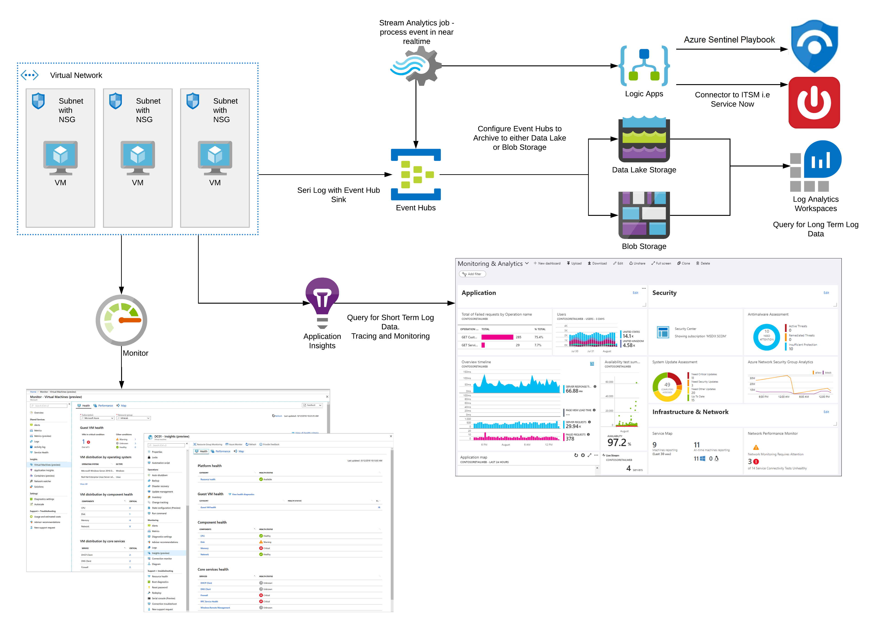

# Unified logging for microservices apps

Whenever an application fails, teams need to know:

- Why did the application fail?
- When did the application exception occur?
- Which method caused the exception?
- What were the events recorded up to the point of application failure?
- Did this exception lead to potential data corruption?

Logging, tracing, and monitoring can provide the answers to these questions, as well as monitor application usage and performance.

Traditional on-premises or monolithic applications are non-distributed, consisting of a single executable and its dependencies. The executable runs under a single process space on a single virtual machine (VM), or across multiple VMs to increase performance. For each instance, logging, tracing, and monitoring happen within the single process domain.

Cloud development differs from on-premises methodology. Many cloud-native applications consist of platform-as-a-service (PaaS) services built around the [microservices](https://docs.microsoft.com/azure/architecture/microservices/) architectural paradigm. Microservices architectures involve discrete, loosely coupled services that work within their process boundaries. This loosely distributed architecture has many benefits:

- Consists of discrete services that are easier to build and simpler to maintain.
- Focuses on business capabilities.
- Works well with automated continuous integration (CI) and continuous delivery (CD) systems.
- Is more fault-tolerant to failures, so a single service failure doesn't bring down the application.
- Allows services to scale independently of each other to provide better utilization and cost optimization.

Logging and tracing for cloud-native distributed applications can be complicated. A single request can interact with many microservices. Each microservice generates its own logging, and it becomes difficult to determine application execution process flow. Because microservices can handle hundreds of requests concurrently, wading through logs to manually determine event correlations can be a laborious task.

Azure provides several services to automate and manage effective logging, tracing, and monitoring for microservices applications. By creating a unified logging strategy, development and operations teams can gain deep insights from within as well as from outside application domains. For deployed applications, logging and monitoring help ensure that cloud-native applications remain reliable, scalable, redundant, resilient, and secure.

## Architecture

The following architecture uses Azure services to build a unified logging and monitoring system. The application emits events from both the API and the user interface to Event Hubs and Application Insights.


For applications that use Azure VMs, the following architecture includes Azure Monitor to monitor the performance and health of the VMs that run the application.



## Components

When building a cloud-native distributed microservices architecture, teams can leverage these Azure services to build an effective logging, tracing, and monitoring solution. Teams can view near real-time metrics and gain insight into application health through Application Insights.

Keep logs in long-term storage to allow the team to analyze and diagnose issues and determine if system behavior has changed over time. Make sure that recorded and stored information meets any regulatory guidelines and doesn't contain any personal identifiable information.

### Event Hubs

[Azure Event Hubs](https://azure.microsoft.com/services/event-hubs/) is a fully managed, real-time ingestion service that can stream large volumes of events per second. As such, Event Hubs is the perfect candidate for a central log ingestion pipeline. Event Hub can send event messages to Azure Data Lake or Azure Blob Storage to use for later analysis.

### Blob Storage

[Azure Blob Storage](https://azure.microsoft.com/services/storage/blobs/) is a cloud scalable storage layer for storing unstructured text or binary object data. Event Hub can store events as Avro files within Blob Storage. Azure [Log Analytics](https://docs.microsoft.com/azure/azure-monitor/log-query/log-query-overview) can then query the log data for insights.

### Azure Data Lake Storage

[Azure Data Lake Storage](https://azure.microsoft.com/services/storage/data-lake-storage/) is built on Azure Blob Storage. Data Lake Storage is a cloud scalable storage repository that can store data in any format for long periods of time. Developers can then query the objects stored within the Data Lake for investigation.

### Azure Stream Analytics

[Azure Stream Analytics](https://azure.microsoft.com/services/stream-analytics/) is a real-time, serverless analytics engine designed for critical machine workloads. Stream Analytics can process event messages that meet critical indicators.

### Logic Apps

[Azure Logic Apps](https://azure.microsoft.com/services/logic-apps/) is a serverless cloud service that lets developers schedule and orchestrate common task workflows with a visual designer. The power of Logic Apps is the connectors that integrate with a number of first and third-party services with little or no code.

For example, Stream Analytics jobs can trigger a Logic Apps workflow that sends notifications to the development team as well as calling RESTful APIs.

### Azure Monitor

[Azure Monitor](https://docs.microsoft.com/azure/azure-monitor/overview) is a service that maximizes availability and performance by collecting, analyzing, and acting on telemetry from cloud-native applications. With Azure Monitor, teams can create operational dashboards that detect issues and alert teams of critical situations.

If the team uses an Information Technology Service Management (ITSM) system, Logic Apps can call the REST endpoint of the ITSM system and create the relevant issue with the appropriate severity level. This process provides quick notification to all relevant teams and ensures that triaging is immediate and useful. For more information, see [Stream Analytics and Azure Logic Apps](https://docs.microsoft.com/archive/blogs/vinaysin/consuming-azure-stream-analytics-output-in-azure-logic-apps). 

### Application Insights

[Application Insights](https://docs.microsoft.com/azure/azure-monitor/app/app-insights-overview), a feature of Azure Monitor, is an extensible Application Performance Management (APM) service for developers and DevOps teams. Application Insights can monitor live services, detect anomalies in performance and analytics tools, diagnose and trace problems, and query log data. You can also use Application Insights from [within Visual Studio](https://docs.microsoft.com/azure/azure-monitor/app/visual-studio). You can use Application Insights to do [distributed tracing](https://docs.microsoft.com/azure/azure-monitor/app/distributed-tracing#enabling-via-application-insights-through-auto-instrumentation-or-sdks) through the Application Insights SDK.

### Azure Sentinel

[Azure Sentinel](https://azure.microsoft.com/services/azure-sentinel/) is a Security Information and Event Management (SIEM) and Security Orchestration, Automation, and Response (SOAR) service. Sentinel provides a unified overview of the cloud estate through native integration of Azure services. Sentinel can collect information from the cloud as well as from downstream dependent systems in customers' data centers.

Azure Sentinel provides a dashboard view of the current security posture and allows administrators a global view on potentially malicious events such as failed logins, suspicious credentials, and the relevant connections from these events. Site reliability engineering (SRE) teams can use [Log Analytics](https://docs.microsoft.com/azure/azure-monitor/log-query/log-query-overview) to query the data.

## Issues and considerations

*Logging* is tracking and reporting related data in a centralized way. Log events can track code errors or application failures, or provide purely informational messages. Logging focuses on providing an overview of the state of an application execution by using discrete event messages. You can use automation to read event logs and notify relevant parties if events meet a criterion or threshold.

*Tracing* focuses on the continuous flow of the application. Tracing follows program execution through various methods and services from beginning to end, while understanding data state and transitions.

*Monitoring* can apply to tracing or logging. Monitoring uses application instrumentation to provide metrics that operations teams can use to make informed decisions. These metrics can aggregate log or trace data in a dashboard that gives a holistic view of application health, from utilization to error count.

The following practices help microservices architectures perform logging in a cloud-native environment:

- All application-generated requests should have a unique identifier, usually called a correlation ID, that they pass through each microservice. Each microservice accepts the correlation ID as part of the request, and all logs emitted by the microservice contain the correlation ID.
- When the application processes the request, it returns the correlation ID as part of the response. The application then uses the correlation ID when emitting its own logs.
- All logs, except audit logs, should be emitted to the same hub and stored in a central repository. If audit logs are required for security or compliance, it's best to store them in a separate data store.
- Log data should use JSON format.
- Logging should be asynchronous. Asynchronous logging helps to reduce overhead by delegating the call to a background task. The application doesn't need to await the results of the operation and can continue the logical program flow.
- Logging should use a logging framework if possible. Don't expend engineering effort creating a logging system unless there's a clear business need. [Serilog](https://github.com/serilog) is a popular open-source logging framework that provides support for the Azure ecosystem through community supported extensions. 

### Logging levels

During application development and after deployment, make sure to use the common [logging levels](https://docs.microsoft.com/dotnet/api/microsoft.extensions.logging.loglevel) appropriately:

- **Trace** is the most detailed and most verbose log level. The Trace level outputs detailed, possibly sensitive data about application state during program execution. Tracing can affect application performance, so don't use it in pre-production or production environments. Enable this level sparingly and locally, and only during development.
- **Debug** is for debugging code locally during software development. This level tends to have no long-term value.
- **Info** level describes the general application flow when users are interacting with the system in production.
- **Warn** level in production indicates that an event could be potentially problematic. Warn tells automated alerting tools to pick up the event and notify the relevant teams to investigate.
- **Error** level in production logs errors within the application, which could be logic errors.
- **Critical/Fatal** level means the application is unable to fulfill the request and has caused an unrecoverable error.

### Synthetic logging

Most application traffic is variable, and so are the generated logs. Applications that don't generate high traffic may not generate enough logs to test and diagnose issues. Synthetic logging uses automation to emulate user behavior and generate logs for the application's monitoring systems.

Using an automation tool like [Selenium](https://docs.microsoft.com/azure/devops/pipelines/test/continuous-test-selenium), developers can create a test suite of user interactions. Microservices and API-first services can use [Apache JMeter](https://jmeter.apache.org/) to test the functional behavior of a service as well as understand performance.

For testing and development, [Postman](https://www.postman.com/) can test APIs locally and integrate with the CI/CD pipeline to automate API testing.

Synthetic transactions can simulate user behavior in your application or augment established traffic patterns. Tests can run scheduled or ad hoc.

Synthetic logging is a valuable tool for identifying problems and analyzing telemetry data. Synthetic logging helps development and operations teams ascertain that critical application processes are behaving as expected, and can also ensure that the non-functional requirements of availability, performance, response time, and resiliency are met.

### Structured logging

A key aspect of logging is the structure of the log itself. Log data is essentially unstructured, so it can be hard to query for specific events, implement automated alerting, or correlate related events.

A structured format makes event data readable and able to be passed by automated systems. JSON is the data interchange format used by most web services today, and its familiar schema is well suited for structured logging.

When defining log structure, you can add context to every request with the following objects:
- Correlation ID for the request. The ID chains related log events together to provide a narrative for events and help establish where issues occur when dealing with distributed systems. The correlation ID should be a globally unique value.
- Date and time in UTC
- Service name
- HTTP codes
- Browser type
- Event severity
- Pertinent information from the request type that can be used to help diagnose problems

The following code shows examples of the structured logging objects:

```json
{
  "CorrelationId": "715eec8f-fefc-45e2-a352-95aa389ddb8f"
  "Environment": "Live",
  "StatusCode: 500,
  "Severity: "Error",
  "Application": "Contso Web Shop",
  "Service": "PaymentsService",
  "EventTimeUTC:" "2020-04-27T13:19Z",
  "BrowserType": "Chromium",
  "Data":{
      "Runtime":"Net Core",
      "Message": "System.NullReferenceException: Object reference not set to an instance of an object.",
      "Method": "PaymentProcesser"
  } 
}
```

Incorporating the preceding changes into a distributed application allows team members to retrieve logs from the complete lifecycle of the request by using the correlation ID. Structured logging makes it easier to search through logs when issues occur, as well as allowing automated alerting.

