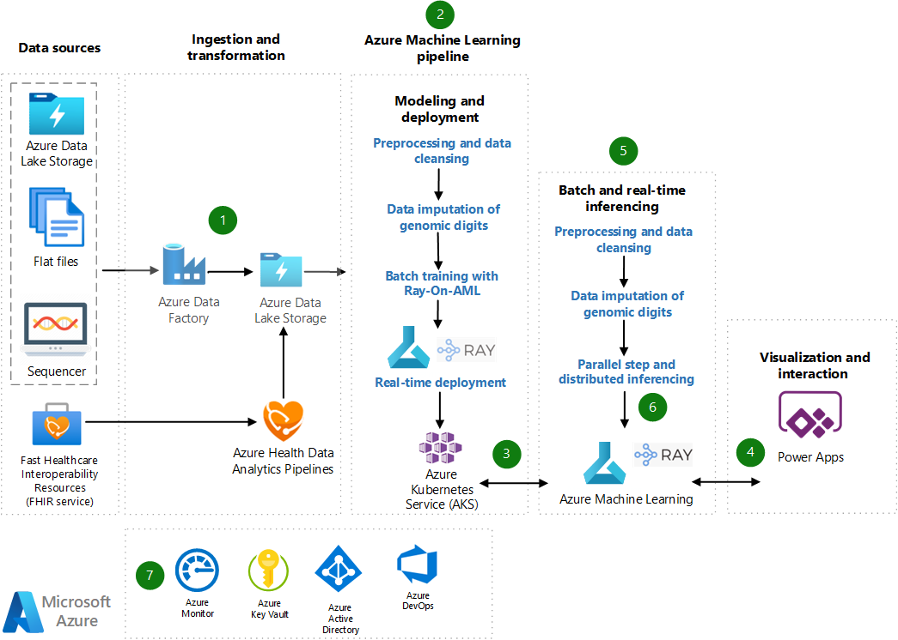

This Azure example scenario supports developing data-driven models for donor-patient virtual DNA cross matching. This solution eliminates human interpretation by using several different machine learning algorithms to train Azure Machine Learning models.

The models predict recipient and donor compatibility by using Human Leukocyte Antigen (HLA) antibody mean fluorescent intensity data and donor HLA typing. The workflow uses best practices for data exploration, governance, model training, and deployment.

*The Ray logo is a trademark of [Ray](https://www.ray.io). No endorsement is implied by the use of this logo.*

## Architecture

*Download a [Visio file](https://arch-center.azureedge.net/Donor_Match_Architecture_v4.0.vsdx) of this architecture.*

### Workflow

This architecture is developed on [Machine Learning](/azure/machine-learning/overview-what-is-azure-machine-learning). The donor-patient matching solution trains several supervised machine learning algorithms to facilitate preprocessing and imputing genomics data and donor-patient matching.

The first step is to collect data for research and training purposes. Then, the workflow divides into two parts: Inferencing or application consumption by a third party, and artificial intelligence (AI) machine learning training for continued research.

1. [Azure Data Factory](/azure/data-factory/introduction) and [Azure Health Data Services](/azure/healthcare-apis) securely ingest patient and genomics data into [Azure Data Lake Storage](/azure/storage/blobs).

   Azure Health Data Services ingests the patient non-genomics clinical datasets in Fast Healthcare Interoperability Resources (FHIR) format. Azure [Health Data Analytics Pipelines](https://github.com/microsoft/FHIR-Analytics-Pipelines) convert and provide access to the stored patient clinical data in Parquet format. If the data is in a legacy format such as HL7, CCDA, or JSON, [FHIR Converters](/azure/healthcare-apis/fhir/convert-data) convert the data.

2. Machine Learning loads the data store by referencing the blob storage. Machine Learning with the [Ray framework](https://www.ray.io) and [Ray-on-AML library](https://github.com/microsoft/ray-on-aml) use parallel and distributed data processing to do data preprocessing, custom data imputation, and model training.

3. The models deploy to Azure Kubernetes Service (AKS) within the Machine Learning workspace.

4. End users and researchers can invoke inferencing by using the Power Apps user interface (UI) to input patient and donor data.

5. After that, the real-time Machine Learning pipeline uses AKS to do data processing, imputation, and inferencing, and shows results in the UI.

   For continued research, a separate manually triggered pipeline can do batch inferencing when needed on larger datasets, and upload the results to Azure Blob Storage.

6. The pipeline tests the retrained models, evaluates them based on user metrics, and versions them in a model registry that facilitates the organization of trained models.

7. The solution uses the following supporting services:

   - [Azure Key Vault](/azure/key-vault/general/overview) to securely store connection strings, passwords, and secrets that different components use.
   - [Azure Monitor](/azure/azure-monitor/overview) to monitor service health and performance.
   - [Azure Active Directory (Azure AD)](/azure/active-directory/fundamentals/active-directory-whatis) as the identity and access management provider.
   - [Azure DevOps](/azure/devops/user-guide/what-is-azure-devops) to manage the Machine Learning lifecycle and orchestration.

### Components

- [Data Lake Storage](https://azure.microsoft.com/products/storage/data-lake-storage) is limitless data storage to house data in different shapes and formats for archives, data lakes, high-performance computing (HPC), machine learning, and cloud-native workloads. Data Lake Storage has enterprise-grade security and monitoring support and provides easy integration with Azure analytics tools. In this example, Data Lake Storage provides a local data store for Machine Learning data and a Premium data cache for training the machine learning model.

- [Azure Data Factory](https://azure.microsoft.com/products/data-factory) is an Azure extract, transform, and load (ETL) service for scale-out serverless data integration and data transformation. Azure Data Factory offers a code-free UI for intuitive authoring, and a single pane of glass for monitoring and management.

- [Azure Health Data Services](https://azure.microsoft.com/products/health-data-services) is a set of managed Azure services that can combine disparate health datasets and standardize data in the cloud.

- [Machine Learning](https://azure.microsoft.com/products/machine-learning) provides enterprise-grade machine learning services for easy model development and deployment to a wide range of targets. Machine Learning accelerates and manages the machine learning project lifecycle, including training and deploying models and managing MLOps. Machine Learning provides a low-code designer, automated machine learning, and a hosted Jupyter notebook environment that supports various integrated development environments.

- [AKS](https://azure.microsoft.com/products/kubernetes-service) is a serverless Kubernetes service that can deploy and scale containerized applications with enterprise-grade security and governance. AKS can define, deploy, debug, and upgrade complex Kubernetes applications, and automatically containerize applications.

- [Power Apps](https://powerapps.microsoft.com) is a suite of apps, services, and connectors that provide a rapid development environment to build custom apps.

- [Ray](https://www.ray.io) is an open-source, high-performance distributed execution framework for large-scale machine learning and AI applications.

- [Azure Key Vault](https://azure.microsoft.com/products/key-vault) can securely store, manage, and tightly control access to tokens, credentials, certificates, API keys, and secrets.

- [Azure Monitor](https://azure.microsoft.com/products/monitor) is a comprehensive solution for collecting, analyzing, and acting on telemetry from cloud and on-premises environments.

- [Azure AD](https://azure.microsoft.com/products/active-directory) is an Azure cloud-based identity and access management service.

- [Azure DevOps](https://azure.microsoft.com/products/devops) is a set of modern developer services that supports collaborative continuous integration and continuous deployment (CI/CD).

### Alternatives

- This solution uses the Ray framework and the Ray-on-AML library distributed execution framework for powerful computational performance. You can alternatively use [Azure high-performance computing](https://azure.microsoft.com/solutions/high-performance-computing) for some components of the solution.

- Alternatively, you can use [Azure Databricks](/azure/databricks/what-is-databricks) for machine learning workloads. Azure Databricks is a first-class implementation of Apache Spark Databricks that's fully integrated with Azure services.

- You can use [GitHub Actions](https://github.com/features/actions) instead of Azure DevOps to manage machine learning lifecycle and orchestration.

## Scenario details

Genomics quantifies the entirety of an organism's genes, called its *genome*. Healthcare and genomics researchers with bioinformatics expertise analyze large amounts of complex DNA sequence data for variations that affect health, diseases, or drug response. Genomics has achieved great breakthroughs in the past couple of decades, but the challenge of processing enormous amounts of genomic data requires complex algorithms and HPC power. To analyze this complex data for meaningful patterns, researchers use AI and machine learning.

Ray is an open-source unified compute framework that makes it easy to scale AI workloads for large-scale machine learning applications. Ray-on-AML offers scalable computational power, high availability, and parallel computing on multinode clusters. The Ray-on-AML library turns Machine Learning compute instances and compute clusters into Ray and [Dask](https://docs.ray.io/en/latest/data/dask-on-ray.html) clusters that give Machine Learning powerful computational performance to handle complex genomics data.

The virtual cross match use case dwells solely within the Machine Learning ecosystem, so it's easy to integrate its components. This use case also demonstrates how to use research projects for viable applications that can generate social and economic value, while keeping the research project separate.

Hospitals and diagnostic centers that participate in the [Donor matching system](https://optn.transplant.hrsa.gov/patients/about-donation/donor-matching-system) can use [Azure Data Share](/azure/data-share/overview) to share data among tenants. All participating tenants must have an Azure subscription.

### Potential use cases

Other use cases for this architecture include:

- Extensive analysis and processing of genomic data.
- Genetic disease research.
- Precision health and molecular biology.

## Considerations

This architecture implements the pillars of the Azure Well-Architected Framework, which is a set of guiding tenets that can be used to improve the quality of a workload. For more information, see the [Microsoft Azure Well-Architected Framework](https://www.microsoft.com/azure/partners/well-architected#well-architected-assets).

The technologies in this architecture were chosen for scalability and availability, with the aim of managing and controlling cost.

### Reliability

Reliability ensures your application can meet the commitments you make to your customers. For more information, see [Overview of the reliability pillar](/azure/architecture/framework/resiliency/overview).

The components in this architecture feature high availability. However, machine learning and analytics tasks have two parts: training and production deployment. Training resources don't typically need high availability. For production deployment, AKS fully supports high availability.

### Security

Security provides assurances against deliberate attacks and the abuse of your valuable data and systems. For more information, see [Overview of the security pillar](/azure/architecture/framework/security/overview).

The components in this scenario have built-in security. You can also manage permissions via Azure AD authentication or role-based access control. Follow [Azure Machine Learning best practices for enterprise security](/azure/cloud-adoption-framework/ready/azure-best-practices/ai-machine-learning-enterprise-security) to establish suitable security levels.

To store, manage, and analyze HIPAA-compliant and HITRUST-compliant health data and medical records with the highest level of built-in security, follow the [HIPAA and HITRUST compliant health data AI](/azure/architecture/solution-ideas/articles/security-compliance-blueprint-hipaa-hitrust-health-data-ai) architecture.

### Cost optimization

Cost optimization is about looking at ways to reduce unnecessary expenses and improve operational efficiencies. For more information, see [Overview of the cost optimization pillar](/azure/architecture/framework/cost/overview).

In this architecture, storage and compute resources account for most of the costs. You can scale up compute resources for processing or training jobs with zero spend while idle. However, consider the increased latency of spinning up after idle.

Scale resources for analytics, training, and deployment workloads to optimize costs. The AKS resources incur costs continuously, whereas you can optimize batch inferencing deployment on a per need basis.

To estimate the cost of this solution, use the [Azure pricing calculator](https://azure.microsoft.com/pricing/calculator) for the listed components and services.

### Operational excellence

Operational excellence covers the operations processes that deploy an application and keep it running in production. For more information, see [Overview of the operational excellence pillar](/azure/architecture/framework/devops/overview).

Follow MLOps guidelines to standardize and manage an end-to-end Machine Learning lifecycle scalable across multiple workspaces. Before going into production, ensure the implemented solution supports ongoing inference with retraining cycles and automated model redeployments. Consider using the [Azure MLOps (v2) solution accelerators on GitHub](https://github.com/Azure/mlops-v2).

### Performance efficiency

Performance efficiency is the ability of your workload to scale to meet the demands placed on it by users in an efficient manner. For more information, see [Performance efficiency pillar overview](/azure/architecture/framework/scalability/overview).

You can scale most components in this scenario up or down depending on the analysis activity levels. You can scale Machine Learning depending on the data size and the compute resources necessary for model training. For continuous research, you can scale up the analytics workload resources from zero compute nodes. Similarly, data processing, model training, and retraining workloads use resources that scale according to the job.

For deployment, you can scale compute resources based on expected load, scoring service, and AKS service latency requirements. You can scale batch processing up or down during inferencing, whereas real-time inferencing requires continuous resource use. To deploy optimal resources for real-time inferencing, consider the size of the models and the number of models to invoke concurrently or consequently.

Consult the [Performance efficiency checklist](/azure/architecture/framework/scalability/performance-efficiency) for guidance on designing scalable solutions.

## Contributors

*This article is maintained by Microsoft. It was originally written by the following contributors.* 

Principal authors:

- [Angela Kunanbaeva](https://www.linkedin.com/in/aqqu) | Senior Cloud Solution Architect
- [Arash Mosharraf](https://www.linkedin.com/in/arashaga) | Senior Cloud Solution Architect

Other contributors:

- [Foad Khoshouei](https://www.linkedin.com/in/foad-khoshouei) | Senior Cloud Solution Architect
- [James Nguyen](https://www.linkedin.com/in/james-nguyen-6575a431) | Principal Cloud Solution Architect
- [João Pedro Martins](https://www.linkedin.com/in/joaopedromartins) | Senior CSA Manager
- [Mustafa Al-Durra, PhD](https://www.linkedin.com/in/mustafaaldurra) | Healthcare Industry Architect

## Next steps

- [Enterprise security and governance for Azure Machine Learning](/azure/machine-learning/concept-enterprise-security)
- [Library to turn Machine Learning Compute into Ray and Dask cluster](https://techcommunity.microsoft.com/t5/ai-machine-learning-blog/library-to-turn-azure-ml-compute-into-ray-and-dask-cluster/ba-p/3048784).
- [Artificial Intelligence, Machine Learning and Genomics](https://www.genome.gov/about-genomics/educational-resources/fact-sheets/artificial-intelligence-machine-learning-and-genomics).
- [Development of data-driven models for the flow cytometric cross match](https://www.sciencedirect.com/science/article/abs/pii/S0198885919306585?via%3Dihub)

## Related resources

- [Batch scoring of Python models on Azure](/azure/architecture/reference-architectures/ai/batch-scoring-python)
- [Deploy AI and ML computing on-premises and to the edge](/azure/architecture/hybrid/deploy-ai-ml-azure-stack-edge)
- [MLOps for Python models using Azure Machine Learning](/azure/architecture/reference-architectures/ai/mlops-python)
- [HIPAA and HITRUST compliant health data AI](/azure/architecture/solution-ideas/articles/security-compliance-blueprint-hipaa-hitrust-health-data-ai)
- [Precision medicine pipeline with genomics](/azure/architecture/example-scenario/precision-medicine/genomic-analysis-reporting)
- [Health data consortium on Azure](/azure/architecture/example-scenario/data/azure-health-data-consortium)

