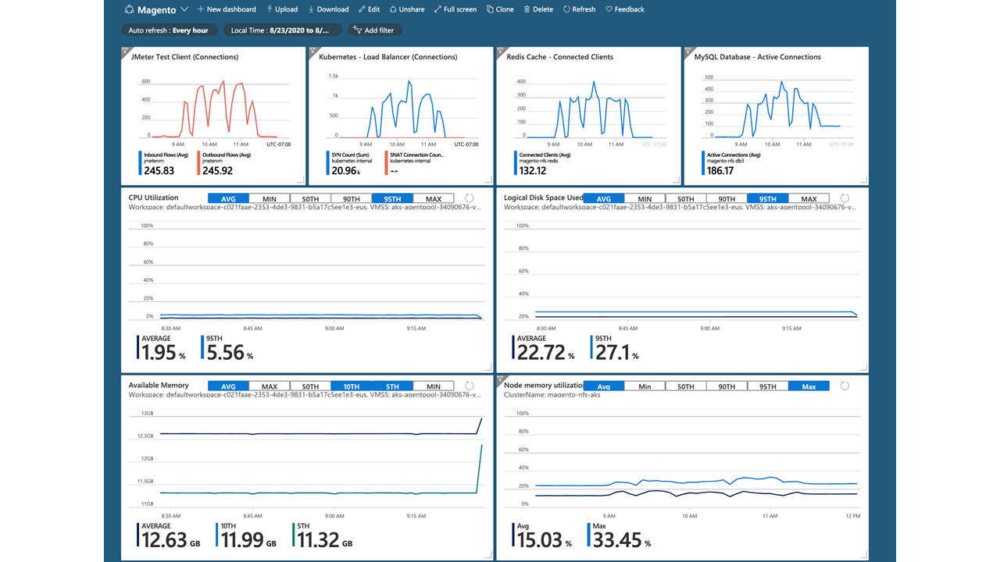
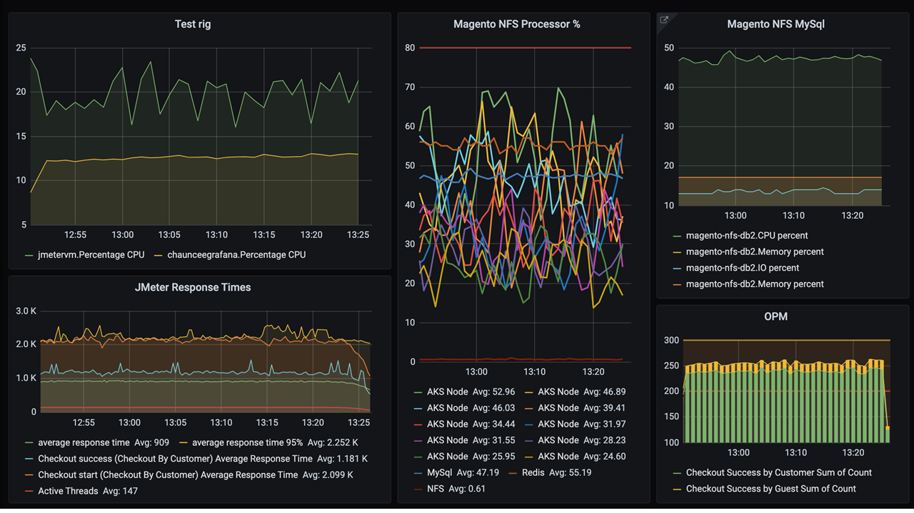

This article is about the open-source version of Magento, an e-commerce platform written in PHP. This article isn't about Adobe Commerce. This example scenario shows Magento deployed to Azure Kubernetes Service (AKS) and describes common best practices for hosting Magento on Azure.

## Architecture

:::image type="content" alt-text="Diagram showing Magento deployed in Azure Kubernetes Service with other Azure components." source="media/magento-architecture.svg" lightbox="media/magento-architecture.svg":::

*Download a [Visio file](https://arch-center.azureedge.net/magento-architecture-2.vsdx) of this architecture.*

### Workflow

- [Azure Kubernetes Service (AKS)](https://azure.microsoft.com/products/kubernetes-service) deploys the Kubernetes cluster of Varnish, Magento, Redis, and [Elasticsearch](https://www.elastic.co/elasticsearch) in different pods.
- AKS creates a [virtual network](https://azure.microsoft.com/products/virtual-network) to deploy the agent nodes. Create the virtual network in advance to set up subnet configuration, private link, and egress restriction.
- [Varnish](https://varnish-cache.org/intro/index.html#intro) installs in front of the HTTP servers to act as a full-page cache.
- [Azure Database for MySQL](https://azure.microsoft.com/products/mysql) stores transaction data like orders and catalogs. Version 8.0 is recommended.
- [Azure Files Premium](https://azure.microsoft.com/products/storage/files), [Azure NetApp Files](https://azure.microsoft.com/products/netapp), or an equivalent *network-attached storage (NAS)* system stores media files like product images. Magento needs a Kubernetes-compatible file system that can mount a volume in *ReadWriteMany* mode, like Azure Files Premium or Azure NetApp Files. [Storage options for applications in Azure Kubernetes Service (AKS)](/azure/aks/concepts-storage). It is highly recommended that you test input/output operations per second (IOPS) throughput and choose the options which work for you. 
- A [content delivery network (CDN)](https://azure.microsoft.com/products/cdn) serves static content like CSS, JavaScript, and images. Serving content through a CDN minimizes network latency between users and the datacenter. A CDN can remove significant load from NAS by caching and serving static content.
- [Redis](https://redis.io) stores session data. Hosting Redis on containers is recommended for performance reasons.
- AKS uses an [Azure Active Directory (Azure AD)](https://azure.microsoft.com/products/active-directory) identity to create and manage other Azure resources like Azure load balancers, user authentication, role-based access control, and managed identity.
- [Azure Container Registry](https://azure.microsoft.com/products/container-registry) stores the private [Docker](https://www.docker.com) images that are deployed to the AKS cluster. You can use other container registries like Docker Hub. The default Magento install writes some secrets to the image.
- [Azure Monitor](https://azure.microsoft.com/products/monitor) collects and stores metrics and logs, including Azure service platform metrics and application telemetry. Azure Monitor integrates with AKS to collect controller, node, and container metrics, and container and master node logs.

### Components

- [Azure Kubernetes Service (AKS)](https://azure.microsoft.com/products/kubernetes-service): Scale containers on a managed Kubernetes service.
- [Azure Virtual Network](https://azure.microsoft.com/products/virtual-network): Virtual networks in the cloud.
- [Azure Database for MySQL](https://azure.microsoft.com/products/mysql): MySQL in the cloud that's cost effective and easy to set up, operate, and scale.
- [Azure Files](https://azure.microsoft.com/products/storage/files): File shares in the cloud. This solution uses the Premium tier.
- [Azure NetApp Files](https://azure.microsoft.com/products/netapp): Enterprise-grade Azure file shares, powered by NetApp.
- [Azure Content Delivery Network](https://azure.microsoft.com/products/cdn):A fast, reliable, and global content delivery network. 
- [Azure Active Directory (Azure AD)](https://azure.microsoft.com/products/active-directory): Multicloud identity and access management.
- [Azure Container Registry](https://azure.microsoft.com/products/container-registry): A registry of Docker and Open Container Initiative (OCI) images, with support for all OCI artifacts.
- [Azure Monitor](https://azure.microsoft.com/products/monitor): End-to-end observability for your applications, infrastructure, and network

## Scenario details

For more information about Magento, see [On-premises installation overview](https://experienceleague.adobe.com/docs/commerce-operations/installation-guide/overview.html).

### Potential use cases

This solution is optimized for the retail industry.

## Considerations

These considerations implement the pillars of the Azure Well-Architected Framework, which is a set of guiding tenets that can be used to improve the quality of a workload. For more information, see [Microsoft Azure Well-Architected Framework](/azure/architecture/framework).

### Security

Here are some security considerations for this scenario:

- Configure a [private link](https://azure.microsoft.com/products/private-link) for MySQL so that the traffic between clients and MySQL isn't exposed to the public internet. For more information, see [What is Azure Private Link](/azure/private-link/private-link-overview).

- You could add [Azure Application Gateway](https://azure.microsoft.com/products/application-gateway) ingress to support secure socket layer (SSL) termination.

#### Role-based access control (RBAC)

Kubernetes and Azure both have mechanisms for *role-based access control (RBAC)*.

- Azure RBAC controls access to Azure resources, including the ability to create resources. Azure RBAC can assign permissions to users, groups, or *service principals*, which are security identities used by applications.

- Kubernetes RBAC controls permissions to the Kubernetes API. For example, creating pods and listing pods are actions that Kubernetes RBAC can authorize to users.

AKS integrates the Azure and Kubernetes RBAC mechanisms. To assign AKS permissions to users, create *roles* and *role bindings*:

- A role is a set of permissions that apply within a namespace. Permissions are defined as verbs like get, update, create, or delete, on resources like pods or deployments.

- Role binding assigns users or groups to roles.

- A *ClusterRole* object defines a role that applies to the entire AKS cluster, across all namespaces. To assign users or groups to a ClusterRole, create a *ClusterRoleBinding*.

When you create the AKS cluster, you can configure it to use Azure AD for user authentication.

- For details on how to set up Azure AD integration, see [AKS-managed Azure Active Directory integration](/azure/aks/managed-aad).

- For more information about controlling access to cluster resources using Kubernetes RBAC and Azure AD identities, see [Use Kubernetes RBAC with Azure AD](/azure/aks/azure-ad-rbac).

### Scalability

There are several ways to optimize scalability for this scenario:

#### Media and static files

- Adequately provision Azure Files, Azure NetApp Files, or another network-attached storage (NAS) system. Magento can store thousands of media files such as product images. _Be sure to provision NAS products with sufficient input/output operations per second (IOPS) to handle demand_.

- Minimize the size of static content such as HTML, CSS, and JavaScript. [Minification](https://devdocs.magento.com/cloud/deploy/static-content-deployment.html#minify-content) can reduce bandwidth costs and provide a more responsive experience for users.

#### Database connection

- Turn on *persistent connection* to the MySQL database, so Magento keeps reusing the existing connection instead of creating a new one for every request. To turn on persistent connection, add the following line to the `db` section of the Magento *env.php* file:

  `'persistent' => '1'`

- If MySQL consumes too much CPU, reduce the utilization by turning off *product count* from layered navigation in [Magento configuration](https://experienceleague.adobe.com/docs/commerce-operations/configuration-guide/paths/config-reference-general.html):

  `magento config:set -vvv catalog/layered_navigation/display_product_count 0`

#### Caching

- Configure [OPcache](https://www.php.net/manual/book.opcache.php) for PHP code caching and optimization.

  Make sure the following directives are set and uncommented in *php.ini*:

  `opcache.enable=1`

  `opcache.save_comments=1`

  `opcache.validate_timestamps=0`

- Load balance the [Varnish cache](https://experienceleague.adobe.com/docs/commerce-operations/configuration-guide/cache/varnish/config-varnish.html) by running multiple instances on pods so that it can scale.

#### Logging

Limit access logging, to avoid performance issues and prevent exposing sensitive data like client IP addresses.

- Use the following Varnish command to limit logging to error-level:

  `varnishd -s malloc,1G -a :80 -f /etc/varnish/magento.vcl && varnishlog -q "RespStatus >= 400 or BerespStatus >= 400"`

- If you use Apache web server for ingress, limit Apache logging to error-level by adding the following line to the Magento `VirtualHost` entry in the Apache server configuration:

  `CustomLog /dev/null common`

- Turn off PHP-FPM access logs by commenting out the `access.log` setting in all PHP-FPM configurations.

### Availability

Consider these ways to optimize availability for this scenario:

#### Health probes

Kubernetes defines two types of health probe:

- The *readiness probe* tells Kubernetes whether the pod is ready to accept requests.
- The *liveness probe* tells Kubernetes whether a pod should be removed and a new instance started.

Customize the Kubernetes health probes and use them to tell if a pod is in good health.

#### Availability Zones

Availability Zones are unique physical locations within Azure regions that help protect applications and data from datacenter failures. Each zone is made up of one or more datacenters. Applications in zones can remain available even if there's a physical failure in a single datacenter.

AKS clusters can be deployed across multiple Availability Zones, to provide a higher availability level and protect against hardware failures or planned maintenance events. Defining cluster node pools to span multiple zones lets nodes continue operating even if a single zone goes down. For more information about deploying AKS to Availability Zones, see [Create an AKS cluster that uses availability zones](/azure/aks/availability-zones).

#### Resource constraints

- Resource contention can affect service availability. Define container resource constraints so that no single container can overwhelm the cluster memory and CPU resources. You can use AKS diagnostics to identify any issues in the cluster.

- Use resource limit to restrict the total resources allowed for a container, so one particular container can't starve others.

### DevOps

Here are some operational considerations for this scenario:

- In this scenario, MySQL doesn't expose a public endpoint. If the build server stores configuration settings to the backend MySQL database, be sure to deploy that server into the same virtual network subnet that MySQL connects to via service endpoint.

- Use Azure Container Registry or another container registry like Docker Hub to store the private Docker images that are deployed to the cluster. AKS can authenticate with Azure Container Registry by using its Azure AD identity.

#### Monitoring

Azure Monitor provides key metrics for all Azure services, including container metrics from AKS. Create a dashboard to show all metrics in one place.

Another monitoring option is to use [Grafana](https://grafana.com) dashboard:

#### Performance testing

Use [Magento Performance Toolkit](https://github.com/magento/magento2/tree/2.4-develop/setup/performance-toolkit) for performance testing. The toolkit uses [Apache JMeter](https://jmeter.apache.org) to simulate customer behaviors like signing in, browsing products, and checking out.

### Cost optimization

Cost optimization is about looking at ways to reduce unnecessary expenses and improve operational efficiencies. For more information, see [Overview of the cost optimization pillar](/azure/architecture/framework/cost/overview).

- Do capacity planning based on performance testing.

- Use the [Azure pricing calculator](https://azure.microsoft.com/pricing/calculator) to estimate costs.

- See other cost considerations in [Principles of cost optimization](/azure/architecture/framework/cost/overview) in the Microsoft Azure Well-Architected Framework.

## Next steps

- [Magento 2 GitHub code repo](https://github.com/magento/magento2)
- [Magento Developer Documentation](https://devdocs.magento.com)

## Related resources

- [All retail architectures](/azure/architecture/browse/?terms=retail)
- [Elastic Workplace Search on Azure](../../solution-ideas/articles/elastic-workplace-search.yml)
- [Buy online, pick up in store (retail)](../iot/vertical-buy-online-pickup-in-store.yml)
- [Scalable order processing](../data/ecommerce-order-processing.yml)
- [Application data protection for AKS workloads on Azure NetApp Files](../file-storage/data-protection-kubernetes-astra-azure-netapp-files.yml)
