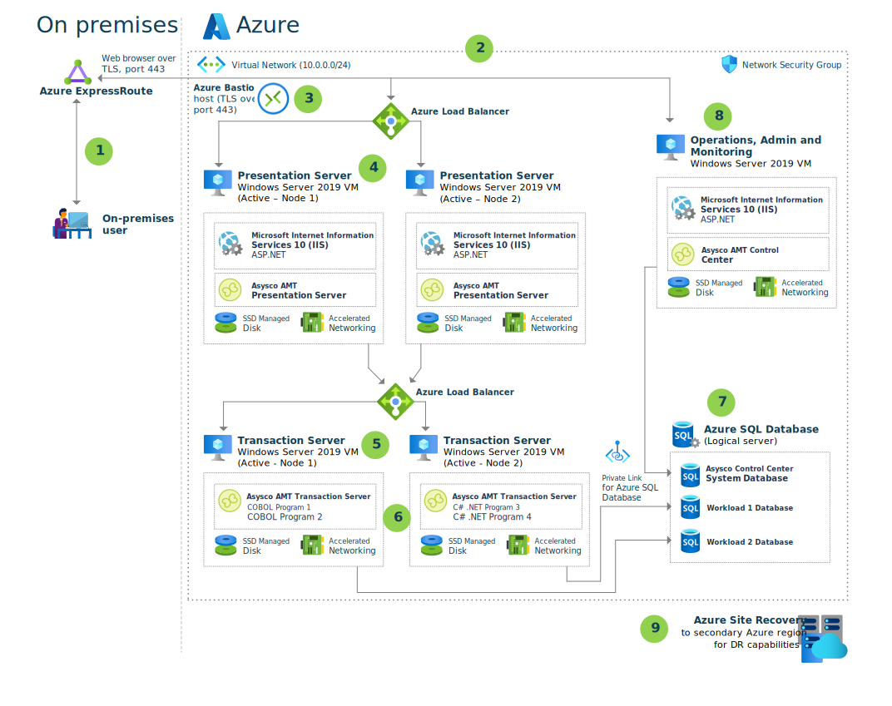

Microsoft partner [Asysco's](https://asysco.com/products/) Automated Migration Technology (AMT) Framework converts IBM mainframe applications into native .NET applications running on Windows Server OS. These applications can run in Azure infrastructure-as-a-service (IaaS) and platform-as-a-service (PaaS) environments. Transforming legacy proprietary infrastructures into more cost-effective, standardized, open technologies enables agile DevOps principles that are today's high-productivity norm. This transformation leads away from islands of unique legacy infrastructures, processes, and development to more unified business and IT alignment.

This article describes an example conversion of an IBM mainframe system to Azure using the Asysco AMT Framework. The AMT Framework allows an accelerated move into Azure without rewriting application code or redesigning data architecture. The framework converts legacy code to C#, while maintaining the source code in its original form. Application user interfaces and interactions can be virtually unchanged, minimizing the need for end user retraining.

## Potential use cases

Many scenarios can benefit from Asysco AMT. Possibilities include the following cases:

- Modernizing infrastructure from the high costs, limitations, and rigidity associated with mainframes.
- Moving IBM z/OS mainframe workloads to the cloud without the side effects of a complete redevelopment.
- Migrating mission-critical applications to the cloud while maintaining continuity with on-premises mainframe applications.
- Implementing Azure's horizontal and vertical scalability.
- Deploying high availability (HA) and disaster recovery (DR) options.

## Architecture

The following diagram shows how the typical components of an IBM z/OS mainframe system can map and migrate to Azure capabilities.

   
1. A web browser to access Azure resources replaces standard mainframe protocols like HTTPS and TN3270 terminal emulation for demand and online users (**A**). Users access web-based applications via Azure ExpressRoute over TLS port 443. For admin access to the Azure Virtual Machines (VMs), Azure Bastion hosts maximize security by minimizing open ports.
   
1. The AMT Framework converts mainframe presentation, batch, and transaction loads (**B**) to VM server farms. The VMs use Premium SSD or Ultra Azure Managed Disks with Accelerated Networking for high performance. Each set of servers can scale out to provide more throughput.
   
   - Two sets of two VMs run the web and application layers. Presentation layer code runs in IIS and uses ASP.NET to maintain the z/OS mainframe user-interface screens. You can leave web applications' presentation layers unchanged, to minimize end user retraining, or you can update the presentation layers with modern user experience frameworks.
   
   - Mainframe batch and transaction loads convert to sufficient server farms to handle this type of work.
   
1. The VMs running the web and application layers are fronted by Azure Load Balancers in *active-active* arrangements to spread query traffic. Another Azure Load Balancer fronts the transaction servers for the same purpose. The load balancers build resiliency into the solution. If one presentation or transaction server fails, another server behind the load balancer takes on the workload.
   
1. Application code (**C**) converts to AMT COBOL or directly to .NET C#. AMT maintains the original code structure to use as a baseline or for future edits. If code needs changing or editing, AMT can maintain and reprocess the original code, or you can edit the converted C# code directly to advance the code base to new standards.

1. Asysco data migration tools automate migrating all legacy DB2, IMS, and IDMS hierarchical, network, or relational databases (**D**) to Azure SQL Server. Asysco AMT Transform converts DMS and RDMS schemas to SQL, and  WFL/ECLJCL/REXX scripts to open-source VB scripts or Windows PowerShell.
   
   Azure SQL Database uses either Hyperscale or Business Critical tiers for high IOPS and high uptime SLA. Private Link for Azure SQL Database provides a private, direct connection from Azure VMs to Azure SQL Database.
   
   AMT Transform also converts all binary or indexed VSAM, flat files, and virtual tape files to Azure Files. Features like Azure autofailover group replication provide data protection.
   
1. Workload automation, scheduling, reporting, and system monitoring functions (**E**) that are Azure-capable can keep their current platforms. This example uses AMT Control Center for operations.
   
   The system can support printers and other legacy system output devices if they have IP addresses connected to the Azure network.
   
1. Azure Site Recovery mirrors the Azure VMs to a secondary Azure region for quick failover and DR in case of Azure datacenter failure.

## Components

- [Azure Virtual Machines](https://azure.microsoft.com/services/virtual-machines/) provides on-demand, scalable computing resources that give you the flexibility of virtualization without having to buy and maintain physical hardware.
  
- [Azure Virtual Network](/azure/virtual-network/virtual-networks-overview) is the fundamental building block for Azure private networks. Virtual networks let Azure resources like VMs securely communicate with each other, the internet, and on-premises networks. An Azure Virtual Network is similar to a traditional network on premises, but with Azure infrastructure benefits like scalability, availability, and isolation.
  
- [Virtual network interfaces](/azure/virtual-network/virtual-network-network-interface) let Azure VMs communicate with internet, Azure, and on-premises resources. As in this architecture, you can add several network interface cards to one Azure VM, so child VMs can have their own dedicated network interface devices and IP addresses.
  
- [Azure managed disks](/azure/virtual-machines/windows/managed-disks-overview) are block-level storage volumes that Azure manages on Azure VMs. The available types of disks are ultra disks, premium solid-state drives (SSDs), standard SSDs, and standard hard disk drives (HDDs). This architecture works best with Premium SSDs or Ultra Disk SSDs.
  
- [Azure Files](/azure/storage/files/storage-files-introduction) offers fully managed file shares in your Azure Storage Account that are accessible from the cloud or on-premises. Windows, Linux, and macOS deployments can mount Azure file shares concurrently, and access files via the industry standard Server Message Block (SMB) protocol.
  
- [Azure ExpressRoute](/azure/expressroute/expressroute-introduction) lets you extend your on-premises networks into the Microsoft cloud over a private connection facilitated by a connectivity provider. With ExpressRoute, you can establish connections to cloud services like Azure and Office 365.
  
- [Azure Bastion](/azure/bastion/bastion-overview) is a fully managed platform as a service (PaaS) that you provision inside your virtual network. Bastion provides secure and seamless RDP and SSH connectivity to the VMs in your virtual network directly from the Azure portal over TLS.

- [Azure SQL Database](/azure/azure-sql/database/sql-database-paas-overview) is a fully managed PaaS database engine that is always running on the latest stable version of SQL Server and patched OS, with 99.99% availability. SQL Database handles most database management functions like upgrading, patching, backups, and monitoring without user involvement. These PaaS capabilities let you focus on business critical, domain-specific database administration and optimization.

### Alternatives

The AMT Framework supports several methodologies to move client workloads to Azure:

- One method is to convert and move the entire mainframe system to Azure at once, saving interim mainframe maintenance and facility support costs. This approach carries some risk because all processes, like application conversion, data migration, and testing, must align to allow a smooth transition.

- A second methodology is to move applications from the mainframe to Azure gradually, with complete transition as the ultimate goal. This tactic provides savings per application, and lessons learned to convert each application can help with subsequent conversions. Modernizing each application on its own schedule can be more relaxed than converting everything at once. If regaining time on the mainframe is a goal, this stepped method can also provide more processing cycles on the mainframe as applications convert to Azure. Eventual starvation of the mainframe can highlight the need to retire the mainframe expense.

## Considerations

The following considerations apply to this solution:

### Availability

- [Azure Site Recovery](https://azure.microsoft.com/services/site-recovery/) mirrors the Azure VMs to a secondary Azure region for quick failover and DR in case of Azure datacenter failure.

- [Azure autofailover group replication](/azure/azure-sql/database/auto-failover-group-overview) provides data protection by managing database replication and failover to another region.

### Resiliency

Azure Load Balancer builds resiliency into this solution. If one presentation or transaction server fails, the other servers behind the load balancer take on the workload.

### Scalability

- Asysco has proven single-application scalability equivalent to at least 28,000 million IBM mainframe instructions per second (MIPS).

- You can scale out the VM server sets to provide more throughput. For more information, see [Virtual machine scale sets](/azure/virtual-machine-scale-sets/overview).

### Security

- This solution uses an Azure network security group (NSG) to manage traffic between Azure resources. For more information, see [Network security groups](/azure/virtual-network/network-security-groups-overview).

- [Private Link for Azure SQL Database](/azure/azure-sql/database/private-endpoint-overview) provides a private, direct connection isolated to the Azure networking backbone from the Azure VMs to Azure SQL Database.

- [Azure Bastion](/azure/bastion/bastion-overview) maximizes admin access security by minimizing open ports.

### Pricing

- Azure helps avoid unnecessary costs by identifying resource needs, analyzing spending over time, and scaling to meet business needs without overspending. Asysco AMT in Azure runs on Windows VMs, which help you optimize costs by turning off VMs when not in use and scripting schedules for known usage patterns.

- Azure SQL Database uses [Hyperscale or Business Critical](/azure/azure-sql/database/service-tiers-general-purpose-business-critical) tiers in this solution, for high input/output operations per second (IOPS) and high uptime SLA. For pricing information, see [Azure SQL Database pricing](https://azure.microsoft.com/pricing/details/sql-database/single/).

- This solution works best with Premium SSDs or Ultra Disk SSDs. For pricing information, see [Managed Disks pricing](https://azure.microsoft.com/pricing/details/managed-disks/).

## See also

- Visit the Azure Marketplace for information about [Asysco AMT GO](https://azuremarketplace.microsoft.com/marketplace/apps/asyscosoftwarebv.amtvmcc_basic_2019_002?tab=Overview).
- See the blog post [MIPS Equivalent Sizing for IBM CICS COBOL Applications Migrated to Microsoft Azure](https://techcommunity.microsoft.com/t5/azure-global/mips-equivalent-sizing-for-ibm-cics-cobol-applications-migrated/ba-p/731665).

## Next steps

- For more information, please contact [legacy2azure@microsoft.com](mailto:legacy2azure@microsoft.com).
- [Micro Focus Enterprise Server for IBM z/OS on Azure VMs](micro-focus-server.yml).
- [Refactor IBM z/OS mainframe Coupling Facility (CF) to Azure](../../reference-architectures/zos/refactor-zos-coupling-facility.yml).
- See the [Microsoft Azure Well-Architected Framework](/azure/architecture/framework/) for more information about cost optimization for [VM instances](/azure/architecture/framework/cost/optimize-vm).
