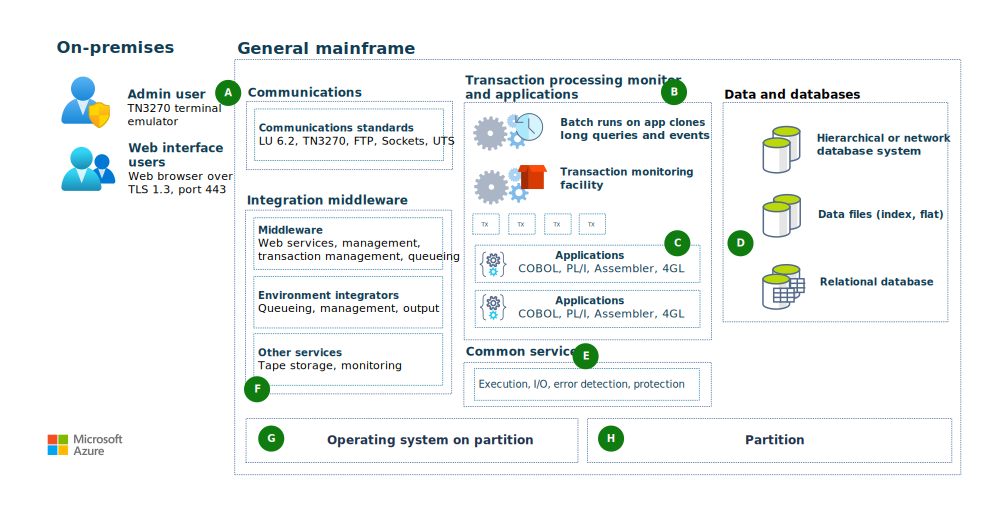
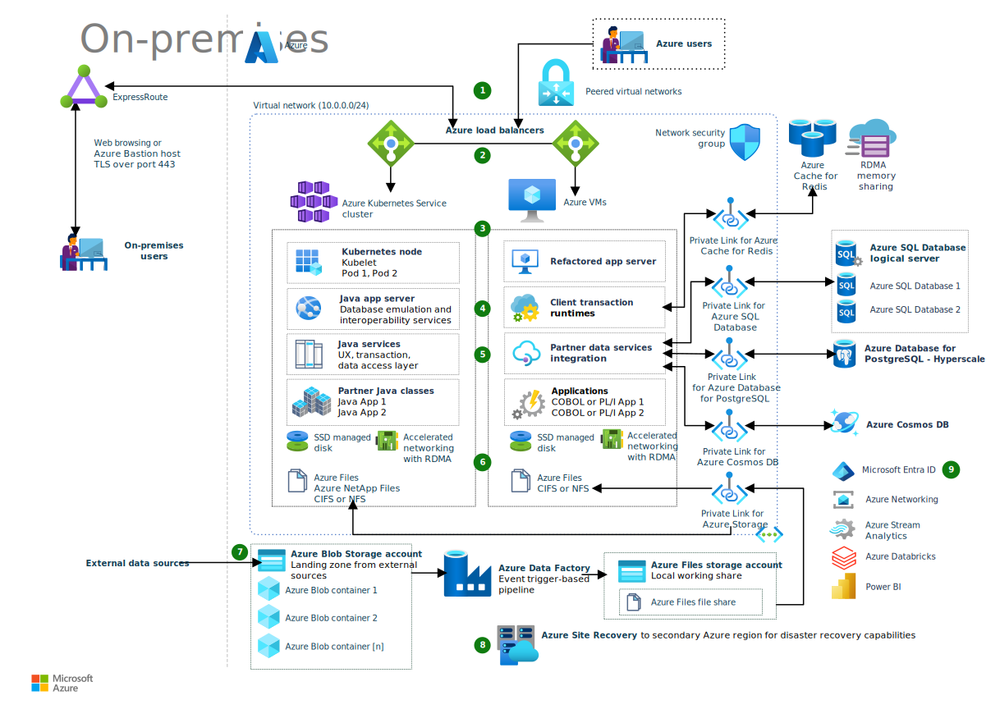

The following architecture illustrates a general refactoring approach that can use Azure Kubernetes Service (AKS) or Azure virtual machines (VMs). The choice depends on existing applications' portability and your preference. Refactoring can speed up the move into Azure by automatically converting code to Java or .NET, and converting pre-relational to relational databases.

## Mainframe architecture

*Download a [Visio file](https://arch-center.azureedge.net/mainframe-general-azure-refactor.vsdx) of this architecture.*

### Workflow

- On-premises users access the mainframe over TCP/IP by using standard mainframe protocols like TN3270 and HTTPS (**A**).
- Receiving applications can be either batch or online systems (**B**).
- COBOL, PL/I, Assembler, or compatible languages run in enabled environments (**C**).
- Typical data and database services include hierarchical or network database systems, index or flat data files, and relational databases (**D**).
- Common services include program execution, I/O operations, error detection, and protection (**E**).
- Middleware and utility services manage tape storage, queueing, output, and web services (**F**).
- Operating systems are the interface between the compute engine and the software (**G**).
- Partitions run separate workloads or segregate work types within the environment (**H**).

## Refactored Azure architecture

*Download a [Visio file](https://arch-center.azureedge.net/mainframe-general-azure-refactor.vsdx) of this architecture.*

### Workflow

1. Input comes from remote clients via ExpressRoute, or from other Azure users. TCP/IP is the primary way to connect to the system.

   - On-premises users can access web-based applications over Transport Layer Security (TLS) port 443. Web applications' presentation layers can remain unchanged, to minimize end user retraining. Or, you can update the presentation layers with modern UX frameworks.

   - On-premises administrative access uses Azure Bastion hosts to maximize security by minimizing open ports.

   - Azure users connect to the system via virtual network peering.

1. In Azure, Azure Load Balancer manages access to the application compute clusters. Load Balancer supports scale-out compute resources to handle input. You can use a level-7 application level or level-4 network level load balancer, depending on how the application input reaches the compute cluster entry point.

1. Application compute clusters can run on Azure VMs, or run in containers in AKS clusters. Usually, mainframe system emulation for PL/I or COBOL applications uses VMs, and applications refactored to Java or .NET use containers. Some mainframe system emulation software also supports deployment in containers. Compute resources use premium or ultra solid-state drive (SSD) managed disks with Accelerated Networking and Remote Direct Memory Access (RDMA).

1. Application servers in the compute clusters host the applications based on language capability, such as Java classes or COBOL programs. The servers receive application input, and share application state and data by using Azure Cache for Redis or RDMA.

1. Data services in the application clusters support multiple connections to persistent data sources. Azure Private Link provides private connectivity from within the virtual network to Azure services. Data sources can include:

   - PaaS data services like Azure SQL Database, Azure Cosmos DB, and Azure Database for PostgreSQL - Hyperscale.
   - Databases on VMs, such as Oracle or Db2.
   - Big data repositories like [Azure Databricks](https://azure.microsoft.com/services/databricks) and Azure Data Lake.
   - Streaming data services like Apache Kafka and [Azure Stream Analytics](https://azure.microsoft.com/services/stream-analytics).

1. Data storage can be either local-redundant or geo-redundant, depending on usage. Data storage can use a combination of:

   - High-performance storage with ultra or premium SSD disks.
   - File storage with Azure NetApp Files or Azure Files.
   - Standard storage, including blob, archive, and backup storage.

1. Azure PaaS data services provide scalable and highly available data storage that you can share among compute cluster resources. This storage can also be geo-redundant.

   - Azure Blob Storage is a common landing zone for external data sources.
   - Azure Data Factory supports data ingestion and synchronization of multiple Azure and external data sources.

1. Azure Site Recovery provides DR for VM and container cluster components.

1. Services like [Azure Active Directory](https://azure.microsoft.com/services/active-directory), [Azure Networking](https://azure.microsoft.com/product-categories/networking), Azure Stream Analytics, Azure Databricks, and [Power BI](https://powerbi.microsoft.com) can easily integrate with the modernized system.

### Components

This example features the following Azure components. Several of these components and workflows are interchangeable or optional depending on your scenario.

- [Azure ExpressRoute](https://azure.microsoft.com/services/expressroute) extends your on-premises networks into Azure over a private, dedicated fiber connection from a connectivity provider. ExpressRoute establishes connections to Microsoft cloud services like Azure and Microsoft 365.

- [Azure Bastion](https://azure.microsoft.com/services/azure-bastion) provides seamless Remote Desktop Protocol (RDP) or secure shell (SSH) connectivity to virtual network VMs from the Azure portal over TLS. Azure Bastion maximizes administrative access security by minimizing open ports.

- [Azure Load Balancer](https://azure.microsoft.com/services/load-balancer) distributes incoming traffic to the compute resource clusters. You can define rules and other criteria to distribute the traffic.

- [Azure Kubernetes Service (AKS)](https://azure.microsoft.com/services/kubernetes-service) is a fully managed Kubernetes service to deploy and manage containerized applications. AKS offers serverless Kubernetes, an integrated continuous integration and continuous delivery (CI/CD) experience, and enterprise-grade security and governance.

- [Azure Virtual Machines](https://azure.microsoft.com/services/virtual-machines) offers many sizes and types of on-demand, scalable computing resources. With Azure VMs, you get the flexibility of virtualization without having to buy and maintain physical hardware.

- [Azure Virtual Network](https://azure.microsoft.com/services/virtual-network) is the fundamental building block of Azure private networks. Azure VMs within virtual networks can communicate securely with each other, the internet, and on-premises networks. A virtual network is like a traditional on-premises network, but with Azure infrastructure benefits like scalability, high availability, and isolation.

- [Azure Private Link](https://azure.microsoft.com/services/private-link) provides private connectivity from a virtual network to Azure services. Private Link simplifies network architecture and secures the connection between Azure endpoints by eliminating public internet exposure.

- [Azure Cache for Redis](https://azure.microsoft.com/services/cache) adds a quick caching layer to application architecture to handle large volumes at high speed. Azure Cache for Redis scales performance simply and cost-effectively, with the benefits of a fully managed service.

- [Azure Storage](https://azure.microsoft.com/product-categories/storage) offers scalable, secure cloud storage for all your data, applications, and workloads.

  - [Azure Disk Storage](https://azure.microsoft.com/services/storage/disks/) is high-performance, durable block storage for business-critical applications. Azure managed disks are block-level storage volumes that are managed by Azure on Azure VMs. The available types of disks are ultra disks, premium SSDs, standard SSDs, and standard hard disk drives (HDDs). This architecture uses either premium SSDs or ultra disk SSDs.

  - [Azure Files](https://azure.microsoft.com/services/storage/files) offers fully managed file shares in the cloud that are accessible via the industry standard Server Message Block (SMB) protocol. Cloud and on-premises Windows, Linux, and macOS deployments can mount Azure Files file shares concurrently.

  - [Azure NetApp Files](https://azure.microsoft.com/services/netapp) provides enterprise-grade Azure file shares powered by NetApp. NetApp Files makes it easy for enterprises to migrate and run complex, file-based applications with no code changes.

  - [Azure Blob Storage](https://azure.microsoft.com/services/storage/blobs) is scalable and secure object storage for archives, data lakes, high-performance computing, machine learning, and cloud-native workloads.

- [Azure databases](https://azure.microsoft.com/product-categories/databases) offer a choice of fully managed relational and NoSQL databases to fit modern application needs. Automated infrastructure management provides scalability, availability, and security.

  - [Azure SQL Database](https://azure.microsoft.com/products/azure-sql/database) is a fully managed PaaS database engine. SQL Database always runs on the latest stable version of SQL Server and a patched OS with 99.99 percent availability. Built-in PaaS database management capabilities include upgrading, patching, backups, and monitoring. You can focus on domain-specific, business-critical database administration and optimization.

  - [Azure Database for PostgreSQL](https://azure.microsoft.com/services/postgresql) is a fully managed database based on the open-source Postgres relational database engine. The [Hyperscale (Citus) deployment option](/azure/postgresql/hyperscale/) scales queries across multiple machines using sharding, for applications that require greater scale and performance.

  - [Azure Cosmos DB](https://azure.microsoft.com/services/cosmos-db) is a fully managed, fast NoSQL database with open APIs for any scale.

- [Azure Site Recovery](https://azure.microsoft.com/services/site-recovery) mirrors Azure VMs to a secondary Azure region for quick failover and DR if an Azure datacenter fails.

## Scenario details

Refactoring workloads to Azure can transform mainframe applications that run on Windows Server or Linux. You can run these applications more cost effectively with cloud-based Azure infrastructure as a service (IaaS) and platform as a service (PaaS).

The general refactoring approach for mainframe applications also drives infrastructure transformation from legacy-proprietary into standardized, benchmarked, open technologies. This transformation promotes agile DevOps principles that are today's high-productivity, open-systems standard. Refactoring transitions away from islands of unique legacy infrastructures, processes, and applications to a unified land of better business and IT alignment.

This general refactoring approach can use Azure Kubernetes Service (AKS) or Azure virtual machines (VMs). The choice depends on existing applications' portability and your preference. Refactoring can speed up the move into Azure by automatically converting code to Java or .NET, and converting pre-relational to relational databases.

Refactoring supports different methodologies for moving client workloads to Azure. One method is to convert and move the entire mainframe system to Azure at once, saving interim mainframe maintenance and facility support costs. This approach carries some risk. All application conversion, data migration, and testing processes must align for a smooth transition from the mainframe to Azure.

A second methodology is to move applications from the mainframe to Azure gradually, with complete transition as the ultimate goal. This tactic provides savings per application, and lessons learned to convert each application can help with later conversions. Modernizing each application on its own schedule can be more relaxed than converting everything at once.

### Potential use cases

Refactoring on Azure can help organizations to:

- Modernize infrastructure, and escape mainframes' high costs, limitations, and rigidity.
- Move mainframe workloads to the cloud without the side effects of a complete redevelopment.
- Migrate business-critical applications, while maintaining continuity with other on-premises applications.
- Benefit from Azure's horizontal and vertical scalability.
- Gain disaster recovery (DR) capabilities.

## Considerations

The following considerations, based on the [Azure Well-Architected Framework](/azure/architecture/framework/index), apply to this solution:

### Availability

Azure Site Recovery mirrors the Azure VMs to a secondary Azure region for quick failover and DR if the primary Azure datacenter fails.

### Operations

Refactoring not only supports faster cloud adoption, but also promotes adoption of DevOps and Agile working principles. You have full flexibility in development and production deployment options.

### Resiliency

Performance efficiency is built into this solution by the load balancers. If one presentation or transaction server fails, other servers behind the load balancers can run the workloads.

### Security

This solution uses an Azure network security group (NSG) to manage traffic between Azure resources. For more information, see [Network security groups](/azure/virtual-network/network-security-groups-overview).

Private Link provides private, direct connections isolated to the Azure networking backbone between the Azure VMs and Azure services.

Azure Bastion maximizes administrative access security by minimizing open ports. Bastion provides secure and seamless RDP and SSH connectivity to virtual network VMs from the Azure portal over TLS.

### Cost optimization

Azure avoids unnecessary costs by identifying the correct number of resource types, analyzing spending over time, and scaling to meet business needs without overspending.

- Azure provides cost optimization by running on VMs. You can turn off the VMs when not in use, and script a schedule for known usage patterns. See the [Azure Well-Architected Framework](/azure/architecture/framework/index) for more information about cost optimization for [VM instances](/azure/architecture/framework/cost/optimize-vm).

- The VMs in this architecture use either premium SSDs or ultra disk SSDs. For more information about disk options and pricing, see [Managed Disks pricing](https://azure.microsoft.com/pricing/details/managed-disks).

- SQL Database optimizes costs with serverless compute and Hyperscale storage resources that automatically scale. For more information about SQL Database options and pricing, see [Azure SQL Database pricing](https://azure.microsoft.com/pricing/details/azure-sql-database/single).

Use the [Pricing calculator](https://azure.microsoft.com/pricing/calculator) to estimate costs for your implementation of this solution.

## Contributors

*This article is maintained by Microsoft. It was originally written by the following contributors.* 

Principal author:

 - [Jonathon Frost](https://www.linkedin.com/in/jjfrost/) | Principal Software Engineer
 
*To see non-public LinkedIn profiles, sign in to LinkedIn.*

## Next steps

- For more information, please contact [legacy2azure@microsoft.com](mailto:legacy2azure@microsoft.com).
- [What is Azure ExpressRoute](/azure/expressroute/expressroute-introduction)
- [What is Azure Virtual Network](/azure/virtual-network/virtual-networks-overview)
- [Introduction to Azure managed disks](/azure/virtual-machines/managed-disks-overview)
- [What is Azure Private Link](/azure/private-link/private-link-overview)
- [What is Azure SQL Database](/azure/azure-sql/database/sql-database-paas-overview)
- [What is Azure Files](/azure/storage/files/storage-files-introduction)

## Related resources

- [Azure mainframe and midrange architecture concepts and patterns](../../mainframe/mainframe-midrange-architecture.md)
- [Refactor mainframe applications to Azure with Raincode compilers](../../reference-architectures/app-modernization/raincode-reference-architecture.yml)
- [Refactor IBM z/OS mainframe Coupling Facility (CF) to Azure](../../reference-architectures/zos/refactor-zos-coupling-facility.yml)
- [Unisys mainframe migration](../../reference-architectures/migration/unisys-mainframe-migration.yml)
- [IBM z/OS mainframe migration with Avanade AMT](asysco-zos-migration.yml)
- [High-volume batch transaction processing](process-batch-transactions.yml)
- [Modernize mainframe & midrange data](/azure/architecture/example-scenario/mainframe/modernize-mainframe-data-to-azure)