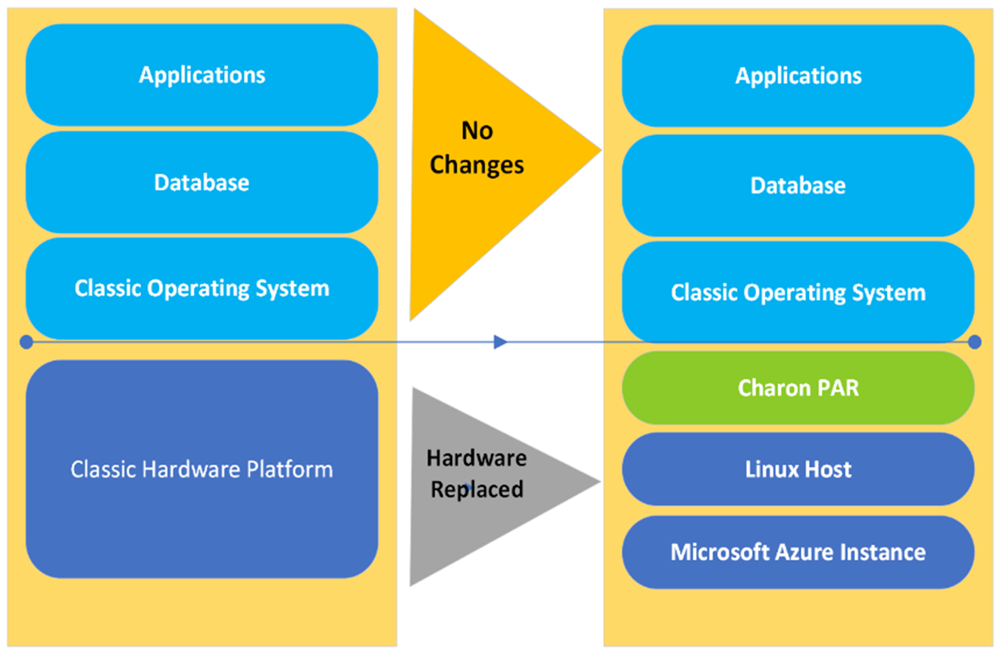

This article describes the lift-and-shift migration of an HP-UX workload to Azure. HP-UX is HP's Unix operating system for PA-RISC workstations and servers. The article shows how emulator software called Charon-PAR from Microsoft partner [Stromasys](https://www.stromasys.com/about) can run HP-UX workloads on Azure.

## Architecture

:::image type="content" source="media/charon-par-hp-ux.png" alt-text="Diagram that shows an architecture for lift-and-shift migration of HP-UX." lightbox="media/charon-par-hp-ux.png" border="false":::

*Download a [Visio file](https://arch-center.azureedge.net/Stromasys-Charon-PAR-for-HP-UX-Reference-Architecture.vsdx) of this architecture.*

### Workflow

Charon-PAR runs on Azure, emulating the PA-RISC systems for HP-UX. On this virtual system (Azure virtual machines), you install the Charon host operating system (Linux), the Charon emulator software, and your legacy operating system (HP-UX) and the associated applications. By using this configuration, you can run an HP-UX workload or application unchanged in an emulation environment on a VM in Azure. The virtual system behaves as though you're using the original hardware.

1. The Charon-PAR software runs on Linux Azure VMs because Charon-PAR requires a Linux host. Charon-PAR emulates the PA-RISC processor architecture. The HP-UX workloads run on these emulated PA-RISC systems.
1. The HP-UX workloads can reside on the solid-state drive (SSD) managed disk of the host Azure VM.
1. One or more host network interface controllers (NICs) can be dedicated to the guest operating system. You can do that by dedicating physical NICs to the guest operating system. Each HP-UX VM gets its own Azure network interface, so it has its own dedicated private IP address. This host-specific network interface is normally used within the Charon configuration for the dedicated use of guest workloads.

   Optionally, you can easily set up Azure public IP addresses on the same network interfaces. There must always be network interfaces dedicated to the guest OS. The host is allocated a network interface. PA9-32 720 allows only one network interface, but PA9-64 allows multiple network interfaces dedicated to the guest OS.
1. Users can  connect via Secure Shell (SSH) directly to the HP-UX VMs (if SSH is supported by the HP-UX version). These VMs have their own dedicated network interface cards and IP addresses.
1. Azure storage account file shares that are mounted on the Linux VM allow mapping of the Charon-PAR virtual tape manager to a locally mounted device, which is backed by an Azure Files storage account in the cloud. This mapping enables low-cost storage of archived tapes for regulatory and compliance purposes.

### Components

- [Azure Virtual Machines](https://azure.microsoft.com/services/virtual-machines) provides on-demand, scalable computing resources in Azure. An Azure VM gives you the flexibility of virtualization without requiring you to buy and maintain physical hardware. Azure VMs offer a choice of operating systems, including Windows and Linux.
- [Azure Virtual Network](https://azure.microsoft.com/services/virtual-network) is the fundamental building block for private networks on Azure. Virtual networks enable Azure resources like VMs to communicate with each other, the internet, and on-premises networks. Azure Virtual Network is like a traditional network in your own datacenter, but it provides the additional scale, availability, and isolation benefits of the Azure infrastructure.
- [Azure Virtual Network interface cards](/azure/virtual-network/virtual-network-network-interface) enable an Azure VM to communicate with internet, Azure, and on-premises resources. As shown in the diagram, you can add additional network interface cards to a single Azure VM, which allows the child VMs to have their own dedicated network interface devices and IP addresses.
- [Azure SSD managed disks](/azure/virtual-machines/managed-disks-overview) are block-level storage volumes managed by Azure that are used with Azure VMs. Ultra disks, premium SSDs, standard SSDs, and standard hard disk drives (HDDs) are available. For this architecture, we recommend either premium SSDs or ultra disk SSDs.
- [Azure ExpressRoute](https://azure.microsoft.com/services/expressroute) enables you to extend your on-premises networks into the Microsoft Cloud over a private connection that's facilitated by a connectivity provider. By using ExpressRoute, you can establish connections to Microsoft Cloud services like Azure and Microsoft 365.
- [Azure Storage](https://azure.microsoft.com/product-categories/storage) and [Azure Files](https://azure.microsoft.com/services/storage/files) offer fully managed file shares in the cloud that can be accessed via the industry-standard Server Message Block (SMB) protocol. Azure file shares can be mounted concurrently by cloud or on-premises deployments of Windows, Linux, and macOS.
- [Stromasys Charon-PAR](https://www.stromasys.com/solutions/charon-par) re-creates the PA-RISC virtual hardware layer on industry standard x86-64 computer systems and VMs. The virtual hardware layer is compatible with a range of HP-UX software that runs on it, so there's no need for code conversion or source code. (See a list of [compatible versions](https://fileserver.stromasys.com/files/list?apikey=par-3-0-4-lp_6363838b&name=).) Charon-PAR is a member of the Stromasys cross-platform hardware virtualization product family. It's a hardware virtualization layer that runs under Linux on industry standard servers. It emulates a range of historical 64-bit and 32-bit PA-RISC hardware and enables existing users of these systems to move to modern Intel-based server hardware.

### Alternatives

This solution works best with premium SSDs or ultra disk SSDs. We recommend premium SSD disks. Azure ultra SSD managed disks are an option for even higher input/output operations per second (IOPS).

For the best performance, we recommend a compute-optimized FX-series VM. You can use the Azure Fs-series for low-end spec servers, but the required minimum for PAR is 3.0 GHz. (3.4 GHz or more is recommended.) An FX-series instance is required for high-end servers.

## Scenario details

Frequently, the evolution and maintenance of business applications is stalled because of underlying legacy hardware. Sometimes the hardware is no longer compatible with newer upgrades and integrations, or, worse, it's no longer supported. Aging infrastructure for mission-critical applications is a concern. The longer the problem remains unsolved, the higher the risk and cost of mitigation. 

These applications might have supported the organization's critical business and evolved over decades, gone through audits and certifications, and have well-established operations around them. Instead of a high-risk and complex re-engineering project, an alternative approach is a low-risk project that moves the applications as-is to a modern and less expensive platform, like Azure, with the help of an emulator. Such a project, often called *lift and shift*, preserves the business functionality of the application and replaces only the hardware, providing business continuity.

Running applications with an emulator on the cloud provides numerous benefits, like security, elasticity, disaster recovery, high availability, and failover. But the most significant benefits are the reduced operational costs and the ease of maintenance. No risky migration projects or changes to the operating system or middleware are required. A server virtualization on Azure can be the first step toward modernization. After the workload is on Azure, you can potentially take advantage of other benefits of the cloud.

This article describes a migration of an HP-UX workload to Azure. It shows how emulator software Charon-PAR can run HP-UX workloads on Azure.

The core business of [Stromasys](https://www.stromasys.com) centers on cross-platform virtualization / server virtualization software that allows owners of HP-UX legacy systems to continue running their mission-critical applications unchanged on new industry standard computer systems. Charon products preserve current application investments by enabling customers to continue to use their existing applications and business processes. Because everything continues to run without modification, no retraining or restaffing is required. Charon products dramatically reduce the cost of ownership by reducing computer footprint, energy consumption, and cooling costs while eliminating the risks and costs that are associated with running on aging hardware.

The Stromasys Charon environment provides a significantly higher level of platform stability. For the first time since the first HP-UX systems were introduced, replacing the actual physical server no longer requires changes to the HP-UX software environment. Charon also provides more platform stability and has virtually unlimited lifetime.

With the steady increase in the use of Azure-hosted systems in the typical corporate environment, an emulated HP-UX system that's hosted on Linux is the best way to host an HP-UX system in these environments.

The following image illustrates the migration approach that's recommended in this article:

Benefits of the lift-and-shift approach to migration include:

- Azure/Charon customers can continue to use existing critical applications without the cost of rewriting, porting, migrating, or retraining.
- Maintenance costs are reduced because these applications are moved to emulated systems that are hosted on Azure.

### Potential use cases

- Enable low-friction lift-and-shift to Azure of on-premises HP-UX workloads that run on PA-RISC server machines.
- Continue to use HP-UX applications that run on end-of-life PA-RISC servers without any changes, but free the applications from old hardware and continue to provide users with the same or better interfaces.
- Manage multiple server hosts and child VMs from a single interface.
- Use low-cost Azure storage to archive tapes for regulatory and compliance purposes.
- Migrate a database to the cloud and run the application in the cloud via emulation without any changes.

## Considerations

These considerations implement the pillars of the Azure Well-Architected Framework, which is a set of guiding tenets that you can use to improve the quality of a workload. For more information, see [Microsoft Azure Well-Architected Framework](/azure/architecture/framework).

### Security

Security provides assurances against deliberate attacks and the abuse of your valuable data and systems. For more information, see [Overview of the security pillar](/azure/architecture/framework/security/overview).

- This solution uses an Azure network security group to manage traffic between Azure resources. For more information, see [Network security groups](/azure/virtual-network/network-security-groups-overview).
- [For increased security, consider using Azure Bastion](https://azure.microsoft.com/services/azure-bastion). Azure Bastion maximizes admin access security by minimizing open ports. It provides secure and seamless RDP/SSH connectivity to virtual network VMs directly from the Azure portal over TLS.

### Cost optimization

Cost optimization is about reducing unnecessary expenses and improving operational efficiencies. For more information, see [Overview of the cost optimization pillar](/azure/architecture/framework/cost/overview).

Azure avoids unnecessary costs by identifying the correct number of resource types, analyzing spending over time, and scaling to meet business needs without overspending. For example, with Azure, you pay as you go. When you don't need workloads, you can shut them down to save money. You can start Charon-PAR as a service manually or automatically when the Azure VM starts. You can stop the service manually or automatically when the host system shuts down. Ensure that you always first shut down the guest OS (HP-UX), then the emulator (Charon), and then the host VM. When you start up the system, do it in the reverse order. Here are a few other cost optimization considerations:

- [Azure Files](https://azure.microsoft.com/pricing/details/storage/files) pricing depends on many factors: data volume, data redundancy, transaction volume, and the number of file sync servers that you use.
- [Azure Storage](https://azure.microsoft.com/pricing/details/storage) costs depend on your data redundancy configurations and volume.
- The VMs in this architecture use either premium SSDs or ultra disk SSDs. For more information, see [Managed Disks pricing](https://azure.microsoft.com/pricing/details/managed-disks).
- For [ExpressRoute](https://azure.microsoft.com/pricing/details/expressroute), you pay a monthly port fee and outbound data transfer charges.

To estimate the cost of Azure products and configurations, use the [Azure pricing calculator](https://azure.microsoft.com/pricing/calculator). To learn more about Stromasys products and their related services, see the [Stromasys website](https://www.stromasys.com).

### Operational excellence

Operational excellence covers the operations processes that deploy an application and keep it running in production. For more information, see [Overview of the operational excellence pillar](/azure/architecture/framework/devops/overview).

For proactive monitoring and management, consider using [Azure Monitor](https://azure.microsoft.com/services/monitor) to monitor Azure services that host migrated HP-UX workloads.

### Performance efficiency

Performance efficiency is the ability of your workload to scale to meet the demands placed on it by users in an efficient manner. For more information, see [Performance efficiency pillar overview](/azure/architecture/framework/scalability/overview).

At least one CPU core for the host operating system and two cores per emulated CPU are required. This solution works best with [compute optimized Azure VMs](/azure/virtual-machines/sizes-compute). Compute optimized VMs have a high CPU-to-memory ratio. The [FX-series](/azure/virtual-machines/fx-series) virtual machine is a new addition to the F-Series. For the best performance, we recommend an FX-series VM. It's designed for high-frequency compute workloads. It features a base frequency of 3.4 GHz and an all-core-turbo clock speed of up to 4.0 GHz. We recommend FX-series for high-end HP-UX workloads.

Fx-series VMs are equipped with 2 GB of RAM and 16 GB of local SSD per CPU core.

## Contributors

*This article is maintained by Microsoft. It was originally written by the following contributors.*

Principal author:

 - [Sunnyma Ghosh](https://www.linkedin.com/in/sunnymaghosh) | Senior Program Manager

Other contributors:

 - [Mick Alberts](https://www.linkedin.com/in/mick-alberts-a24a1414) | Technical Writer
 - [Bhaskar Bandam](https://www.linkedin.com/in/bhaskar-bandam-75202a9) | Senior Program Manager
 
*To see non-public LinkedIn profiles, sign in to LinkedIn.*

## Next steps

- [Charon-PAR](https://www.stromasys.com/solutions/charon-par)
- [Charon on the Azure Cloud | Stromasys](https://www.stromasys.com/solutions/charon-on-the-azure-cloud)
- [What is Azure Virtual Network?](/azure/virtual-network/virtual-networks-overview)
- [Linux virtual machines in Azure](/azure/virtual-machines/linux/overview)
- [What is Azure ExpressRoute?](/azure/expressroute/expressroute-introduction)
- [Create a Linux virtual machine in Azure](/training/modules/create-linux-virtual-machine-in-azure)

For more information, contact [legacy2azure@microsoft.com](mailto:legacy2azure@microsoft.com).

## Related resources

- [Mainframe migration overview](/azure/cloud-adoption-framework/infrastructure/mainframe-migration)
- [Make the switch from mainframes to Azure](/azure/cloud-adoption-framework/infrastructure/mainframe-migration/migration-strategies)
- [Modernize mainframe and midrange data](/azure/architecture/example-scenario/mainframe/modernize-mainframe-data-to-azure)
- [Azure mainframe and midrange architecture concepts and patterns](../../mainframe/mainframe-midrange-architecture.md)