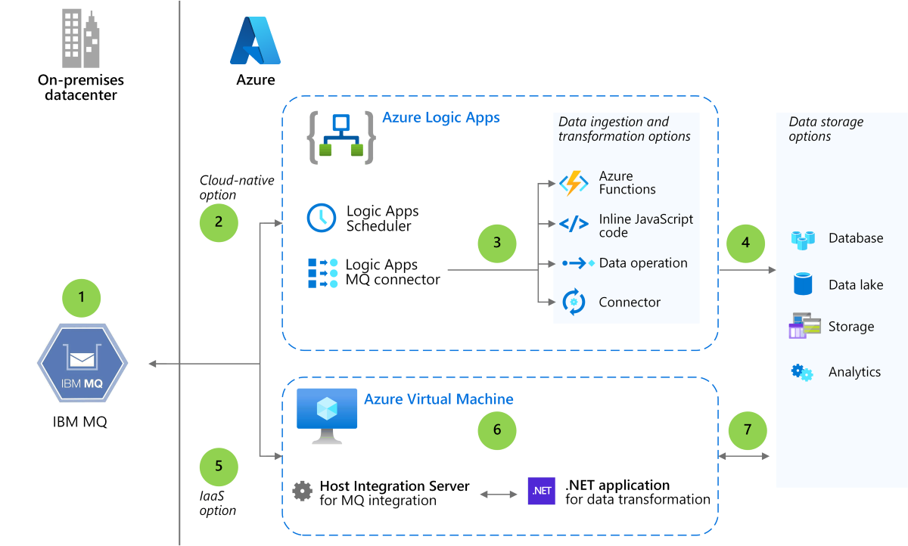
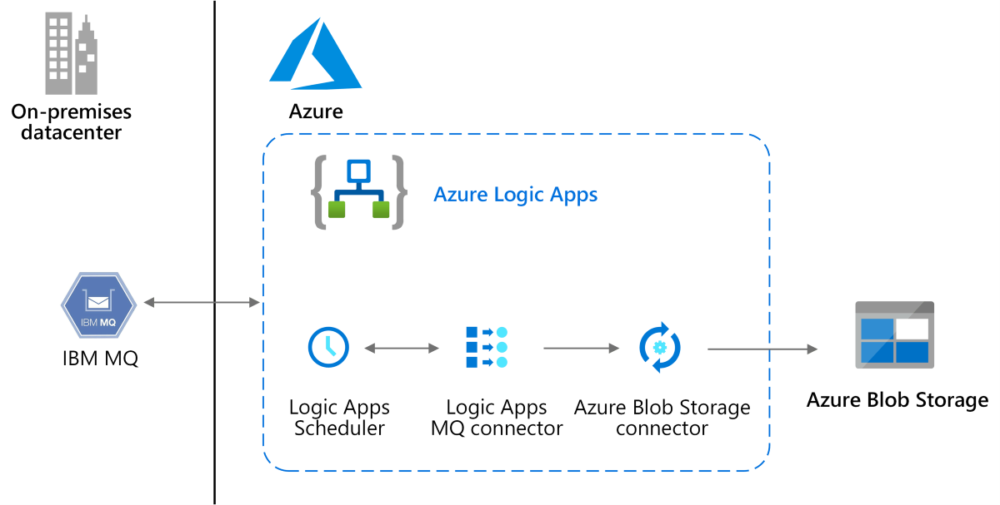

When using Azure as a modern data platform, you have your choice of platform as a service (PaaS) or infrastructure as a service (IaaS). PaaS provides cloud-native options for data ingestion, transformation, and storage. IaaS gives you greater control over your hybrid infrastructure, starting with the size and type of virtual machines (VM) you choose. With either approach, you can take advantage of a variety of fully managed relational, NoSQL, and in-memory databases, storage solutions, and analytics offerings that span proprietary and open-source engines. This example architecture shows both approaches.

## Architecture

### Workflow

1.  IBM MQ is the middleware that acts as a loosely coupled link between a mainframe or midrange system and Azure services. Messages are received and sent according to application requirements to communicate with the mainframe application layer.

1.  In a cloud-native approach, Azure Logic Apps uses the MQ connector to exchange messages with IBM MQ. The Scheduler feature orchestrates the Azure workflow, sending and receiving messages at [recurring intervals](/azure/logic-apps/concepts-schedule-automated-recurring-tasks-workflows) of one second.

1.  The MQ connector can send the messages it reads directly to storage through a connector or send them to be transformed first. Logic Apps includes several options for data transformation, such as an inline
    [JavaScript](/azure/logic-apps/logic-apps-add-run-inline-code) runtime that you can use to run simple JavaScript code snippets for data transformation or [data operations](/azure/logic-apps/logic-apps-perform-data-operations) that perform transformations on JSON, CSV, and HTML table data. You can also create serverless, single-task functions using [Azure Function](/azure/logic-apps/logic-apps-azure-functions).

1.  Data is loaded into storage. Azure offers many managed data storage solutions, each providing different features and capabilities.

1.  In an IaaS approach, a VM runs Microsoft Host Integration Server (HIS) with the BizTalk Adapter for WebSphere MQ. HIS exchanges messages with IBM MQ and exposes orchestration as web service to a custom .NET application.

1.  A .NET application persists the data using any supported Azure data store. For example, the application can mask data or use private endpoints for security.

1.  Data is loaded into storage. Azure offers many managed data storage solutions, each providing different features and capabilities.

### Components

[Azure Logic Apps](https://azure.microsoft.com/services/logic-apps/) provides tools for data orchestration, data integration, and data transformation. It includes hundreds of
[connectors](/connectors/connector-reference/) for accessing data on-premises or in the cloud. Make sure to test throughput and performance before choosing a data storage connector.

[Logic Apps Scheduler](/azure/logic-apps/concepts-schedule-automated-recurring-tasks-workflows) provides triggers for starting and running workflows based on the interval and frequency of recurrence that you specify.

[Logic Apps MQ connector](/azure/connectors/connectors-create-api-mq) connects your Logic Apps workflows to an IBM MQ server on-premises or on Azure. Workflows receive and send messages stored in your MQ server. A Microsoft MQ client is also included for communicating with a remote MQ server across a TCP/IP network. You can use the client to connect to IBM WebSphere MQ 7.5, MQ
8.0, and MQ 9.0, 9.1, and 9.2.

[Host Integration Server](/host-integration-server/core/data-for-host-files) (HIS) can serve as a message integrator through the WebSphere MQ adapter in Microsoft BizTalk Server. A client and server adapter exchange messages between IBM MQ and BizTalk Server. HIS also serves as an MQ listener and can poll the MQ server for messages at intervals you specify.

[.NET](/dotnet/core/introduction) is a free, open-source development platform used in this example to create an app to pull the data through HIS to the data storage layer. It can also be used to access IBM WebSphere MQ Servers directly through the Microsoft Client for MQ.

### Alternatives

-   For the data layer, you have your choice of managed services, including
    [Azure Database for PostgreSQL](/azure/postgresql/), [Azure Database for MySQL](/azure/mysql/overview), [Azure Cosmos DB](/azure/cosmos-db/introduction), [Azure Database for MariaDB](/azure/mariadb/overview), and [Azure SQL](/azure/azure-sql/).

-   For the storage layer, create an enterprise data lake using [Azure Data Lake Storage](/azure/storage/blobs/data-lake-storage-introduction).

-   For the data layer, create a big data analytics platform using [Azure Synapse Analytics](/azure/synapse-analytics/overview-what-is).

## Scenario details

A popular approach in digital transformation scenarios is to see whether
existing applications and middleware tiers can run as-is in a hybrid setup where Microsoft Azure serves as the scalable, distributed data platform. This example describes a data-first approach to middleware integration that enables IBM message queues (MQs) running on mainframe or midrange systems to work with Azure services so you can find the best data platform for your workload.

When using Azure as a modern data platform, you have your choice of platform as a service (PaaS) or infrastructure as a service (IaaS). PaaS provides cloud-native options for data ingestion, transformation, and storage. IaaS gives you greater control over your hybrid infrastructure, starting with the size and type of virtual machines (VM) you choose. With either approach, you can take advantage of a variety of fully managed relational, NoSQL, and in-memory databases, storage solutions, and analytics offerings that span proprietary and open-source engines.

This example architecture shows both approaches:

-   **Cloud-native PaaS**. [Azure Logic Apps](/azure/logic-apps/logic-apps-overview) exchanges messages with [IBM MQ](https://www.ibm.com/cloud/learn/message-queues) through the [MQ connector](/azure/connectors/connectors-create-api-mq#:~:text=The%20logic%20app%20where%20you%20want%20to%20add,For%20example,%20you%20can%20use%20the%20Recurrence%20trigger.). Additional
    [connectors](/connectors/connector-reference/) provide quick access to events, data, and actions across other apps, services, systems, protocols, and platforms. Logic Apps also includes tools for transforming data from the queue if you need to modify the data format, structure, or values before storing it on Azure or sending it to the application layer.

-   **VM-based IaaS**. Running [Microsoft Host Integration Server](/host-integration-server/what-is-his) (HIS) on a VM, you can use a messaging integration component that connects to IBM MQ. You control the data transformation process by creating a .NET application to read and write messages. The application can persist data in the Azure data store of your choice, and you can choose the MQ server's polling interval.

### Potential use cases

Either of these approaches can be used to:

-   Enable loosely coupled applications that communicate through messaging systems to use the Azure data platform.

-   Sync or replicate data incrementally between a mainframe or midrange system and Azure.

-   Flow event messages between mainframe or midrange systems and Azure.

## Considerations

A hybrid datacenter configuration make sense for organizations that are developing their cloud strategies. Connecting to Azure can help bridge the gaps in your datacenter, enhance performance, improve business continuity, and expand your reach globally.

For example, applications on-premises can communicate with a modern data platform on Azure and begin taking advantage of big data analytics or machine learning. If you need a cost-effective storage solution, you can replicate mainframe data, store it on Azure, and keep the data in sync. Azure can also add the scale needed to support online transaction processing (OLTP), batch, and data ingestion systems.

### Availability

Azure service-level agreements (SLAs) describe your uptime guarantees. The SLAs for various components can vary. For example, Azure Logic Apps will be available at least 99.9 percent of the time. Configuration settings you choose can improve SLA.

### Performance efficiency

Make sure to test the throughput and performance of your data transformation layer before you finalize your architectural approach. Performance depends on several factors, including a workload's message size, latency, and the connectors that are used. Testing helps you find the most compatible target data platform.

### Storage

In this example architecture, Logic Apps connectors can be used to send messages directly to [Azure Storage](/azure/storage/common/storage-introduction) and [Azure Data Lake Storage](/azure/storage/blobs/data-lake-storage-introduction). For example, Logic Apps includes the [Azure Blob Storage connector](/connectors/azureblob/) as the following figure shows. The connector makes it easy to store massive amounts of unstructured data in [Azure Blob Storage](/azure/storage/blobs/storage-blobs-introduction). Your data becomes accessible from anywhere in the world via HTTP or HTTPS. Blob storage also supports [Azure Data Lake Storage Gen2](/azure/storage/blobs/data-lake-storage-introduction), a big data analytics solution for the cloud. Data is loaded into storage using an Azure service such as the
[AzCopy](/azure/storage/common/storage-ref-azcopy) tool, [Azure Data Factory](/azure/data-factory/introduction), or another solution that can connect to storage.

Both the PaaS and IaaS architecture options support many popular managed database services. You can load data using a custom-built loader, a vendor solution, or a managed service such as [Azure Data Factory](/azure/data-factory/introduction). Database options include:

-   [Azure SQL Database](https://azure.microsoft.com/services/sql-database/). Part of the Azure SQL family, Azure SQL Database is the intelligent, scalable, relational database service built for the cloud. Always up to date, it includes automated features that optimize performance, durability, and scalability, so you can focus on building new applications.

-   [Azure SQL Managed Instance](https://azure.microsoft.com/services/azure-sql/sql-managed-instance/). Part of the Azure SQL service portfolio, SQL Managed Instance combines the broadest SQL Server engine compatibility with all the benefits of a fully managed PaaS.

-   [Azure SQL on Azure Virtual Machines](https://azure.microsoft.com/en-in/services/virtual-machines/sql-server/). Part of the Azure SQL family, this cost-effective option is designed for lifting and shifting SQL Server workloads to Azure. It combines the performance, security, and analytics of SQL Server with the flexibility and hybrid connectivity of Azure—with 100 percent code compatibility. Now includes SQL Server 2019 images.

-   [Azure Database for PostgreSQL](https://azure.microsoft.com/services/postgresql/). This fully managed relational database service is based on the community edition of the open-source PostgreSQL database engine. You can focus on application innovation instead of database management and easily scale your workloads.

-   [Azure Database for MySQL](/azure/mysql/overview). This fully managed relational database service is based on the community edition of the open-source MySQL database engine.

-   [Azure Cosmos DB](/azure/cosmos-db/introduction). A globally distributed, multi-model database, Azure Cosmos DB provides throughput and storage that scales elastically and independently across any number of geographic regions. It is a fully managed NoSQL database service that guarantees single-digit-millisecond latencies at the 99th percentile anywhere in the world.

-   [Azure Synapse Analytics](/azure/synapse-analytics/overview-what-is). This enterprise analytics service accelerates time to insight across data warehouses and big data systems.

### Cost optimization

This article outlines a wide range of Azure Services to demonstrate the various possibilities and you probably won't use them all for MQ integration.

-   Use the [Azure pricing calculator](https://azure.microsoft.com/pricing/calculator/) to estimate costs for the Azure resources.

-   Use the [BizTalk pricing](https://azure.microsoft.com/pricing/details/biztalk-services/) to understand the pricing for the HIS solution.

## Contributors

*This article is maintained by Microsoft. It was originally written by the following contributors.* 

Principal author:

 - [Ashish Khandelwal](https://www.linkedin.com/in/ashish-khandelwal-839a851a3/) | Principal Engineering Architecture Manager
 
*To see non-public LinkedIn profiles, sign in to LinkedIn.*

## Next steps

-   For more information, email [Azure Data Engineering - Mainframe & Midrange Modernization](mailto:datasqlninja@microsoft.com) (datasqlninja\@microsoft.com).

-   Read the [Azure Database Migration Guides](https://datamigration.microsoft.com/).

## Related resources

-   [Azure data architecture guide](../../data-guide/index.md)

-   [Azure data platform end-to-end](../dataplate2e/data-platform-end-to-end.yml)
