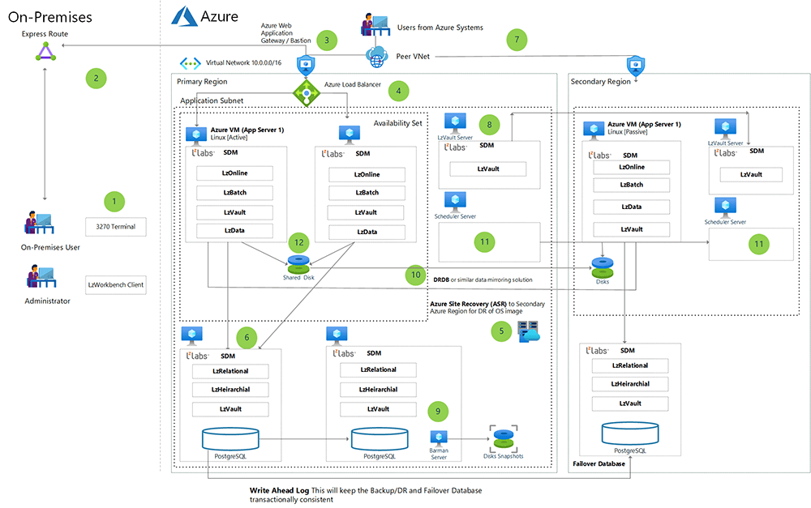

<!-- cSpell:ignore lzlabs RACF HDDs -->

LzLabs Software Defined Mainframe (SDM) significantly reduces the risk and complexity of legacy workload rehosting by eliminating the need to find, modify, and recompile source code of legacy applications. This approach enables z/Architecture binary executable programs to operate at native speeds on x86_64 architecture computers running an open systems software stack, opening the path to legacy modernization.

## Architecture

*Download an [SVG file](./media/lzlabs-software-defined-mainframe-in-azure-architecture.svg) of this architecture.*

### Workflow

1. LzLabs SDM applications are accessed just like ordinary mainframe applications via a 3270 terminal. You can use any terminal emulator you like. For management, administration, and other activities, the [LzWorkbench client](https://www.lzlabs.com/resources/lzworkbench-data-sheet//) is used. The server component runs on the SDM VM.
1. The port access is typically configured to adapt to the security requirements of the customer.
1. For a secure implementation of SDM, a web services front end should be implemented that consists of:
   - [Azure Application Gateway](https://azure.microsoft.com/services/application-gateway/) for any CICS APIs accessing via the web,
   - [Azure Bastion](https://azure.microsoft.com/services/azure-bastion/) for secure access to manage the VMs,
   - and an [Azure Load Balancer](/azure/load-balancer/load-balancer-overview).
1. SDM can be configured for failover with virtual network (VNet) peering to the backup, disaster recovery (DR), and Secondary Azure regions. This improves the availability of SDM for production workloads because Azure keeps a consistent replica in case the initial VM goes offline.
1. The SDM virtual machine in the production environment is replicated and kept in sync in the Failover Region by [Azure Site Recovery](https://azure.microsoft.com/services/site-recovery/). This service keeps the main OS disk for production and the attached disk images in sync with the Secondary Region SDM. It does this for all attached disks except the disk responsible for index file processing (see item 10). Site Recovery is also used to keep all of the other VM images in sync with the Secondary Region.
1. The database in this architecture is [PostgreSQL IaaS](/azure/postgresql/overview-postgres-choose-server-options). Currently, Azure PostgreSQL Service cannot be used, and PostgreSQL IaaS must be used with SDM in deployments. This is because of a limitation in Azure PostgreSQL for processing user-defined data types (UDT). The database instance in the Secondary Region is kept up to date with the Write Ahead Transaction Log. This allows for cross-region failover. When failover occurs, the mode will be set to active. The same process is used to keep the production failover database transactionally consistent within the Production Region. By using the Write Ahead Transaction Log to keep these two replicas in sync, the database tier is highly available. **Note:** For best performance, the database VM and the SDM VM must be placed in an [Azure proximity placement group](/azure/virtual-machines/co-location).
1. A web services front end needs to be deployed for the DR Region in order to maintain secure access to the system. Many mainframe workloads have an API web services layer to access CICS transactions and DB2 data.
1. For RACF and Top Secret identity integration using Active Directory extensions, LzVault provides authentication and authorization in Azure for the security rules migrated from the mainframe.
1. The Barman Server is configured in the Data Tier. This provides snapshot replicas of the PostgreSQL database for point-in-time recovery within both the Production Region and the Secondary Region.
1. As mentioned in item 5, the disk that maintains the indexed file processing for SDM needs to be synchronized across regions using a database mirroring solution. This is because Azure Site Recovery cannot guarantee the transaction consistency needed for a database. Since the indexed file processing is not within PostgreSQL, a solution must be used that can provide this.
1. To accommodate the scheduling of batch job processing, a scheduler such as [Azure Logic Apps](https://azure.microsoft.com/services/logic-apps/) or SMA must be used.
1. To provide availability, there are two SDM VMs deployed into an Azure availability set. [Azure Load Balancer](/azure/load-balancer/load-balancer-overview) provides load balancing services to the two VMs. State is shared between the two VMs using an [Azure shared disk](/azure/virtual-machines/disks-shared). This is replicated via DRDB to the DR instance.

### Components

- [Azure Virtual Machines](https://azure.microsoft.com/services/virtual-machines) (VMs) is one of several types of on-demand, scalable computing resources that Azure offers. An Azure VM gives you the flexibility of virtualization without having to buy and maintain the physical hardware that runs it.
- [Virtual networks](https://azure.microsoft.com/services/virtual-network) (VNets) are the fundamental building block for your private network in Azure Virtual Network. Virtual Network enables many types of Azure resources, including VMs, to securely communicate with each other, the internet, and on-premises networks. Virtual Network is similar to a traditional network that you'd operate in your own datacenter but with the added benefits of Azure's infrastructure, such as scaling, availability, and isolation.
- [Azure Virtual Network Interface](/azure/virtual-network/virtual-network-network-interface) (NIC) is a network interface that enables an Azure Virtual Machine to communicate with the internet, other resources in Azure, and on-premises resources. As shown in this architecture, you can add more NICs to the same VM, allowing the Solaris child-VMs to have their own dedicated network interface device and IP address.
- [Azure SSD managed disks](/azure/virtual-machines/managed-disks-overview) are block-level storage volumes that are managed by Azure and used with Azure Virtual Machines. The available types of disks are Ultra Disk, Premium SSDs, Standard SSDs, and Standard Hard Disk Drives (HDDs). For this architecture, we recommend either Premium SSDs or Ultra Disk SSDs.
- [Azure Storage](https://azure.microsoft.com/product-categories/storage) and [Azure Files](https://azure.microsoft.com/services/storage/files/) offer fully managed file shares in the cloud that are accessible via the industry- standard Server Message Block (SMB) protocol. Azure file shares can be mounted concurrently by cloud or on-premises deployments of Windows, Linux, and macOS.
- [Azure ExpressRoute](https://azure.microsoft.com/services/expressroute) lets you extend your on-premises networks into the Microsoft cloud over a private connection facilitated by a connectivity provider. With ExpressRoute, you can establish connections to Microsoft cloud services, such as Microsoft Azure and Office 365.
- [Azure SQL Database](https://azure.microsoft.com/products/azure-sql/database) is a fully managed platform as a service (PaaS) database engine that handles most of the database management functions without user involvement, including upgrading, patching, backups, and monitoring. Azure SQL Database is always running on the latest stable version of the SQL Server database engine and patched OS with 99.99-percent availability. PaaS capabilities that are built into Azure SQL Database enable you to focus on the domain-specific database administration and optimization activities that are critical for your business.

## Scenario details

LzLabs Software Defined Mainframe (SDM) is a workload rehosting and mainframe application modernization platform. SDM enables mainframe legacy applications to execute on open systems with no requirement for source-code changes, recompilation, or conversion of data types. SDM also has features that allow legacy applications to be gracefully modernized to contemporary languages and implementations, without compromising the integrity or operation of the system as a whole.

SDM significantly reduces the risk and complexity of legacy workload rehosting by eliminating the need to find, modify, and recompile source code of legacy applications. This approach enables z/Architecture binary executable programs to operate at native speeds on x86_64 architecture computers running an open systems software stack, opening the path to legacy modernization.

### Potential use cases

- **No source code.** LzLabs is a solution for customers who have mainframe workloads but do not have the source code for the running applications. This can happen if the solution was a customizable off-the-shelf solution (COTS) purchased from an independent software vendor that did not the source code to the IP. Also, since many of these COBOL-based applications were written long ago, the source code could have been lost or misplaced. LzLabs solves this problem because all that is needed are the load modules (binaries) for execution in SDM.
- **Customer has source code and wants to rehost.** The customer might still have the source code and simply want to rehost their mainframe workloads to reduce cost and enjoy the benefits of a cloud platform like Azure. The COBOL code can be maintained in the SDM in a modern DevOps environment.
- **Failover.** To increase uptime and avoid potential disruptions in business continuity, customers can use LzLabs SDM for a failover environment. In this case, the load modules are loaded into the SDM and used as a secondary environment if the production environment becomes unavailable.

## Considerations

The following considerations, based on the [Azure Well-Architected Framework](/azure/architecture/framework/index), apply to this solution.

### Availability

Availability for the application tier is provided with Site Recovery as shown in the diagram. Since LzLabs SDM leverages PostgreSQL for the database tier, availability is provided with a write-ahead transaction log. This ensures that the secondary database is transactionally consistent with the production database.

### Operations

The Azure environment in the diagram is managed either with the Azure portal or [Azure Resource Manager (ARM) templates and scripts](/azure/azure-resource-manager/templates/). This allows for the administration of assets (like resizing) and managing security and access. Management of the actual SDM environment is provided via the LzWorkbench administration tool. This allows for the creation and management of execution environments in the SDM.

### Performance efficiency

When migrating mainframe workloads to Azure, keep in mind that the MIPS per vCPU ratio ranges from 50 to 150 MIPS per vCPU.  This can vary depending on the type of workload. You will need to profile the mainframe workload for online and batch environments, and then size resources accordingly.

### Scalability

Currently, the solution for scaling SDM is to scale up the virtual machines by adding more vCPUs and memory.

### Security

Access to Azure assets is managed via the Azure portal and/or Azure Resource Manager. Security for the SDM is managed using the Vault component of SDM. This migrates the security and permissions from RACF or Top Secret into an LDAP-based environment for management in Azure.

### Cost optimization

To estimate the cost of Azure products and configurations, visit the [Azure pricing calculator](https://azure.microsoft.com/pricing/calculator/).

To learn more about pricing for LzLabs Software Defined Mainframe products and their related services, visit the [LzLabs website](https://www.lzlabs.com/).

## Contributors

*This article is maintained by Microsoft. It was originally written by the following contributors.* 

Principal author:

 - [Jonathon Frost](https://www.linkedin.com/in/jjfrost/) | Principal Software Engineer
 
*To see non-public LinkedIn profiles, sign in to LinkedIn.*

## Next steps

- For more information, contact legacy2azure@microsoft.com

See the following resources from LzLabs:

- [LzLabs website](https://www.lzlabs.com)
- [LzLabs Software Defined Mainframe product overview](https://www.lzlabs.com/mainframe-software/)
- [LzWorkbench](https://www.lzlabs.com/resources/lzworkbench-data-sheet/)
- [LzLabs video library](https://www.lzlabs.com/resources/demo-video-unlock/)

See the following documentation from Microsoft:

- [Virtual machines in Azure](/azure/virtual-machines)
- [Azure Virtual Network documentation](/azure/virtual-network)
- [Azure Resource Manager template documentation](/azure/azure-resource-manager/templates)
- [Azure ExpressRoute documentation](/azure/expressroute)
- [Demystifying mainframe to Azure migration white paper](https://azure.microsoft.com/resources/demystifying-mainframe-to-azure-migration-white-paper/)
- [Azure Mainframe Migration center](https://azure.microsoft.com/migration/mainframe/)
- [Mainframe migration overview](/azure/cloud-adoption-framework/infrastructure/mainframe-migration/)
- [Mainframe workloads supported on Azure](/azure/virtual-machines/workloads/mainframe-rehosting/partner-workloads)
- [Mainframe rehosting on Azure virtual machines](/azure/virtual-machines/workloads/mainframe-rehosting/overview)

## Related resources

See the following related articles on Azure Architecture Center:

- [Azure mainframe and midrange architecture concepts and patterns](/azure/architecture/mainframe/mainframe-midrange-architecture)
- [Migrate AIX workloads to Azure with Skytap](/azure/architecture/example-scenario/mainframe/migrate-aix-workloads-to-azure-with-skytap)
- [Refactor mainframe applications with Astadia](/azure/architecture/example-scenario/mainframe/refactor-mainframe-applications-astadia)
- [Refactor mainframe applications with Advanced](/azure/architecture/example-scenario/mainframe/refactor-mainframe-applications-advanced)
