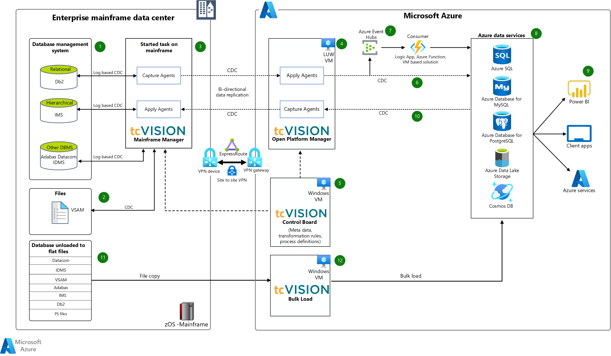

tcVISION is a data replication solution from BOS Software. It provides an IBM mainframe integration solution for mainframe data replication, data synchronization, data migration, and change data capture (CDC) to multiple Azure data platform services.

## Architecture

*Download a [Visio file](https://arch-center.azureedge.net/Mainframe-Realtime-Batch-Data-Replication-Azure-tcVISION.vsdx) of this architecture.*

The tcVISION logo is a trademark of its respective company. No endorsement is implied by the use of this mark.

### Workflow

1. The tcVISION data replication solution supports CDC from many mainframe-based databases. Examples include Db2, IMS/DB, Software AG ADABAS, CA Datacom, CA IDMS, and so on. tcVISION provides log-based CDC agents to capture the change data on the record level. This log-based CDC puts negligible overhead on production source databases.
1. tcVISION also supports CDC from virtual storage access method (VSAM) files.
1. A task starts on the mainframe. Started tasks (STCs) are created on the mainframe as part of tcVISION software installation. Two vital STCs are:
   * Capture agent, which captures changed data from the source.
   * Apply agent, which uses DBMS-specific APIs for efficiently writing changed data to the target.
   > [!NOTE]
   > For Db2 z/OS, tcVISION also offers an Agentless CDC solution by way of a Db2 user-defined type (UDT) that doesn't need a started task.

1. The Open Platform Manager acts as a replication server. This server contains utilities for automatic data mapping to generate metadata for sources and targets. It contains the rule set for extracting the data from the source. And the server transforms and processes the data for the target systems and writes the data into the targets. You can install this component in Linux, Unix, and Windows Operating System. 
1. The tcVISION Control Board or dashboard provides administration, review, operation, control, and monitoring of the data exchange processes. The tcVISION command line utilities help automate data exchange processes and manage the unattended operations of the data synchronization process.
1. The tcVISION Apply Agent uses database management system-specific APIs. These APIs efficiently implement real-time data changes in combination with CDC technology at the source to the target Azure Data Services (as in, database and files).
1. tcVISION supports direct streaming of the changed data into Azure Event Hubs or Kafka. These events are then processed by Azure Logic Apps, a function, or a custom solution in the virtual machine.
1. The Azure data platform targets supported by tcVISION include Azure SQL Database, Azure Database for PostgreSQL, and MySQL, Azure Cosmos DB, Azure Data Lake Storage, and so on.
1. After data lands in Azure data platform, it's consumed by Azure services or others that are permitted to see it. Examples include Power BI, Synapse Analytics, or even a custom application.
1. The tcVISION product can even reverse-sync capture changes from an Azure database platform (Azure SQL Database, MySQL, PostgreSQL, Azure Data Lake Storage, and so on) and write them back to the mainframe data tier.
1. The mainframe database backup and unload files are copied to an Azure VM with tcVISION for bulk load processing.
1. The tcVISION bulk load performs an initial target database load using mainframe source data. Source data can be read directly from the mainframe data store or from a mainframe backup or unload. The bulk load provides an automatic translation of mainframe data types, such as extended binary coded decimal interchange code (EBCDIC)-packed fields. Typically, for the best performance, use the backup or unload data versus a direct read of the mainframe database. The reason for not reading directly is because moving unload or backup data to the requisite tcVISION Azure VM and using native database loaders minimizes network IO and reduces load time.

### Components

The solution uses the following components.

#### Networking and identity components

  - [Azure ExpressRoute](/azure/expressroute/expressroute-introduction) - ExpressRoute lets you extend your on-premises networks into the Microsoft Cloud over a private connection handled by a connectivity provider. With ExpressRoute, you can establish connections to cloud services, such as Microsoft Azure and Microsoft 365.
  - [Azure VPN Gateway](/azure/vpn-gateway/vpn-gateway-about-vpngateways) - A VPN gateway is a specific type of virtual network gateway that sends encrypted traffic between an Azure virtual network and an on-premises location over the public internet.
  - [Azure Active Directory (Azure AD)](/azure/active-directory/fundamentals/active-directory-whatis) - Azure Active Directory is an identity and access management service that you can sync with an on-premises directory.

#### Application components

  - [Azure Logic Apps](/azure/logic-apps/logic-apps-overview) - Logic Apps helps create and run automated recurring tasks and processes on a schedule. You can call services inside and outside Azure, such as HTTP or HTTPS endpoints, post messages to Azure services such as Azure Storage and Azure Service Bus, or upload files to a file share.
  - [Azure Functions](/azure/azure-functions/functions-overview) - Functions lets you run small pieces of code, or functions, without worrying about application infrastructure. With Functions, the cloud infrastructure provides the up-to-date servers you need to keep your application running at scale.
  - [Azure Virtual Machines](https://azure.microsoft.com/services/virtual-machines/) - Azure VMs are on-demand, scalable computing resources that are available with Azure. An Azure VM provides the flexibility of virtualization. But it eliminates the maintenance demands of physical hardware. Azure VMs offer a choice of operating systems, including Windows and Linux.

#### Storage components

  - [Azure Storage](/azure/storage/common/storage-introduction) - This offers un-managed storage solutions like Azure Blob, Azure Tables, Azure Files, and Azure Queues. Files can particularly come in handy for reengineered mainframe solutions. This provides an effective add-on with the managed SQL storage.
  - [Azure SQL](/azure/azure-sql/database/sql-database-paas-overview) - This is a fully managed PaaS service for SQL Server from Azure. The relational data can be migrated and used efficiently with other Azure services (Azure SQL Managed Instance, Azure SQL VM, Azure Database for PostgreSQL, Azure Database for MariaDB, MySQL, and so on.)
  - [Azure Cosmos DB](/azure/cosmos-db/introduction) - Azure Cosmos DB is no-SQL offering that you can use to migrate non-tabular data off the mainframe.

#### Monitoring components

  - [Azure Monitor](/azure/azure-monitor/overview) - Azure Monitor delivers a comprehensive solution for collecting, analyzing, and acting on telemetry from cloud and on-premises environments.
  - [Application Insights](/azure/azure-monitor/app/app-insights-overview) - Application telemetry is sent to Application Insights for analysis and presentation.
  - [Azure Monitor Logs](/azure/azure-monitor/logs/data-platform-logs) - Azure Monitor Logs is a feature of Azure Monitor that collects and organizes log and performance data from monitored resources. Data from different sources such as platform logs from Azure services, log and performance data from VM agents, and usage and performance data from applications can be consolidated into a single workspace so they can be analyzed together using a sophisticated query language that's capable of quickly analyzing millions of records.
  - [Log Analytics](/azure/azure-monitor/log-query/log-query-overview) - Log queries help you gain the value of the data collected in Azure Monitor Logs. A powerful query language lets you join data from multiple tables, aggregate large sets of data, and perform complex operations with minimal code.

## Considerations

These considerations implement the pillars of the Azure Well-Architected Framework, which is a set of guiding tenets that can be used to improve the quality of a workload. For more information, see [Microsoft Azure Well-Architected Framework](/azure/architecture/framework).

### Reliability

* Set up tcVISION Open Platform Manager (OPM) on Azure virtual machines deployed in separate availability zones to provide high availability. In case of failures, a secondary tcVISION OPM is activated and it communicates its IP address to tcVISION Mainframe Manager. The mainframe starts communicating with the new tcVISION OPM that continues processing at its next logical restart point, using a combination of logical unit of work (LUW) and restart files.
* Design database services in the Azure support zone redundancy to fail over to a secondary node in case of an outage or during a maintenance window.
* Use Azure Monitor and Application Insights on top of Log Analytics to monitor the health of the Azure resource. You can set alerts for proactive management.
* For more information about resiliency in Azure, see [Designing reliable Azure applications](/azure/architecture/framework/resiliency/app-design).

### Scalability

* CDC: Set up tcVISION scaling for CDC processing by running multiple parallel replication streams. First, analyze the files included in logical transactions. These files must be processed together in sequence. The tcVISION CDC process ensures the integrity of each logical transaction, and these files must be processed together. For instance, sets of tables that don't participate in common transactions might be divided into parallel tasks by creating multiple processing scripts.
* Bulk Load: tcVISION can run parallel concurrent bulk load processing simultaneously on a single Azure VM or on multiple Azure VMs giving horizontal scalability. Bulk load large tables faster by splitting the process into multiple tasks, either by arbitrary intervals, or by way of row filtering. Row filtering can use a key, partition key, date, and so on.
* Auto scaling: The SQL Database serverless compute tier provides an auto scaling option based on workload. Other Azure databases can be scaled up and down by using automation to meet the workload demands.
* For more information, see [Autoscaling best practices in Azure](/azure/architecture/best-practices/auto-scaling).

### Security

Security provides assurances against deliberate attacks and the abuse of your valuable data and systems. For more information, see [Overview of the security pillar](/azure/architecture/framework/security/overview).

* Control authentication and access for tcVISION with Azure Active Directory.
* Encrypt data transfer between tcVISION products (mainframe to Azure) with transport layer security (TLS).
* Use Express Route or site-to-site VPN for private and efficient connection to Azure from an on-premises environment.
* Authenticate Azure resources with Azure AD and manage permissions with role-based access control.
* Use the database services in Azure to support various security options like data encryption at rest (TDE), data encryption in transit (TLS), and data encryption while processing, as in, always encrypted.
* For guidelines about designing secure solutions, see the [Azure security documentation](/azure/security).
* To find out your security baseline, see [Azure security baseline assessment](/security/benchmark/azure/security-baselines-overview).

### Cost optimization

Cost optimization is about looking at ways to reduce unnecessary expenses and improve operational efficiencies. For more information, see [Overview of the cost optimization pillar](/azure/architecture/framework/cost/overview). Use the [Azure pricing calculator](https://azure.microsoft.com/pricing/calculator) to estimate the cost of implementing this solution.

## Scenario details

Mainframes are servers that process a large number of transactions. Mainframe applications generate and consume large amounts of data daily. With the introduction of public clouds that offer elasticity, cost optimization, ease of use, and easy integration, many x86 and mainframe applications are moving to the cloud. It's now important for organizations to have a well-designed mainframe-to-cloud data integration and migration strategy.

This scenario shows how to integrate an IBM Z (mainframe) data tier with Azure cloud data platform. To integrate mainframe with Azure cloud data platform, use [tcVISION](https://www.tcvision.de/tcvision-real-time-mainframe-data-integration) software provided by [B.O.S. Software](https://www.tcvision.de/tcvision-real-time-mainframe-data-integration) and [Treehouse Software](https://www.treehouse.com/tcVISION.shtml).

### Potential use cases

This solution is ideal for large-scale data migrations to Azure data platform. Consider this scenario for the following use cases:

* Full migration of a mainframe data tier: In this use case, a customer wants to move all their Db2, IMS, IDMS, files, and so on from a mainframe to the Azure data platform.
* Co-existence of mainframe and Azure based applications: In this use case, a customer often has a requirement to support a bidirectional sync between mainframe and Azure data platform.
* Archival: In this use case, a customer wants to store data for audit and compliance purposes but doesn't want to access this data frequently. Azure storage provides a low-cost solution to store archive data.

## Contributors

*This article is maintained by Microsoft. It was originally written by the following contributors.*

Principal authors:

 - [Sandip Khandelwal](https://www.linkedin.com/in/sandip-khandelwal-64326a7/) | Senior Engineering Architect

Other contributors:

 - [Liz Casey](https://www.linkedin.com/in/elizabethhlizfloriocasey) | Senior Content Developer
 
*To see non-public LinkedIn profiles, sign in to LinkedIn.*

## Next steps

* [Application Insights](/azure/azure-monitor/app/app-insights-overview)
* [Architect a data platform in Azure](/training/paths/architect-data-platform/)
* [Azure AD](https://azure.microsoft.com/services/active-directory/)
* [Azure Artifacts](https://azure.microsoft.com/services/devops/artifacts/)
* [Azure Boards](https://azure.microsoft.com/services/devops/boards/)
* [Azure Cosmos DB](https://azure.microsoft.com/services/cosmos-db/)
* [Azure Data Engineering for mainframe and midrange modernization](mailto:datasqlninja@microsoft.com).
* [Azure ExpressRoute](https://azure.microsoft.com/services/expressroute/)
* [Azure Functions](https://azure.microsoft.com/services/functions/)
* [Azure Logic Apps](/azure/logic-apps/logic-apps-overview)
* [Azure Monitor](https://azure.microsoft.com/services/monitor/)
* [Azure Monitor Logs](/azure/azure-monitor/logs/data-platform-logs)
* [Azure Pipelines](https://azure.microsoft.com/services/devops/pipelines/)
* [Azure Repos](https://azure.microsoft.com/services/devops/repos/)
* [Azure SQL](https://azure.microsoft.com/products/azure-sql/)
* [Azure Storage](https://azure.microsoft.com/products/category/storage/)
* [Azure Test Plans](https://azure.microsoft.com/services/devops/test-plans/)
* [Azure Virtual Machines](https://azure.microsoft.com/services/virtual-machines/#overview)
* [Azure VPN Gateway](https://azure.microsoft.com/services/vpn-gateway/)
* [Data migration guide](https://datamigration.microsoft.com/)
* [Data platform modernization](/training/modules/introduction-data-platform-modernization/)
* [Design your data migration to Azure](/training/modules/design-your-migration-to-azure/)
* [Log Analytics](/azure/azure-monitor/log-query/log-query-overview)

## Related resources

* [Modernize mainframe and midrange data](/azure/architecture/example-scenario/mainframe/modernize-mainframe-data-to-azure)
* [Replicate and synch mainframe data in Azure](../../reference-architectures/migration/sync-mainframe-data-with-azure.yml)
