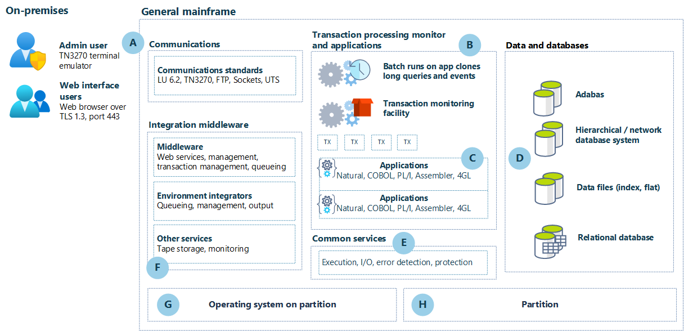

Software AG provides a popular 4GL mainframe platform that's based on the Natural programming language and the Adabas database. This article provides an architecture for organizations that are using mainframe computers that run Adabas & Natural and that are looking for ways to modernize these workloads and move them to the cloud.

## Mainframe architecture 

This diagram illustrates an example of a mainframe with Software AG's Adabas & Natural modules installed, before migration to Azure. This example shows an IBM z/OS architecture.

*Download a [Visio file](https://arch-center.azureedge.net/mainframe-pre-migration.vsdx) of this architecture.*

### Workflow

A. Input occurs over TCP/IP, including TN3270 and HTTP(S). Input into the mainframe uses standard mainframe protocols. 

B. Receiving applications can be either batch or online systems. 

C. Natural, COBOL, PL/I, Assembler, or other compatible languages run in an enabled environment. 

D. Data and database services commonly used are hierarchical/network database systems and relational database types. 

E. Common services include program execution, I/O operations, error detection, and protection within the environment. 

F. Middleware and utilities manage services like tape storage, queueing, output, and web services within the environment. 

G. Operating systems provide the interface between the engine and the software that it runs. 

H. Partitions are needed to run separate workloads and to segregate work types within the environment. 

## Azure architecture

This diagram shows how you can migrate the legacy architecture to Azure by using a refactoring approach to modernize the system:

:::image type="content" border="false" source="media/mainframe-software-ag-azure-refactor.png" alt-text="Diagram that shows the legacy architecture after migration to Azure." lightbox="media/mainframe-software-ag-azure-refactor.png":::

*Download a [Visio file](https://arch-center.azureedge.net/mainframe-SoftwareAG-azure-refactor-r1.vsdx) of this architecture.*

### Workflow

1. **Input.** Input typically occurs either via Azure ExpressRoute from remote clients or via other applications currently running Azure. In either case, TCP/IP connections are the primary means of connection to the system. TLS port 443 provides access to web-based applications. You can leave the web-based applications presentation layer virtually unchanged to minimize user retraining. Alternatively, you can update this layer with modern UX frameworks per your requirements. For admin access to the VMs, you can use Azure Bastion hosts to maximize security by minimizing open ports.

1. **Access in Azure.** In Azure, access to the application compute clusters is provided via an Azure load balancer. This approach allows scale-out compute resources to process the input work. Both level 7 (application level) and level 4 (network protocol level) load balancers are available. The type that you use depends on how the application input reaches the entry point of the compute cluster.  

1. **Application compute clusters.** The architecture supports applications that run in a container that can be deployed in a container orchestrator like Kubernetes. Adabas & Natural components can run inside container technology operated on top of a Linux operating system. You can re-architect your legacy applications to modern container-based architectures and operate on top of Azure Kubernetes Services. 

1. **ApplinX terminal emulation** (Software AG). ApplinX is a server-based technology that provides web connectivity and integration into core system applications without requiring changes to the applications. **Natural Online** enables online users to connect to Natural applications via a web browser. Without ApplinX, users need to connect with terminal emulation software by using SSH. Both systems run in containers. 

1. **EntireX** (Software AG). EntireX enables you to easily connect services that run on Integration Server to mission-critical programs that are written in languages like COBOL and Natural. **Natural Business Services** enables API access to business functions that are programmed in Natural. Both systems run in containers. 

1. **Adabas** (Software AG). Adabas is a high performance NoSQL database management system. **Natural batch** (Software AG) is a dedicated component for running batch jobs. Natural batch jobs, which are scheduled by a batch job scheduling system that you choose, should run on the same node as the Adabas database to avoid performance impact. 

1. **Storage**. Data services use a combination of high performance storage (ultra / premium SSD), file storage (NetApp), and standard storage (Blob, archive, backup) that can be either local redundant or geo-redundant, depending on the use. Node operating systems use managed disk storage. All persistent data, like database files, protection logs, application data, and backup, use Azure NetApp Files. AKS manages operating system volumes that are stored in managed disks. All business-critical data from the databases, including ASSO, DATA, WORK files, and Adabas protection logs, should be written to separate volumes that can be provided by Azure NetApp Files. 

1. **CONNX**. The CONNX for Adabas module provides highly secure, real-time read/write access to Adabas data sources on OS/390, z/OS, VSE, Linux, Solaris, HP-UX, AIX, and Windows via .NET, ODBC, OLE DB, and JDBC. CONNX connectors provide access to Adabas data sources and expose them to more common databases, like Azure SQL Database, Azure Database for PosgreSQL, and Azure Database for MySQL.

### Components  

- [Azure ExpressRoute](https://azure.microsoft.com/services/expressroute) extends your on-premises networks into the Microsoft cloud over a private connection that's facilitated by a connectivity provider. You can use ExpressRoute to establish connections to Microsoft cloud services like Azure and Office 365. 

- [Azure Kubernetes Service](https://azure.microsoft.com/services/kubernetes-service) is a fully managed Kubernetes service for deploying and managing containerized applications. AKS provides serverless Kubernetes, integrated continuous integration and continuous delivery (CI/CD), and enterprise-grade security and governance. 

- [Azure managed disks](/azure/virtual-machines/managed-disks-overview) are block-level storage volumes that are managed by Azure and used with Azure Virtual Machines. Various types are available: ultra disks, premium SSD, standard SSD, and standard HDD. SSD disks are used in this architecture. 

- [Azure NetApp Files](https://azure.microsoft.com/services/netapp) provides enterprise-grade Azure file shares powered by NetApp. Azure NetApp Files makes it easy to migrate and run complex, file-based applications without changing code. 

## Scenario details

Applications running on mainframe computers have been at the core of most business operations for almost 50 years. While these mainframe systems have provided remarkable reliability over the years, they've become somewhat problematic because they're rigid and, in some cases, hard to maintain and costly to operate. 

Many organizations are looking for ways to modernize these systems. They're looking for ways to free up the constrained resources that are required to maintain these systems, control their costs, and gain more flexibility in interactions with the systems.  

Software AG provides a popular 4GL mainframe platform that's based on the Natural programming language and the Adabas database.

There are two patterns that allow you to run Adabas & Natural applications on Azure: [rehost and refactor](/azure/cloud-adoption-framework/migrate/azure-best-practices/contoso-migration-overview#migration-patterns). This article describes how to refactor an application by using containers that are managed in Azure Kubernetes Service (AKS). For more information, see [Container-based approach](#container-based-approach), later in this article. 

### Potential use cases
 
This architecture applies to any organization that uses mainframe computers running Adabas & Natural and that plans to modernize these workloads and move them to the cloud.

## Considerations 

### Container-based approach

To make the most of the flexibility, reliability, and capabilities of Azure, you need to rearchitect mainframe applications. We recommend that you rewrite monolithic applications as microservices and use a container-based approach to deployment. A container bundles all the software that's needed for execution into one executable package. It includes an application's code together with the related configuration files, libraries, and dependencies that are required to run the app. Containerized applications are quick to deploy and support popular DevOps practices like continuous integration (CI) and continuous deployment (CD).  

Adabas & Natural containers run in pods, each of which performs a specific task. Pods are units of one or more containers that stay together on the same node and share resources like the host name and IP address. Because they're decoupled from the underlying platform, components in pods scale independently and support higher availability. A containerized application is also portable: it runs uniformly and consistently on any infrastructure.  

Containerized services and their associated networking and storage components need to be orchestrated and managed. We recommend AKS, a managed Kubernetes service that automates cluster and resource management. You designate the number of nodes you need, and AKS fits your containers onto the right nodes to make the best use of resources. AKS also supports automated rollouts and rollbacks, service discovery, load balancing, and storage orchestration. And AKS supports self-healing: if a container fails, AKS starts a new one. In addition, you can safely store secrets and configuration settings outside of the containers. 

The architecture diagram in this article shows a container-based implementation of Adabas & Natural. When you set up AKS, you specify the Azure VM size for your nodes, which defines the storage CPUs, memory, and type, like high-performance solid-state drives (SSDs) or regular hard disk drives (HDDs). In this example, Natural runs on three VM instances (nodes) to boost scalability and availability of the user interface (Natural online plus ApplinX) and the API layer (Natural services plus EntireX).  

In the data layer, Adabas runs in the AKS cluster, which scales in and out automatically based on resource use. You can run multiple components of Adabas in the same pod or, for greater scale, AKS can distribute them across multiple nodes in the cluster. Adabas uses Azure NetApp Files, a high-performance, metered file storage service, for all persistent data, like database files, protection logs, app data, and backup. 

### Operations 

Refactoring supports faster cloud adoption. It also promotes adoption of DevOps and Agile working principles. You have full flexibility of development and production deployment options.

### Performance efficiency  

Kubernetes provides a cluster autoscaler. The autoscaler adjusts the number of nodes based on the requested compute resources in the node pool. It monitors the Metrics API server every 10 seconds for any required changes in node count. If the cluster autoscaler determines that a change is required, the number of nodes in your AKS cluster is increased or decreased accordingly.  

### Security  

This architecture is primarily built on Kubernetes, which includes security components like pod security standards and secrets. Azure provides additional features like Azure Active Directory, Microsoft Defender for Containers, Azure Policy, Azure Key Vault, network security groups, and orchestrated cluster upgrades. 

## Contributors

*This article is maintained by Microsoft. It was originally written by the following contributors.* 

Principal author:

 - Marlon Johnson | Senior TPM
 
*To see non-public LinkedIn profiles, sign in to LinkedIn.*

## Next steps  

For more information, contact [legacy2azure@microsoft.com](mailto:legacy2azure@microsoft.com).

Here are some additional resources: 
- [Adabas & Natural](https://www.softwareag.com/en_corporate/platform/adabas-natural.html)
- [Azure Kubernetes Service](/azure/aks/intro-kubernetes)
- [Azure NetApp Files documentation](/azure/azure-netapp-files)
- [Mainframe rehosting on Azure virtual machines](/azure/virtual-machines/workloads/mainframe-rehosting/overview)
- [Move mainframe compute to Azure Virtual Machines](/azure/virtual-machines/workloads/mainframe-rehosting/concepts/mainframe-compute-azure)

## Related resources

- [Azure mainframe and midrange architecture concepts and patterns](../../mainframe/mainframe-midrange-architecture.md)
- [Mainframe migration overview](/azure/cloud-adoption-framework/infrastructure/mainframe-migration/?toc=/azure/architecture/toc.json&bc=/azure/architecture/_bread/toc.json)
- [General mainframe refactor to Azure](general-mainframe-refactor.yml)
- [AIX UNIX on-premises to Azure Linux migration](../../example-scenario/unix-migration/migrate-aix-azure-linux.yml)
