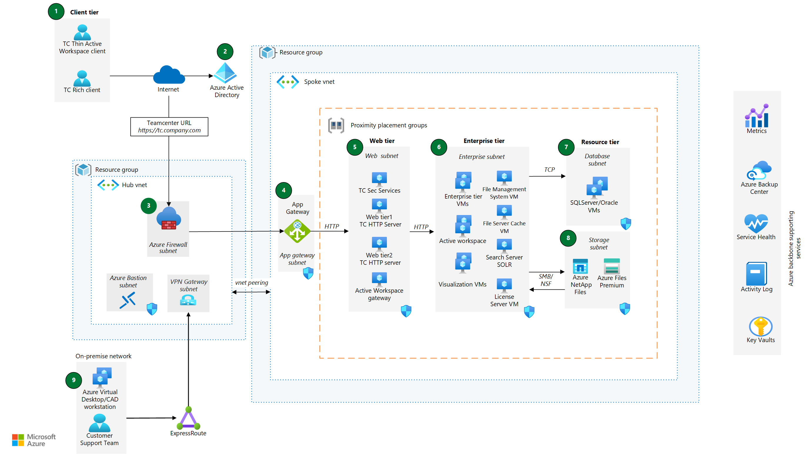

This article provides guidance for implementing Siemens Teamcenter Product Lifecycle Management (PLM) in Azure. It describes a baseline architecture for Siemens Teamcenter PLM deployments in Azure. [Siemens Teamcenter PLM](https://plm.sw.siemens.com/en-US/teamcenter/) is a software suite for managing the entire lifecycle of a product.

Many customers run multiple Teamcenter solutions across the enterprise, mixing multiple instances, multiple ISV vendors, and hybrid cloud and on-premises implementations. This fragmentation reduces the customer’s ability to uniformly access data. Consolidating Teamcenter on Azure can speed the shift to one consistent, harmonized PLM experience, enterprise wide.

| Benefit of Teamcenter on Azure | Details |
| --- | --- |
|Engineer Anywhere | Enhances collaboration by eliminating data silos in multiple on-premises PLM instances.
|Cost Efficiency | Teamcenter PLM on Azure cuts down IT infrastructure and nonessential maintenance investments.
| End-to-End Workflow Enablement| Seamless interaction with core product design, simulation, and more through Azure. Interconnect with CAD/CAM, Simulation Solvers, MES, ERP, and other IT/OT systems.
| High Performance Tech & Speed | Offers high-quality compute, storage, and networking capabilities. Delivers consistently maintained performance across all Teamcenter PLM instances on Azure, boosting innovation and market speed.
| Scalability & Global Collaboration | Enable expansion across Azure’s global infrastructure with efficient internal and external enterprise collaboration.
| Security & Compliance |Azure’s inbuilt security controls and compliance policies ensure data protection and global standards adherence.
| Simplified Management | Consolidation of Teamcenter on Azure simplifies management and accelerates the shift to a consistent, enterprise-wide PLM experience.

## Architecture

Siemens Teamcenter PLM baseline architecture has four distributed tiers (client, web, enterprise, and resource) in a single availability zone. Each tier aligns to function and communication flows between these tiers. All four tiers use their own virtual machines in a single virtual network. Teamcenter uses a client-server model.  The Teamcenter core business functionality runs on a central server in the enterprise tier and users access it through a web-based or thick-client interface. You can deploy multiple instances in Dev and Test environments (virtual networks) by adding extra virtual machines and storage .

*Download a [Visio file](https://arch-center.azureedge.net/teamcenter-baseline-architecture.vsdx) of this architecture.*

### Workflow

1. Teamcenter users access the Teamcenter application via an HTTPS-based endpoint Public URL. Users access the application through two user interfaces: (1) a Rich client and (2) an Active workspace client.
1. User authenticates using a Teamcenter credential that a Teamcenter administrator creates in Teamcenter. Azure Active Directory with SAML configuration allows single sign-on to the Teamcenter application.
1. Azure Firewall backbone filters traffic and threat intelligence from Microsoft Cyber Security. Https traffic directed to the Azure Application gateway. The Hub virtual network and Spoke virtual network are peered so they can communicate over the Azure backbone network.
1. Azure Application Gateway routes traffic to the Teamcenter’s web server virtual machines (VMs) in the Web Tier. Azure Application Gateway with Azure Firewall inspects the incoming HTTP traffic to continuously monitor Teamcenter against exploits. For reliable performance of your application, the VM size, disk configuration, and application installs should match across all VMs.  Based on your requirements you can consider the use of Azure Virtual Machines Scale Sets. With Virtual Machine Scale Sets, VM instances have the same base OS image and configuration.
1. The Web subnet in the Web tier runs the following Teamcenter components on Azure VMs:

    - *Teamcenter Security services (TCSS)* enable role-based access control (RBAC) for end users and secure access to resources. With TCSS, users can navigate between different Teamcenter applications without encountering multiple authentication challenges.  It offers a unified framework for integration with a site's single sign-on solution and simplifies the authentication process

    - *Teamcenter HTTP servers (TC HTTP servers)* run third-party HTTP web servers, such as IIS (.NET) or Java-based servers, to support the Rich client or Active Workspace client. These web server VMs also host the Teamcenter servlet container. Network security groups (NSGs) secure inbound and outbound communication between the Application Gateway subnet, web subnet and enterprise subnets. NSGs ensure the necessary connectivity and security measures are in place for data transfer between the subnets.

    - *Active Workspace Gateway* provides the functionality for the Teamcenter Active Workspace client. It serves as the routing mechanism for static content, such as HTML, CSS, JavaScript, JSON, and dynamic content such as API routing. It directs these requests to the appropriate back-end services and microservices responsible for tasks such as Service-Oriented Architecture (SOA), File Management Services (FMS), Visualization, and GraphQL. This architecture ensures efficient delivery and processing of content within the Teamcenter Product Lifecycle Management application running on Azure.

    - Network security groups (NSGs) secure inbound and outbound communication between the Enterprise subnets, Database subnet & Storage subnet.

1. The Enterprise subnet runs the following core Teamcenter components:

    - *Enterprise tier VMs* run the business logic components of Teamcenter. These components include Teamcenter Foundation, Server Manager, Dispatcher, and Microservices.

    - *Active workspace* serves as the platform where Active Workspace users sign in to access information and perform tasks based on their assigned roles.

    - *Visualization VMs* run Teamcenter lifecycle visualization. This feature empowers every member of your organization to access and view design data that is commonly stored in CAD-data formats.

    - *File Management System (FMS) VM* stores and retrieves user files (CAD, PDF) through SMB/NFS access protocols from file storage (ex. managed disks, Azure Files or Azure NetApp Files). It also supports caching and file distribution. FMS requires the installation of an FMS server cache (FSC) and FMS client cache (FCC) components. FCC resides on client desktop.

    - *File server cache VM* is a volume server for file management. It's also a server-level performance cache server and provides shared data access for multiple users. All Teamcenter file access/update is via FMS server cache processes. The cache process reads and writes the files in volume servers. It also streams the file(s) to/from clients as required.

    - *Search server SOLR* performs smart searches and supports real-time indexing of data.

    - *License server VM* runs a valid Teamcenter FlexPLM license.

1. *Database subnet* runs a SQL Server database using an infrastructure-as-a-service deployment. It uses SQL Server Always On availability groups for asynchronous replication. The deployment could run an Oracle on this IaaS deployment.
1. *Storage subnet* uses Azure Files Premium and Azure NetApp Files.
1. *On-premises network* allows the customer support team and system administrators can connect to Azure via Azure VPN connection to gain access to any Azure VM instance via Remote Desktop Protocol (RDP) from a jump box (Bastion).

### Components

This architecture consists of the following Azure components.

- [Azure Virtual Network](https://azure.microsoft.com/services/virtual-network/) enables Azure resources, such as Azure Virtual Machines (VMs), to securely communicate with each other, the internet, and on-premises networks.
- [Virtual machines](https://azure.microsoft.com/services/virtual-machines/#overview) are an infrastructure-as-a-service (IaaS), on-demand, scalable computing resources. Virtual machines provide the flexibility of virtualization but eliminate the maintenance demands of physical hardware.
- [Azure File](https://azure.microsoft.com/products/storage/files)  provides shared storage that can be mounted as shared paths using the SMB protocol on Windows or Linux and allows creating a hierarchical folder structure to upload files.
- [Azure NetApp Files](https://azure.microsoft.com/services/netapp) makes it easy to migrate and run file-based applications with no code changes. This shared file-storage service is a joint development from Microsoft and NetApp, a Microsoft partner. For more information, see [Siemens Teamcenter with Azure NetApp Files](/azure/architecture/example-scenario/manufacturing/teamcenter-plm-netapp-files).
- [Azure Active Directory](https://azure.microsoft.com/products/active-directory) synchronize on-premises directories and enables single sign-on. For more information, see [SAML authentication with Azure Active Directory](/azure/active-directory/fundamentals/auth-saml)
- [SQL Server on Azure Virtual Machines](/azure/azure-sql/virtual-machines/windows/sql-server-on-azure-vm-iaas-what-is-overview) provides a way to migrate SQL Server workloads to the cloud with 100 percent code compatibility. As part of the Azure SQL family, this database solution runs SQL Server on VMs. SQL Server on Azure Virtual Machines offers the flexibility and hybrid connectivity of Azure. But this solution also provides the performance, security, and analytics of SQL Server. You can continue to use your current SQL Server version. You can also access the latest SQL Server updates and releases.
- [Network security groups](/azure/virtual-network/network-security-groups-overview) are used to restrict access to the subnet.
- [Azure Public IP](/azure/virtual-network/ip-services/public-ip-addresses) is a public IP address connects the internet to the VM.
- [Azure Monitor](https://azure.microsoft.com/services/monitor) is a granular and real-time monitoring data for any Azure resource.
- [Azure Key Vault](https://azure.microsoft.com/services/key-vault) is a service for securely storing and accessing API keys, passwords, certificates, cryptographic keys, or any other secrets used by cloud apps and services.
- [Azure Application Gateway](https://azure.microsoft.com/services/application-gateway/) is a web traffic load balancer that manages traffic to web applications.
- [Azure Virtual Desktop](https://azure.microsoft.com/services/virtual-desktop) is a desktop and application virtualization service.
- [Azure Firewall](https://azure.microsoft.com/products/azure-firewall) Azure Firewall is a cloud-native and intelligent network firewall security service that provides the best of breed threat protection for your cloud workloads running in Azure.

## Considerations

These considerations align to the pillars of the Azure Well-Architected Framework. A set of guiding tenets that can be used to improve the quality of a workload. For more information, see [Microsoft Azure Well-Architected Framework](/azure/architecture/framework).

### Potential use cases

Teamcenter provides a broad and rich depth of many functional solutions for managing data across the product and service lifecycle. Teamcenter deployment on Azure supports the following use cases:

- Store product data assets in a single, secured, shared source of truth to streamline processes.
- Manage product complexity combining mechanical, electrical and software.
- Collaborate to manage product design, configuration (bill of material) and change management across the product lifecycle efficiently.
- Process connectivity across engineering, design, R&D and manufacturing
- Increase competitive advantage by increasing speed to market for new products.
- Power digital thread and digital twins.

### Reliability

Reliability ensures your application can meet the commitments you make to your customers. For more information, see [Overview of the reliability pillar](/azure/architecture/framework/resiliency/overview). In general, consider Availability zones or Availability sets based on requirements of multisite implementations. For more information, see [High availability and disaster recovery for IaaS apps](/azure/architecture/example-scenario/infrastructure/iaas-high-availability-disaster-recovery).

#### Enterprise tier reliability

**Use multiple VMs in the web tier.** You should use multiple instances of the Teamcenter application to enhance the resiliency and scalability. Run these instances on multiple virtual machines and load balance the traffic between them. A Teamcenter HTTP web server cluster provides better performance and resiliency for static web content.

**Use multiple VMs in the Enterprise tier.** You should install the Enterprise tier on multiple Azure virtual machines. This setup ensures fail-over support and enables load balancing to optimize performance. There are two load balancers. Application gateway load balances between VMs in the Web subnet and the Active Workspace Gateway load balances at the application level.

By distributing software functions over a network, the application can achieve high availability and improve overall system reliability. This configuration is beneficial for production environments where uninterrupted operation and efficient resource utilization are crucial. With multiple VMs, the Teamcenter application can handle increased demand and provide a robust and responsive user experience. It allows you to use the scalability and resilience capabilities of Azure and optimize the performance of Siemens Teamcenter application. It helps ensure uninterrupted access to critical product lifecycle management functionalities.

**Configure File Management System (FMS) configuration failover.** Configuration failover allows the client or the FMS network to fail over from one FSC configuration server to another. The failover happens based on the priority value of the FSC set in the FMS primary configuration file. Like other failovers in FMS configuration, the priority attribute determines the failover configuration. Zero is the highest priority. Numbers greater than zero represent a decreasingly lower priority.  You should use Siemens GTAC site for more information for failover configuration for the following components:

- FSC volume server failover configuration
- FSC remote cache failover configuration
- FSC remote multiple-level cache failover configuration
- Microservices configuration

#### Resource tier reliability

**Configure database backups.** For SQL Server, one approach is to use [Azure Backup](/azure/backup/backup-azure-sql-database) using Recovery Services Vault to back up SQL Server databases that run on VMs. With this solution, you can perform most of the key backup management operations without being limited to the scope of an individual vault. For more information on Oracle, see [Oracle Database in Azure Virtual Machines backup strategies](/azure/virtual-machines/workloads/oracle/oracle-database-backup-strategies).

**Use Azure Backup utility.** When performing server-level backups, you should avoid backing up the active database files directly. The backup might not capture the complete state of the database files at the time of backup. Instead, server-level backups should focus on backing up the backup file generated by using the database backup utility. This approach ensures a more reliable and consistent backup of the application's database. You can protect the integrity and availability of their Teamcenter application data. You can safeguard critical information and enabling efficient recovery for any unforeseen issues or data loss.

**Configure volume backups.** Azure Files provides the capability to take snapshots of file shares, creating point-in-time, read-only copies of your data. By using Azure Files or Azure NetApp Files snapshots, establish a general-purpose backup solution that safeguards against accidental deletions or unintended changes to the data. For the Teamcenter volume server, use File volume backups. This configuration effectively backs up the volume server and enables easy recovery if there was data loss or system failures. Implementing these recommendations enhances the data protection and resilience of the Teamcenter application, mitigating the risks associated with data loss or unauthorized modifications.

**Test database and storage backups.** You should plan, document, and test the backup and recovery strategy for the Teamcenter database and file manager servers.

**Configure backup frequency.** Determine backup needs based on business requirements, considering the increasing number of users. A daily backup may not be sufficient for optimal protection, so adjust the frequency accordingly.

**Coordinate volume data with database backups.** Ensure that backups for the File Manager volume servers (FMS) are coordinated with database backups. . This configuration allows you to sync the actual files with the file metadata. The database contains metadata (pointers) to files within the FMS, making synchronization crucial.

**Enhance database reliability.** Deploy SQL Server VMs in Availability Sets to improve database reliability. Availability Sets deploy virtual machines across fault domains and update domains, mitigating downtime events within the datacenter. Create an availability set during VM provisioning. Consider replicating Azure storage across different Azure datacenters for extra redundancy.

**Use Always On availability group.** Configure the database server with an "Always On" availability group for SQL Server on Azure Virtual Machines. This option uses the underlying Windows Server Failover Clustering (WSFC) service and helps ensure high availability. For more information, see [Overview of SQL Server Always On availability groups](/azure/azure-sql/virtual-machines/windows/availability-group-overview?view=azuresql) and [Windows Server Failover Clustering (WSFC)](/azure/azure-sql/virtual-machines/windows/hadr-windows-server-failover-cluster-overview?view=azuresql).

### Security

Azure Security provides assurances against deliberate attacks and the abuse of your valuable data and systems. For more information, see [Overview of the security pillar](/azure/architecture/framework/security/overview).

**Configure the Login Service and Identity Service.** Teamcenter provides the Teamcenter Security Services (TCSS) feature. The Login Service and Identity Service are essential components of TCSS and can be built using the Web Application Manager. Deploy these Java EE web applications on a supported Java EE web application server.

*Login Service*: The Login Service serves as a client interface and can be accessed using both IPv4 and IPv6 URLs. It also serves as the repository for active Security Services sessions, storing important state information required for the single sign-on capability of Security Services.

*Identity Service*: The Identity Service can only be accessed using IPv4 addressing. It includes a table that points to the application root URL. As a client interface, it must accept both IPv4 and IPv6 URLs. To utilize the Security Services, ensure the installation of the Security Services Session Agent.

### Cost optimization

Cost optimization is about looking at ways to reduce unnecessary expenses and improve operational efficiencies. For more information, see [Overview of the cost optimization pillar](/azure/architecture/framework/cost/overview).

**Consider constrained vCPU VMs.** If your workload requires more memory and fewer CPUs, consider using one of the [constrained vCPU VM](/azure/virtual-machines/constrained-vcpu) sizes to reduce software licensing costs that are charged per vCPU.

**Use the right VM SKUs.** You should use the VM SKU in the following table. Contact Siemens support team for the latest Teamcenter on Azure certification matrix and SKU recommendations.

|Role of the Server|SKUs|
| --- | --- |
|Enterprise server, FMS and ODS|[Standard F16s v2](/azure/virtual-machines/fsv2-series)
|FSC, Solr server| [Standard D8ds v5,DDv5](/azure/virtual-machines/ddv5-ddsv5-series#ddv5-series)
|Visualization, CAD workstation| [Standard NV_A10_v5](/azure/virtual-machines/nva10v5-series)
|Database servers |[Standard E32-16ds_v4](/azure/virtual-machines/constrained-vcpu)
|Pool manager for 4T and AWC| [Dv4](/azure/virtual-machines/dv4-dsv4-series) and [Ev4](/azure/virtual-machines/ev4-esv4-series)

### Performance efficiency

Performance efficiency is the ability of your workload to scale to meet the demands placed on it by users in an efficient manner. For more information, see [Performance efficiency pillar overview](/azure/architecture/framework/scalability/overview).

**Use proximity placement groups.**  Use proximity placement groups to achieve optimal network latency, particularly for CAD applications. Employ proximity placement groups when significant network latency between the application layer and the database impacts the workload. Take note of the limitations on VM type availability within the same datacenter. For more information, see [Proximity placement groups.](/azure/virtual-machines/co-location)

When hosting volumes for the Teamcenter Volume Server, it's recommended to attach multiple premium disks to a Virtual Machine and stripe them together. This configuration enhances the combined I/O operations per second (IOPS) and throughput limit. On a DS series Virtual Machine, you can stripe up to 32 premium disks, and for GS series, up to 64 premium disks can be striped. Ensure that the combined input-output per second (IOPS) doesn't exceed the limit defined by the Virtual Machine SKU. For NetApp file storage performance considerations, refer here. See Siemens GTAC to get more SKU recommendations.

## Contributors

Microsoft maintains this article that the following contributors wrote originally:

Principal authors:

- [Sunita Phanse](https://www.linkedin.com/in/sunita-phanse-176969/) | Senior Technical Program Manager

Other contributors:

- [Guy Bursell](https://www.linkedin.com/in/guybursell/) | Director Business Strategy
- [Gauhar Junnarkar](https://www.linkedin.com/in/gauharjunnarkar/) | Principal Program Manager
- [Geert van Teylingen](https://www.linkedin.com/in/geertvanteylingen/) | Azure NetApp Files Group Product Manager

To see nonpublic LinkedIn profiles, sign in to LinkedIn.

## Next steps

>[!div class="nextstepaction"]
> [Siemens Teamcenter with NetApp Files](teamcenter-plm-netapp-files.yml)

- [GPU-optimized virtual machine sizes](/azure/virtual-machines/sizes-gpu)
- [Windows virtual machines on Azure](/azure/virtual-machines/overview)
- [Virtual networks and virtual machines on Azure](/azure/virtual-network/network-overview)

Siemens recommendations: For the latest documentation, certification matrix, recommendations, and best practices, see also the Siemens GTAC website.
